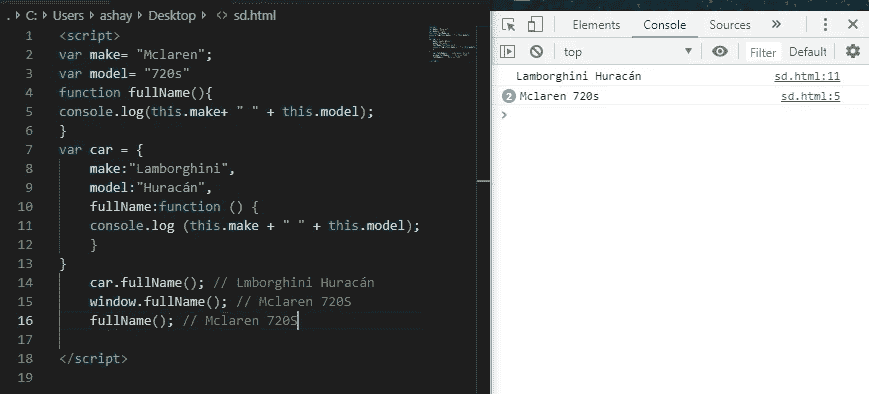

# JavaScript 中的“this”指南

> 原文：<https://levelup.gitconnected.com/a-guide-to-this-in-javascript-a735bfb9e6a9>


照片由 [Prateek Katyal](https://unsplash.com/@prateekkatyal?utm_source=medium&utm_medium=referral) 在 [Unsplash](https://unsplash.com?utm_source=medium&utm_medium=referral) 上拍摄

关键字`this`无疑是 JavaScript 中使用最广泛但又被误解的一个方面。我今天会努力改变这种情况。

让我们回到以前学习代词的学生时代。

> 菲尔普斯游得很快，因为他想赢得比赛。

注意代词“他”的用法。这里我们不直接称呼菲尔普斯，而是用代词“他”来指代菲尔普斯。类似地，JavaScript 使用`this`关键字来引用上下文*中的对象，即主题*。

示例:


```
var car= {
  make: "Lamborghini",
  model: "Huracán",
  fullName: function () {
    console.log(this.make + " " + this.model);
    console.log(car.make + " " + car.model);
  }
}
car.fullName();
```

在上面的代码中，我们有一个对象`car`，它有属性`make`、`model`和`fullName`。`fullName`的值是一个使用两种不同语法打印汽车全名的函数。

*   使用`this` ( `this.make+ ” “ +this.model`)时，`this`指的是上下文中的对象`car`。因此`this.make`实际上是`car.make`，对于`this.model`也是如此。
*   使用点符号，我们可以访问对象的属性，`car.make`和`car.model`。

# ``this`` 是吗！

现在我们已经了解了什么是`this`及其最基本的用法，让我们来看看一些经验法则，这样我们就能永远记住。

## JS ` `this``关键字指的是它所属的对象

```
var car = {
  make: '....'
  func: () => { console.log(this.make) }
}
```

上面代码片段中的`this`属于对象汽车。

# ` this '根据用途取不同的值

1.  在方法内部
2.  在函数内部
3.  单独的
4.  在一次事件中
5.  `call()`和`apply()`

## **在一个方法里面**

当`this`在方法内部使用时，它指的是所有者对象。

在对象内部定义的函数称为方法。让我们再次以汽车为例。

```
var car= {
  make: "Lamborghini",
  model: "Huracán",
  fullName: function () {
    console.log(this.make+" " +this.model);
    console.log(car.make+ " " +car.model);
  }
}
car.fullName();
```

`fullName()`这里有一个方法。方法里面的`this`属于`car`。

## **内部一个函数**

`this`函数内部有点复杂。首先要理解的是函数也有属性，就像所有的对象都有属性一样。每当该函数被执行时，它就获得`this`属性，这是一个变量，包含调用它的对象的值。

> 这实际上只是“先行对象”——调用对象——的快捷方式引用。—javascriptissexy.com

如果函数没有被对象调用，那么函数内部的`this`属于全局对象，称为`window`。在这种情况下，`this`将引用全局范围中定义的值。为了更好地理解，让我们看一个例子:

```
var make= "Mclaren";
var model= "720s"function fullName(){ 
  console.log(this.make+ " " + this.model);
}var car = {
    make:"Lamborghini",
    model:"Huracán",
    fullName:function () {
      console.log (this.make + " " + this.model);
    }
}

car.fullName(); // Lmborghini Huracán
window.fullName(); // Mclaren 720S
fullName(); // Mclaren 720S
```



这里`make`、`model`和`fullName`是全局定义的，而`car`对象也有一个`fullName`的实现。当被`car`对象调用时`this`引用了对象内部定义的属性。另一方面，其他两个函数调用是相同的，都返回全局定义的属性。

## **独自一人**

当单独使用且不在任何函数或对象中时，`this`指的是全局对象。


这里的`this`是指`window`中的全局名称属性。

## **在一个事件中**

事件可以是任何类型，但是为了简单明了，让我们来看一个点击事件。


每当单击一个按钮并引发一个事件时，它可以调用另一个函数来完成基于单击的特定任务。如果在该函数中使用了`this`，它将引用引发事件的元素。在 DOM 中，所有的元素都存储为对象。这就是为什么当一个事件被引发时，它引用那个元素，因为那个*网页元素实际上是 DOM* 中的一个对象。

示例:

```
<button onclick="this.style.display='none'">
  Remove Me!
</button>
```

## **调用()、应用()和绑定()**

*   `bind`:允许我们在方法上设置`this`值。
*   `call`和`apply`:允许我们借用函数，并在函数调用时设置`this` 值。

`call`、`bind`和`apply`本身就是另一篇文章的主题。它们非常重要，在这里解释它们是不可能的，因为我们应该了解所有关于`this`的知识，才能知道这些功能的用法。

# 最棘手的部分

`this`正确使用会使我们的工作更容易。但也有一些被误解的情况。

## 例 1。


```
var car = {
  make:"Lamborghini",
  model:"Huracán",
  name:null,
  fullName:function () {
    this.name=this.make + " " + this.model;
    console.log (this.name);
  }
}var anotherCar={
  make:"Ferrari",
  model:"Italia",
  name:null
}anotherCar.name= car.fullName();
```

我们得到了一个意想不到的结果。我们从另一个对象借用了一个使用`this`的方法，但这里的问题是该方法只被分配给了`anotherCar`函数，但实际上是在`car`对象上调用的。这就是为什么我们得到的结果是兰博基尼而不是法拉利。

为了解决这个问题，我们使用`call()`方法。


这里`call()`方法调用了`anotherCar`对象上的`fullName()`，该对象原本没有`fullName()`功能。

我们还可以看到，当我们记录`car.name`和`anotherCar.name`时，我们得到的是后者的结果，而不是前者，这意味着函数确实是在`anotherCar`而不是`car`上被调用的。

## 例 2。


```
var cars=[
{ make: "Mclaren", model: "720s"},{make: "Ferrari",model: "Italia"}
]var car = {cars:[{make:"Lamborghini", model:"Huracán"}],
fullName:function () {
  console.log(this.cars[0].make + " " + this.cars[0].model);}
}
var vehicle=car.fullName;
vehicle()
```

在上面的代码片段中，我们有一个名为 cars 的全局对象，在 car 对象中有一个同名的对象。然后将`fullName()`方法分配给随后被调用的车辆变量。该变量属于全局对象，因此`this`调用全局`cars`对象，而不是`cars`对象，因为上下文关系。

为了解决这个问题，我们使用`.bind()`函数来解决这个问题。


绑定帮助我们明确地设置`this`值，因此车辆变量明确地指向汽车对象而不是全局对象，所以这在`car`对象的上下文中。

## 例 3。


```
var car = {
  cars:[{make:"Lamborghini",model:"Huracán"},
  { make: "Mclaren", model: "720s"},
  {make: "Ferrari",model: "Italia"}],
  fullName:function(){
    this.cars.forEach(()=>{
      console.log (this.make  + " " + this.model);
  })}
}
car.fullName();
```

在上面的代码片段中，`fullName()`方法调用一个函数，该函数使用`forEach`遍历 cars 数组。在`forEach`中有一个匿名函数，它丢失了上下文。JavaScript 中函数内部的函数称为`closure`。`Closures`在 JavaScript 中非常重要且广泛使用。

这里起作用的另一个重要概念是`scope`。函数内部的变量不能访问其`scope`外部的变量和属性。匿名函数内部的`this`无法访问它外部的`this`。所以`this`无处可去，只能指向全局对象。一旦这里，没有为`this`定义要访问的属性，所以`undefined`被打印。

解决上述问题的一个方法是，我们可以在匿名函数外部为`this`的值分配一个变量，然后在内部使用它。


在这里,`self`变量包含了`this`的值，该值与内部函数一起使用，从而给出了输出。

## 例 4。


```
var car= {
  make: "Lamborghini",
  model: "Huracán",
  fullName: function (cars) {
    cars.forEach(function(vehicle){
    console.log(vehicle +" "+ this.model);
  })}
}
car.fullName(['lambo','ferrari','porsche']);
```

这是一个重新讨论过的例子，其中`this`是不可访问的，所以我们通过使用一个名为`self`的变量来保存它的值。

让我们用箭头函数以同样的方式解决这个问题:


正如你所看到的，在`forEach()`中使用一个箭头函数自动解决了这个问题，我们不必使用`bind`或将`this`的值赋给其他变量。这是因为箭头函数自动绑定它们的上下文，所以`this`实际上指的是原始上下文或原始对象。

## 例 5。


```
var car = {
  make: "Lamborghini",
  model: "Huracán",
  fullName: function () {
    console.log(this.make +" "+ this.model);
   }
}
var truck = {
  make: "Tesla",
  model: "Truck",
  fullName: function (callback) {
    console.log(this.make +" "+ this.model);
    callback();
  }
}
truck.fullName(car.fullName);
```

上面的代码由两个相同的对象组成，其中一个包含一个**回调**函数。**回调**函数是作为参数传递给另一个函数的函数，然后在外部函数中被调用以完成某种例程。

这里，卡车对象的`fullName` 方法由一个**回调**组成，该回调也在它的**内部被调用。**我们的车对象还是和以前一样。当我们使用回调(参数)作为汽车对象的`fullName`方法调用卡车的`fullName`方法时，我们得到的输出是`Tesla Truck`和`undefined undefined.`

在阅读了`this`之后，你们中的一些人可能已经预感到`car.fullName` 会打印卡车物体的模型和构造，但是让你们失望的是，`this`又一次捉弄了我们。在这里，`car.fullName` 作为一个参数被传递，实际上并没有被 truck 对象调用。回调调用 car 对象方法，但是请注意，该函数的实际调用位置是回调，回调将它绑定到全局对象。有点混乱，再读一遍！


为了清楚起见，我们打印了`this`本身。我们可以看到回调的`this`被赋予了全局作用域。所以为了得到结果，我们创建了全局属性`make`和`model`。


同样，使用全局`make`和`model`属性运行相同的代码，我们最终得到全局`this`的答案。这证明了`this`引用了全局对象。

为了得到我们想要的结果，`car.fullName`结果我们将再次使用`bind()`将 car 对象硬绑定到回调，这将使一切再次正确。


# 解决了！

毫无疑问`this`非常有用，但也有它自己的陷阱。我希望我让你很容易理解。如果你想要更多像这样简化的内容，请关注我的 Medium。如果你喜欢，请留下你的回答并分享。

