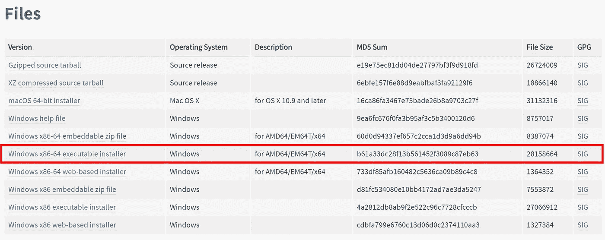

# 将 Python 升级到 3.9 的指南🐍

> 原文：<https://levelup.gitconnected.com/a-guide-to-upgrade-your-python-to-3-9-44ccb3eae31a>

## Python 3.9 已经发布(2020 年 10 月 5 日)！我们来装吧！


[大卫·克洛德](https://unsplash.com/@davidclode?utm_source=medium&utm_medium=referral)在 [Unsplash](https://unsplash.com?utm_source=medium&utm_medium=referral) 上的照片

自 2020 年 10 月 5 日以来，Python 的新版本(3.9)发布了一些新的特性和优化，如 dict 中的联合运算符、标准集合中的类型提示泛型、灵活的函数和变量注释等等。

本文将向您展示如何针对 Windows、Mac 和 Linux 操作系统以简单的方式将 Python 更新到 3.9 的教程。

# 窗口操作系统

只需从 Python 下载页面[下载并安装 Python 3.9 安装程序。而且你不确定哪个版本适合你。我建议使用 Windows x86–64 可执行安装程序版本，或者您可以简单地单击此](https://www.python.org/downloads/release/python-390/)[链接](https://www.python.org/ftp/python/3.9.0/python-3.9.0-amd64.exe)。



**推荐 Python 安装程序**(截图自 Python 下载页面)

您可以在安装时选中“将 Python 添加到路径”选项，将 Python3.9 注册为您系统上的主 Python

```
**$ python --version**
Python 3.9.0
```

# mac 操作系统

对于 macOS，您可以通过从 Python 下载[页面](https://www.python.org/ftp/python/3.9.0/python-3.9.0-macosx10.9.pkg)下载来完成与 Windows OS 相同的操作。然后，您可以检查您的 python 版本，如下面的示例命令所示:

```
**$ python --version**
Python 2.x.x**$ python3 --version**
Python 3.9.0
```

或者，如果您希望这个新的 python 版本使用`python`命令而不是`python3`命令运行，您可以在`$HOME`目录下的`.bash_profile`文件中添加一个别名。您可以通过打开终端并使用以下命令来完成此操作:

```
$ cd $HOME
$ nano .bash_profile
```

然后，在末尾加上这一行。

```
alias python="python3"
```

现在，你可以用`python`执行 python 3.9。

```
**$ python --version**
Python 3.9.0
```

# Linux 操作系统

在 LINUX 中，您可以使用以下命令:

```
**$ sudo add-apt-repository ppa:deadsnakes/ppa
$ sudo apt update
$ sudo apt install python3.9**
```

然后，您可以使用以下命令检查新的和现有的 Python 安装版本:

```
**$ sudo python --version**
2.x.x
**$ sudo python3 --version**
3.8.x
**$ sudo python3.9 --version**
3.9.0
```

就这些了，祝你用 Python 3.9 编码愉快。🐍

安全**健康**健康！

**感谢您的阅读。👋**😄

[](https://medium.com/@JoeTS)

[https://medium.com/@JoeTS](https://medium.com/@JoeTS)