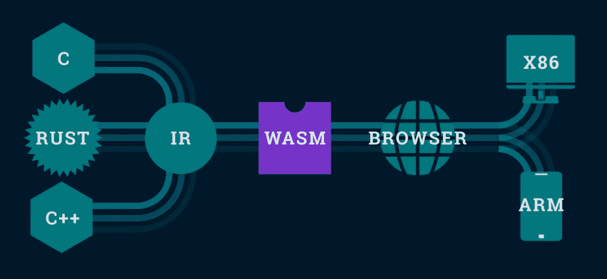
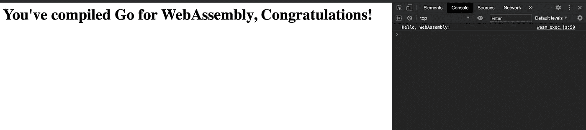

# 使用 Go 进行 WebAssembly 的实践介绍

> 原文：<https://levelup.gitconnected.com/a-hands-on-introduction-to-webassembly-with-go-959babb58109>

用 WebAssembly 为浏览器运行 Golang，用 TinyGo 使之快速！



从 [Interlogica](https://www.interlogica.it/en/insight-en/webassembly-why/)

万维网已经彻底改变了信息在世界各地传播的方式。虽然 Chrome 和 Firefox 以消耗内存著称，但在运行高图形视频游戏或任何其他形式的高要求计算时，现代网络浏览器非常有限。为了理解为什么这是真的，以及 WebAssembly 如何改变了 web 的游戏规则——让我们快速总结一下为什么 web 浏览器开始时很慢。

web 浏览器能够在无数不同类型的设备和机器上运行，使其成为多平台的。然而，这种灵活性是以较高的性能为代价的。web 应用程序无法针对主机的操作系统(OS)或硬件功能，导致 web 浏览器和机器硬件之间的转换层降低了速度。

为本地运行而编写的应用程序能够针对主机的特定硬件进行*编译*。这包括优化低级机器码或给予图形卡高优先级访问。这也是编译语言(如 C 或 Go)通常比解释语言(如 Python 或 JavaScript)更快的部分原因。

说到 JavaScript，web 也受到了限制，因为大约 95%的 web 使用它。抛开原因不谈，JavaScript 主宰了 web 编程领域——普通的 web 浏览器不会采用任何新的语言，比如 Python，或者转向客户端脚本。

> **要点提示:**如果您想使用 Python 或其他语言可以访问但 JavaScript 中没有的有用的包，您必须要么编写自己的库，要么希望其他人有解决方案。不仅如此，JavaScript 的单线程和可解释特性禁止在浏览器中运行密集计算，如增强现实或视频编辑。

## 介绍 WebAssembly！

We assembly 1.0 于 2017 年 11 月首次发布，适用于 Chrome、Edge、Firefox 和 WebKit。它由 Mozilla 首创，作为 C/C++、Rust 和 just recently Go 等源代码语言的编译目标。这意味着你拥有 go 例程的并发性、C/C++的效率以及它们所有的库和软件包，可以在网络上使用。这是一个巨大的声明。

此外，为了保持向后兼容性，WebAssembly 并不意味着要取代 JavaScript——它旨在补充 JavaScript 并与之协同工作。WebAssembly 自带类似汇编的语言，允许调试、测试和优化。

## 现在，让我们编译 Go against WebAssembly！

注意:您需要安装 Go 1.11 或更高版本。还建议您将 go/bin 添加到 PATH 环境变量中——对于 MAC，这通常在/etc/profile 中。

首先，让我们为我们的新项目创建一个新的空目录，并将其更改为新目录。

```
$ mkdir wasm-with-go
$ cd wasm-with-go
```

下一步是创建一个简单的 Go 包。目前，WebAssembly 将只针对主包进行构建。

```
$ touch main.go
```

[https://gist . github . com/Israel-Miles/ddceeb 2190 dbb 7 f 33 b 08 f1 cf 9 f 711 f 5f](https://gist.github.com/Israel-Miles/ddceeb2190dbb7f33b08f1cf9f711f5f)

我们现在将针对 WebAssembly 构建和编译 go——注意我们如何将 Go 操作系统(GOOS)设置为 JavaScript (js ),将 Go 架构(GOARCH)设置为 WebAssembly (wasm)。

```
$ GOOS=js GOARCH=wasm go build -o main.wasm
```

该命令构建一个名为 main.wasm 的可执行 WebAssembly 模块。为了在浏览器中显示我们的项目，我们需要一个支持的 JavaScript 文件以及标准的 index.html。

我们可以使用下面的命令将 JavaScript 支持文件从预安装的 go 包中复制到当前的工作目录中:

```
$ cp "$(go env GOROOT)/misc/wasm/wasm_exec.js" .
```

我不会太担心这部分的细节，wasm_exec.js 文件接近 600 行 JavaScript 管道。呸。

接下来，让我们创建我们的 index.html 文件。

```
$ touch index.html
```

[https://gist . github . com/Israel-Miles/df 7a 82 c 035d 759 a 6 a 6 ff 0d 6906 f 0572 c](https://gist.github.com/Israel-Miles/df7a82c035d759a6a6ff0d6906f0572c)

在这里，我们找到了 wasm_exec.js 支持文件，在第 8–13 行，我们创建了内联 JavaScript，它在获取我们之前编译的 main.wasm 文件时将 Go 作为一个新对象导入。最后，我们将得到的 wasm 对象实例化。同样，我不会太担心这里的细节——这只是一些必要的管道连接一切。

最后，让我们创建一个基本的服务器，从这里我们可以提供我们的文件。

```
$ touch http-server.go
```

[https://gist . github . com/Israel-Miles/58 b 066 c 7d 81 b 2 BD 488 dcbfcd 1c 1404 de](https://gist.github.com/Israel-Miles/58b066c7d81b2bd488dcbfcd1c1404de)

我们现在可以运行这个文件，在端口 8080 上为我们的 index.html 文件服务。运行以下命令后，您可以转到 [http://localhost:8080](http://localhost:8080) 来访问您的新服务器！然后，您可以检查页面，并转到控制台日志，查看源自 go 的 wasm 可执行文件的输出。

```
$ go run http-server.go
2020/10/25 18:13:47 listening on ":8080"...
```



最重要的是，我们可以在构建命令中包含 TinyGo 来自由压缩我们的 WebAssembly 可执行文件。

```
$ brew tap tinygo-org/tools
$ brew install tinygo
$
$ ls -l main.wasm
israelmiles 2214759 Oct 25 17:24 main.wasm
$ tinygo build -o compressed-main.wasm -target wasm ./main.go
$ ls -l compressed-main.wasm
israelmiles 210961 Oct 25 18:25 compressed-main.wasm
```

我们已经成功地将 wasm 可执行文件从 2，214，759 字节压缩到只有 210，961 字节！这些好处随着您包含的包越多而减少，但是对于最小的应用程序来说，这可能是一个值得的好处。现在你已经知道了编写 Go 程序的基本知识，可以将它编译成 WebAssembly 模块，甚至可以使用 TinyGo 轻松节省空间。恭喜你！

ebAssembly 不仅会极大地增加 web 编程语言的数量，还会释放出增强的性能和库，这将彻底改变我们对简单 web 浏览器的看法。

我希望你喜欢这个简短的教程。如果你有任何问题或者想看更多，请在下面给我留言。我还想添加一些直接与 JavaScript 接口的例子。感谢阅读！