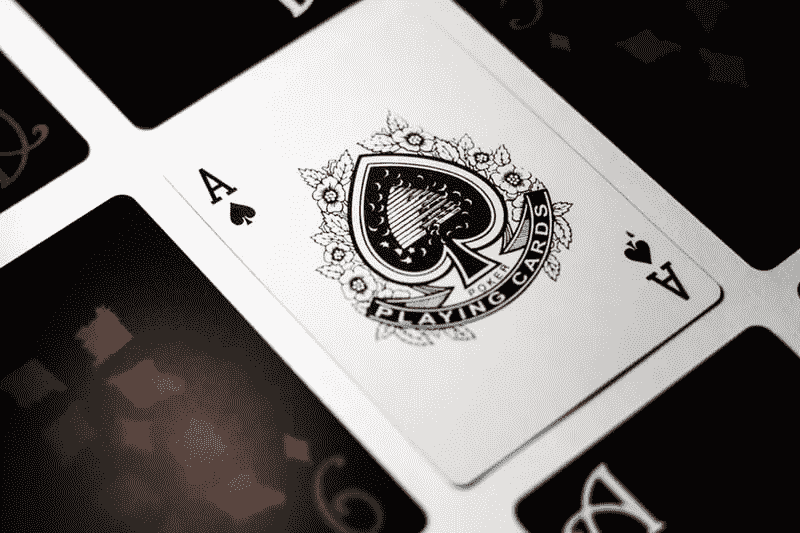
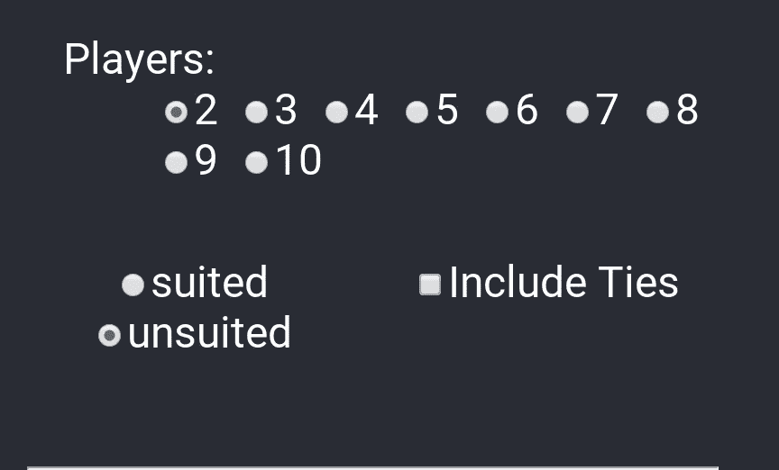
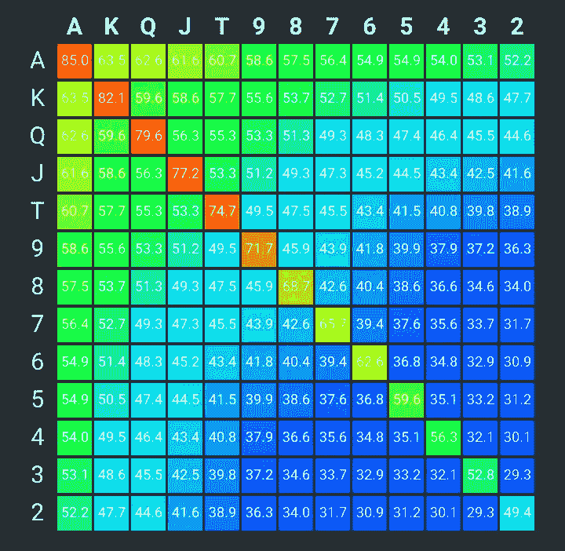
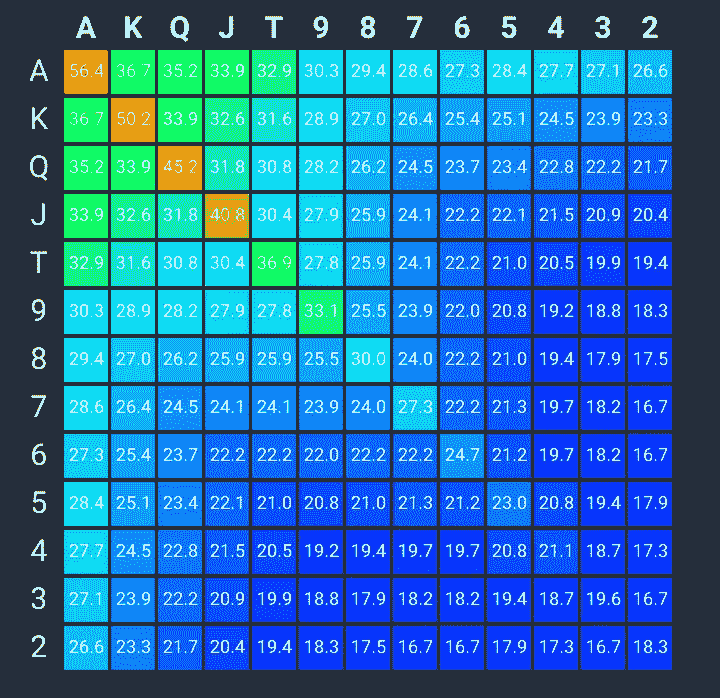
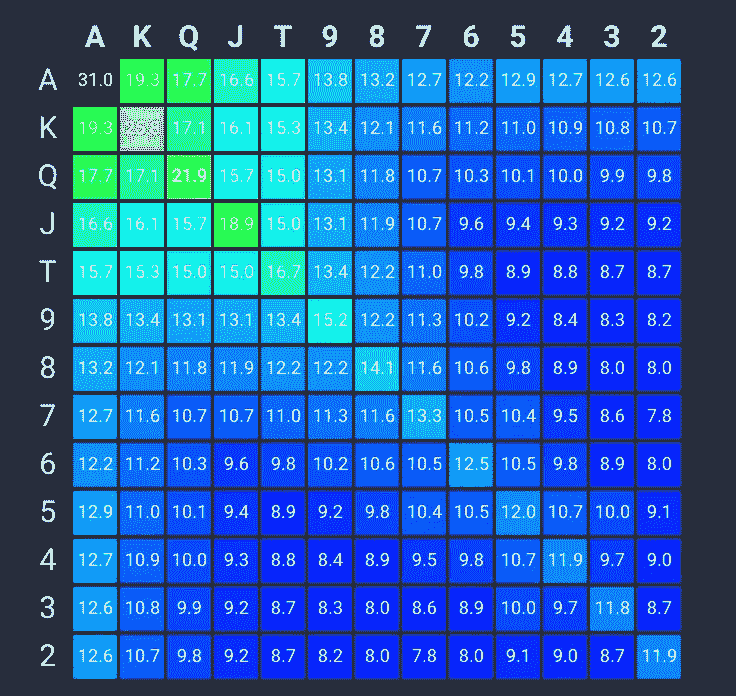
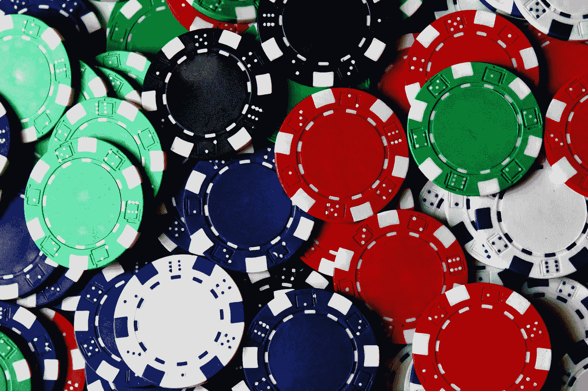

# 德州扑克获胜概率的 JavaScript 热图

> 原文：<https://levelup.gitconnected.com/a-heat-map-for-texas-holdem-8b431224191a>



你可能熟悉 [Texas Holdem](https://en.wikipedia.org/wiki/Texas_hold_%27em) ，这是扑克的一种变体，向每位玩家发两张牌面朝下的牌，然后分三个阶段发五张面朝上的公共牌，总共四个阶段。在每个阶段之后，玩家都有机会下注或加注。

假设你有两张底牌。在翻牌圈发牌之前，你赢的机会有多大？了解这一点，你就可以相应地下注，或者计划下注。

[印第安纳大学的 Apu Kapadia](https://cs.indiana.edu/~kapadia/index.html) 教授采用统计学方法进行分析，通过运行 40 亿个模拟扑克游戏来确定结果。[几个 169 行的列表是结果](https://cs.indiana.edu/~kapadia/nofoldem/)，显示基于玩家数量的胜率，从 2 到 10。虽然每个列表都非常有用，但由于有这么多行，很难看出数字中的任何模式，除了显示高排名的孔牌比低排名的孔牌赢的次数多。

不久前，我创建了一个简单的热图包。为了寻找实际用途，我偶然发现了卡帕迪亚博士的统计数据，它们非常适合用于演示。

# 篡改统计数据


照片由[克里斯蒂安·休姆](https://unsplash.com/@christinhumephoto?utm_source=unsplash&utm_medium=referral&utm_content=creditCopyText)在 [Unsplash](https://unsplash.com/search/photos/massage?utm_source=unsplash&utm_medium=referral&utm_content=creditCopyText) 上拍摄

由于每组统计数据都不方便地嵌入在 HTML 中，所以我有两个选择:

1.  使用 [Cheerio](https://github.com/cheeriojs/cheerio) 或同等工具从呈现的文档对象模型中抓取数据；
2.  将呈现的 HTML 页面上的统计信息剪切并粘贴到一个文件中，然后使用一些 regex 魔法将其转换为 JSON 格式

由于统计数据带有版权声明，我问教授更喜欢哪种方法，他同意选择 2。正则表达式并不太难写，所以我用 JSON 结束，如下所示:

```
const arry = [
  { pair: 'AA', wins: '84.97	 ', ties: '0.57	' },
  { pair: 'KK', wins: '82.10	 ', ties: '0.58	' },
  { pair: 'QQ', wins: '79.63	 ', ties: '0.61	' },
  { pair: 'JJ', wins: '77.16	 ', ties: '0.65	' },
  { pair: 'TT', wins: '74.66	 ', ties: '0.72	' },
  { pair: '99', wins: '71.69	 ', ties: '0.80	' },
  { pair: '88', wins: '68.72	 ', ties: '0.91	' },
  { pair: '77', wins: '65.72	 ', ties: '1.04	' },
  { pair: 'KAs', wins: '65.28	 ', ties: '2.66	' },
  { pair: 'QAs', wins: '64.41	 ', ties: '2.78	' },...
```

这仍然不是 jsheatmap API 的正确格式，但是[几行代码](https://github.com/JeffML/pokermap/blob/master/src/datasets/dsParser.js)解决了这个问题。

现在一切都准备好了。

# 热图 API

我用 TypeScript 编写了 jsheatmap 包，它采用以下构造函数参数:

```
type labeledValuesType = [string, number[]]

class Sterno {
  headings: Array<string>
  rows: Array<labeledValuesType>

  constructor(headings: string[], rows: Array<labeledValuesType>) {...
```

`headings`是列标题，`['A', 'K', ..., '2']`；行的格式如下:

```
[['A', [51.7, 36.2, 25.1,...], ['K', [...], ..., ['2', [...]]
```

其中，每个数组元素的第一个值是行标签，后面的数字数组是该行的单元格值。这些像元值将被缩放到 0.0 到 1.0 之间的数字，并且 RGB 颜色值将被分配给这些缩放值。这一切都发生在调用方法`getData()`时，该方法返回一个数据结构，显示原始输入数据是如何缩放的，以及每个缩放值对应的颜色渐变是什么:

现在剩下的就是以彩色格式呈现地图数据。

# React 应用

我使用 [create-react-app](https://create-react-app.dev/) 来快速启动和运行 react 应用程序。脚本运行完毕后，我只需编辑生成的代码。

我想做的第一件事是通过单选按钮和复选框添加一些用户交互性。用户可以指定三件事情:

1.  玩家数量
2.  合适或不合适的底牌
3.  是否包括领带



我提到了玩家数量的影响。如果底牌是同花(例如，两张都是红心)，那么赢的几率会增加一点。平局是指两个或两个以上的玩家在他们的 5 张牌(他们的两张底牌加上五张公共牌中的三张)中拥有相同的牌级，从而平分底池。

以下是几张截图:



两名球员，不合适，没有联系



5 名玩家，同花，有平局



10 名玩家，同花，没有平局

# 热图中有什么值得注意的

以下是热图中容易发现的一些东西，你可以在[https://pokermap.netlify.com](https://pokermap.netlify.com/)验证:

## **玩家越多，胜算越小**

在两人游戏中，左上角有很多绿色，这表明在两人游戏中排名较高的底牌的胜算较大(A-2 的胜算约为 50%，与一对 2 的胜算大致相同)。有 10 个玩家，比两个 2 要差得多。

## **排名靠后的对子帮助不大**

在 10 人参与的情况下，一对 6 的胜算与任何不成对的牌面组合大致相同或更少。

## **玩家越多，同花底牌的效果越好**

在双人游戏中，不合适的 K-Q 有 59%的胜率。同色，百分比仅略微增加到 61.6%。在一场 10 人游戏中，不合适的 K-Q 有 13.6%的胜算，但如果是同花，胜算会上升到 17.1%。

这篇文章证明了即使是一个简单的热图对于在大量数据中寻找模式和相关性也是有用的。在 github 上随意探索 jsheatmap 和 T2 poker map 的源代码。



照片由[阿曼达·琼斯](https://unsplash.com/@amandagraphc?utm_source=unsplash&utm_medium=referral&utm_content=creditCopyText)在 [Unsplash](https://unsplash.com/search/photos/poker-chips?utm_source=unsplash&utm_medium=referral&utm_content=creditCopyText) 拍摄

*最初发表于*[*https://www.jeffamabob.com*](https://www.jeffamabob.com/posts/holecardmap)*。*

[](https://gitconnected.com/learn) [## 了解如何编码-查找编码教程| gitconnected

### 从开发者提交和排名的教程中学习任何编程语言、框架或库。教程是…

gitconnected.com](https://gitconnected.com/learn)