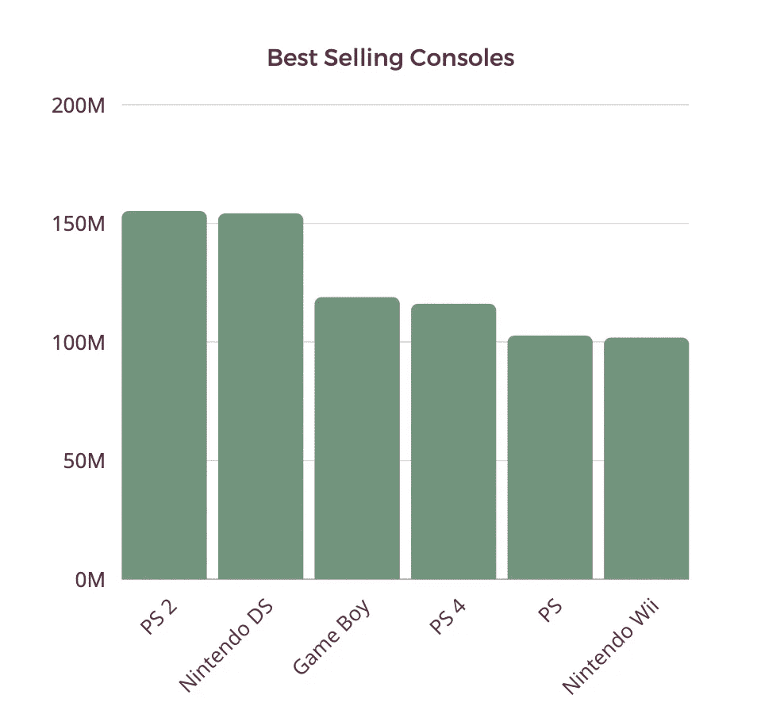
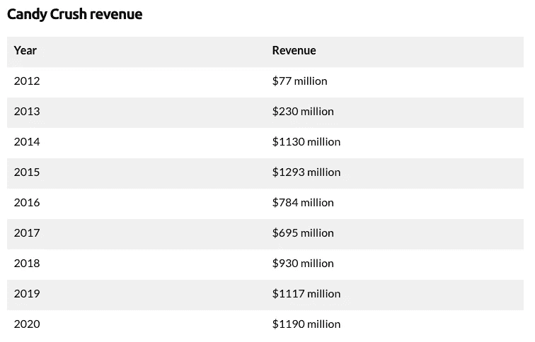

# 电子游戏货币化的历史

> 原文：<https://levelup.gitconnected.com/a-history-of-video-game-monetisation-867cf49a2e29>

## 创新如何不断重塑整个行业

米克·豪普特在 [Unsplash](https://unsplash.com?utm_source=medium&utm_medium=referral) 上的照片

博彩业每年都超出预期。2020 年全球收入估计约为 1630 亿美元。想把它放在上下文中吗？这比体育和电影加起来的钱还多！预计未来五年将达到 3000 亿美元。

一开始，它只不过是实验室里的一个实验。拉尔夫·贝尔和他的“棕色盒子”是游戏之父。它将这些实验室实验转变为我们今天所知的游戏。从那时起，游戏就不断地演变成了其内容的盈利方式。后退几步回顾过去将有助于我们更好地理解未来。

# 拱廊

过去，玩视频游戏的唯一现实方式是通过街机。游戏机还没有完成。当准备好的时候，这种方式对于普通消费者来说太贵了。在街机商店花点钱更合理。

街机游戏必须专注于一个伟大的和容易玩的体验。游戏简短且易于掌握。唯一的竞争方式是通过排行榜或一对一的游戏。

吃豆人是有史以来最成功的街机。让我们来看看它的一些统计数据:

*   **橱柜销售:** 40 万
*   到 1990 年的收入::35 亿美元
*   通货膨胀调整后:7681491635 美元

这真是令人印象深刻。一个非常赚钱的行业就这样诞生了。

# 零售

当电脑和游戏机更便宜时，一个全新的市场出现了:零售。那时就有可能购买游戏并带回家玩。游戏机游戏成为一种时尚。很多像雅达利、任天堂、世嘉……这样的公司刚刚诞生。一场永无止境的最佳比赛开始了。

任天堂是第一批在游戏中加入故事情节的公司之一，永远改变了游戏行业。商品被创造出来，很快甚至他们游戏的电影也被创造出来。

尽管索尼是后来者，但它重塑了整个市场。创新正在不断重塑游戏行业。销量最高的是 PlayStation 2，销量超过 1.55 亿台。

这项技术并不总是有利于游戏盈利。随着技术的普及，盗版很快就出现了。索尼通过使用光盘降低了游戏制作成本。这也意味着他们的游戏更容易被复制。盗版一直存在。

据商业软件联盟估计，盗版每年给该行业带来 510 亿美元的收入。将会进行许多不成功的尝试来解决它。一个例子是创造了被称为 T1 的 T0。

# 扩展包

游戏有一个问题:一旦你出售它们，顾客可以连续玩几个小时，而不会带来更多收入。怎么才能解决？

索尼是第一个提出革命性想法的公司:扩展包。那些到底是什么？

> 一个**扩展包**、**扩展集**、**补充**，或简称为**扩展**是对现有角色扮演游戏、桌面游戏、视频游戏或收藏卡牌游戏的补充

第一个扩展包是`Grand Theft Auto: London 1969`，它很成功。您可以为更成功的游戏提供额外的内容。

并不是所有的游戏都成功地使用了这种模式，因为它现在已经变得相当过时了。`World of Warcraft`在 2007 年至 2020 年期间，其每个扩展包的首日平均销量为 310 万。

# 移动应用商店

新技术的兴起永远改变了手机行业。iPhone 商店改变了我们今天购买应用的方式。取代了高收费的应用程序，引入了低收费的应用程序。有了一个为你做所有发行工作的市场，以低价出售大量游戏比以高价出售少量游戏更有利可图。

《愤怒的小鸟》是一个很好的例子，展示了如何建立一个基于手机游戏的帝国。Rovio 在 2009 年开始以 0.99 美元的价格销售他们的流行游戏。到 2013 年，他们所有的游戏已经被下载了超过 17 亿次。

为什么这个游戏不再受欢迎了？它缺乏创新导致人们厌倦并忽视了这款应用。创新是游戏的关键因素。即使是很棒的游戏，缺乏令人兴奋的新功能也让它们很无聊。

# 应用内购买

应用市场彻底改变了科技行业。从可信的供应商那里安装游戏突然变得简单了。然而，它并不完美:游戏被限制只能从一次购买中获利。苹果在 2009 年提出了另一个想法:`In-App Purchases`。

有了这个新概念，大量的货币化策略诞生了。免费增值模式由此诞生。给予用户免费访问，并要求对每个功能的基础上付费。

金是后来者，但它是如何成功实现应用内购买的一个明显例子。《糖果粉碎传奇》上映第一年就获得了 7700 万美元的收入。其最高收入为 12.93 亿美元。它简单的用户界面和奖励系统吸引了他们的用户。他们让这成为一次愉快而有益的经历。

资料来源:businessofapps.com

# 游戏内广告

早期，开发者意识到游戏可以用来展示一些广告。这是提高他们游戏利润的好方法。第一个提出这个想法的游戏是在 1978 年。它为自己的下一款游戏:`Pirate Adventures`插入了自我宣传广告。突然，游戏内广告诞生了。

Fifa 94 中的游戏内广告示例

随着互联网的兴起，游戏中的广告将被带到一个全新的水平。对于独立视频游戏创作者来说，这是更好的赚钱方式。

作为参考，2019 年游戏内广告占 423 亿美元。据估计，到 2024 年，这一数字可能会增长到 560 亿美元。视频附加奖励成为并且仍然是最受欢迎的选择。这似乎是一个双赢的解决方案，开发者和玩家都得到回报。

# 免费游戏

堡垒之夜是 2018 年该行业的另一个变化。它带来了一个革命性的想法:游戏将对所有人完全免费。如果你不愿意，你就不需要花一分钱。同样，在这上面花钱也不会让你比竞争对手更有优势。

那时候他们是怎么赚钱的？皮肤和化妆品只是为了在其他玩家面前炫耀。让它免费并让 YouTubers 推广是一个巨大的成功。它在第一年就创造了超过 24 亿美元的收入。其 2018 年和 2019 年的收入约为 41 亿美元。

它向世界证明了，如果你有一个好的产品，卖你的用户感兴趣的东西，他们会很乐意这样做。以前，所有的“免费”游戏都是:

*   质量非常低
*   免费只是为了让你上瘾，然后要钱
*   使用微支付缩短等待时间

堡垒之夜令人敬畏的引擎和他们的诚实使他们倾家荡产。他们也给我们上了一课。

# 基于云的游戏

虽然谷歌是后来者，但它很快就进入了市场。它再次彻底改变了市场，带来了一个新概念:基于云的游戏。他们在 2019 年的早期演示让整个行业都想要更多。

他们的目标是什么？谷歌的目标不是职业玩家，而是休闲玩家。休闲游戏玩家被授予大更新或慢游戏创业。谷歌通过在云中托管游戏本身解决了所有这些问题。

云游戏服务仍处于早期阶段。然而，据估计，它将在第三年产生至少 9 亿美元。用户可以购买游戏和/或购买包月服务。

竞争对手又一次复制了这种模式。游戏行业利润丰厚，就连亚马逊也盯上了它。

# 最后的想法

我们只是看到了游戏盈利的更大图景。如今，电子竞技、流媒体、商品销售、会议……这个行业日益成熟，利润丰厚。它早就向怀疑论者证明了它是多么强大和充满活力。

历史证明，游戏消费者不是傻子。抄袭我们的游戏或策略是行不通的。他们有很大的期望等着去实现。只有新鲜和创新的想法才能征服他们的灵魂。

未来会发生什么？VR 无疑即将到来。它的技术越来越容易获得。不过，目前还不清楚哪种形式会让银行破产。即使你自己不是游戏玩家，这也是一个值得关注和学习的令人兴奋的行业。

# 有关系的

 [## Web 货币化 API:一种新的 Web 货币化替代方案

### 让微支付成为现实

codeburst.io](https://codeburst.io/web-monetization-api-a-new-web-monetization-alternative-eb72b5c58bd6)