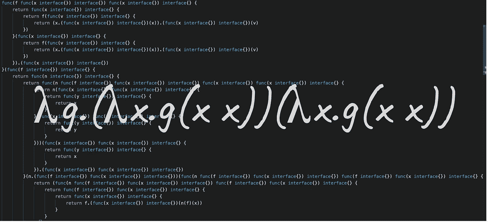
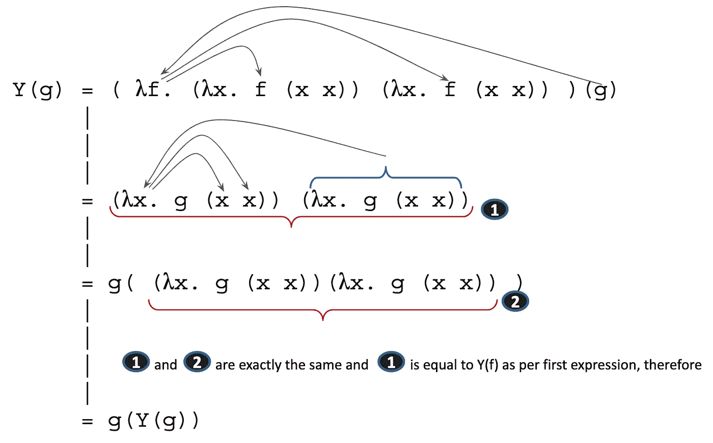

# 用 Go 进行 Lambda 微积分之旅

> 原文：<https://levelup.gitconnected.com/a-journey-along-lambda-calculus-with-go-62c2f5135b78>

## 类型化世界中的λ演算



λCalculus is a[是数理逻辑中表达计算](https://en.wikipedia.org/wiki/Lambda_calculus)的形式系统，基于函数的概念，由[阿隆佐·邱奇](https://en.wikipedia.org/wiki/Alonzo_Church)于 1936 年定义。

艾伦·图灵证明了λ演算和图灵机是等价的，因此λ演算是图灵完备的。这意味着任何计算都可以使用 Lambda 演算来执行。

有些人可能觉得用纸和笔来研究 Lambda 微积分会很困难，非常抽象，很乏味。

酷的是，正如我们所说，Lambda 演算是基于函数的概念，这是程序员非常熟悉的东西。事实上，我们可以用任何支持“函数作为一等公民”的编程语言来实现 Lambda 演算，也就是说，用任何语言，函数可以作为参数传递给其他函数，也可以作为函数的结果返回。

所以，每当我们使用这样的表达方式时

```
// g and h are functions
function f(g) {
  ...
  return h
}
```

我们可以实现 Lambda 演算。

Go 是一种支持“一等公民”功能的语言，因此易于实现 Lambda 演算。在这篇文章中，我们将会看到开发一个具体的计算例子意味着什么。

这篇博客中展示的代码和更多 Go 中 Lambda 演算的例子可以在这篇报告中找到[。](https://github.com/EnricoPicci/LambdaCalculus-Go-Typescript)

注意:Javascript 也是一种语言，即使它的本质与 Go 完全不同，它也是一种我们可以实现 Lambda 演算的语言，如 [Y 组合子](https://medium.com/p/36806ebc2857#Fixed-point_combinators_in_lambda_calculus)的魔力有着内在的联系(是的，Haskell 语言和“currying”技术都是以他的名字命名的)。

## Y 组合子

这是 Y 组合子的定义

```
Y = λf. (λx. f (x x)) (λx. f (x x))
```

所以`Y`是一个期待一个`f`并对其做一些事情的函数。

但是为什么这个东西和递归联系在一起呢？让我们看看当我们传递一个值给`Y`函数时会发生什么，我们称之为`g`。正如我们对`Mult`功能的演示一样，我们将使用称为 *β缩减*的机械变换。



所以，我们发现

```
Y(g) = g(Y(g))
```

## y 组合子和递归

现在魔法来了。

让我们回到最初的问题

```
function factorial(n) {
   if (n == 0) {
     return 1
   }
   return n * factorial(n-1)
}
```

我们可以将函数`factorial`提取(抽象)到参数`f`中，并获得以下表达式

```
function F(**f**) {
   return function(n) { // anonymous function returned by F
      if (n == 0) {
        return 1
      }
      return n * **f**(n-1)
   }
}
```

现在，如果我们将`F`传递到`Y`，根据`Y`的定义，我们得到

```
Y(F) = F(Y(F))
```

然后我们可以定义一个新的函数`factorial'`,以下为真

```
factorial' = Y(F) = F(Y(F)) = F(factorial')
```

但是`F(factorial')`可以开发成这样

```
F(factorial') = (function F(**f**) {
              |     return function(n) { 
              |       if (n == 0) {
              |          return 1
              |       }
              |       return n * **f**(n-1)
              |     }
              |  })(**factorial'**)
              |
              = function(n) { 
              |   if (n == 0) {
              |      return 1
              |   }
              |   return n * **factorial'**(n-1)
              | }
```

所以，我们来试着计算一下`factorial'(2)`

```
factorial'(2) = (F(**factorial'**))(2)
              |
              = (function(**n**) { 
              |   if (**n** == 0) {
              |      return 1
              |   }
              |   return **n** * **factorial'**(n-1)
              | })(**2**)
              |
              = if (**2** == 0) {  // 2 is NOT equal to 0
              |    return 1
              | }
              | return **2** * **factorial'**(**2**-1)
              |
              = **2** * **factorial'**(**2**-1)
```

所以，最后，我们得到的是

```
factorial'(2) = **2** * **factorial'**(**2**-1)
```

这正是我们在寻找的递归类型。

## Z 组合子

当我们想用一种“严格”编程语言(维基百科中的[:*严格编程语言也被称为 eager 语言，其中应用性求值顺序被应用*](https://en.wikipedia.org/wiki/Fixed-point_combinator) )按照 Lambda 演算实现递归时，我们被迫回到 Z 组合子，它可能是 Y 组合子的一个不太优雅的兄弟。Go 是一种“严格的”语言，所以我们将使用 Z 组合子。博客“[Javascript 中的 Y 和 Z 组合子—带实代码的 Lambda 演算](https://medium.com/swlh/y-and-z-combinators-in-javascript-lambda-calculus-with-real-code-31f25be934ec)”中描述了关于为什么“严格”语言需要使用 Z 组合子的更多细节。

Z 组合子定义为

```
Z = λg.(λx.g(λv.xxv))(λx.g(λv.xxv))
```

它在围棋中的实现是

# 包装它

从简单的定义开始

```
type Lambda = func(x interface{}) interface{}
```

仅使用 Lambda 函数，我们已经定义了自然数(`Zero`和`Succ`)、乘和减这些数的函数(`Mult`和`Prev`)、条件逻辑(`IsZero`)以及最终实现递归的方法(`Z`组合子)。我们已经具备了创建一个函数的所有要素，该函数使用 Go 中实现的纯 Lambda 演算术语来计算一个数的阶乘。

## 阶乘函数

用λ演算术语实现的阶乘函数是这样的

并且可以用这样的测试用例进行测试

我们可以在这里看到一旦我们用匿名函数版本替换所有 Go 变量，这看起来是什么样子，例如用

```
func(f interface{}) Lambda { 
   return func(x interface{}) interface{} {
     return x 
   } 
}
```

# 结论

这是一段漫长的旅程。我们从`Lambda`的基本定义开始，最后只使用匿名函数和泛型`interface{}`来计算一个数的阶乘。

如果你想了解 Lambda 微积分实际上是如何工作的，这有用吗？大概是的。

这些代码可以在现实世界的开发中重用吗？大概不会。但是，在 Go 中作为“类型化的一等公民”使用函数可能是一个有趣的练习，这绝对是值得了解的事情。

这篇文章中展示的全部 Go 代码，以及 Typescript 中的一个实现，可以在这个报告中找到。