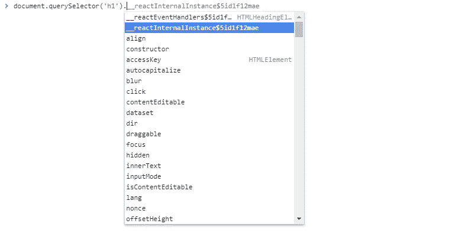

# ReactDOM.render 之旅 React 如何管理 DOM 和状态的解释

> 原文：<https://levelup.gitconnected.com/a-journey-through-reactdom-render-e8fc5edc11fd>

## React 中使用的纤程架构的概述，以及如何使用它来管理 DOM

ReactDOM 是一个对象，它公开了许多顶级 API 来与浏览器 DOM 进行交互。根据文档，它提供了“*特定于 DOM 的方法，可以在应用程序的顶层使用，如果需要的话，可以作为脱离 React 模型的出口。其中一种方法是`render()`。*

# 一些背景说明

在继续之前，有必要对 React 的内部工作方式有一个总体的了解。在 React 15 中，更新是以同步方式完成的。这造成了更新运行速度低于计算所需的 16ms(每秒 1000 毫秒/ 60 帧)的风险，导致 janky UIs。React 16 引入了 fiber，这是 React 的协调算法的重写，允许异步调度更新并区分优先级。这是通过重新实现浏览器的内置调用堆栈来实现的。这样做可以中断调用堆栈，并以一种专门为 React 组件定制的方式手动操作堆栈框架。

重写的核心是一个叫做**纤程**的数据结构，它是一个可变的对象，包含组件状态和 DOM 表示。它也可以被认为是一个虚拟堆栈框架。Fiber 的架构分为两个阶段:**协调/渲染**和**提交**。在这篇文章的过程中，我们将触及它的一些方面，但更广泛的解释可以在这里找到:

*   [React 中对账的深入概述](https://medium.com/react-in-depth/inside-fiber-in-depth-overview-of-the-new-reconciliation-algorithm-in-react-e1c04700ef6e)
*   [React 如何以及为什么使用链表来更新组件](https://medium.com/dailyjs/the-how-and-why-on-reacts-usage-of-linked-list-in-fiber-67f1014d0eb7)
*   [React 光纤架构说明](https://github.com/acdlite/react-fiber-architecture)
*   [Mozilla 员工工程师林克拉克关于 React Fiber 的演讲](https://www.youtube.com/watch?v=ZCuYPiUIONs)
*   [React 核心成员 Sebastian Markbage 对 React Fiber 背后原理的解释](https://github.com/facebook/react/issues/7942#issue-182373497)

# 旅程开始了

`ReactDOM.render()`实际上包装了另一个函数，并用两个额外的参数调用它，所以它的声明很简单。下面是包装的函数:

React 做的第一件事是为我们的应用程序创建**纤程树**。否则，它无法处理任何用户更新或事件。该树是通过调用`legacyCreateRootFromDOMContainer`创建的，它返回以下对象:

这被称为**纤维根对象**。每个 React 应用程序都有一个或多个充当容器的 DOM 元素，并且为每个容器创建一个对象。在这个对象上，我们通过`current`属性找到了对纤程树的引用，它的值是:

这是一个**纤程节点**，它位于每个 React 纤程树的根处([这个](https://github.com/facebook/react/blob/v16.7.0/packages/react-reconciler/src/ReactFiber.js#L85)是创建这个对象的函数)。这个节点实际上是一种特殊类型的纤程节点，称为`HostRoot`节点，它充当我们应用程序中最上层组件的父节点。我们知道它是一个`HostRoot`节点，因为它的`tag`属性的值是 **3** (你可以在这里找到纤程节点类型[的完整列表)。注意在这个阶段，很多属性，尤其是`child`，都是`null`。我们稍后将回到这一点。](https://github.com/facebook/react/blob/cbbc2b6c4d0d8519145560bd8183ecde55168b12/packages/shared/ReactWorkTags.js#L34)

创建树之后，React 检查我们是否提供了回调作为 render 调用的第三个参数。如果是这样的话，它获取对我们应用程序的根组件实例的引用(在我们的例子中，它是`<h1>`元素),然后确保我们的回调将在稍后在这个实例上被调用。

# 深入其中

在此之前发生的所有事情都是为将我们的应用程序呈现在屏幕上的工作做准备。到目前为止，我们有一个树，但它不像我们的用户界面。以下代码解决了这个问题:

`Root`是一个只有一个属性的对象(属性`_internalRoot`保存了对根纤程对象的引用)。它是通过调用`[ReactRoot](https://github.com/facebook/react/blob/v16.7.0/packages/react-dom/src/client/ReactDOM.js#L364)`函数上的`new`创建的，所以如果你查看它的内部`[[Prototype]]`链，你会发现下面的方法:

还记得我们前面的`HostRoot`纤程节点和所有的`null`值吗？在上面的函数中，我们可以通过`root.current`来访问它。`updateContainer()`完成工作后，它看起来是这样的:

并且`child`属性中的值现在是`<h1>` 元素的纤程节点:

如您所见，纤维树现在反映了我们想要呈现的 UI。那是怎么发生的？下面是为了让我们达到这一阶段而采取的步骤的总结:

## 计划更新

React 有一个内部的[调度器](https://github.com/facebook/react/tree/v16.7.0/packages/scheduler)，用于在浏览器环境中处理[协作调度](https://developer.mozilla.org/en-US/docs/Web/API/Background_Tasks_API)。这个包包括一个用于`[window.requestIdleCallback](https://developer.mozilla.org/en-US/docs/Web/API/Window/requestIdleCallback)`的 [polyfill](https://github.com/facebook/react/blob/v16.7.0/packages/scheduler/src/Scheduler.js#L415) ，它是 React 如何协调 UI 更新的核心。在此过程中，每个纤程节点都有一个**到期时间**。这是一个值，表示正在进行的**工作**(对帐期间发生的所有活动的名称)将在未来某个时间完成。

这种计算包括检查是否有优先级更高的未决工作以及当前正在进行的工作的性质。在我们的例子中，它是同步更新，但在其他场景中，它可以是交互式的或异步的。低优先级更新的例子包括网络响应或点击按钮改变颜色。高优先级更新包括用户输入和动画。

## 创建更新队列

在我们的例子中，我们只有一个纤程树，因为它没有更新队列，所以必须创建一个并分配给`updateQueue`属性。这个队列是用`[createUpdateQueue](https://github.com/facebook/react/blob/v16.7.0/packages/react-reconciler/src/ReactUpdateQueue.js#L152)` 函数创建的，它将纤程节点的 **memoizedState** 作为其参数。记忆状态是指用于创建节点输出的状态。队列是一个优先更新的链表，像纤程树一样，它也是成对出现的。**当前**队列代表 UI 的可见状态。

## 创建工作进展树并对其进行处理

当工作被实际执行时，React 检查它的内部堆栈，以确定它是从一个新的堆栈开始还是继续以前产生的工作。在这个检查之后不久，它使用一种被称为[双缓冲](https://en.wikipedia.org/wiki/Multiple_buffering#Double_buffering_in_computer_graphics)的技术来[创建](https://github.com/facebook/react/blob/v16.7.0/packages/react-reconciler/src/ReactFiber.js#L346)工作进程**树。React 使用两个纤程树——一个名为 **current** 的纤程树保存 UI 的当前状态，另一个名为 **workInProgress** 的纤程树反映未来状态。当前**树中的每个节点在**工作进程**树中都有一个对应的节点，该节点是在渲染过程中根据数据创建的。****

一旦 **workInProgress** 被渲染到屏幕上，它就成为新的**当前树**。workInProgress 树也有一个更新队列，但是它可以在渲染之前被变异和异步处理。

## DOM 元素创建

`<h1>`元素的**纤程节点**是在 **workInProgress** 树上工作期间创建的。几个调用之后，[这个](https://github.com/facebook/react/blob/c954efa70f44a44be9c33c60c57f87bea6f40a10/packages/react-dom/src/client/ReactDOMComponent.js#L374)函数使用 DOM API 来创建我们的`<h1>`元素，到目前为止它一直是一个 React element 对象。当应用程序呈现后，您可以通过键入`document.querySelector('h1')`来访问元素。如果你检查它的属性，你会发现一个以`__reactInternalInstance$`开头的。该属性保存对元素纤程节点的引用。React】也给分配元素的文本内容，然后[将它附加到我们的根 DOM 元素中。在追加之前，React 已经进入了提交阶段。](https://github.com/facebook/react/blob/c954efa70f44a44be9c33c60c57f87bea6f40a10/packages/react-dom/src/client/ReactDOMHostConfig.js#L361)

通过查看该属性的值，可以查看在 React 中创建的任何 HTML 元素的纤程节点

# 这就是它的全部

在我们的例子中，我们已经呈现了最基本的 ui，但是 React 已经做了大量的工作来准备和显示它。像大多数为构建复杂应用程序而创建的框架一样，它做这项工作是为了应对与此任务相关的所有可能发生的情况。由于示例应用程序是静态的，所以我们没有涉及到状态更新、生命周期挂钩以及其他方面的任何代码。

由于这是我第一次深入研究 React，我确信我遗漏了一些东西或者错误地解释了其他人，所以请在下面留下您的反馈！

 [## 学习 React -最佳 React 教程(2019) | gitconnected

### React 是一个现代 JavaScript 库，前端 web 开发人员使用它来构建用户界面(UI)。它用于…

gitconnected.com](https://gitconnected.com/learn/react)