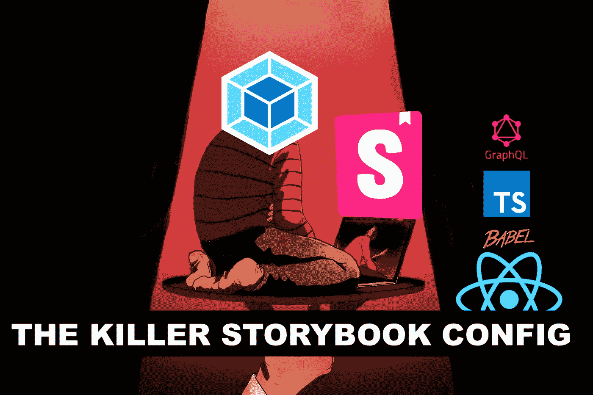
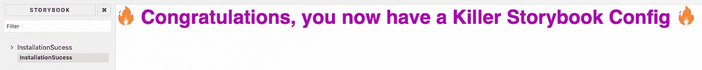
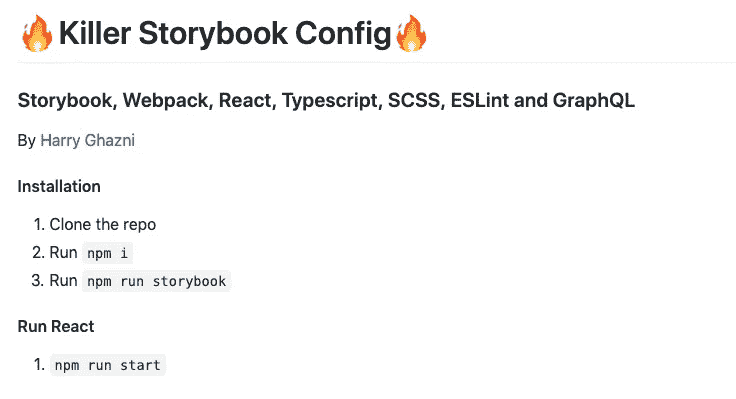

# 杀手故事书网络包配置

> 原文：<https://levelup.gitconnected.com/a-killer-storybook-webpack-config-a0fd05dc70a4>



嘿，嘶…是的，你…过来这里…你需要一本故事书的配置吗？是的，你听到了。你需要访问全局 SCSS 变量，不是吗？我正好有药给你。看看藏在我难以置信的污渍风衣里的这个…耶，这是一个杀手网络包配置。 什么？不，不，把装金条的公文包拿开，你的钱在这里没用，朋友…这是免费的。我带你去看世界。

# 什么是故事书？

它确实非常方便。 **Storybook** 是一个用于独立开发 UI 组件的开源工具。它大多与 React、Angular 和 Vue 相结合。

然而，我们将使用**和*做出反应。*** *这篇文章的目标是为 Storybook 创建一个配置，*让你的故事可以全局访问 ***SCSS 变量、打字稿、反应、巴别塔*** 和其他好东西。这是你需要的最杀手级的故事书版本。

# 我不能按照文档进行配置吗？

是的，如果你想构建你的 UI 组件，必须手动包含你所有的 SCSS 变量，直接满足于 CSS 或者不能访问你的 SCSS 变量？官方文档只能带你到这里，但是它遗漏了很多你在构建一个可靠的故事书 webpack 时会遇到的核心问题。然后你将不得不用每个依赖的所有包版本玩扫雷…对你来说谢天谢地，我已经为你受苦了。

# 装置

幸运的是，我不会要求您手动一点一点地将整个配置放在一起。我已经帮你做了重活。然而，如果你决定要迎合你的需求。克隆完不想要的，随便砍改。

首先，git 克隆那个坏小子下来。

```
git clone [https://github.com/hghazni/killer-storybook-config.git](https://github.com/hghazni/killer-storybook-config.git)
cd killer-storybook-config
```

一旦你得到了回购，我们需要:-

```
npm i
npm run storybook
```

仅此而已[🎉](https://emojipedia.org/party-popper/)



现在，如果你想在安装包后运行 **React** ，只需

```
npm start
```

# 那么这个配置中有什么呢？

好吧，让我们来探索是什么让这个故事书配置，*“杀手”。*

# 文件基础设施

这就是配置结构的布局。

```
|.storybook/
|.webpack/
|public/
|src/
|stories/
|-_babel.config.js
|-.babelrc
|-.eslintignore
|-.gitignore
|-package.json
|-tsconfig.json
|-webpack.config.js
```

**重要提示:**

`.webpack`是您的 storybook webpack 设置所在的位置。

`.src`是您的 react 应用程序还是您决定使用的任何前端(已经为您设置好)。

`public`是 React 应用程序编译的地方。

`.tsconfig.json`是您的打字稿翻译设置。

`.webpack.config.js`是你网站的主要引擎，几乎做了所有的事情。

# Webpack 配置

这是分解的这个 webpack 配置的引擎。

在根文件夹中有一个主`webpack.config.js`。这将决定你的应用程序如何运行。

根中还有一个包含我们的巴别塔配置的`_babel.config.js`。

在`.storybook`文件夹中有另一个`webpack.config.js`,它是主文件夹的延伸。这让我们的故事可以访问我们在 React 应用程序中使用的所有内容。

在同一个`.storybook`文件夹中，我们还有一个`config.ts`来搜索整个`src`文件夹。

最重要的是，我们在故事书的`rules.js`中包含了我们的 webpack 配置，并在`webpack.config.js`中需要它以供将来重用。

这就是在 React 应用程序中访问 SCSS 变量的神奇之处。总的想法是扩展我们在主 webpack 配置中使用的加载器，并在每个故事中包含特定的 SCSS 文件(上面列出的那些)。有了它，我们就能做一些神奇的事情。

如果您需要它用于项目中的另一个 webpack 配置，为了将来的可重用性，它被分成了一个`rule.js`。理想情况下，您也应该将它包含在您的根 webpack 配置中。

# 或者只是用我的配置引导

所以你可以从头开始构建一个，一步一步地使用上面的配置进行定制…或者，你可以下载我的 repo，只需几个命令就可以立即启动。



[https://github.com/hghazni/killer-storybook-config](https://github.com/hghazni/killer-storybook-config)

[](https://github.com/hghazni/killer-storybook-config) [## hghazni/杀手-故事书-配置

### 一个杀手级故事书 Webpack 配置，帮助你尽快启动一个伟大的故事书配置。它包括一个反应前端…

github.com](https://github.com/hghazni/killer-storybook-config) 

# 一路上学到的见解、技巧和诀窍

从不同的仓库提升和移动 webpack 配置时，检查您的`package-lock.json`。通过正确匹配包版本，而不是依赖于`package.json`，您可以省去很多麻烦。这也适用于解决任何类型项目的问题。

一点一点地构建你的 webpack 配置，不要试图一次完成所有事情。耐心是关键。如果你不系统地使用它，会浪费很多时间。

不要在 Storybook 中退而求其次，你可以用状态、道具、GraphQL 查询和真实数据设置几乎任何类型的环境。

# 经过思考

我写这篇文章的原因是，对于 webpack 的非专家级用户来说，让全局 SCSS 变量在 Storybook 中工作实际上是一个相当大的挑战。所以我花了很大力气试图得到一个易于重用、快速启动并运行的配置。

处于 webpack 配置拼图地狱，是最糟糕的地方。有了这个**黑仔故事书配置** …应该有助于平衡世界上的事情，只是一点点，并帮助你更快地启动和运行:)

# 感谢阅读

我的名字 [**哈里加兹尼**](https://github.com/hghazni) 我在英国诺丁汉工作。

如果你喜欢我写的东西，你可以在[***Twitter***](https://twitter.com/harryghazni)或[***medium***](https://medium.com/@hghazni)上找到我。我热爱我所做的事情，我所学的知识，并与他人分享。

我也有一个 YouTube 频道叫做 [**好奇 Byt** e](https://www.youtube.com/channel/UChgP4qLeMhkcJUFMO5S05mQ/) ，我在那里发布教程和建议，看看吧！