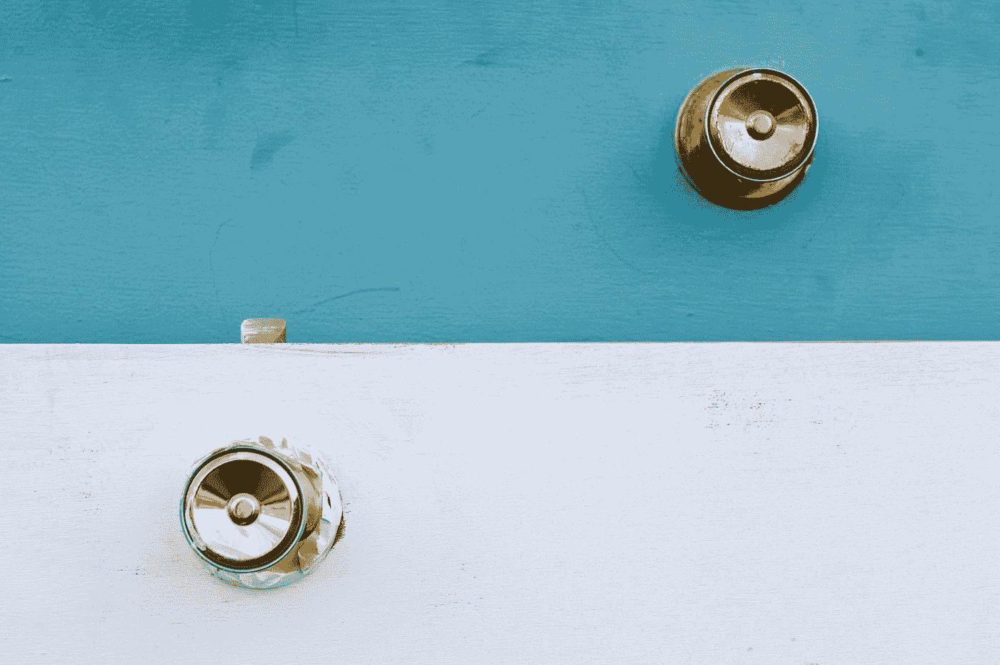
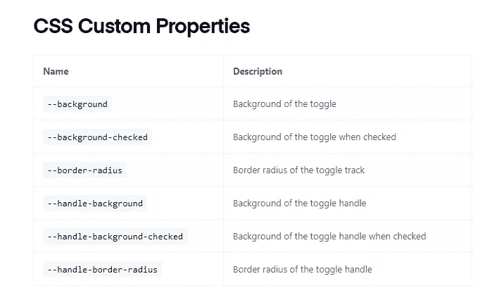
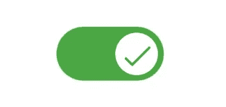
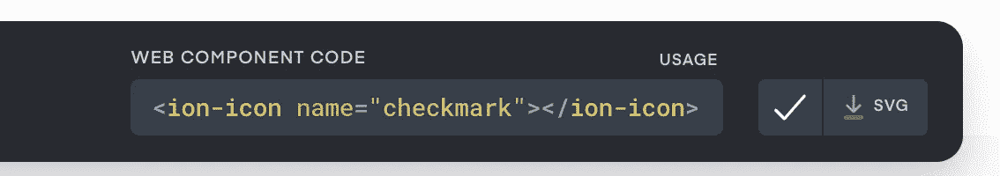
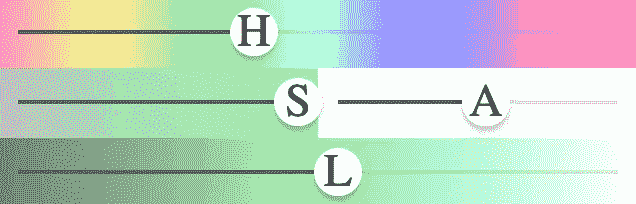

# 离子切换和离子范围的旋钮技巧

> 原文：<https://levelup.gitconnected.com/a-knob-trick-for-ion-toggle-and-ion-range-d0186e6d6edf>



戴维·埃德尔斯坦在 [Unsplash](https://unsplash.com?utm_source=medium&utm_medium=referral) 上拍摄的照片

这是一篇关于利用 CSS“背景”速记属性来设计 modern (4+) Ionic 的**离子开关**和**离子范围**组件的小文章。

Ionic Framework 令人惊叹，因为它是用标准 web 技术(web 组件)构建的。

我最近在使用新的框架版本时遇到的一个问题是关于 [ion-range](https://ionicframework.com/docs/api/range) 和 [ion-toggle](https://ionicframework.com/docs/api/toggle) 组件:Ionic 4+和更新的版本利用“shadow DOM”作为其组件，并且 Ionic 组件内部元素的样式是一个挑战(在 [CSS 自定义属性](https://medium.com/u/bb8eea5f6816#css-custom-properties)的限制，例如，这是 [ion-toggle](https://ionicframework.com/docs/api/toggle) 的选项:



ion-toggle 的 CSS 自定义属性

在我的应用程序中，我需要添加一个表达式来强调离子开关的状态，理想的情况是这样的:



用旋钮上的图标切换

基本上，我希望能够用一个图标来设计离子开关的旋钮，该图标将显示“开”位置的复选标记和“关”位置的十字。

# 设计旋钮

我看着第一个 CSS 变量“ **—背景**”，意识到它是…

> …一个在单个声明中设置以下属性的[简写](https://developer.mozilla.org/en-US/docs/Web/CSS/Shorthand_properties):`[background-clip](https://developer.mozilla.org/en-US/docs/Web/CSS/background-clip)`、`[background-color](https://developer.mozilla.org/en-US/docs/Web/CSS/background-color)`、`[background-image](https://developer.mozilla.org/en-US/docs/Web/CSS/background-image)`、`[background-origin](https://developer.mozilla.org/en-US/docs/Web/CSS/background-origin)`、`[background-position](https://developer.mozilla.org/en-US/docs/Web/CSS/background-position)`、`[background-repeat](https://developer.mozilla.org/en-US/docs/Web/CSS/background-repeat)`、`[background-size](https://developer.mozilla.org/en-US/docs/Web/CSS/background-size)`和`[background-attachment](https://developer.mozilla.org/en-US/docs/Web/CSS/background-attachment)`。

这意味着，理论上，我们可以使用这些属性中的任何一个，并使用背景图像来设计 ion-toggle 旋钮的样式。

# 将 ion-icon 的 SVG 放在旋钮上:

由于 Ionic 附带了一组离子图标，我们可以从[www.ionicons.com](http://www.ionicons.com)获得矢量格式(SVG)的图标:



我下载了 SVG 格式的“勾号”和“关闭”图标，然后使用这个[奇妙的 URL 编码器](https://yoksel.github.io/url-encoder/)为我的 CSS 做好准备:

以上**部分重点介绍**:

1.  我确实从 SVG 源代码中删除了`width=’512' height=’512'`,因为 Safari 不能很好地处理这些属性
2.  我修改了`stroke`的颜色为‘白色’(# fff)而不是复选标记图标的黑色(#000)，使其在较暗的背景下更明显
3.  我使用“居中/80%”来调整图标的大小，并集中放置

通过上述更改，我们实现了这一点:


# 将字母放在旋钮上:

有时我们也想在把手上印上大写字母。因此，在我的应用程序中，我希望获得 H、S、L 和 A 字母的颜色范围，我使用 ion-range 实现了这一点。

为此，我们可以再次使用 SVG 的力量。我在这里创建了这个 URL 编码的 SVG，它使用 SVG 居中对齐的文本元素，现在我可以用我需要的任何内容替换字母:

```
<svg  xmlns:xlink="http://www.w3.org/1999/xlink" viewBox="0 0 50 50">

    <text style='font-size: 48px' fill='black' x='50%' y='50%' alignment-baseline='central' text-anchor='middle'>
    A
    </text>

</svg>
```

现在，使用相同的 URL 编码器，我生成了这些 CSS 规则:

最后的结果是:



速记 CSS 属性是惊人的，因为它们允许你对元素的许多方面进行样式化，而不仅仅是一个方面。“背景”CSS 属性非常强大，因为它有许多样式选项，我们可以将它用于任何通过 CSS 变量公开它的 Ionic 组件。

感谢您的阅读和快乐编码！