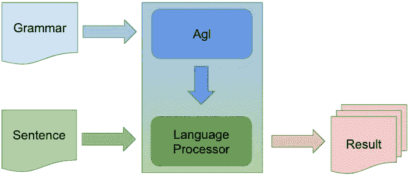

# 可从 JVM 或 JavaScript 使用的 Kotlin 多平台解析器

> 原文：<https://levelup.gitconnected.com/a-kotlin-multi-platform-parser-usable-from-a-jvm-or-javascript-59e870832a79>

## 当一个正则表达式还不够时，动态的、按需扫描的、GLR 解析

AGL 的一个目的是为小规模 DSL 的快速开发提供支持，包括当一个正则表达式不够用，而一个解析器生成器又超出您的需要时的用例。

如果你想要一个能够处理数千行和数百万行代码的成熟编程语言的解析器，那么这个不适合你。试试 [ANTLR](https://www.antlr.org/) 。 [Xtext](https://www.eclipse.org/Xtext/) 、 [Yacc](https://en.wikipedia.org/wiki/Yacc) 等。

但是，如果您想要一个满足以下要求的解析器，那么 AGL 就是您想要的。

1.  解析器应该在运行时构建(动态地)。
    即没有单独的生成代码步骤或单独的工具来生成解析器。
2.  书写语法规则应该尽可能直观。
    也就是说，我们想写语法而不必担心关于左、右或隐藏递归的限制。即解析器应该处理任何有效的类似 EBNF 的语法，没有限制。
3.  关于保留字没有限制。
    即可以定义一个语法，其中关键字可以用作变量名。
4.  解析器应该支持语言家族。
    即语法作文。
5.  解析器应该既可以在 JVM (Java)平台上使用，也可以在浏览器或其他 JavaScript 平台上使用。
6.  解析器必须有足够的性能才可用。
    也就是说，对于明确的语法，应该能够在 1 秒钟内解析至少一页文本。

AGL 是开源的，[可在 github](https://github.com/dhakehurst/net.akehurst.language) 上获得。这是我多年反复试验的结果，因为我了解了解析算法的复杂性。



虽然 AGL 的主要目标是解析，但在处理语言时，其他相关操作也很有用。AGL 为语法分析、格式化和代码完成提供了一些基本支持。

## 其他文章

[为文本输入验证创建自定义的领域特定语言](https://medium.com/javascript-in-plain-english/agl-your-dsl-in-the-web-c9f54595691b)

# 入门指南

该项目是开源的，在 github 上有 Apache 2.0 许可[。科特林模块是在 jcenter](https://github.com/dhakehurst/net.akehurst.language) 上发布的[。另外，](https://jcenter.bintray.com/net/akehurst/language/)[Javascript 模块在 npmjs.com](https://www.npmjs.com/package/net.akehurst.language-agl-processor)发布。

## 格拉德勒

```
dependencies {
  commonMainApi("net.akehurst.language:agl-processor:$version_agl")
}ordependencies {
  implementation("net.akehurst.language:agl-processor:$version_agl")
}
```

## NPM /纱线

```
npm install net.akehurst.language-agl-processoryarn add net.akehurst.language-agl-processor
```

## 科特林

```
import net.akehurst.language.processor.Agl
import net.akehurst.language.api.analyser.AsmElementSimple...val grammarStr = ...
val sentence = ...
val proc = Agl.processor(grammarStr)
val asm = proc.process<AsmElementSimple>(sentence)
```

## Java 语言(一种计算机语言，尤用于创建网站)

```
import net.akehurst.language.agl.processor.Agl;
import net.akehurst.language.api.processor.LanguageProcessor;
import net.akehurst.language.api.analyser.AsmElementSimple;...String grammarStr = ...
String sentence = ...
LanguageProcessor proc =
                  Agl.*INSTANCE*.processor(grammarStr,null,null);
AsmElementSimple asm = proc.process(sentence);
```

## Java Script 语言

```
const agl_module = require('net.akehurst.language-agl-processor');
const Agl = agl_module.net.akehurst.language.agl.processor.Agl;const grammarStr = ...
const sentence = ...
const proc = Agl.processorFromString(grammarStr);
const asm = proc.process(sentence).toArray();
```

# 例子

有一个[在线演示](https://info.itemis.com/demo/agl/editor)，集成了 Ace 和 Monaco 编辑器，github 库中有一些[小例子。此外，对主 agl 处理器模块的测试还有许多其他的例子。](https://github.com/dhakehurst/net.akehurst.language/tree/master/examples)

# 创建语言处理器

AGL 是用 Kotlin 编写的多平台模块。因此，它可以在 Java(或其他 JVM 语言)、基于 JavaScript 的语言(包括 TypeScript 等)中使用，甚至可以在本机代码中使用……尽管这还没有得到很好的测试。

> 本文中的代码示例用 Kotlin 给出。但是等价的 Java 或 JavaScript 代码也可以工作。关于如何从这些其他语言调用 Kotlin 代码，请参见 Kotlin 文档。

AGL 模块(库)在 [jcenter](https://bintray.com/bintray/jcenter) 发布(Javascript 版本也在 [npm](https://www.npmjs.com/) 发布)。使用你最喜欢的构建工具来获得它。我推荐 [gradle](https://gradle.org/) 。

API 入口点是`Agl`对象。它包含了许多从 AGL 语法的定义创建语言处理器的有用方法。例如，

```
val grammarStr = ...
val myProcessor = Agl.processor(grammarStr)
```

一旦你创建了一个`LanguageProcessor`，你就可以用你的语言扫描、解析、处理等句子。

> 它被称为语言处理器(而不是语言解析器)，因为它可以做的不仅仅是解析。它还可以执行扫描(如果您想简单地扫描)、格式化和语法分析(将解析结果转换成 AST 抽象语法树)。

## 扫描

尽管 Agl 提供了一个按需扫描解析器，但有时您确实想简单地扫描一个句子，并返回一个与您的语言语法中的终止符号相匹配的标记列表。

```
val grammarStr = ...
val myProcessor = Agl.processor(grammarStr)
val tokens = myProcessor.scan("some nice sentence")
```

## 从语法上分析

为了解析一个句子，你可以定义目标规则，也就是你想要用来匹配句子的语法规则。

```
val grammarStr = ...
val myProcessor = Agl.processor(grammarStr)
val sppt = myProcessor.parse("goalRule", "some nice sentence")
```

或者，如果您省略了 goalRule，解析器将简单地使用您在语法中定义的第一个规则(参见下面如何定义语法)。

解析的结果不仅仅是一棵解析树。Agl 使用基于 GLR 的解析算法。如果你定义了一个不明确的语法，可能会有多个解析树结果，这取决于你所解析的句子。

解析的结果被称为共享打包解析树(SPPT)。该树只有一个根节点。节点可以是分支节点，也可以是叶节点。

叶节点是“令牌”的表示，包含从句子中匹配的简单字符串。(scan 函数返回代表令牌的 SPPT 叶节点列表)。

分支节点是与简单解析树(PT)不同的地方。在简单的解析树中，分支节点包含一系列子节点。在 SPPT 中，分支节点包含多个(可选)子列表。如果你的语法是明确的，所有的分支节点将只包含一个孩子的列表，SPPT 将相当于一个简单的解析树。

## 处理

通常，解析器提供选项来编写用于构建抽象语法树(AST)的“语义动作”。从 PT 构造 AST 的过程被称为语法分析。

AGL 将使用默认的简单语法分析器进行语法分析。或者你可以在构建语言处理器时给它一个定制的语法分析器。

```
val grammarStr = ...
val analyser = MySyntaxAnalyser()
val myProcessor = Agl.processor(grammarStr, analyser)val ast = myProcessor.process<AstType>("a nice sentence")
```

## 格式化

类似地，如果您将一个格式化程序传递给处理器，那么您可以要求它格式化一个 AST 或一个句子。

```
val grammarStr = ...
val analyser = MySyntaxAnalyser()
val formatter = MyFormatter()
val myProcessor = Agl.processor(grammarStr, analyser, formatter)val formattedSentence = myProcessor.formatText("a nice sentence")
```

## 代码完成

还提供了基本的代码完成支持。如果你给处理器一些文本和文本中的一个位置，它可以告诉你下一步它期望找到什么。即

```
val grammarStr = ...
val myProcessor = Agl.processor(grammarStr)
val sentence = ...
val pos = 5
val next = myProcessor.expectedAt(sentence, pos)
```

# 定义语法的语言

要创建一个语言处理器，你需要定义一个语法。定义语法的 AGL 语言是基于 EBNF 的。

## 规则

规则是用 LHS 名称和 RHA 集合的终端和非终端符号以及操作符定义的。例如，一对用于解析非常简单的属性声明的规则可能看起来像:

```
propertyDeclaration = NAME ':' NAME ;
NAME = "[a-zA-Z][a-zA-Z0-9]*" ;
```

LHS 为非终端定义了一个名称，该名称可用于其他规则。第一个规则的 RHS 定义了非终结符`NAME`、文字值`:`和非终结符`NAME`的连接。第二个规则用 RHS 定义了`NAME`，RHS 是一个单独的条目，它是一个正则表达式，匹配符合简单标识符的字符串。

RHS 规则项目可以是以下三种情况之一:

*   非终结符(其他规则的名称)
*   用单引号括起来的终端文字值
*   终止模式值，用双引号括起来的正则表达式

RHS 规则项可以通过多种不同的方式进行组合，如以下部分所述。

## 串联

上面的例子显示了最简单的组合，连接。

## 选择

我们还可以用一个简单的选择操作符来组合项目，

```
boolean = 'true' | 'false' ;
```

然而，由于 AGL 是一个按需扫描的解析器，所以考虑选择的顺序是很重要的。

> 按需扫描并不意味着不进行扫描，只是意味着在解析器之前没有单独的扫描器(或词法分析器)执行。当解析器需要一个令牌时，扫描按需进行。
> 这提供了能够使用关键字作为标识的优势，但是以可能额外的模糊性为代价。

一个不同的例子说明了这一点。typeReference 可以是 builtInType 或 userDefinedType。以下语法在解析`int`时给出错误的结果。虽然`builtInType`规则匹配字符串`int`，但是`NAME`规则也匹配，因此`userDefinedType`也匹配。当解析器试图匹配`typeReference`时，它有两个选择。

```
typeReference = builtInType | userDefinedType ;
builtInType = 'int' | 'boolean' | 'real' ;
userDefinedType = NAME ;
NAME = "[a-zA-Z][a-zA-Z0-9]*" ;
```

为了消除选择的歧义，解析器首先试图找到最长的选项，如果长度相同，那么它将选择最后一个选项:在这种情况下(不正确地)，它选择了`userDefinedType`。

为了得到所需的结果，当`builtInType`规则优先于`userDefinedType`规则时，我们必须定义优先级最高的项目排在最后的规则。

```
typeReference = userDefinedType | builtInType ;
builtInType = 'int' | 'boolean' | 'real' ;
userDefinedType = NAME ;
NAME = "[a-zA-Z][a-zA-Z0-9]*" ;
```

## 可选择的

要定义可选的 RHS 项目，使用`?.`

```
propertyDeclaration = modifier? NAME ':' NAME ;
```

## 多样性

要定义多个 RHS 项目，请使用:`*`、`+`、`2+`或一个范围`2..5`

```
itemList0 = item* ;     // 0 or more items
itemList1 = item+ ;     // 1 or more items
itemList2 = item+ ;     // 2 or more items
itemList3 = item3..7 ;  // between 3 and 7 items
```

> 可选项目(使用`?`)相当于多重`0..1`

## 分隔列表

有时候你想要一个列表，但是这个列表需要被其他的条目分开。一个典型的例子是由`','`符号分隔的参数列表。

```
argumentList0 = [ argument / ',' ]* ;  // 0 or more
argumentList1 = [ argument / ',' ]+ ;  // 1 or more
argumentList2 = [ argument / ',' ]2+ ;  // 2 or more
argumentList3 = [ argument / ',' ]3..7 ;  // 3 to 7
```

## 组

当然，有时你想写一个复杂的规则，并用括号`(…)`将条目组合在一起。

```
rule1 = a b (c d* )? ( [e / ',']+ )? ; 
```

## 跳过规则

除了普通的解析器规则，我们还可以定义`skip`规则。这些规则支持你的语言中的注释和空白。它们将匹配任何其他规则中项目之间的句子部分。

例如，大多数语言通常需要一个匹配空白的规则，如下所示:

```
skip WHITESPACE = "\s+" ;
```

## 树叶规则

有时，为端子符号命名或使用多个规则定义端子会很有帮助。这可以通过将规则标记为“叶”规则来实现。

```
leaf ID = "[a-z][a-z0-9]*"
DIGIT = "[0-9]+"
leaf REAL = DIGITS '.' DIGITS 
```

在上述规则中，`ID`被定义为 RHS 上给定正则表达式的终止符号。此外，通过将规则`REAL`标记为叶规则，它相当于用正则表达式`"[0-9]+[.][0-9]+"`定义了一个终止符号。

> 叶规则**不得包含递归。**

## 语法定义和构成

一个完整的语法定义被包装起来并被赋予一个名称和命名空间，

```
namespace com.example.language
grammar MyPropertyLanguage { skip WHITESPACE = "\s+" ;

  property = ID ':' typeReference ;
  typeReference = ID typeArguments? ;
  typeArguments = '<' [typeReference / ',']+ '>' ;

  ID = "[A-Za-z_][A-Za-z0-9_]*" ;}
```

提供了名称和命名空间，以便我们可以执行语法合成。例如，我们可以用一种语法扩展另一种语法，

```
namespace com.example.language
grammar MyLanguage extends MyPropertyLanguage { unit = class* ;
  class = 'class' ID '{' property* '}' ;}
```

或者我们可以将一种语法嵌套在另一种语法中，

```
namespace com.example.languagegrammar Expressions { expression = ... ;}grammar MyLanguage { readOnlyProperty = 'val' NAME '=' Expressions.expression}
```

使用语法扩展，得到的语法相当于包含两组规则的单个语法。但是，扩展(超)语法中的规则可以在扩展(子)语法中被覆盖(给出新的定义)。

当你在另一个语法中使用`nest`一个语法时，解析器基本上暂停基于`outer`语法的解析，并尝试继续使用`inner`语法进行解析，直到它匹配给定的`inner`规则，然后它再次继续使用`outer`语法。这意味着，例如，您可以在`inner`语法中定义完全不同的空白(跳过)规则。

# 摘要

在 Kotlin 中，解析器是作为一个公共模块实现的，因此它可以在任何 Kotlin 目标上使用。

解析器的目标之一是使使用它尽可能容易，所以它为了可用性牺牲了原始速度。然而，对于不明确的语法，它仍然保持可接受的性能。

解析器仍在开发中，我很乐意接受感兴趣的用户的贡献、建议和任何其他反馈。请对本文发表评论或在 github 资源库中提出问题。