# 用于现有知识库的有文化的编程环境

> 原文：<https://levelup.gitconnected.com/a-literate-programming-environment-for-existing-repositories-9e3cd7b47e1e>

文化编程是 DevOps 或变更集成/变更部署(CI/CD)的超集。我详述了如何通过为现有的 Github 库定制 nbdev 来实现有文化的编程。示例代码可以用于其他供应商的存储库，如 Gitlab 和 Bitbucket。


图一。唐纳德的《有文化的编程》的书皮。来源:作者截图。

# 什么是识字编程？

> 识字编程是由[唐纳德·克努特](https://en.wikipedia.org/wiki/Donald_Knuth)引入的[编程范式](https://en.wikipedia.org/wiki/Programming_paradigm)，其中用[自然语言](https://en.wikipedia.org/wiki/Natural_language)如英语给[计算机程序](https://en.wikipedia.org/wiki/Computer_program)解释其逻辑，穿插[宏](https://en.wikipedia.org/wiki/Macro_(computer_science))的[片段](https://en.wikipedia.org/wiki/Snippet_(programming))和传统[源代码](https://en.wikipedia.org/wiki/Source_code)，从中可以生成[可编译的](https://en.wikipedia.org/wiki/Compiler)源代码— [维基百科](https://en.wikipedia.org/wiki/Literate_programming)

按照最初的设想，文化编程将文档、代码和测试放在一个媒体中。

# nbdev 是什么？

> `nbdev`是一个允许你在 [Jupyter Notebooks](https://jupyter.org/) 中开发 python 库的库，把你所有的代码、测试和文档放在一个地方。— [nbdev 项目](https://github.com/fastai/nbdev)。

由 [nbdev](https://nbdev.fast.ai/tutorial.html) 实施的识字编程使您的 Jupyter 笔记本媒体能够:

1.  文档，然后为 web 生成一个完整的、带索引的、超链接的、可搜索的文档集；

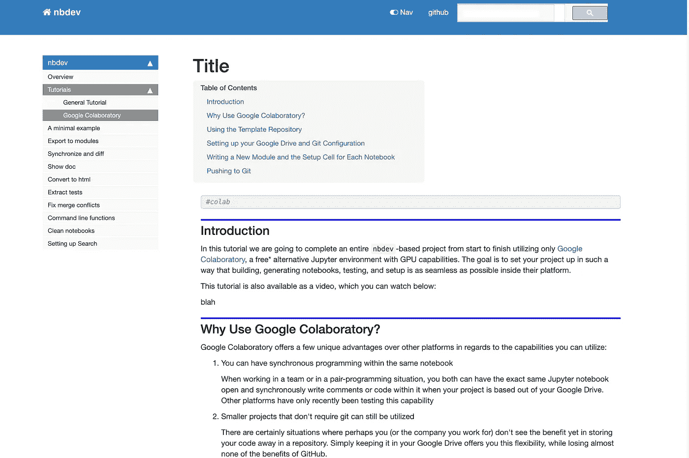

图二。由 nbdev 自动生成的 Web 文档。来源:作者截图。

2.可选地，将文档自动部署到[readthedocs.org。](https://readthedocs.org/)

3.Jupyter 笔记本版本控制；

4.从 Jupyter 笔记本媒体自动执行测试或组测试。您决定如何显示测试结果以及测试结果所需的任何后续行动；

5.将代码自动部署为 PyPI 包。；

6.PyPI 包的自动版本号管理；

7.[还有更多……](https://nbdev.fast.ai/)

文化编程及其实现作为 nbdev 作为 DevOps 或变更集成/变更部署(CI/CD)的超集。

# 新项目回购或现有项目回购

你有两个选择:

1.  您还没有为您的项目创建 Github repo。您希望项目包括 nbdev。[原始路径步骤不适用]详细介绍了这种情况。
2.  您已经为项目创建了一个 Github repo。您希望项目包括 nbdev。[定制路径步骤注意]详细描述了这种情况。

***注*** *: n 为 1，2，…n 中的整数变量*

## [原步骤 1a。]为新的 Github Repo 完成 nbdev 设置。

1.  遵循“ [nbdev 通用教程”](https://nbdev.fast.ai/tutorial.html)中的说明，直到[编辑 settings.ini](https://nbdev.fast.ai/tutorial.html#Edit-settings.ini) 。
2.  创建了包含所有必需的 nbdev 文件的整个存储库。您可以继续 nbdev 设置的[原始步骤 2]。

如果您想通过点击 [nbdev 模板](https://github.com/fastai/nbdev_template/generate)为一个新的项目 repo 创建一个新的 GitHub repo，那么步骤 1a 可以正常工作。

***注意*** *:如果你有一个 Github 的登录会话，新的 repo 被创建。*

## 【定制步骤 1b。]为现有 Github Repo 完成 nbdev 设置。

如果你已经有一个现有的 Github repo，并希望该项目添加 nbdev 的功能，那么这些是我遵循的步骤。

1.  我完成了步骤 1a。，但是我用了 <repo-name>= `nbdevtmp .`</repo-name>

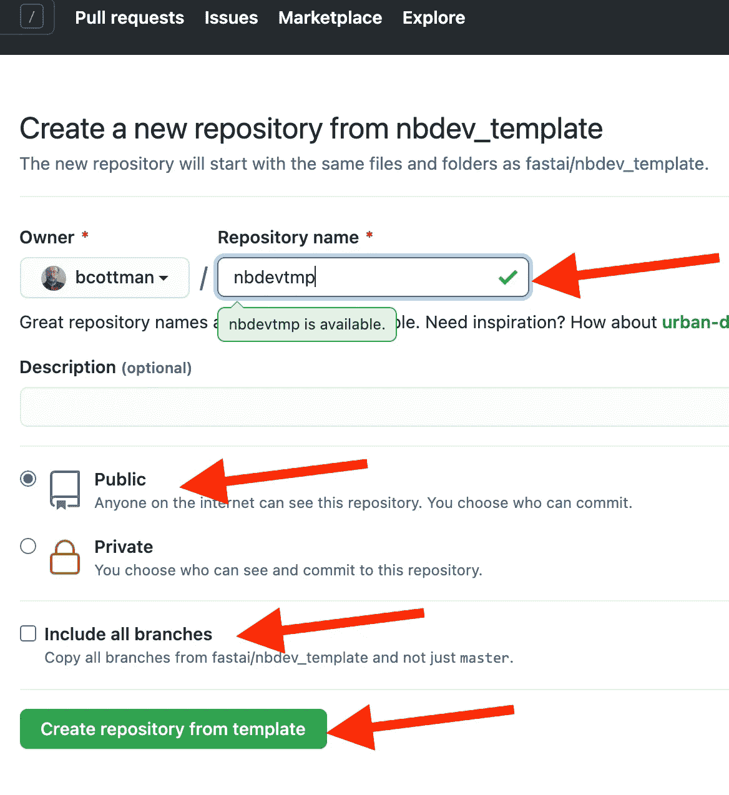

图 3。点击“从模板创建存储库以重命名您的存储库——来源:作者截图。

***注*** *:您知道可以用模板创建回购吗？我现在知道了！*

2.你必须更新(推送)所有本地回购，每个本地开发沙箱到<existing-project-repo>。</existing-project-repo>

***注意*** *:如果它们存在，在你的本地 repo<existing-project-repo>重命名 CONTRIBUTING.md，LICENSE，MANIFEST.in，README.md 通过在名称字符串末尾打上 x，例如，CONTRIBUTINGx.md、LICENSEx、MANIFESTx.in、READMEx.md。在步骤 3 之后，将这些文件中的任何冲突与来自* `*nbdevtmp .*`的合并文件进行协调

```
#git push -u origin <branch-name>
# what I did was...
git push -u origin branch-ccce48bb-f718–4f68-b742–615886313f2a
```

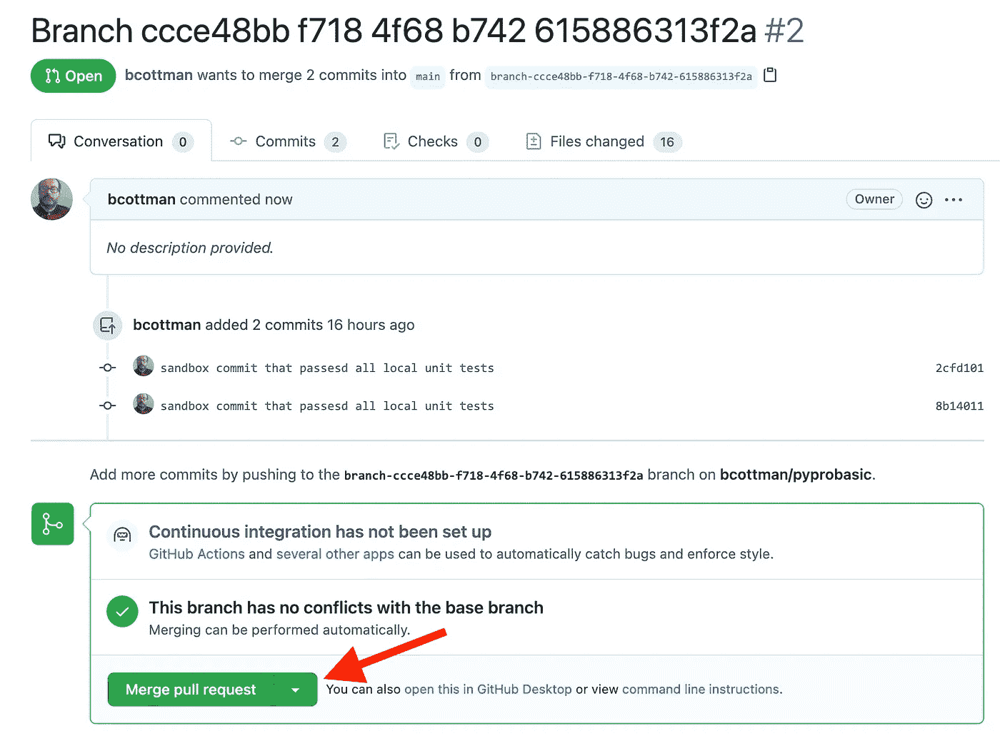

图 4。一个来自本地存储库的请求合并。可能有几个本地的回购——来源:作者截图。

3.接下来，我将`nbdevtmp`与<现有项目回购>合并。

```
#credit for following [aidus](https://stackoverflow.com/questions/1425892/how-do-you-merge-two-git-repositories)
# what I did was...cd <project-parent-directory>
# git remote add <nbdevtmp-project-name> <gthub-url-path-nbdevtmp>
git remote add nbdevtmp [https://github.com/bcottman/nbdevtmp](https://github.com/bcottman/nbdevtmp)git fetch nbdevtmp --tags
git merge --allow-unrelated-histories nbdevtmp/master
```

如果没有完成第 2 步，推送所有本地回购；在第 3 步之前，您会得到关于合并的错误:

```
error: Your local changes to the following files would be overwritten by merge: <list of files that would be overwritten>
```

4.在两个回购合并的最后一步，我删除了回购`nbdevtmp.`

```
git remote remove nbdevtmp
```

# 【标准步骤 2。]启用 Github 页面

你可以把你的文档放在`https://<gituhb-id>.github.io/<project-name>/`或者 readthedoc.io

> nbdev 系统使用 [jekyll](https://jekyllrb.com/) 进行文档化。因为 [GitHub Pages 支持 Jekyll](https://help.github.com/en/github/working-with-github-pages/setting-up-a-github-pages-site-with-jekyll) ，你可以在 [Github Pages](https://pages.github.com/) 上免费托管你的站点，不需要任何额外的设置，所以这是我们推荐的方法(但不是必须的；任何 jekyll 主机都可以)。— [nbdev 项目](https://nbdev.fast.ai/tutorial.html#Github-pages)

下面三个截图展示了如何为 nbdev 设置 Github 页面。

1.  转到您的项目-例如回购`[https://github.com/bcottman/pyprobasic.](https://github.com/bcottman/pyprobasic.)`
2.  点击`Settings,`，然后点击`Pages,`，如图 5 中红色箭头所示。
3.  其他红色箭头显示设置`Source,` 和`Change theme.`

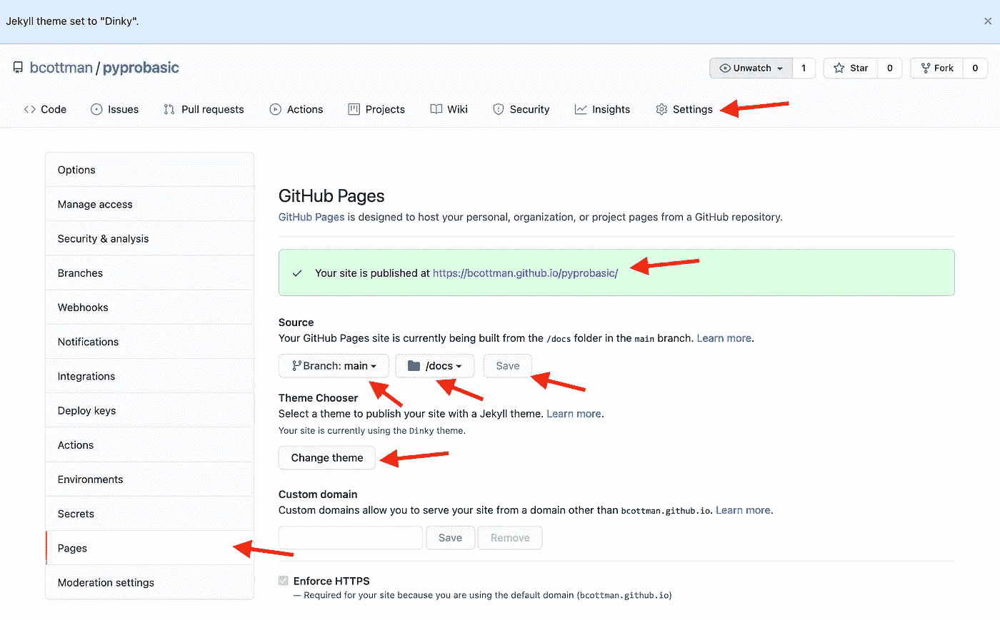

图 5。设置 Github 页面。来源:作者截图。

4.返回到顶部的 project-repo 页面，单击“齿轮”图标，如图 6 中的红色箭头所示。

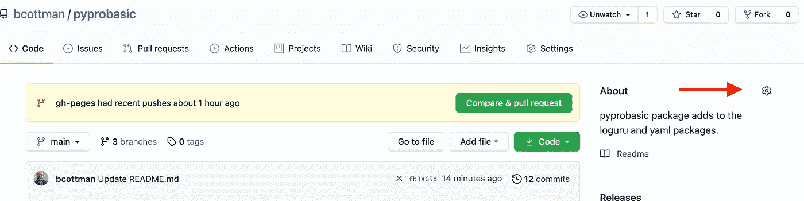

图 6。Github 项目-回购页面。来源:作者截图。

5.将 Github Pages URL 粘贴到`Website`文本框中，位置如图 7 中的红色箭头所示。

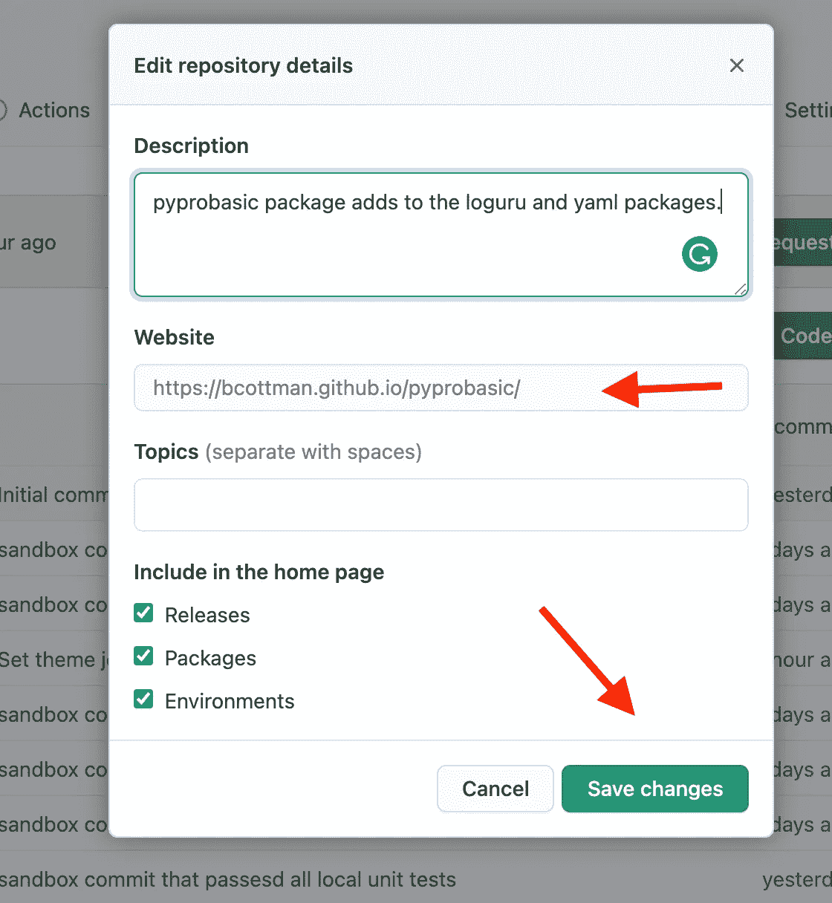

图 7。“存储库详细信息”页面。来源:作者截图。

# 【标准步骤 3。]编辑 setting.ini

编辑 setting.ini 的方法有很多，我可以告诉你我是怎么做的。

***注意*** *:我用标记* `*{constant}*` *来表示你的定制值中的一个替换，通常是文本。*

我在笔记本上从文件`[nbdev_template/settings.ini](https://github.com/fastai/nbdev_template/blob/master/settings.ini)`到`{local repo dir path}/setting.ini`的内容。

我在图 8 中举例说明。我设置的值，如图 8 中的红色箭头所示。也请熟悉 [nbdev 说明](https://nbdev.fast.ai/tutorial.html#Edit-settings.ini)。

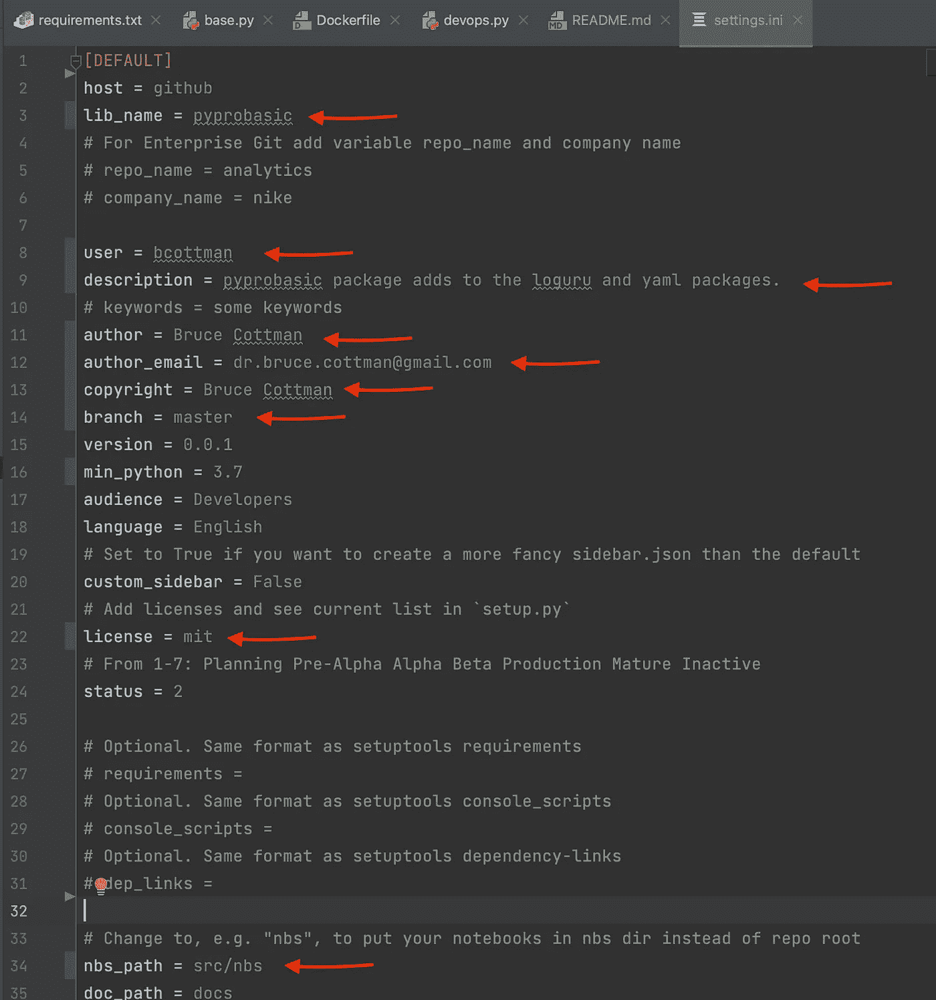

图 8。setting.ini 中的改动用红色箭头标出—来源:作者截图。

最后，我完成了:

```
cd .... /Projects/pyprobasic
mkdir nbs
cd nbs# link -s <local project directory path> to (path/lib_name)
# Example
```

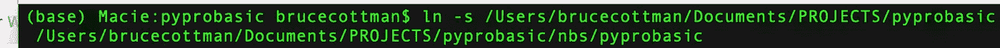

图 9。link -s 示例。来源:作者截图。

我把这个项目的任何`*.ipynb` 文件都复制到了`… /Projects/pyprobasic/nbs.`

另一种方法是将`nbs_path`设置为`.`并将`*.ipynb` 文件放在`… /Projects/pyprobasic/.`的项目顶层目录中，这不是我推荐的选择。

# 【标准步骤 4。]安装 git 挂钩

***注意*** *:* [*你大概想把默认 shell 改成 bash on MAC OS Catalina*](https://www.howtogeek.com/444596/how-to-change-the-default-shell-to-bash-in-macos-catalina/)*from zsh。我需要改用 bash shell，因为在过去的 12 年里，我所有的脚本都在 bash 中。在任意终端*和`cshsh -s /bin/bash`上重启终端会话. h

我在这一步使用了 [nbdev 项目安装说明](https://nbdev.fast.ai/tutorial.html#Install-git-hooks-to-avoid-and-handle-conflicts)。

# 【标准步骤 5。]每。ipynb 文件必须有# default_exp<file-name></file-name>

每个`.ipynb`文件的第一行必须有`# default_exp <file-name-of-generated>.py.`例如:

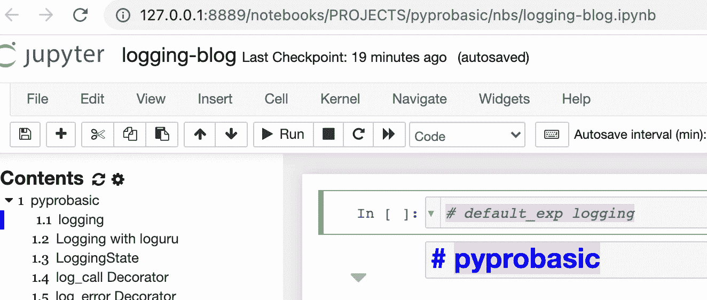

图 10。`# default_exp logging generated logging.py from logging.ipynb`。来源:作者截图。

***注意*** *:如果不把* `*default_exp …*` *放在每个* `*.ipynb*` *文件的第一行，就会产生类似于*的错误

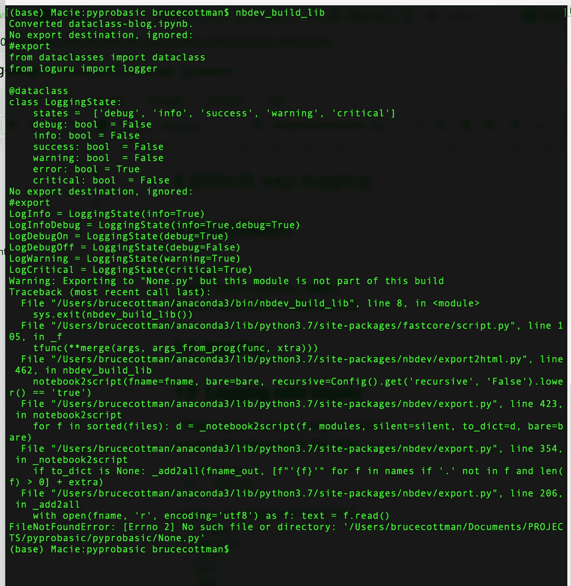

图 11。由`# default_exp <file-name-of-generated .py>` 示例产生的错误消息。来源:作者截图。

# 【标准步骤 6。] nbdev 命令

我将运行一系列 nbdev 命令来测试在现有回购上使用 nbdev。

## nbdev_build_lib

在我的项目文件夹中`˜/Documents/PROJECTS/pyprobasic` n [我试着](https://nbdev.fast.ai/tutorial.html#Edit-00_core.ipynb):

```
$ nbdev_build_lib
```

输出是:

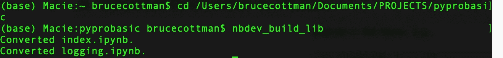

输出看起来没问题，但是我们应该检查`˜/Documents/PROJECTS/pyprobasic/pyprobasic/logging.py`:

```
# AUTOGENERATED! DO NOT EDIT! File to edit: nbs/logging.ipynb (unless otherwise specified).__all__ = ['LoggingState', 'LogInfo', 'LogInfoDebug', 'LogDebugOn', 'LogDebugOff', 'LogWarning', 'LogCritical']# Cell
from dataclasses import dataclass
from loguru import logger[@dataclass](http://twitter.com/dataclass)
class LoggingState:
    states =  ['debug', 'info', 'success', 'warning', 'critical']
    debug: bool  = False
    info: bool = False
    success: bool  = False
    warning: bool  = False
    error: bool = True
    critical: bool  = False# Cell
LogInfo = LoggingState(info=True)
LogInfoDebug = LoggingState(info=True,debug=True)
LogDebugOn = LoggingState(debug=True)
LogDebugOff = LoggingState(debug=False)
LogWarning = LoggingState(warning=True)
LogCritical = LoggingState(critical=True)
```

不错！由我的 logging.ipynb 笔记本生成。

## nbdev_build_docs

接下来，在我的项目文件夹`˜/Documents/PROJECTS/pyprobasic` n [中，我尝试](https://nbdev.fast.ai/tutorial.html#Edit-00_core.ipynb):

```
nbdev_build_docs
```

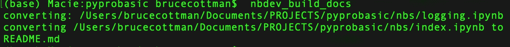

输出看起来没问题，但是我们应该检查`˜/Documents/PROJECTS/pyprobasic/pyprobasic/README.md`:

```
# Welcome to pyprobasic
> Create yal (yet another logger)
```

不错！由我的 index.ipynb 笔记本生成。

**然而**

我在这里退出是因为当我在端口 4000 上查看生成的文档时:

```
make docs_serve
```

结果输出是:

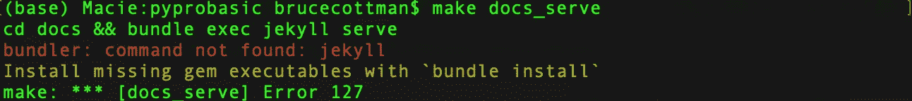

哎哟！我将在下一篇博客文章中修复它。暂时够了。我需要去睡觉。

# 摘要

我展示了如何针对以下情况为 Jupyter 笔记本定制 nbdev(识字编程):

*   你已经有了一个 Github 项目库；
*   您希望将笔记本放在项目的子目录中；

目前，nbdev 在 Ubuntu 20.04 上工作，安装了 ruby、bundle、 [Jekyll](https://jekyllrb.com/) 、gem 和其他 gem。在这篇博客文章的更新中，我详细介绍了如何使用 MacOS。祝我好运，因为我希望我不必接触 nbdev 的源代码。

在另一篇博客文章中，我展示了如何使用 docker 为任何环境制作一个可移植的 nbdev。

作为 nbdev 替代 DevOps 或变更集成/变更部署(CI/CD)的识字编程及其实施。

识字编程是 DevOps、DataOps、MLOps 和任何其他 XOP 之后的下一步。

快乐编码是高效的工程。