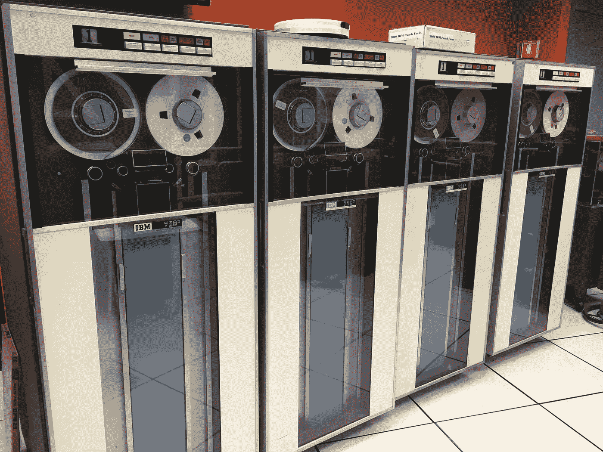

# 一个小操作系统

> 原文：<https://levelup.gitconnected.com/a-little-operating-system-90c52cf9f628>

最近我读了很多关于早期计算机系统的书。我觉得有趣的一件事是操作系统的发展。

操作系统是让你的电脑运转的东西:它是一种软件，可以跟踪你的文件在哪里，启动和停止程序，处理网络连接，并确保你的所有硬件协同工作。最常见的操作系统是 Windows、Linux 和 OSX。

当第一台计算机在 20 世纪 50 年代和 60 年代被开发出来时，还没有操作系统。有人工操作员加载磁带并按下按钮来操纵 CPU。

加载文件？装一盘磁带！— [维基百科](https://commons.wikimedia.org/wiki/File:IBM_729_tape_drives.agr.jpg)

然后是西部大开发时期。在 20 世纪 70 年代的某个时候，有人认为如果每个人都能在家里拥有一台电脑该有多好。许多公司开始销售他们自己版本的“个人电脑”(pc)。每个电脑制造商都有自己的操作系统。那是一段有很多疯狂想法的美好时光。

所有这些都结晶成了我们现在所处的情况，大约有两种操作系统:或者是闻起来像 Unix 的东西，或者是和 flindows 押韵的东西。这两个绝不是完美的，但他们已经走了很长的路。许多非常聪明的人在过去几十年里一直在优化、调整、反思和调试这些系统。

尽管这些系统完全不同，但它们有许多共同点:

1.  它们可以在任何平台上运行:桌面、移动、服务器
2.  他们有一个本地图形界面
3.  它们支持多个用户
4.  他们有一个包含目录树、权限等的文件系统
5.  他们运行多个流程
6.  他们支持加载第三方驱动程序
7.  它们运行在各种各样的硬件上

这些都是很高的要求，这也解释了为什么操作系统如此庞大和复杂。有多大？Linux 大约有[2800 万行代码](https://www.theregister.co.uk/2020/01/06/linux_2020_kernel_systemd_code/)，Windows 大约有[两倍于此数量](https://m.facebook.com/windows/posts/155741344475532)。

> 我的问题是:是否需要一个不能满足所有这些需求的操作系统？

我在考虑一款只适合一项特定任务的迷你操作系统。这个新的操作系统可能会更简单、更快、更安全。

想想你想把哪座埃菲尔铁塔放在口袋里。—照片由 [Cederic X](https://unsplash.com/@cedericx?utm_source=medium&utm_medium=referral) 在 [Unsplash](https://unsplash.com?utm_source=medium&utm_medium=referral) 上拍摄

让我们更具体一点。假设我们想要一个只运行一个程序的操作系统:HTTP 服务器。它将只提供平面文件(没有脚本)，它不会做认证或任何其他花哨的东西。

例如:想象一个网络服务器。

1.  它只需要运行在简单的标准硬件上。
2.  它不需要图形界面。所以没有显示器，没有键盘，没有鼠标。
3.  它不需要多个用户(在操作系统级别)或权限。
4.  它可能需要一个文件系统，但是它可以是一个非常简单的文件系统
5.  它可能不需要运行多个进程(取决于您如何实现 web 服务器),甚至不需要运行不同的二进制文件。事实上，您可以在内核中实现整个 web 服务器。
6.  它不需要很多司机。

为了使事情变得更简单，我们可以对它施加更多的限制:

1.  仅限 x86 64 位处理器。
2.  仅支持 1 个特定网卡。
3.  不支持压缩或加密。

这可能是类似谷歌的公司大量部署的服务器类型。我们可以为特定的硬件构建这个操作系统，然后打包出售(听起来很熟悉吧？🍎).它也可以在非常小的虚拟机上运行。

即使有这些限制和简化，它仍然是一个巨大的项目。例如，看一看这份针对特定英特尔网卡的 [400 页的软件开发人员手册](https://www.intel.com/content/dam/doc/manual/pci-pci-x-family-gbe-controllers-software-dev-manual.pdf)。那只是一张网卡！

目前，这只是一个思想实验。我其实并没有这么做(还没有？).我只是想知道这是否可行，是否会比在 Linux 上运行 web 服务器有所改进。如果你有任何想法或主意，我很乐意听听！