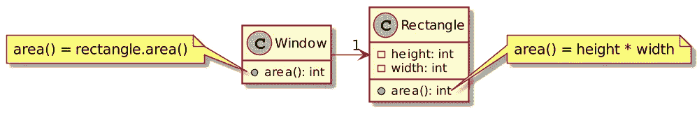
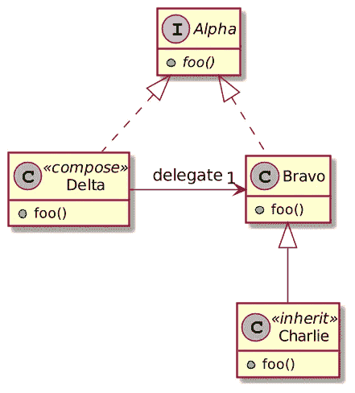

# 看一看科特林的代表团

> 原文：<https://levelup.gitconnected.com/a-look-at-kotlins-delegation-902bf11fea03>


Kotlin 提供了许多令人兴奋的功能。一般来说，开发人员倾向于引用空安全作为他们的最爱。对我来说，就是函数扩展。但是授权紧随其后。

# 委托模式

GoF 一书中描述了委托模式:

> ***委托*** *是一种让复合像继承一样强大的复用方式[Lie86，JZ91]。在委托中，*两个*对象参与处理一个请求:一个接收对象将操作委托给它的* ***委托*** *。这类似于子类推迟对父类的请求。但是有了继承，一个继承的操作总是可以通过 C++中的* `*this*` *成员变量和 Smalltalk 中的* `*self*` *引用接收对象。为了达到与委托相同的效果，接收者将自己传递给委托者，让委托的操作引用接收者。*



当人们选择*组合*而不是*继承*时，委托是至关重要的。



# 手动和本机委托

在 Java 中，您需要手动编写委托代码。上面的示例转换成以下代码:

```
interface A {
    void foo();
}class B implements A {
    @Override
    public void foo() {
    }
}class Composition implements A {
    private final B b; Composition(B b) {
        this.b = b;
    } @Override
    public void foo() {
        b.foo();
    }
}
```

科特林使用关键字`by`直接处理委托。您可以用 Kotlin 编写相同的代码，如下所示:

```
interface A {
    fun foo()
}

class B : A {
    override fun foo() {}
}

class Delegate(b: B) : A by b          // 1
```

1.  有了这个，您可以在任何`Delegate`实例上调用`foo()`

正如文件中所解释的:

> *超类型列表中* `*Delegate*` *的 by 子句表示* `*b*` *将被内部存储在* `*Delegate*` *的对象中，编译器将生成* `*B*` *的所有方法，并转发给* `*b*` *。*
> 
> — [代表团](https://kotlinlang.org/docs/reference/delegation.html)

# 委派属性

Kotlin 还提供了**委托属性**，这个属性将它的 getter(如果是`var`，还有它的 setter)委托给“其他东西”。委托属性也使用`by`关键字。

通过标准库可以获得一些现成的委托。

**非空委托:**非`null`委托的行为方式与`lateinit`关键字相同:如果在将变量初始化为非`null`值之前使用该变量，它将抛出`IllegalStateException`。

```
var notNull: String by Delegates.notNull()
```

**惰性委托:**惰性委托在第一次访问时计算值*，存储它，然后返回存储的值。顾名思义，当值的计算代价很高并且计算后不变时，就使用`lazy`。*

```
val lazy: String by lazy { "An expensive computation" }
```

**可观察的:**当值被访问时，一个可观察的委托提供一个钩子，这样你就可以在之后执行代码**。**

```
val observed = "Observed"
val observable: String by Delegates.observable(observed) {
    _, old, new -> println("old: $old, new: $new")
}
```

**可否决的:可否决的代表是可观察的对立面。它提供了一个在之前执行**的钩子。如果这个钩子返回`true`，值的设置按预期执行；如果它返回`false`，设置不会发生。****

```
val vetoable: String by Delegates.vetoable(observed) {
    _, _, _ -> Random.nextBoolean()
}
```

**在这里，集合随机地失败了 50%的时间。为你的同事调试没有帮助，但很有趣。**

# **你自己的委托财产**

**如果您想创建自己的委托属性，它需要指向一个类，该类具有:**

1.  **值不可变的字段的`operator fun <T, U> getValue(thisRef: T, prop: KProperty<*>): U` **运算符**函数**
2.  **一个额外的`operator fun <T, U> setValue(thisRef: T, prop: KProperty<*>, value: U)`如果它是可变的**

*   **`T`是类‘类型**
*   **`U`物业的**
*   **`thisRef`是类实例**
*   **`value`是新值**
*   **`prop`是财产本身**

**作为一个例子，让我们实现一个基于 IMDG 的分布式缓存委托属性。**

```
class HazelcastDelegate<T>(private val key: String) { private val map: IMap<String, Any> by lazy {                // 1          
    val config = Config().apply {
      instanceName = "Instance"
    }
    Hazelcast.getOrCreateHazelcastInstance(config).getMap("values")
  } operator fun getValue(thisRef: T, prop: KProperty<*>) = map[key] //2  operator fun setValue(thisRef: T, prop: KProperty<*>, value: Any?) {
      map[key] = value                                        // 3          
  }
}
```

1.  **创建对 Hazelcast 的引用`IMap`**
2.  **从`IMap`中获取数值**
3.  **在`IMap`中设置数值**

**使用上面的委托很简单:**

```
class Foo {
  var cached: Any? by HazelcastDelegate<Foo>("cached")
}fun main() {
  val foo = Foo()
  foo.cached = "New value"
  println(foo.cached)
}
```

# **结论**

**委托模式在面向对象编程世界中无处不在。一些语言，比如 Kotlin，提供了本地实现。**

**但是授权并不停留在班级层面。Kotlin 确实提供了属性级的委托。它提供了一些现成的委托，但是您可以轻松地创建自己的委托。**

# **为了更进一步:**

*   **[代表团](https://kotlinlang.org/docs/reference/delegation.html)**
*   **[委托属性](https://kotlinlang.org/docs/reference/delegated-properties.html)**

***原载于 2021 年 4 月 18 日* [*一个 Java 怪胎*](https://blog.frankel.ch/kotlin-delegation/) *。***