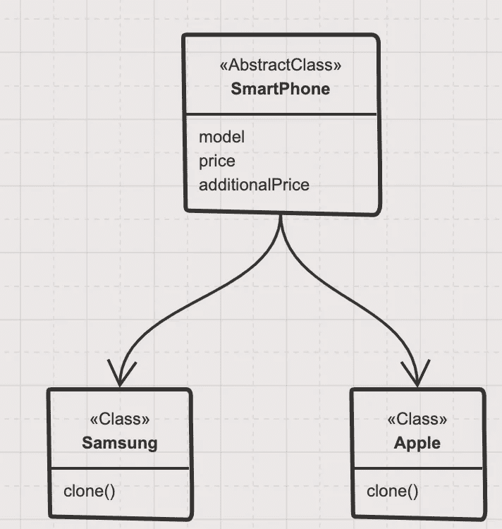
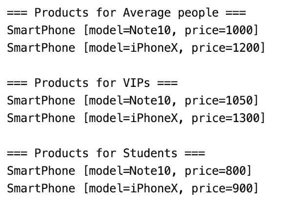

# 看看原型设计模式

> 原文：<https://levelup.gitconnected.com/a-look-at-the-prototype-design-pattern-3e4032b072d2>

## 将原始对象复制到新对象，然后根据需要进行修改。这里有一个 Java 实现。

图像信用—pexels.com

*原型模式*指的是在考虑性能的同时创建重复的对象。这种类型的设计模式属于创建模式，因为这种模式提供了创建对象的最佳方式之一。

原型模式提供了一种机制，将原始对象复制到新对象，然后根据我们的需要修改它。原型设计模式使用 Java 克隆来复制对象。

在本文中，我们将涵盖以下主题:

*   原型设计模式是什么？
*   我们应该什么时候使用它？
*   它的 Java 实现带有适当的图像和 Java 编码
*   它的优点和缺点

你可以试试我下面其他的设计模式和原理的相关文章

*   [SOLID 原理及其 JAVA 实现概述](/overview-of-solid-principles-and-its-java-implementations-4ae37fa5bb1b)
*   [工厂方法模式及其在 JAVA 中的实现](https://blog.devgenius.io/the-factory-method-pattern-and-its-implementation-in-java-b51d307b8dd8)

# 原型设计模式是什么？

根据[维基百科](https://en.wikipedia.org/wiki/Prototype_pattern#:~:text=The%20prototype%20pattern%20is%20a,cloned%20to%20produce%20new%20objects.&text=avoid%20subclasses%20of%20an%20object,the%20factory%20method%20pattern%20does)，“原型模式是软件开发中一种创造性的设计模式。当要创建的对象类型由原型实例决定时，使用它，克隆原型实例以产生新对象。”

*   原型模式是一种创造性的设计模式。当对象创建是一项耗时且成本高昂的操作时，原型模式是必需的，因此我们用现有的对象本身创建一个对象。
*   对象克隆是实现原型模式的最佳方法。
*   该模式为所有支持克隆的对象声明了一个公共接口。
*   支持克隆的对象称为原型。对象原型化是子类化的最佳替代方案，当一个对象有大量字段时，它会很有帮助。
*   通过这个过程，您甚至可以复制私有字段。
*   但是，如何根据您的业务模型复制现有对象是您自己的事情。

## 原型设计模式的实现

让我们看看下面针对不同类型消费者的智能手机制造流程的著名例子。

为了实现这个模式，声明一个抽象基类，指定一个纯虚拟的 *clone()* 方法。所有子类都可以扩展 SmartPhone 类，并实现 *clone()* 操作。

图片来源—作者

这里，

*   SmartPhone 抽象类具有型号、价格和附加价格等属性
*   它实现了可克隆的接口。所以所有的具体类都必须覆盖克隆方法

检查智能手机类。这是一个抽象类，实现了一个可克隆的接口。

这个类有一些名为 model、price 和 additional price 的成员变量。总价是价格和附加价格的总和

现在类 Apple 扩展了智能手机基类。下面给出了 Apple 的实现类:

这里，

*   它的价格设置为 1200 硬编码，模型名称通过构造函数传递
*   它实现了克隆方法，并在克隆后返回这个类

现在类三星扩展了智能手机基类。Samsung 的实现类如下所示:

这里，

*   它的价格设置为 1000 硬编码，模型名称通过构造函数传递
*   它实现了克隆方法，并在克隆后返回这个类

现在调用类代码如下所示:

这里，

*   我们为三星制造 note10，为苹果制造 iPhoneX，并打印出来。它显示默认价格
*   在此之后，我们将从 note10 开始打造 note10Golds，并为 VIP 提供更高的价格。还有，为价格更高的 VIP 打造 iPhoneX128。
*   这里没有构建或创建新的实例。我们只是克隆以前创建的实例，并根据我们的要求进行修改

以下是执行这些任务后的输出

图片来源—作者

这里，

*   首先，我们为普通市场制造产品。
*   第二，我们为贵宾修改那些产品，它的价格变得更高
*   第三，我们以较低的价格为学生定制原始产品

## 使用原型模式的利与弊

**优点**

*   ***复用性*** *:* 如果我们想创建一个有很多默认值的类的实例，或者在同样复杂的流程中，*原型模式*很有用。我们可以专注于其他活动。
*   ***减少初始化*** *:* 我们可以用更便宜的成本获得新的实例。客户端可以获得新的对象，而不知道它将是哪种类型的对象。
*   ***简单的复制过程*** *:* 它隐藏了创建对象的复杂性。我们只需要调用`clone()`方法，它简单易读。
*   它减少了分类的需要。它允许您在运行时添加或删除对象。

**缺点**

*   这种模式成本很高。确定迭代次数是有确定性的。
*   每个子类都必须实现`clone()`方法或可选的复制方法。
*   为现有类构建克隆可能很复杂。
*   比如实现`Cloneable`接口可以约束所有子类/实现实现`clone()`方法(有些类可能不需要)。
*   如果类在循环引用中，以浅层复制的方式实现`clone()`方法可能会导致问题。在具有原语字段的示例中，这是可以的，但是当一个类对象包含许多引用其他对象的字段时，我们需要实现深度复制。

## 结论

希望你喜欢这篇文章。快乐编码。

**参考文献
1**。[https://sourcemaking.com/design_patterns/prototype/java/1](https://sourcemaking.com/design_patterns/prototype/java/1)2。[https://www . geeks forgeeks . org/advantages-and-missions-of-prototype-model/](https://www.geeksforgeeks.org/advantages-and-disadvantages-of-prototype-model/)
3 .[https://www . Bartleby . com/essay/advantage-And-lessons-Of-Prototype-Design-Pattern-fcjjwyab 6 ju](https://www.bartleby.com/essay/Advantages-And-Disadvantages-Of-Prototype-Design-Pattern-FCJJWYAB6JU)