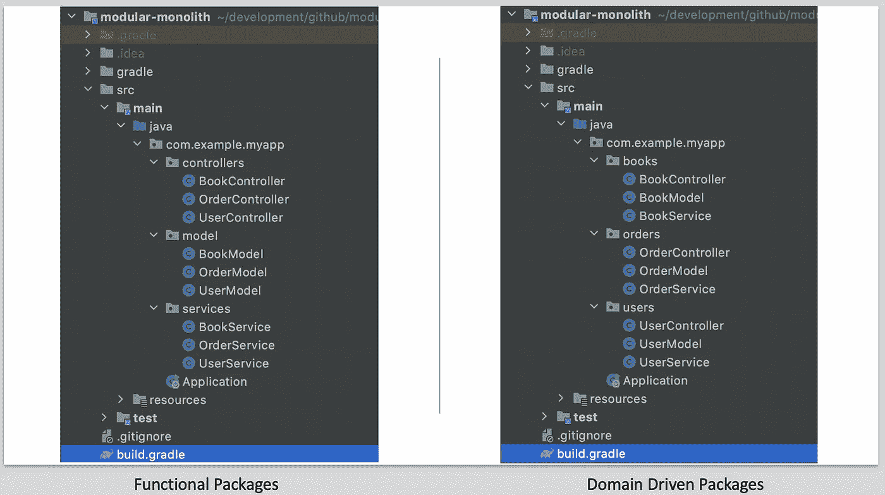

# 对模块化整体结构的研究

> 原文：<https://levelup.gitconnected.com/a-look-into-the-modular-monolith-1df3b571c21f>

## 达到更高的工程标准

马库斯·斯皮斯克在 [Unsplash](https://unsplash.com?utm_source=medium&utm_medium=referral) 上的照片

就架构而言，术语 **monolith** 与 **legacy** 同义。如今，如果您没有使用最新的微服务模式，也没有使用最新的网格技术进行部署，那么您就做得不对。

我认为微服务已经变成了一把神奇的锤子，它是我们的救星，也是我们在维护多年的单体应用程序时所忍受的所有痛苦和折磨的万灵药。可以肯定的是，微服务有一席之地，但我相信它可能是一段旅程的终点——模块化的整体可能是到达那里的最佳方式。

# 什么是模块化整体？

顾名思义，我们谈论的是可以根据需要扩展的单个可部署(整体式)——是的，即使是整体式也可以是 12 个因素，并且可以很好地扩展。在 monolith 中，我们定义模块，每个模块都有自己的领域和构建系统，允许团队独立工作，同时允许我们打包一个可部署的。

> 模块化整体的美妙之处在于，软件架构看起来与微服务架构惊人地相似，如果你想画的话。

我在遗留整体架构中看到的一个大问题是，最终，团队倾向于开始走捷径；诸如[坚实](https://en.wikipedia.org/wiki/SOLID)之类的工程原则在最后期限和交付压力面前退居二线。在这种情况下，技术债务不断累积，并且变得越来越难以控制，最终将我们引向破窗理论。内部依赖性管理几乎不存在，跨越边界来获得某些东西的诱惑几乎太容易了(即使工程师认识到了适当的边界)。

通过用离散的模块构建一个整体，我们有机会创建更小、更有效和更有针对性的软件。我们可以考虑**一个模块应该如何表现**，并且像它的微服务对应物一样，我们可以设计它的公共 API 以保持它尽可能的简洁。在 Java monolith 的情况下，我们可以更加小心地在公共接口中放置什么，并且更加勤奋地在模块本身中使用更受保护的代码级别，这样我们就不会将功能泄漏到更广泛的系统中。构建系统强制模块之间的依赖关系，因此不会在模块之间创建循环依赖关系。

## 一个 Java 例子

以经典的整体式 java 应用程序为例——我们基本上只有一个构建文件(Maven / Gradle ),我们所有的生产代码都藏在`/src/main/java`下。您可能会有一个基本的包名，并将您的代码按照功能或领域原则分组。

这里我们有一个经典书店例子的简化版本。我们有三个域，`users`、`books`和`orders`。

当所有东西都在一个单一的源根目录下时，工程师可以创建循环依赖，JPA 因使用`one-to-many`双向关系使这成为一个简单的选项而臭名昭著。除了构建时的林挺规则，编译器将允许跨包的任何依赖。

代码中的循环依赖是通向微服务(以及良好的软件设计)道路上的巨大障碍，创建清晰的[有界上下文](https://martinfowler.com/bliki/BoundedContext.html)并且不创建这些依赖将使您有可能突破服务。

通过使用多模块项目将代码分割成独立的模块，我们可以使用构建系统来强制`orders`域可以引用`books`而不是相反。为什么`books`需要了解`orders`或`users`呢？

> Gradle 或 Maven 不允许您创建从`books`到`orders`的依赖关系，所以我们的有界上下文是清晰的，并且由编译器强制执行。

由于每个组件都有自己的`build.gradle`文件，因此可以独立运行。这意味着在特定领域工作的任何团队都有能力运行特定于他们领域的测试套件，减少反馈循环，并将完全控制权交还给团队。

# 领域驱动设计

雨果·罗查在 [Unsplash](https://unsplash.com?utm_source=medium&utm_medium=referral) 上的照片

微服务和模块化整体设计的核心应该是 [DDD](https://martinfowler.com/tags/domain%20driven%20design.html) ，理想情况下，使用[事件风暴](https://www.eventstorming.com/)过程来帮助找到应用接缝或边界。从微服务架构开始的绿地项目的一个重要问题是，我们经常不正确地划分这些界限。**重构一系列微服务以解决这一问题的成本可能会非常昂贵**，从而否定了我们关于微服务的“*快速且廉价地发展*”的论点。

在一个模块化的整体中，它可以像在你最喜欢的 IDE 中重构一样简单！(我知道这过于简单化了。)

DDD 和事件风暴本身就是一个主题；一定要寻找关于这些主题的精彩内容。

# 微服务架构的一些问题

我确实喜欢微服务架构；然而，我有时会在事情的执行方面发现一些问题。

## 人员和流程

我在技术行业待得越久，就越发现围绕人和流程解决问题比用技术解决问题回报更高。

以下是我的一些经历:

*   团队没有足够的时间或访问 SME 来正确定义服务界限、DDD、事件风暴等。
*   缺乏分布式系统的经验意味着陡峭的学习曲线，团队选择架构是因为它现在非常热门。
*   没有时间将架构测试到部署复杂系统所需的安全水平(没有人可以否认分布式系统本质上并不复杂)。
*   在绿地项目中，通常是一个团队在开发应用程序，因此任何关于使用微服务更有效地扩展人员的争论都是无效的。

## 失信

微服务声称可以解决我们在软件开发和部署中遇到的许多问题；这些只是我一直发现的几件事:

*   在投入生产之前，因为“可伸缩性”问题而拆分服务通常是不成熟的优化。直到我们进入生产阶段，我们才真正知道一个特定的领域是否如此占主导地位。
*   该架构不保证服务的松散耦合，我们经常看到服务 A 完全依赖于服务 B(并且必须一起部署)。
*   将事情分散化意味着我们不得不担心传输、安全性、可靠性和弹性——这些事情我们在一个可执行文件中不必担心。
*   对于重构来说，没有一些严肃的工程，微服务不会修复一个设计糟糕的有机整体。

> 所以现在是一场噩梦。现在代码库如此糟糕，你会说，
> 
> “你知道我们应该做什么吗？我们应该分手。我们要打破它，以某种方式找到我们从未有过的工程学科。”
> 
> —凯尔西·海托华，[巨石代表未来](https://changelog.com/posts/monoliths-are-the-future)

# 何时探索模块化整体结构

## 现代化

如果你已经有一个成功的单片应用在运行，那么模块化的单片就是一个完美的架构，可以帮助你重构代码，为潜在的微服务架构做好准备。我们经常将微服务视为解决交付中摩擦的银弹——构建、测试和发布新功能缓慢；您可以开始看到这些事情随着分解良好的模块化整体结构而加速！

说起来容易做起来难。一个已经建立起来的庞然大物将充斥着循环依赖、命名不当的服务和[上帝物品](https://en.wikipedia.org/wiki/God_object)(见上文引用)。这将需要真正的工程学科来达到甚至是半体面的模块化整体的程度，更不用说微服务架构了。但这是一个你在驾驶飞机时可以遵循的过程。

与任何现代化努力一样，您将希望确保您已经在一个健壮的回归套件中进行了足够的投资，以避免失望。

## 绿色田野

与微服务架构相比，模块化的整体架构可以让你有空间更快地了解你的领域和架构。

你将不必担心像 Kubernetes 和服务网格这样的事情。您的部署拓扑将被极大地简化，并且您可以将这些问题推迟到交付的后期——甚至可能是在您盈利之后！

# 包扎

这个行业没有什么是灵丹妙药。我发现模块化整体的想法是一种有前途的软件架构，具有微服务的许多优点，而没有它的许多问题和复杂性。

> 模块化整体结构的道路不会阻挡你通往微服务的道路，事实上，它只会加强你为最终分手做准备的地位。

在我们的设计和日常开发中，我们需要更加关注好的**软件架构**和工程实践，例如[可靠的](https://en.wikipedia.org/wiki/SOLID)。你可以用一个构造良好的(理解为模块化的)整体来实现很多，而不需要依赖微服务来加强服务边界，因为更多的人会这样做。

让我知道你的想法！