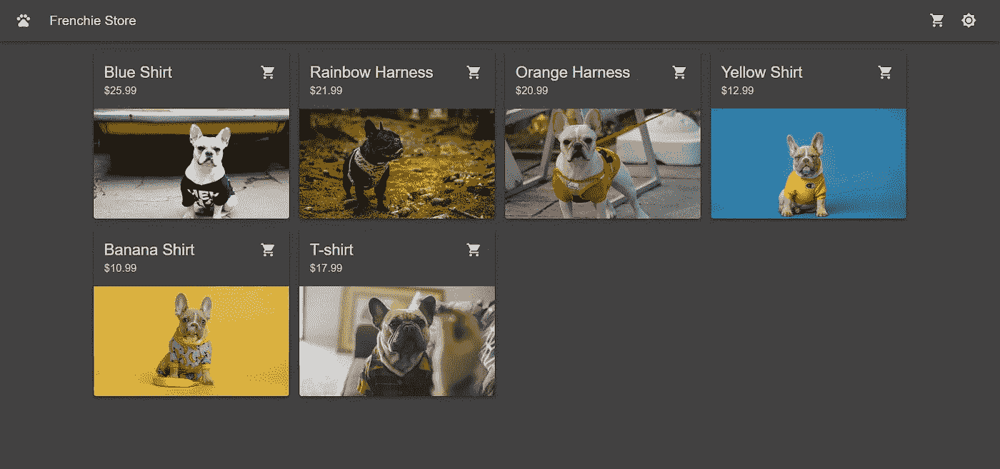
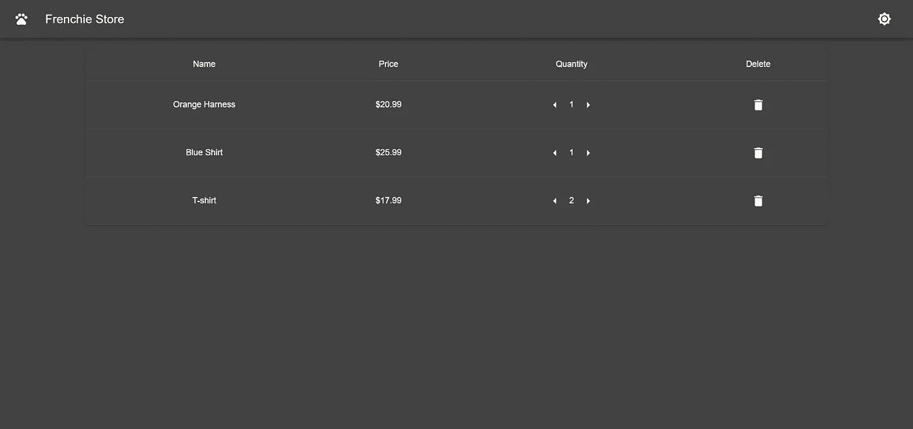
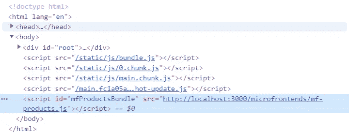
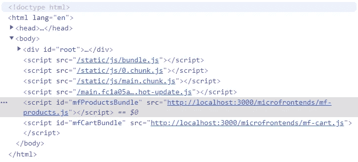

# 一种用于反应的微前端解决方案

> 原文：<https://levelup.gitconnected.com/a-micro-frontend-solution-for-react-1914b19663b>

通过一个简单的网上商店应用程序，了解使用 React 的微前端的可能实现

****更新**** 我写过另一篇关于使用模块联邦的相同例子的文章。看看不同的方法。👇🏼

 [## React 的模块联合示例

### 查看通过模块联合实现的 React 微前端解决方案

levelup.gitconnected.com](/a-module-federation-example-for-react-1fa29d6ac07b) 

# 这个故事是关于什么的？

我想展示一个我用 React 创建的展示微前端的示例应用程序。有大量的介绍性文章讨论了利弊，所以在我的例子中，我将只关注实现。对于那些不熟悉这个概念的人，我在[底部](#77e8)放了一些关于这个主题的更多信息的链接。去看看，然后回来。😉

# 用几句话概括一下微前端

这是一个架构概念，构建可以独立开发、测试和部署的更小的应用程序，而不是一个整体。然后，可以使用几种不同的技术将这些应用程序结合起来。在本文中，我想介绍一种用微前端构建单页面 React 应用程序的可能方法。

# 这个例子

我在 GitHub 上创建了一个[库](https://github.com/burzaszsolt/react-micro-frontends)，这样你就可以查看代码的细节。用几句话总结一下:该应用程序是一个非常简单的法国斗牛犬配件网店，其中列出了一些展示可爱的法国人的产品，还有一个购物车页面列出了等待“购买”的产品。我还实现了一些添加、修改或删除这些项目的功能。

主页

购物车页面

# 结构

该示例由四部分组成:

*   主机应用程序
*   产品微前端
*   推车微前端
*   后端

主机应用程序是一个 React 应用程序，充当网上商店的框架。产品微前端呈现在主页上，将显示项目。购物车按钮出现在主机应用程序的顶部栏上，重定向到购物车页面。大车微前端渲染在这条路线上。它负责显示购物车中的产品列表。它们都连接到“后端”,这基本上是一个用 [json-server](https://github.com/typicode/json-server) 包创建的假 REST API。现在我们已经对这个例子有了一个简要的了解，让我们来看看一些代码。🤓

# 解决办法

## 微前端

在我的例子中，每个微前端可以作为一个独立的应用程序运行，也可以构建为一个微前端。为了实现这一点，我使用了 [webpack](https://webpack.js.org/) 来创建单独的配置，为每个行为创建不同的入口点。当独立运行它时，我使用 [index.js](https://github.com/burzaszsolt/react-micro-frontends/blob/master/mf-products/src/index.js) 作为一个入口点，它将以一种简单的老式 React 方式呈现应用程序，应用程序将由 [webpack-dev-server](https://www.npmjs.com/package/webpack-dev-server) 托管。然而，当构建为微前端时，使用了一个不同的文件，称为 microfrontend.js。这就是神奇之处，所以让我们来看看它。

**render()**

该方法将`App`呈现到用`containerId`参数标识的容器中的 DOM 中，并将所有的`data`作为道具传递给`App`。

**unMount()**

顾名思义，这个函数负责从 DOM 中移除挂载的`App`。

**订阅()**

`subscribe`方法在窗口上注册事件监听器来处理自定义事件，因为这些将是主机和微前端之间通信的常用方式。

**退订()**

这个函数从窗口中移除注册的事件监听器。

**客户事件**

它是一个保存自定义事件的对象，可以从微前端进行调度。

作为 webpack 构建的结果，将创建一个包文件，其中包含一个在其他应用中使用时可以通过`window`访问的库。在我的例子中，这些被称为`mfCart`和`mfProducts`。查看这个[构建配置](https://github.com/burzaszsolt/react-micro-frontends/blob/master/mf-products/build/webpack.build.config.js)以了解更多细节。

## 主持

现在让我们看看如何在宿主应用程序中使用这些库。我们有一个来自微前端构建的 javascript 文件。问题是如何将这个包添加到宿主应用程序中，以访问微前端及其方法。在本例中，我为此创建了一个定制的 React 挂钩，名为`useMicrofrontend`。

那么这里发生了什么？

*   钩子接收两个参数，`id`和`url`。
*   检查脚本是否已经添加到 DOM 中，并再次跳过加载。
*   用提供的参数创建一个`<script>`标签，并将其附加到 DOM 的`<body>`中。
*   它将返回一个指示资源是否已加载的对象，并返回微前端本身，一旦它通过窗口对象可用。

重要的是要注意，通过这种方式，包是动态加载到页面上的。这意味着主页中的购物车微前端将不会被加载，以避免客户端不必要的下载。

主页

导航到购物车页面后

现在让我们来看看这个定制钩子的运行情况。

乍一看，有人可能会说它只呈现了一个带有 id 的`
`，但是这里还有更多的内容。10 号线上的`useMicrofrontend`吊钩开始为`mfProducts`装载捆。

*   加载时，组件不会呈现任何内容。
*   如果加载了包，但微前端仍然不可用，组件将显示一条错误消息。
*   最好的情况是加载了脚本并且微前端可用。在这种情况下，`mfProducts`的`render`方法可以用两个参数来访问和调用:由`Products`组件呈现的 div 的 id 和我将在后面介绍的一些数据。因此，产品微前端将被安装到该 div 中。🎉🙌

## 沟通

主机应用程序的顶栏中有两个图标:一个显示购物车中有多少产品，用于导航到购物车页面，另一个用于在亮色和暗色主题之间切换。

栏顶横木

问题是，如果产品微前端处理向购物车添加产品，如何更新购物车徽章？这就是使用[客户事件](https://developer.mozilla.org/en-US/docs/Web/API/CustomEvent)发挥作用的地方。通过单击产品卡上的购物车图标，请求被发送到 json-server。如果请求成功，就会从产品微前端调度一个自定义事件，指示产品已添加到购物车中。下面是`CartBadge`组件，它监听自定义事件并相应地更新它的状态。

在这个组件中，可以再次使用自定义钩子来获取产品的微前端。这次不需要呈现它，而是通过从`mfProducts`调用`subscribe`方法将一个事件监听器附加到窗口。作为对`useEffect`钩子的清理，事件监听器被`unSubscribe`函数移除。自定义事件的类型也来自`mfProducts`，所以我可以确保听到正确的事件。

现在我们来看一个从主机应用程序到微前端的通信示例。我使用 [Material-UI](https://material-ui.com/) 来构建和设计组件。这个库提供了一种简单的方法来使用带有 [ThemeProvider](https://material-ui.com/styles/api/#themeprovider) 组件的明暗主题。我需要做的就是将一个包含每个主题样式的对象传递给这个组件，并将我的应用程序包装在其中。听起来很简单，对吧？然而，大多数东西是由微前端渲染的，这超出了`ThemeProvider`的范围。那么如何为他们应用相同的主题呢？当在宿主应用程序中呈现微前端时，所选主题被传递给`render`方法。每个微前端都有自己的 ThemeProvider，它用来自主机应用程序的主题进行初始化。这仍然很简单，但是如果我在主机应用程序中通过点击顶栏中的按钮来切换主题，会发生什么呢？嗯，在某些情况下，特别是当微前端有自己的状态时，重新渲染整个微前端将是一个糟糕的解决方案。因此，我们没有这样做，而是使用主机应用程序中选择的主题来调度一个`HOST_THEME_CHANGED`自定义事件。微前端可以监听这个自定义事件，并向其`ThemeProvider`提供接收到的数据。

# 总结

与 JayStack 团队一起，我们已经为一个国际产品工作了一年多，这个例子是基于这个项目的经验。我们发现使用这种配置使用微前端非常简单，如果您有兴趣在 React 中使用它们，我希望这个例子能有所帮助。我已经试着涵盖了大部分内容，但是如果你有任何问题，请查看[库](https://github.com/burzaszsolt/react-micro-frontends)或者留下评论。

# 更多…

如果你想了解更多，这里有一些关于微前端的有用链接。

 [## 微前端

### Cam Jackson Cam Jackson 是 ThoughtWorks 的一名全栈 web 开发人员和顾问，他对如何…

martinfowler.com](https://martinfowler.com/articles/micro-frontends.html)  [## 微前端

### 与多个团队一起构建现代 web 应用程序的技术、策略和方法，这些团队可以发布功能…

micro-frontends.org](https://micro-frontends.org/)  [## 微前端—第 1 部分:将面向服务的架构扩展到前端开发

### StepStone 服务的主要产品——复杂作业板——迁移到微前端架构的案例研究

medium.com](https://medium.com/stepstone-tech/microfrontends-extending-service-oriented-architecture-to-frontend-development-part-1-120b71c87b68)  [## 了解微前端

### 作为一名前端开发人员，这些年来你一直在开发 monoliths，尽管你已经知道这是一个糟糕的…

hackernoon.com](https://hackernoon.com/understanding-micro-frontends-b1c11585a297)  [## 编写面试问题

### 一个完整的平台，在这里我会教你找到下一份工作所需的一切，以及…

技术开发](https://skilled.dev)