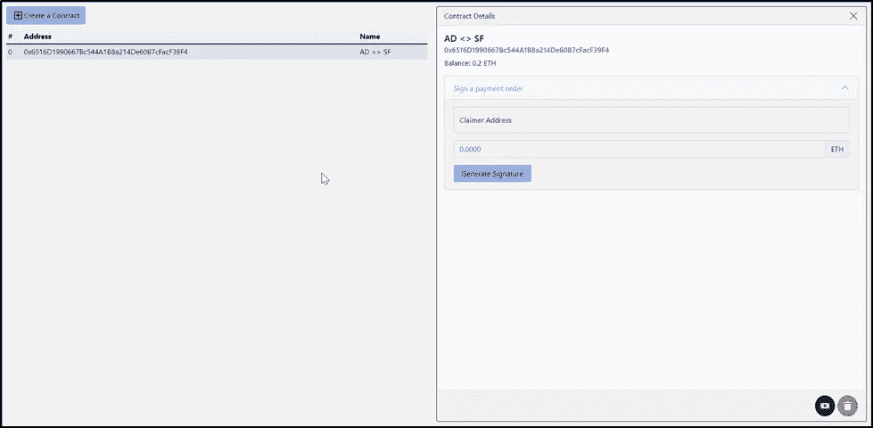
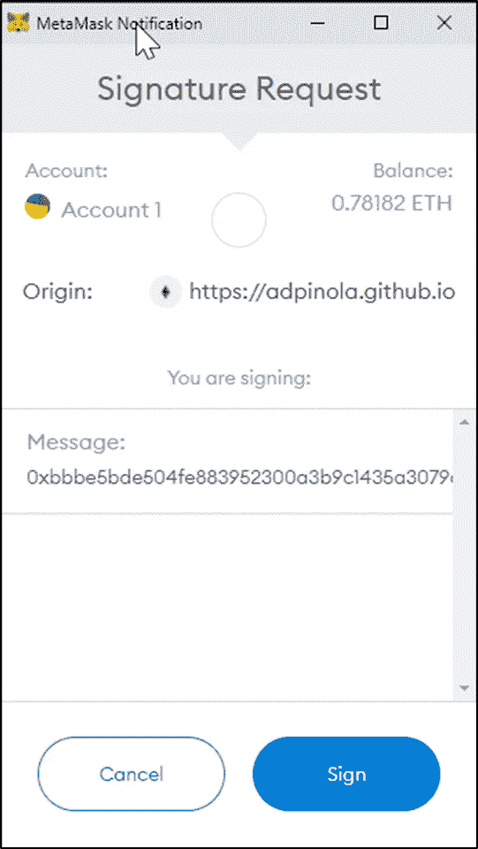
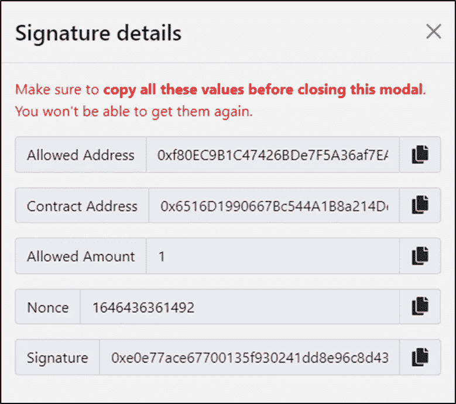
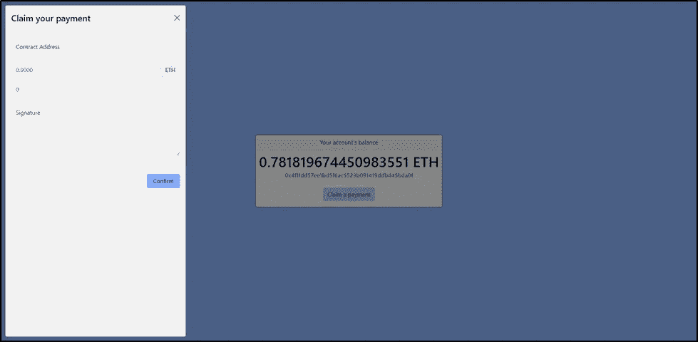

# 一个可靠的微支付渠道工厂

> 原文：<https://levelup.gitconnected.com/a-micropayments-channel-factory-with-solidity-ccf586afb519>

处理两个以太坊账户之间的支付就像从一个账户向另一个账户发送交易一样简单。但每笔交易都有成本，如果你的目标是对不同的账户进行大量交易，你可能希望避免每次都支付费用。

另一种选择？让接收方为获得自己的钱买单。

又是如何做到的？这个想法是将带有签名信息的支付指令发送给在完整的**链外**操作中的任何受益人，当他们准备好时，可以通过与持有它的智能合同进行交互来要求他们的资金。

一种小额支付渠道方法在[的官方可靠性文件](https://docs.soliditylang.org/en/v0.8.11/solidity-by-example.html#micropayment-channel)中可用。我从这里开始，做了一些修改，使合同符合我的预期解决方案。

在这里，我将描述我是如何设法开发这个解决方案的，而不是集中在 CI/CD 和工程基础上。你可以在[我的上一篇文章](https://coinsbench.com/building-a-dapp-using-truffle-and-react-with-ci-cd-integration-aa278a207247)中找到细节。

# 解决方案

一个 Web 应用程序，允许一个 *"company"* 使用一个工厂合同来管理几个小额付款合同。从 UI 中，拥有工厂的帐户可以**创建**和**删除**小额付款实例，并在其初始余额中添加指定数量的乙醚。此外，从 UI 中，所有者可以生成已签名的消息，以允许任何地址向合同的**索取资金**。

UI 的另一部分更简单，它允许任何用户通过使用签名的消息作为输入来声明收取他们的资金。



公司端界面

为了允许账户从合同中获得资金，用户需要在 ETH 中指明允许接收的*索赔人地址*和*金额* 。有了这些信息和我将在后面描述的附加数据，就可以使用元掩码生成签名。

## 生成签名

```
constructMessage(recipient, amount, nonce) {
   return soliditySHA3(
      ['address', 'uint256', 'uint256', 'address'], 
      [recipient, amount, nonce, **this._contractAddress**]);
}
```

前面的方法采用*接收者的地址*、*合同的地址*、金额*、*和一个*随机数*，并生成一个 32 字节的固定长度散列。这样做是为了在签名前限制基本消息的长度。

*   ***收款人:*** *W* e 表示被允许索款的人。当声明者与智能合约交互时， *msg.sender* 值应该与接收者匹配。
*   ***金额:*** 索赔金额应与允许金额相符。
*   ***nonce:*** 唯一标识符，保证同一个签名不能被使用两次。该值保存在合同中，如果已经使用，将拒绝索赔。
*   ***contract address:***这是为了确保声明者只与预期的契约进行交互。如果不这样做，同一个签名可能会在同一个签名者帐户创建的几个合同中使用。

生成散列后，让我们使用下面的方法对它进行签名。

```
web3.eth.personal.sign(hash, signerAddress, '');
```

请注意，第三个参数对应一个*密码*。我把它留为空白，没有必要在这里设置任何值。我尝试使用几个不同的值，总是得到相同的签名。调用此方法时，MetaMask 会提示并要求您确认签名。



签名确认

UI 很好地显示了执行声明所必需的值，这些值应该与声明者共享。



签名详细信息

到目前为止，我们还没有与智能合约进行交互，所以所有这些都是免费的。让我们复制这些信息并与目标用户分享。

## 要求付款

现在，目标用户想要认领他们的资金，让我们去那里认领吧



要求付款

这是与智能合约的实际交互开始的地方，也是有人付费的地方。

要索赔，我们只需要知道提出请求的合同地址、索赔的**金额**、随机数，当然还有**签名。**

```
function claimPayment(uint256 amount, uint256 nonce, bytes memory signature) external {
   require(!usedNonces[nonce], "Claim already done");
   usedNonces[nonce] = true;

   bytes32 message = keccak256(abi.encodePacked(_msgSender(), amount, nonce, this)).prefixed();

   require(message.recoverSigner(signature) == owner(), "Signature is invalid [owner]"); payable(_msgSender()).transfer(amount);
   emit PaymentClaimed(_msgSender(), name, block.timestamp);
}
```

我们来分析一下这个。第一个"*需求*"是检查 nonce 是否从未被用于声明。那么第二行将生成与应该由`web3.eth.personal.sign`生成的消息完全相同的消息。然后,“recoverSigner”方法获取消息和签名，并检索应该签名的所有者。如果它与合同的所有者匹配，那么它就是一个有效的签名，资金被转移。

方法 *prefixed()* 将`\x19Ethereum Signed Message:\32`添加到消息散列的前面。这是用于区分签名邮件的唯一标记。注意，最后一个`32`是原始消息散列的长度。

方法 *recoverSigner()* 调用 *ecrecover* ，这是一个非常有用的方法，用于从给定的消息及其签名中获取签名者。

注意，这个调用`keccak256(abi.encodePacked(_msgSender(), amount, nonce, this))`和*构造消息做的一样。*它对输入数据进行哈希处理。如你所见，索赔人来自于*消息发送者*，合同地址来自于实际合同。

## 工厂

网上有一些工厂实现，你可以查看我将在本文结尾与你分享的 repo 中的代码。所以我只想解决我必须解决的最重要的问题。

首先，简单的一个。我希望创建的契约的所有权是创建实例的帐户，而不是工厂。感谢上帝我们有 [OpenZeppelin](https://openzeppelin.com/) 并且我们不需要写代码，我只是从 [Ownable](https://github.com/OpenZeppelin/openzeppelin-contracts/blob/master/contracts/access/Ownable.sol) 继承我的小额支付合同。所以我只是调用 *transferOwnership()* 并使 msg.sender 成为新的所有者。

```
Micropayments micropaymentContract = (new Micropayments){value: msg.value}(name);micropaymentContract.transferOwnership(_msgSender());
```

第二个问题出现在删除小额支付实例时。由于工厂跟踪创建的实例，如果我们只是其中的一个，工厂不会注意到。因此，我所做的是在 Micropayments 契约中创建一个 *shutdown()* 方法，该方法只能从创建它的工厂调用，并将该地址存储在一个新变量中。因此，实例的所有者就是创建它的人。但是只能从工厂删除。此外，执行删除的工厂方法只能由工厂所有者调用。

```
function deleteContract(address location) external onlyOwner {
  uint256 contractIndex = addressToIndex[location];
  Micropayments toDelete = Micropayments(contracts[contractIndex]); bytes32 nameHash = keccak256(bytes(toDelete.name()));
  nameToAddress[nameHash] = address(0); toDelete.shutdown(); addressToIndex[address(Micropayments(contracts[contracts.length - 1]))] = contractIndex;
  contracts[contractIndex] = contracts[contracts.length - 1];
  contracts.pop(); emit MicropaymentsDeleted(_msgSender(), location);
}
```

> 提示:在 deleteContract()方法中检查合同数组是如何更新的。如果你尝试做`delete contracts[index]`，那个位置不会从数组中移除，长度也是一样的。它只是用数组的默认值来设置位置。

最后但同样重要的是，这里你有回购和网站。合同部署在林克比。

[https://github.com/adpinola/Micropayments](https://github.com/adpinola/Micropayments)

 [## 小额支付工厂

### @阿德皮诺拉的 DApp

adpinola.github.io](https://adpinola.github.io/Micropayments/) 

因为你不是工厂的所有者，所以你不能与它互动。如果你想得到一些 ETH，请分享你的地址，我会为你签名！！

当然，您可以自己部署它，拥有工厂并开始创建支付订单。

感谢你的阅读，我希望它对你的发展冒险有所帮助。

___________________________________________________________________

***更新 4 月 11 日:***
delete contract 方法现在清除 *nameToAddress* 映射，以允许在删除后重复合同名称。
此外， *addressToIndex* 地图在删除合同后没有保持正确的跟踪，现在已经修复。