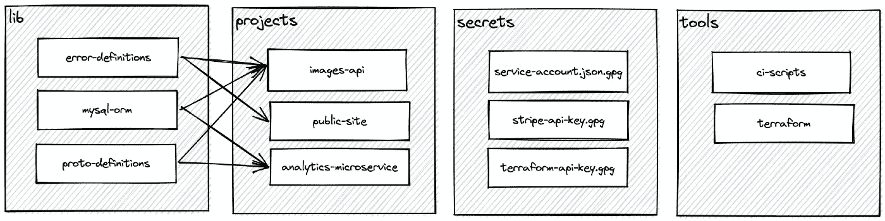

# 一个有效的 monorepo 模板

> 原文：<https://levelup.gitconnected.com/a-monorepo-template-that-actually-works-3efd87770fa5>

## 当你做对了，你就再也不会回头了。

实用的 monorepo

我参与过几十个项目，从常见的 1-2 开发项目到全面的企业应用程序。Monorepo 架构是一种流行的方法，起初可能令人生畏，但却是一种令人惊讶的强大工具。

(顺便说一句，Medium 的所有产品服务都使用 monorepo。这对我们的团队非常有用。)

我强烈支持用 monorepo 启动新项目，并且只在 monorepo 对特定(有限)用例不起作用时才打破常规。

我最喜欢的 monorepo 结构简单，易于采用，并且经久耐用。

# lib:共享库

`/lib/`目录包含共享代码。这些库可以部署到包管理器(例如 npm、PyPI)。它们应该是相互独立的。

如果您有被多个项目使用的代码，将该代码添加到`/lib/`。该文件夹中的公共代码包括 protobuf 定义、自定义错误包装器和域模型。

`/lib/` *中的库不能*作为独立的应用程序部署(那些是*项目*)。

# 项目:部署的服务

`/projects/`中的项目是独立的、可部署的应用程序。它们彼此完全分离，并且*必须*能够独立部署(即您可以部署*项目 1* 而不部署*项目 2* )。

如果项目之间需要共享代码，这些代码属于`/lib/`。

# 秘密:monorepo 的加密秘密

`/secrets/`包含 monorepo 的加密秘密。每个秘密(或秘密目录)应该包含一个附带的自述文件，解释什么是秘密以及应该如何使用它。

秘密通常用于构建管道，但也可以用于开发环境。例如，秘密可能包含用于访问第三方服务的私有 API 密钥。

*此目录不应被其他目录导入。*

# 工具:内部工具

`/tools/`包含内部工具的配置和代码。

*此目录不应被其他目录导入。*

这里常用工具的例子包括 Terraform 模块和*内部*CLI。

我在 GitHub 上整合了一个模板 monorepo。祝你的 monorepo 好运！

 [## GitHub - bennett-jacob/monorepo:一个实用的 monorepo 模板

### 成功的 monorepo 的实际开始。

github.com](https://github.com/bennett-jacob/monorepo)