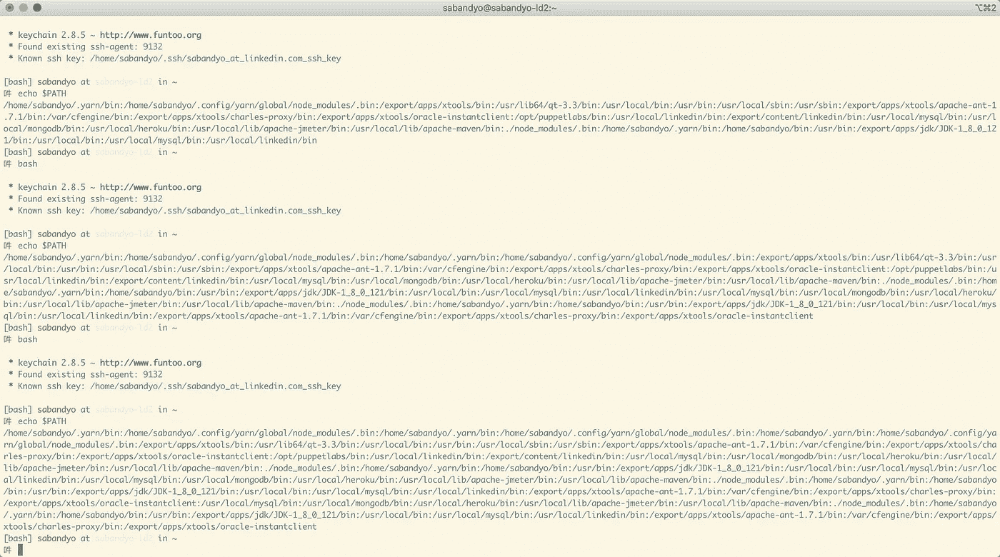
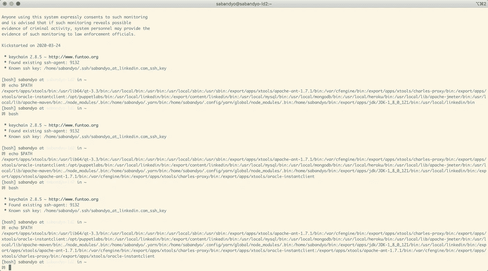
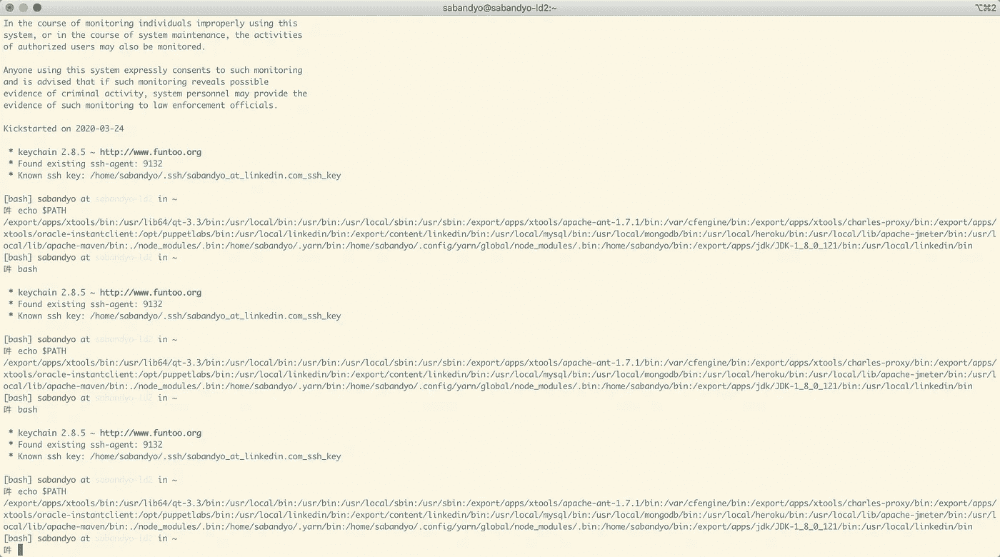

# 我道路上的一个神秘案例

> 原文：<https://levelup.gitconnected.com/a-mysterious-case-of-my-path-2d6a94b8e107>

## 对于每一个新的未登录的`SHELL`，`PATH`的内容随着重复输入而增加。



## 主要学习内容

✨ `/etc/profile`在每次登录`SHELL`时都会被执行，就像`~/.bash_profile`、`~/.zprofile`等等。

✨ `/etc/bashrc`、`/etc/zshrc`等人每次不登录`SHELL`都会被执行，就像`~/.bashrc`、`~/.zshrc`等人一样。

✨默认情况下，`/etc/profile.d`目录中的所有文件通常由`/etc/profile`执行，登录时(除非修改)如下:

```
for i in /etc/profile.d/*.sh; do
  if [ -r "$i" ]; then
    . $i
  fi
done
```

## 问题

我从来没有注意过我的`PATH`变量的内容，除了确保所有需要的二进制文件的路径都被添加到其中。最近，我不得不四处查看，因为一个可执行文件指向了一个不需要的版本。

在回显`PATH`时，我注意到不需要的版本的`path`列在了`PATH`中想要的版本的路径之前。

我还注意到，对于每一个新的未登录的`SHELL`，`PATH`的内容都在增加，看起来好像有重复的条目。


我的终端窗口的屏幕截图，显示在每个新的 shell 会话中，重复的条目被添加到 PATH 中

## 原因

经过仔细观察，我发现以下条目在`PATH`中重复出现。

```
:/usr/local/mysql/bin
:/usr/local/mongodb/bin
:/usr/local/heroku/bin
:/usr/local/lib/apache-jmeter/bin
:/usr/local/lib/apache-maven/bin
:./node_modules/.bin
:/home/sabandyo/.yarn/bin
:/home/sabandyo/.config/yarn/global/node_modules/.bin:/export/apps/xtools/apache-ant-1.7.1/bin
:/var/cfengine/bin
:/export/apps/xtools/charles-proxy/bin
:/export/apps/xtools/oracle-instantclient
```

我可以用以下理由进行推理:

```
:/usr/local/mysql/bin
:/usr/local/mongodb/bin
:/usr/local/heroku/bin
:/usr/local/lib/apache-jmeter/bin
:/usr/local/lib/apache-maven/bin
:./node_modules/.bin
:/home/sabandyo/.yarn/bin
:/home/sabandyo/.config/yarn/global/node_modules/.bin
```

这些条目是我的`[dot-commons/path](https://github.com/sarbbottam/conf-files/blob/c44cd4ff7f48cc712ce21b951c8df94e09e5a756/dot-commons/path)`文件的一部分，重复是因为从我的`~/.[bashrc](https://github.com/sarbbottam/conf-files/blob/c44cd4ff7f48cc712ce21b951c8df94e09e5a756/dot-files/bashrc#L2)` 和`~/.[zshrc](https://github.com/sarbbottam/conf-files/blob/c44cd4ff7f48cc712ce21b951c8df94e09e5a756/dot-files/zshrc#L2)`中调用了`[dot-commons/path](https://github.com/sarbbottam/conf-files/blob/c44cd4ff7f48cc712ce21b951c8df94e09e5a756/dot-commons/path)`。由于`~/.[bashrc](https://github.com/sarbbottam/conf-files/blob/c44cd4ff7f48cc712ce21b951c8df94e09e5a756/dot-files/bashrc#L2)`、`~/.[zshrc](https://github.com/sarbbottam/conf-files/blob/c44cd4ff7f48cc712ce21b951c8df94e09e5a756/dot-files/zshrc#L2)`等人对每个非登录 SHELL 都执行了，所以他们不断地为每个新的非登录会话将上述条目添加到路径中。

## 临时解决方案

我[将 dot-commons/path](https://github.com/sarbbottam/conf-files/commit/6713404c9f240547e07c1bd0d7e820dad4d1d773) 的采购移至[。bash_profile](https://github.com/sarbbottam/conf-files/blob/6713404c9f240547e07c1bd0d7e820dad4d1d773/dot-files/bash_profile#L2) 和`[.zprofile](https://github.com/sarbbottam/conf-files/blob/6713404c9f240547e07c1bd0d7e820dad4d1d773/dot-files/zprofile#L2)`，它解决了上面提到的`PATH`的重复问题。



我的终端窗口的屏幕截图显示，在每个新的 shell 会话中，较少重复的条目被添加到 PATH 中

然而，下面的条目仍然重复出现。

```
:/export/apps/xtools/apache-ant-1.7.1/bin
:/var/cfengine/bin
:/export/apps/xtools/charles-proxy/bin
:/export/apps/xtools/oracle-instantclient
```

## 最终解决方案

进一步挖掘后，我发现我的`/etc/profile.d`目录中有几个文件负责将这些条目添加到`PATH`。`/etc/bashrc`、`/etc/zshrc`等人，每次未登录`SHELL`都会被执行，就像`~/.bashrc`、`~/.zshrc`等人是这样加载这些文件的:

```
for i in /etc/profile.d/*.sh; do
  if [ -r "$i" ]; then
    . $i
  fi
done
```

我修改了相关文件，只在条目还没有出现在`PATH`中时才添加条目，如下所示:

```
if ! echo $PATH | grep -q $DESIRED_PATH ; then
  export PATH=$PATH:$DESIRED_PATH
fi
```

并且解决了`PATH`中剩余重复条目的问题。✅



我的终端窗口的屏幕截图，显示在每个新的 shell 会话中没有重复的条目被添加到 PATH 中

## 关键外卖

仅当所需路径不存在时，将其添加到`PATH`中。

```
# ❌ don't do this
# export PATH=$PATH:$DESIRED_PATH# ✅ rather do this
if ! echo $PATH | grep -q $DESIRED_PATH ; then
  export PATH=$PATH:$DESIRED_PATH
fi
```

## 注意

我应该只在`PATH`中添加一个条目，如果它不在`PATH`中，并相应地更新`[dot-commons/path](https://github.com/sarbbottam/conf-files/blob/c44cd4ff7f48cc712ce21b951c8df94e09e5a756/dot-commons/path)`。那么我应该把对`[dot-commons/path](https://github.com/sarbbottam/conf-files/blob/c44cd4ff7f48cc712ce21b951c8df94e09e5a756/dot-commons/path)`的调用移回到`[dot-files/dot-common](https://github.com/sarbbottam/conf-files/blob/c44cd4ff7f48cc712ce21b951c8df94e09e5a756/dot-files/dot-common#L25)`。

感谢您的阅读。希望这篇帖子提供了一些关于`PATH`、`/etc/profile`、`/etc/profile.d`、`/etc/*shrc`的见解。🖥

## 参考

*   [了解 Linux 中的 Shell 初始化文件和用户配置文件](https://www.tecmint.com/understanding-shell-initialization-files-and-user-profiles-linux/)
*   [Bash Shell 启动文件](http://www.linuxfromscratch.org/blfs/view/6.3/postlfs/profile.html)
*   [了解 Linux 外壳、启动脚本和环境的路径变量](https://medium.com/coding-blocks/getting-to-understand-linux-shell-s-start-up-scripts-and-the-environments-path-variable-fc672107b2d7)