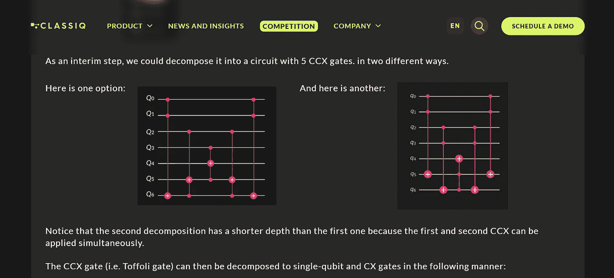

# 土生土长的托夫里门

> 原文：<https://levelup.gitconnected.com/a-native-toffoli-gate-970093e4770c>

单个托夫里门，对目标量子位进行测量

# 以及为什么这是一件大事

美国能源部(DOE)的高级量子试验台(AQT)已经宣布了一种本地的托夫里门。好吧，那到底是什么意思？让我们从头开始…

一个 Toffoli 门，又名 CCNOT，又名 controlled-controlled-NOT，又名 AND 门，看起来不太像。两个小点表示控制量子位，这里是 q[0]和 q[1]；如果它们都处于|1 >态，目标量子位 q[2]会发生比特翻转。在任何其他情况下，|00 >或|01 >或|10 >，q[2]不会发生任何变化。

只有一个小 Toffoli 门，在马尼拉的 ibmq 上运输执行

但是，哇，看看现在！在我们的电路图上，我们看到的一个简单的三量子位操作看起来就像上面 ibmq_manila 的电路。我不知道你怎么想，但我数出了 12 个单量子位操作和 18 个爱出错的两量子位操作。我用尽了手指和脚趾，所以我不能确定…

## 为什么会这样？

我们可以在电路图上画出的运算数量是为了我们作为量子算法设计者的方便。你能想象每次你想实现 AND 逻辑时，至少要编码 30 个操作吗？我们不会这么做的！我们会定义一个函数，或者任何你想用你选择的编程语言来称呼它的东西，我们会调用那个函数。

IBM Quantum 拖放选择

你在上面看到的绝大多数可以认为是函数。例如，您可以将好的 ole Hadamard(即“H”)拖放到您的电路上，它将被传输到它实际代表的三个本机操作中。没有真正的哈达玛行动。

你想知道但又不敢问的关于马尼拉 ibmq 的一切

你看到了吗？也许我们需要放大一点？

前一张截图的特写和个人化

你现在明白了吗？就是这样！电路图中的所有东西都被传输到这五个基本门。如果你不认识他们:CX 是两个量子位控制的非门，ID 是操作延迟的身份门，RZ 是相变门，SX 是 X 门的平方根，最后但同样重要的是，我们有 X 门。你知道那是什么。

## 有什么大不了的？

除了实现与逻辑之外，当量子位的数量超过两个时，Toffoli 门被用来构造多量子位操作。如果你曾经建造过格罗弗神谕，托夫里门就是你的朋友。如果没有托夫里门，下图所示的电路将是一场噩梦。

[https://www.classiq.io/competition/toffoli](https://www.classiq.io/competition/toffoli)

上面的电路向您展示了构建 5CX 门的不同方法，在这种操作中，当且仅当所有五个控制量子位都处于其|1 >状态时，目标量子位才会发生比特翻转。这张截图实际上来自一个正在进行的# classiqcoding 比赛，如果你能在一定的限制下建造一个 14CX 的大门，奖金高达 3000 美元。你觉得你能做到吗？单击图像下方的链接。

声明:我已经提交了解决方案，所以只有二、三等奖。尽管如此，1000 美元和 500 美元的奖金还不错。

但是，我跑题了…

## 遇见伊托弗利之门

在您刚刚阅读完所有内容之后，现在想象一下 Toffoli 门包含在 ibmq_manila 的五个基本门中。想象它只有 1 个操作，只有 1 个时间步，而不是前面显示的 30 个操作和 23 个时间步。如果你对退相干有所了解，那真的应该引起你的注意。此外，许多电路将会有多个托夫里，而不只是一个，这就是为什么电路的深度可以达到数百个只有几个量子位元。也许如果我们可以大幅减少电路深度，我们就可以开始从量子计算机中提取有用的结果，即使我们还不能访问[火蛋白石](https://q-ctrl.com/fire-opal/)？

AQT 宣布的 iToffoli 就是这样一个土生土长的 Toffoli 门。顺便说一下，它通过相移(即“I”的相位旋转)进一步区分了它自己。你可以在文章“[量子通用门集的突破:高保真 iToffoli 门](https://docs.google.com/document/d/1uiVMr9IrZVJ81DJ2PFrj034avI6XeIsVx4ikW0FQ394/edit)”和/或相关论文“[固定频率超导量子位的高保真 iToffoli 门](https://arxiv.org/pdf/2108.10288.pdf)”中阅读有关它的详细信息

我觉得这很酷，一语双关。

## 谁干的？

高级量子实验床(AQT)是一个合作研究计划，旨在推进基于超导电路的量子计算。他们实现了为当前嘈杂的中等规模量子硬件共同设计的量子算法，以解决与能源部(DOE)的科学任务相关的计算问题。应用领域包括最优化，材料科学和高能物理。此外，AQT 还与量子信息科学社区的成员合作开展扩展用户研究项目。更多信息，请访问[https://aqt.lbl.gov/](https://aqt.lbl.gov/)。

# # ClassiqCodingCompetition 竞赛系列

*   [街区上的新大门](https://bsiegelwax.medium.com/new-gates-on-the-block-9cad1bc583fd)
*   [我从 Classiq 的编码竞赛中学到了什么](https://bsiegelwax.medium.com/what-i-learned-from-classiqs-coding-competition-9ebfbb6816bb)
*   [Classiq 的哈密顿问题](https://bsiegelwax.medium.com/classiqs-hamiltonian-problem-31e2992903d0)
*   [Classiq 的分配问题](https://bsiegelwax.medium.com/classiqs-distribution-problem-8e3c7a74afaa)
*   [Classiq 的托夫里问题](https://bsiegelwax.medium.com/classiqs-toffoli-problem-54b7e5084833)
*   [Classiq 的可满足性问题](https://bsiegelwax.medium.com/classiqs-satisfiability-problem-c8e78502f82b)
*   [无-安西利亚 MCX](/no-ancilla-mcx-e59f455bb9f6)
*   [回顾:Wolfram 量子框架](/review-wolfram-quantum-framework-1fdb23d61be9)
*   [一个土生土长的托夫里门](/a-native-toffoli-gate-970093e4770c)