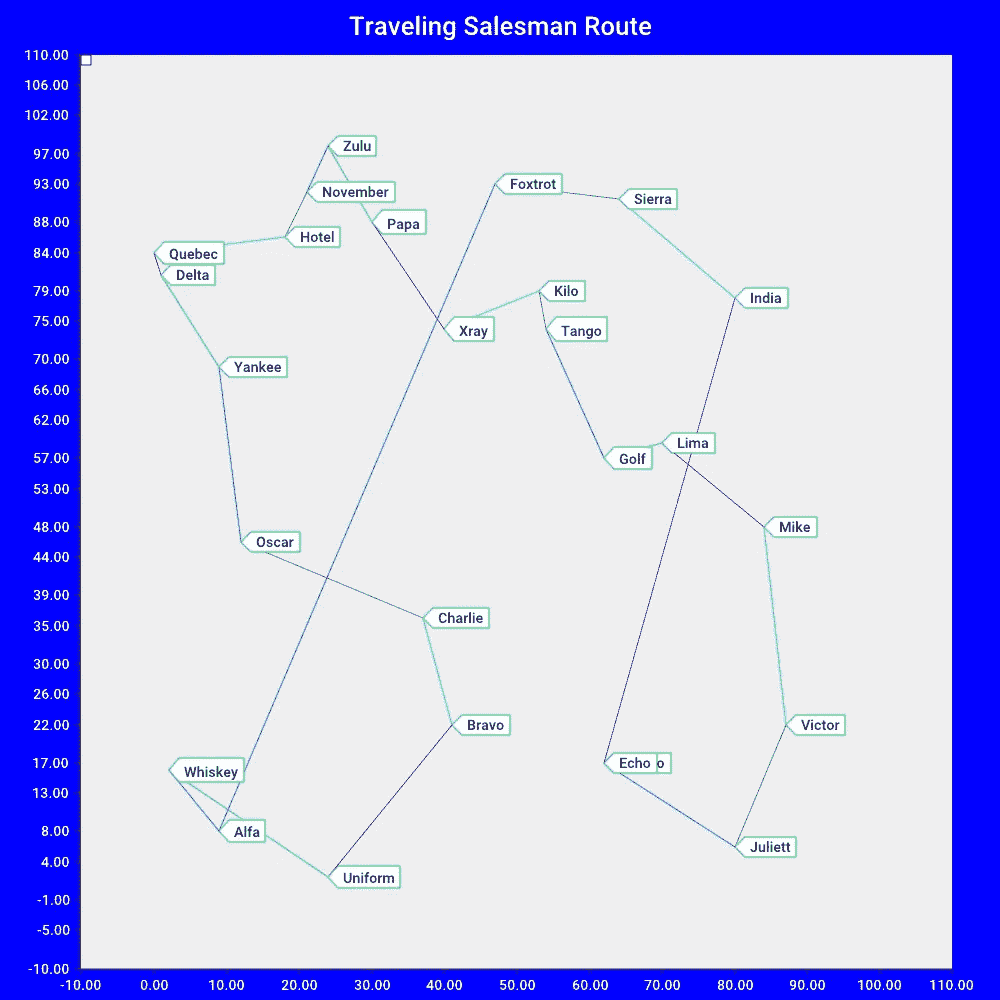

# 旅行商问题的最近邻解法

> 原文：<https://levelup.gitconnected.com/a-nearest-neighbor-solution-in-go-to-the-traveling-salesman-problem-d4d56125b571>

# 摘要

介绍了最近邻算法的 Go 实现，包括路径图表和支持报告输出。一组圆形节点显示了该算法的实现相当精确。如参考文献 6 所述，该项目在 gitlab 上公开托管。

# 介绍

这个项目是使用最近邻(NN)算法对旅行推销员问题的近似解决方案。参考文献(4)对这个相对著名的计算机科学问题进行了非常详细的分析和讨论。这种解决方案被认为比维基百科(4)中提到的精确解决方案长大约 25%。这个项目是在围棋中实现神经网络算法的一个练习，也可能是对基本神经网络算法的一些改进。

# 笔记

关于该项目的说明:

1.  从输出图表的随意检查中可以明显看出，该算法虽然执行起来很快，但在准确性方面不够理想。许多测试运行揭示了这一点，并激发了进一步测试的一些想法。
2.  在 NN 算法中，通过使用前瞻特征来考虑两个节点而不是单个节点，有可能提高精度。
3.  另一个改进可能是实现一个圆，使得通过比较节点与圆周上某点的距离来选择节点。
4.  预计代码重组和图表改进。

起始节点不影响任何一组节点的总行进距离。原因是选择了同一组边，因为节点彼此之间相对位置的变化不会影响该节点到下一个节点的最短距离。

一旦算法开始工作，首先想到的问题是如何证明它按照设计的那样工作。第一个解决方案是以 27 边多边形的形式计算 26 个节点，这些节点足够接近一个圆，以便将销售员的路线距离与由 27 条边组成的圆进行比较。圆的周长被计算并四舍五入到 314，而推销员的路线被计算为 313.18。

# 节点

节点结构包括一个名称字符串和十进制的 x，y 值。小数(3)类型。我使用 shopspring 库(3)是为了方便、易用以及精确处理值。

String() func 应用于节点类型，允许方便地显示节点值。

主要功能从生成 26 个命名节点开始，这些节点的名称对应于 NATO 拼音字母；《阿尔法》、《布拉沃》、《查理》、《德尔塔》、《回声》、《狐步舞》、《高尔夫》、《酒店》、《印度》、《朱丽叶》、《基洛》、《利马》、《迈克》、《十一月》、《奥斯卡》、《爸爸》、《魁北克》、《罗密欧》、《塞拉》、《探戈》、《制服》、《维克多》、《威士忌》、《x 光》(1)、《扬基》、《祖鲁》。这些节点被分配 0 到 100 之间随机生成的 x 和 y 坐标。

26 个节点的集合存储在一个 map[string]节点中。映射键是节点名。

通常这一代在我的联想 W540 Thinkpad 上需要大约 300 微秒，正如最近一次运行所报告的:

在 272.967 秒内生成了 26 个带有 0 到 100 之间的随机 x y 数据点的命名节点

# 原始节点

原点节点 origin node 被标识为离 x 和 y 坐标的原点最近的节点。这由 func FindOriginNode()执行，它计算每个节点到原点的距离，并保存较低值，直到检查完所有节点。

程序从原点节点开始。如前所述，它对最终行进的距离没有影响。测试对此进行了检查，并且没有出现 OriginNode 的替代选择对输出产生影响的情况。

# 优势

Edge 结构包括 node1、node2 字符串类型和长度类型 decimal . decimal .

String()func 应用于 Edge 类型，允许方便地显示值。

应用于每个节点对的潜在边的集合是从节点 x 和 y 坐标生成的。回忆一下高中代数，x - y 平面上两点之间的距离由公式 d = sqrt((x1-x2)^2 加(y1-y2)^2).)给出这始终是一个正数，因此代码应用绝对值函数来处理这种情况。这将创建一组 650 条边。

一些表示边的倒数和自引用节点如“Alfa”-“Alfa”的对被丢弃或不被计算。

边的集合存储在 map[string]Edge，Edges 中。映射键是 node1 和 node2 字符串的串联，即“node1”。名称-节点 2。名”。

通常这个边的生成需要大约 7 毫秒，如相同的测试运行输出所示:
在 6.81242 毫秒内计算了所有节点之间 650 条边的边长

# 路线确定

一旦节点和边的地图被填充，我们就可以根据神经网络算法来确定路线。从原始节点开始，func processEdges(node)通过扫描从原始节点开始的边来查找最近的邻居路径。这个最近的邻居是最短的路径，在应用了一些条件的情况下，给出了 nextNode 返回值。

func findShortestEdgeFromNode(节点 Node)返回一条边。这些条件确保返回的边以前没有被使用过，并且边节点 2 还没有被访问过。本质上，该函数遍历边并检查边，以查看边 node1 是否与节点参数匹配，以及边是否尚未被使用，边的 node2 是否尚未被访问。

已使用的边被添加到名为 UsedEdges 的边的 Go 切片中。以类似的方式，节点被添加到另一个 Go 片 VisitedNodes。两个小的实用函数 EdgeContains 和 NodeContains 用于检查正在讨论的边和节点是否尚未被使用。当 func 将边(edge . node 1 . name-edge . node 2 . name)添加到 UsedEdges 切片时，它还将倒易边 edge . node 2 . name-edge . node 1 . name 添加到 UsedEdges 切片。

func findShortestEdgeFromNode(Node Node)返回从当前节点到未访问节点的最短未使用边。另一个 Go 切片 RouteEdge 存储使用过的边，以便组成为节点找到的最短边。

# 算法开发和 TDD

我要指出的是，这种算法的机制和操作或过程可能看起来很简单，但在构建和测试过程中并非如此。我很幸运，尽管使用 26 个节点作为起点，测试运行还是给出了即时反馈。由于运行、检查输出报告和进行修正都很容易，所以性能足够好，使得对每个函数的测试变得多余。不完全是测试驱动的开发，而是合理的妥协。

我保证以后会做得更好！

# 路线检查

一旦 func ProcessNodes 结束，VisitedNodes 的节点切片包含 26 个按顺序排列的节点，因此生成路由作为报告输出的一部分就足够容易了。

一个典型的路线输出看起来是这样的:阿尔法→威士忌→制服→布拉沃→查理→奥斯卡→美国佬→德尔塔→魁北克→酒店→十一月→祖鲁→帕帕→x 光→基洛→探戈→高尔夫→利马→迈克→维克多→朱丽叶→回声→罗密欧→印度→塞拉→狐步舞→阿尔法

在这种情况下:
推销员旅行的总距离是 528.65

# 制图

我使用 go-charts(5)库来绘制销售人员的路径。这最终做得相当好，对这个项目来说很好。我以前用过它，发现它很容易做简单的事情，只需要多一点学习和实验就可以达到预期的效果。

图表功能太长，不能作为片段包含在这里，主要是因为使用了 26 个节点和边，必须包含这些节点和边才能显示图表。我确信对这个库更有经验的人可能能够改进这个图。在该项目的 gitlab 列表中可以很容易地找到它。

途径

# 结论

这个项目是由我读到的一篇关于 TSP 的最新工作的文章引发的。以前，我听说这个问题是计算机科学中最著名的问题之一。当时，我是一名工程学生，这个问题与我有关，即在其他领域中最小化电网的成本。这是最小生成树问题，当时我没有时间或兴趣去研究它。

回顾在这个问题领域中所做的更多工作可能是有意义的。绕圈路线并尝试采用最近邻算法可能是一种有趣的方式来练习 Go 代码。

这个项目帮助我学习了更多关于 Go 的知识，以及如何以一种利用结构的不可变方面的方式来管理数据，比如节点和边。一旦生成了节点和边，通过将它们添加到专门的片段(如 usedEdges 和 visitedNodes)来处理条件就容易多了，而不是试图更新结构内部的某些字段。

它还显示了如果项目被适当地开发，一点点的考虑可以提供什么。而不是从一个包含所有功能的 main.go 开始。我可以节省几个小时的时间，而不是把它分成多个包和文件。从长远来看，这可能会导致更广泛的测试和更少的挫折。一些被导出的函数也可能被隐藏。该项目肯定可以在几个方面进行改进，但这仍是未来的事。

# 参考

1.  维基百科贡献者，“北约音标”，维基百科，自由百科，https://en.wikipedia.org/w/index.php?title = NATO _ phonetic _ alphabet & oldid = 976561111(2020 年 10 月 14 日访问)。北约的正式名称是“X 射线”
2.  旅行推销员算法，链接[https://cse442-17f.github.io/Traveling-Salesman-Algorithms/](https://cse442-17f.github.io/Traveling-Salesman-Algorithms/)
3.  go 中任意精度的定点十进制数。链接 https://github.com/shopspring/decimal
4.  维基百科贡献者，“旅行推销员问题”，维基百科，免费百科全书，https://en.wikipedia.org/w/index.php?title = traveling _ salesman _ problem & oldid = 983348561(2020 年 10 月 14 日访问)。
5.  威尔·查尔丘克，“去海图”，github.com，链接 https://github.com/wcharczuk/go-chart
6.  伊万·S·柯克帕特里克，“travsales”，Tessaract 公司，【https://gitlab.com/ivank2139/travsales 
7.  照片由[反抗](https://unsplash.com/@revolt?utm_source=unsplash&utm_medium=referral&utm_content=creditCopyText)上[的 Unsplash](https://unsplash.com/s/photos/travel-salesman-route-map?utm_source=unsplash&utm_medium=referral&utm_content=creditCopyText)