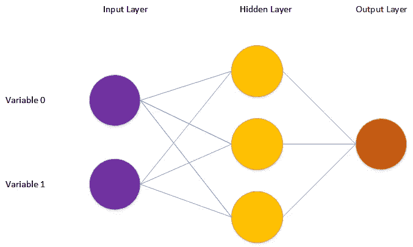
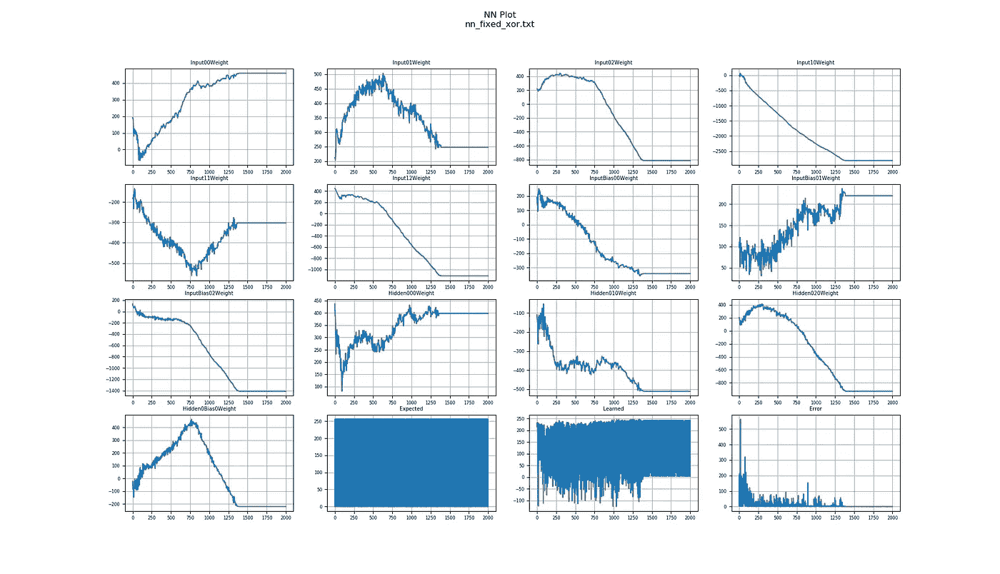

# 4KB 以下的神经网络

> 原文：<https://levelup.gitconnected.com/a-neural-network-in-under-4kb-41fc2d7d9174>

## 介绍

几年前，我开始编写 C++模板库，目标是在嵌入式系统中实例化和运行神经网络和机器学习算法。我没有 FPU(浮点单元)、GPU(图形处理单元)或任何矢量化指令(例如 SIMD)，因此我需要确保我可以只用一个非常简单的 CPU 来运行这些算法。在我的环境中，存储代码和数据的内存也非常有限。我没有空间来存储我不打算使用的代码和数据。

我对这些库的灵感来自安德烈·亚历山德雷斯库的现代 C++设计。这本书是我第一次接触到 C++模板和[模板元编程](https://en.wikipedia.org/wiki/Template_metaprogramming)的力量。在书中，他描述了如何使用策略类作为模板参数来设计代码，以定制行为。这完全符合我的需求，因为我希望代码可以从一个问题扩展到下一个问题(例如，解决方案、激活函数等)。)我还使用这种技术使这些库中的代码尽可能地小而高效。

为了演示[我的神经网络库](https://github.com/danmcleran/tinymind)能做什么，我选择为神经网络实现一个经典的“hello world”类程序( [xor.cpp](https://github.com/danmcleran/tinymind/blob/master/examples/xor/xor.cpp) )。在这里，我将演示如何实例化和训练一个神经网络来预测数学异或函数的结果。我们将生成已知数据并将其输入神经网络，并训练它成为 XOR 预测器。通过在编译期间检查生成的输出文件，我们可以向自己证明，假设我们打开了编译器优化，整个神经网络以及相关的代码和数据在最终图像中占用的空间不到 4KB。

## q 格式

要让神经网络超小超快，浮点这个奢侈品我们可买不起。另外，我的硬件没有浮点单元，这使得使用浮点更加困难。我们需要用定点数来解决这个问题。 [Tinymind](https://github.com/danmcleran/tinymind) 包含一个 C++模板库在这里帮助我们， [Q 格式](/qformat-92b4e570235f)。参见[这篇文章](/qformat-92b4e570235f)了解它如何工作的完整解释。我们像这样声明我们的 Q 格式类型的大小和分辨率:

我们现在已经声明了一个带符号的定点类型，它可以表示值-128 到 127.99609375。我们的分辨率是 2^(-8)或 0.00390625，因为我们使用 8 位作为 q 格式数的小数部分。从这个例子中你会看到，我们有足够的动态范围和分辨率来解决这个问题，没有浮点。该值的固定部分和小数部分连接成一个 16 位字段。举个例子。浮点数 1.5 将以上面选择的 q 格式在 0x180 处表示。这是因为整数部分(1)上移了小数位数(8)，从而得到 0x100。我们将数字中的 OR 表示为 8 位动态范围的一半(十六进制为 128 或 0x80)。

## 神经网络

我们需要指定我们的神经网络架构。我们的做法如下:

我们想要一个具有 2 个输入神经元、1 个包含 3 个神经元的隐藏层和 1 个输出神经元的神经网络。2 个输入神经元将从训练数据中接收 1 和 0 的流。输出神经元输出操作的预测结果。给定输入值和已知结果，隐藏层是学习预测结果的传递函数。

这里提供了神经网络的图形视图:



我们定义了神经网络传递函数策略以及神经网络本身:

TransferFunctionsType 指定了 ValueType(我们的 Q 格式类型)，神经网络的随机数生成器，输入->隐藏层的激活策略，以及隐藏->输出层的激活策略。 [tinymind](https://github.com/danmcleran/tinymind) 内的神经网络代码对其环境不做任何假设。需要为它提供封装策略的模板参数。

## 查找表

因为我没有浮点运算，所以我也没有内置的数学函数来处理 tanh、sigmoid 等。为了绕过这个限制， [tinymind](https://github.com/danmcleran/tinymind) 为这些激活函数([activationtablegenerator . CPP](https://github.com/danmcleran/tinymind/blob/master/apps/activation/activationTableGenerator.cpp))生成并利用查找表(lut)。这个生成器为每个支持的激活函数和 Q 格式分辨率生成头文件。因为我们不想生成我们不打算使用的代码，我们需要定义预处理器符号来编译我们需要的 LUT。如果查看 compile 命令，您会看到以下内容:

```
-DTINYMIND_USE_TANH_8_8=1
```

这指示编译器为 Q 格式类型 Q8.8 构建 tanh 激活 LUT，这就是我们在这个例子中使用的。我们需要为我们计划使用的每个 LUT 都这样做。

## 生成训练数据

我们将以编程方式生成训练数据。调用函数 generateXorTrainingValue 来生成单个训练样本。我们使用内置的随机数生成器来生成 2 个输入。我们生成一个随机数，然后将其与 0x1 进行 and 运算。如果随机数是偶数，结果将是 0，如果随机数是奇数，结果将是 1。

我们将数据输入神经网络，预测输出，然后在误差超出零容忍范围时进行训练。：

我们将在预测误差不在零容忍范围内的每次迭代中训练神经网络。神经网络预测值的误差实际上永远不会为零。我们需要一种方法来决定何时足够接近。如果我们足够接近零误差，那么最好不要去管权重。当声明神经网络的传递函数策略时，指定零容忍策略。在本例中，我们只是使用这些策略的默认值:

## 编译示例

这里我将展示如何在我的 Linux 机器上编译这个例子。我还使用 Visual Studio 在 Windows 上编译了代码。为了编译示例而不将不需要的文件添加到 repo 中，我简单地创建了一个目录来保存输出的可执行文件，并在编译和链接之后移动它。

```
mkdir -p ~/xorg++ -O3 -o ~/xor/xor xor.cpp xornet.cpp ../../cpp/lookupTables.cpp -DTINYMIND_ENABLE_OSTREAMS=1 -DTINYMIND_USE_TANH_8_8=1 -I../../cpp -I../../apps/include
```

要运行该示例，只需 cd 到~/xor 并运行生成的可执行文件。

## 绘图结果

运行示例后，您会看到有一个文本文件输出 nn_fixed_xor.txt，我提供了一个 python 脚本来绘制神经网络单元测试中神经网络训练的结果( [nn_plot.py](https://github.com/danmcleran/tinymind/blob/master/unit_test/nn/nn_plot.py) )。绘制神经网络权重、预期输出、预测输出以及计算误差。



随着预测值接近预期值，您可以看到重量训练时间以及误差减少时间。注意数字的大小。期望值在 0 到 256 之间变化。对于我们的 Q 格式类型，这映射到 0 和 1 的表示。1 在带符号的 Q8.8 格式(8 位小数分辨率，8 位整数表示)中的表示为 0x100。简单来说，就是将数字 1 左移分数分辨率的位数。还要注意重量的变化。它几乎看起来像浮点，但它不是。我们有 2^(-8)或 0.00390625 值之间的分辨率。

要使用绘图脚本，只需将运行示例程序的结果文件的路径传递给它。

## 确定神经网络大小

为了更容易地确定这个例子中神经网络代码和数据占用了多少空间，我确保将所有的神经网络代码放入它自己的文件中， [xornet.cpp](https://github.com/danmcleran/tinymind/blob/master/examples/xor/xornet.cpp) 。为了确定代码和数据在这个程序中占用了多少空间，我们在编译期间生成并解析一个输出文件。我用来编译 [xornet.cpp](https://github.com/danmcleran/tinymind/blob/master/examples/xor/xornet.cpp) 并移动结果输出文件的命令行如下:

```
g++ -c xornet.cpp ../../cpp/lookupTables.cpp -O3 -DTINYMIND_USE_TANH_8_8=1 -I../../cpp && mv xornet.o ~/xor/. && mv lookupTables.o ~/xor/.
```

我们可以使用 Linux 下的 size 实用程序来解析编译 [xornet.cpp](https://github.com/danmcleran/tinymind/blob/master/examples/xor/xornet.cpp) 的输出文件:

```
size lookupTables.o
text    data     bss     dec     hex filename
 192       0       0     192      c0 lookupTables.osize xornet.o
text    data     bss     dec     hex filename
3369       8     388    3765     e8a xornet.o
```

您可以看到，这个神经网络、Q 格式支持和 lut 占用的总空间不到 4KB。神经网络本身占用 396 字节，而相关代码占用 3369 字节。LUT 占用 192 个字节，总计 3957 个字节。

## 结论

使用 [tinymind](https://github.com/danmcleran/tinymind) ，可以使用定点数来实例化神经网络，这样它们就占用了非常少量的代码和数据空间。可以训练它们在 2000 个训练样本下预测一个基本函数的结果。我希望这能启发你克隆 tinymind，并看看单元测试和例子。甚至可能产生一个你自己的。