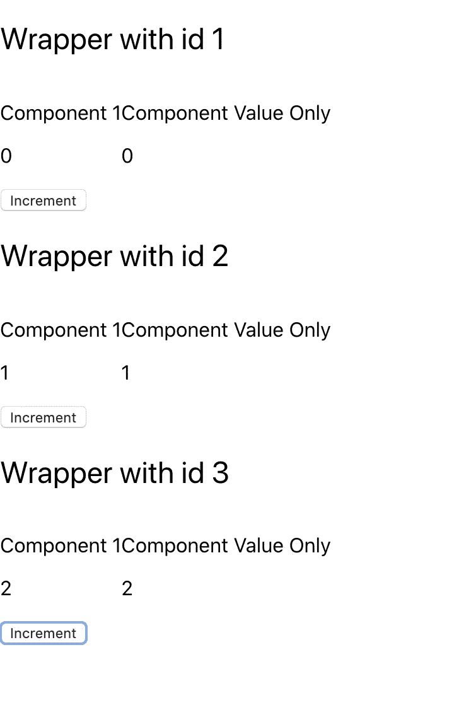

# 一种新的反应状态管理:反冲

> 原文：<https://levelup.gitconnected.com/a-new-state-management-for-react-recoil-53ad7480faa4>


费伦茨·阿尔马西在 [Unsplash](https://unsplash.com?utm_source=medium&utm_medium=referral) 上的照片

你肯定知道 Redux 最著名的中间件:Saga 和 Thunk。您最近还了解了新的上下文 API。但是你听说过[后座力](https://recoiljs.org/)吗？

还是在实验层面，[反冲](https://recoiljs.org/)对于状态管理来说是一个惊人的改进。

**请记住，Redux 或反冲都不是 React 的官方状态管理。它们都是库，都是为 React 设计的。但是它们都不是 React 核心的一部分**

如果你想要一个关于后坐力的完整解释。我强烈建议你去看它的创作者制作的原始视频

[https://www.youtube.com/watch?v=fb3cOMFkEzs](https://www.youtube.com/watch?v=fb3cOMFkEzs)

但总结这段视频，现有状态管理的主要缺点要么是它们的可扩展性，要么是它们的实现方式。

## Redux

Redux 当然是最有名的。许多公司都使用它，它允许有一个全局状态，注册组件，每次注册的值改变时，组件会自己重新呈现。

但是，Redux 应该只用于 UI 值。你应该**永远不要**使用 Redux 来管理输入的值。原因很简单:每次你在做 Redux store 的更新。在后台，存储的完整副本正在执行，然后应用新值，只有在此之后，以前的存储才会被擦除。现在假设我们有一个包含 100 多个值的大型商店？对于你输入的每一个字母，商店都会被复制。它会导致内存泄漏和非常糟糕性能。

## 上下文 API

上下文 API 表现为组件之间的公共状态。它不是用来取代 Redux 的，因为滥用它们会使你的代码很难维护。在视频的例子中，我们有一个正方形的绘图应用程序(比如 Draw.io ),边上有组件来管理它们的宽度和高度。在使用上下文 API 的情况下，为了避免每次方块改变时都重新呈现所有方块，您必须为每个方块创建一个上下文。这是可行的，但调试将是一场噩梦。

## 报应

反冲就是用所谓的**原子**来管理每个组件的状态。它们非常容易创建，甚至更容易使用，因为它们使用的是与 useState 完全相同的 API。此外，原子可以非常容易地创建，因为它们可以通过 id 来识别。然后，您只需向每个原子的键添加一个动态值，就可以轻松管理每个组件的阶段

在开始编写代码之前，让我们先看看什么是原子。

通过调用函数`atom`对原子进行初始化

```
export const counterAtom = atom({
  key: 'counter',
  default: 0
})
```

在这里，我们声明了原子`counterAtom`
每个原子必须有一个唯一的标识符`key`和一个值`default`

当原子被声明时，我们可以用一个特定的钩子来得到它

```
const [counter, setCounter] = useRecoilState(counterAtom);
```

我们已经准备好使用它了！

# 我们来编码吧！

首先，让我们创建一个新的 react 项目。创建-反应-应用是快速做到这一点的最佳选择

```
npx create-react-app recoil-test
```

Npx 是 npm 中包含的一个命令，允许在不安装 cli 的情况下运行 CLI

一切完成后，跳进它(`cd recoil-test`)并安装反冲库

```
npm install --save recoil
```

或者用纱线

```
yarn add recoil
```

一切都已安装完毕，可以运行了。您可以使用`npm start`启动您的开发环境，一个新的浏览器选项卡将在`http://localhost:3000`打开

现在为了测试的目的，我们将递增和递减一个计数器。我们需要三种成分。第一个只会递增，第二个只会递减，最后，第三个只会显示计数器值。

让我们创建两个文件:`ComponentIncrement`和`ComponentValue`第一个文件将增加值，第二个文件只显示它。我们仍然希望第一个组件显示更好理解的值。

让我们在相应的文件中添加以下代码(参见注释)

```
// ComponentIncrement.js
import React from "react";

export default function ComponentIncrement() {

  function onIncrementClick() {}
  return (
    <div>
      <p>Component 1</p>
      <input onClick={onIncrementClick} type="submit" value="Increment"/>
    </div>
  )
}// ComponentValue.js
import React from "react";

export default function ComponentValue() {
  return (
    <div>
      <p>Component Value Only</p>
    </div>
  )
}
```

到目前为止，结果可能不是很有趣。我们现在要创建我们的`Atom`。

让我们创建一个`Atoms.js`文件，并将下面的代码粘贴到其中

```
import { atom } from 'recoil';

export const counterAtom = atom({
  key: 'counter',
  default: 0
})
```

如前所述，我们正在创建一个新的`counterAtom`，它有一个键`counter`，它的默认值是`0`

我们现在拥有了分享这种状态所需的一切！回到我们最初创建的文件，让我们通过以下方式更改我们的`ComponentIncrement.js`的代码

```
import React from "react";
import {counterAtom} from "./Atoms";
import {useRecoilState} from "recoil";

export default function ComponentIncrement() {
// As useState, we are calling the hook useRecoilState and give as parameter the counterAtom we created
const [counter, setCounter] = useRecoilState(counterAtom);

  function onIncrementClick() {
    setCounter(counter + 1);
  }
  return (
    <div>
      <p>Component 1</p>
      <p>{counter}</p>
      <input onClick={onIncrementClick} type="submit" value="Increment"/>
    </div>
  )
}
```

现在，这个组件通过使用`useRecoilState`钩子从原子获取值，并赋予它`counterAtom`

如您所见，输出与`useState`一模一样，非常容易理解！

您可能在这段代码中发现了一个错误。这会导致无效的增量。确实！如果单击次数过多，计数器可能无法正确递增。`setCounter`将会，因为与`useState`中 setter 的行为方式相同，这意味着它是异步的！由于点击次数太快，您可能会得到一个过时的值或`counter`

让我们把`onIncrementClick`里面的代码改成这样:

```
setCounter((current) => current + 1);
```

开始了。这样，您就可以确保使用最新的`counter`值，因此每次点击都会正确递增。

现在是第二个文件。让我们把代码改成`ComponentValue.js`这样:

```
import React from "react";
import {useRecoilState, useRecoilValue} from "recoil";
import {counterAtom} from "./Atoms";

export default function ComponentValue() {
  const counter = useRecoilValue(counterAtom);

  return (
    <div>
      <p>Component Value Only</p>
      <p>{counter}</p>
    </div>
  )
}
```

我们在这里使用了另一个钩子`useRecoilValue`，这个钩子只返回值。您可以将它用于不需要更改值的组件。

不要忘记在您的`App.js`中调用这些组件

```
import React from 'react';
import ComponentIncrement from "./ComponentIncrement";
import ComponentValue from "./ComponentValue";

function App() {
  return (
    <div>
      <ComponentIncrement/>
      <ComponentValue/>
    </div>
  );
}

export default App;
```

在它工作之前的最后一件事是，你必须用一个`Provider`包装你的应用程序，就像 Redux 或 Context 所做的那样。

打开您的`index.js`文件并应用这些更改

```
...
import { RecoilRoot } from 'recoil';
...<RecoilRoot>
  <App />
</RecoilRoot>
```

保存您的代码并转移到您的 react 应用程序！单击增量按钮，您将看到两个值都在变化！很棒，不是吗？实现起来真的很简单，也不需要太多维护！

# 使用相同原子的多个组件

举例来说，可能(将会)发生这样的情况，你有一个列表，而这个列表使用相同的原子。在这种情况下，您希望每个列表都有自己的原子状态。

让我们改变我们的代码，使之与之兼容。让我们在名为`CountersWrapper.js`的文件中创建一个新组件

```
import React from "react";
import ComponentIncrementWithId from "./ComponentIncrementWithId";
import ComponentValueWithId from "./ComponentValueWithId";

export default function CountersWrapper(props) {
  return (
    <div>
      <h2>Wrapper with id {props.id}</h2>
      <div style={{display: 'flex', flexDirection: 'row'}}>
        <ComponentIncrementWithId id={props.id}/>
        <ComponentValueWithId id={props.id} />
      </div>
    </div>
  )
}
```

复制`ComponentIncrement.js`和`ComponentValue.js`并在每一个的末尾添加`WithId`。我们将改变一些内容，以便能够使用我们通过道具提供的新`id`。

```
// ComponentIncrementWithId.js
import React from "react";
import {counterWithId} from "./Atoms";
import {useRecoilState} from "recoil";

export default function ComponentIncrementWithId(props) {
  const [counter, setCounter] = useRecoilState(counterWithId(props.id));

  function onIncrementClick() {
    setCounter((current) => current + 1);
  }
  return (
    <div>
      <p>Component 1</p>
      <p>{counter}</p>
      <input onClick={onIncrementClick} type="submit" value="Increment"/>
    </div>
  )
}// ComponentValueWithId.js
import React from "react";
import {useRecoilValue} from "recoil";
import {counterWithId} from "./Atoms";

export default function ComponentValueWithId(props) {
  const counter = useRecoilValue(counterWithId(props.id));

  return (
    <div>
      <p>Component Value Only</p>
      <p>{counter}</p>
    </div>
  )
}
```

如你所见，我们正在调用一个名为`counterWithId`的新函数，它将`props.id`作为参数。让我们实现这个函数。
跳转到`Atoms.js`文件并添加以下代码

```
export const counterWithId = (id) => atom({
  key: `counter${id}`,
  default: 0
})
```

原理和第一个一样。但是我们通过添加作为参数传递的`id`来使这个键动态化。

现在，只需将`App.js`的返回改为

```
return (
  <div>
    <CountersWrapper id={1}/>
    <CountersWrapper id={2}/>
    <CountersWrapper id={3}/>
  </div>
);
```



3 种不同状态的最终结果

我们到了！我们可以“动态地”创建 3 个不同的原子，每个包装器都有自己的状态！

# 结论

反冲是实验性的，您绝对不应该在生产环境中尝试它！但这是非常有希望的，我希望不久之后，我们将能够在 react 应用程序中更容易地维护状态，让我们的生活更轻松！

你当然可以在[我的回购](https://github.com/psyycker/recoil-test)上找到最终代码

感谢您的阅读！

雷米