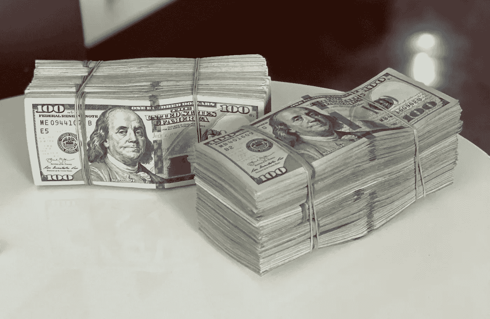
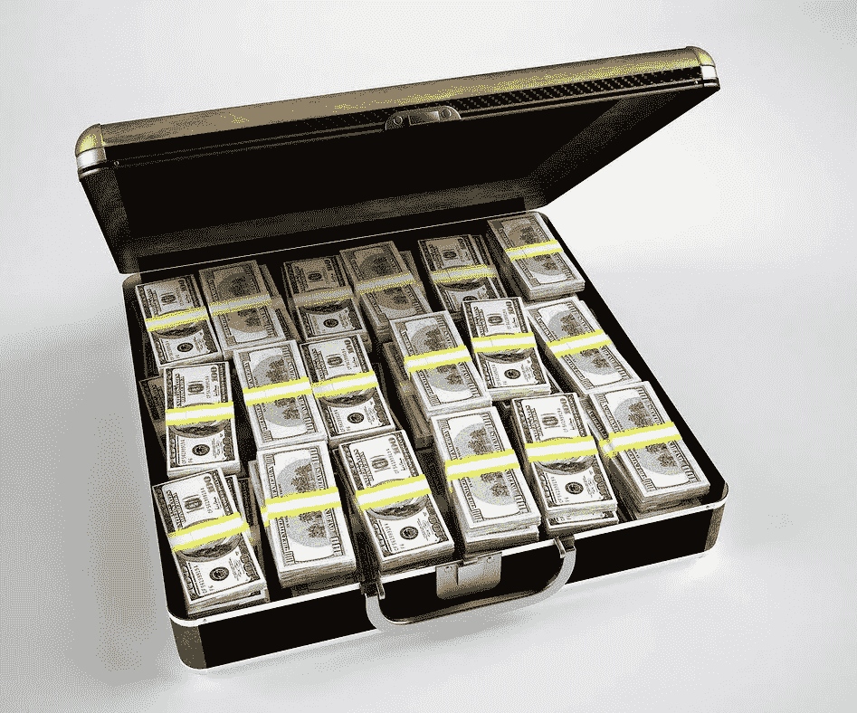
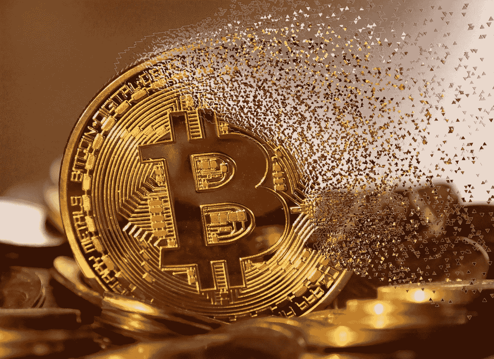
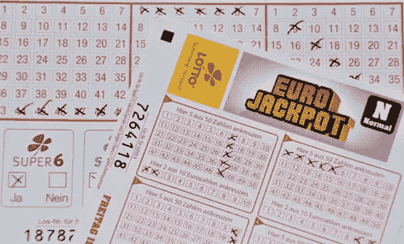

# 一个陌生人给了我 800 万美元

> 原文：<https://levelup.gitconnected.com/a-nigerian-i-never-met-is-sending-me-8-000-000-8c4da8b384e1>

## 一周至少两次，一笔新的横财到来

[Bermix 工作室](https://unsplash.com/@bermixstudio?utm_source=unsplash&utm_medium=referral&utm_content=creditCopyText)在 [Unsplash](https://unsplash.com/s/photos/fraud?utm_source=unsplash&utm_medium=referral&utm_content=creditCopyText) 拍摄的照片

甚至不用参加比赛，我就能赢得数百万美元。来自世界各地的人们也不断与我联系，告知我遗产继承的情况，或者寻求我的帮助转移大笔资金。本周，我甚至收到了一封来自厄瓜多尔的电子邮件，提供给我在两天内从 300 美元的比特币投资中赚取 2500 美元的机会。

我还没有回复任何邮件，也不打算回复。我只是看了一眼就删除了，怀疑里面可能有某种病毒。我假设他们每个人都是诈骗未遂。

以下是最近的几个:

## **一名强力球中奖者的信托代理人，带着一张 ATM 卡**

有人催促我赶快行动，否则我将没收这笔钱。我还被建议不要告诉任何人我获奖的消息，“以避免因重复索赔而被取消资格”。

> 收件人:尊敬的受益人，
> 
> 特此通知您，您在由所有域名用户和所有社交网络用户组织的 2020 年奖金推广活动中赢得了 800 万美元的奖金。
> 
> 谷歌和微软收集了活跃在线人群的所有电子邮件地址，这些人是数百万订阅电子邮件/社交网络的用户。六个人被选中从此次促销活动中受益，您是被选中的获奖者之一。
> 
> 支付奖金和索赔
> 
> 获奖者将根据他/她的结算中心获得报酬。抽奖奖励必须在抽奖通知之日起 14 天内申领。在此期间未领取的任何奖品将被没收。请注意，您的金额为 8，000，000.00 美元(800 万美元)的 ATM 卡现在由您在尼日利亚阿布贾的信托代理人保管，已投保并以您赢得此奖的电子邮件地址签发，因此，您应该联系您的信托代理人 Victor Umeh 先生(我们在尼日利亚的支付办公室)并提供您的详细信息，以便他们加快处理您的资金交付。以下是您的身份号码:
> 
> 批号:
> 
> MFI/08/APA-43658，
> 
> 参考编号:2008234522
> 
> 获奖号码:01 14 21 30 35 48
> 
> 这些号码属于尼日利亚的位置文件，你被要求联系你的信托代理人在下面的信息，并发送您的中奖识别号码给他们；
> 
> 信托代理人/索赔经理联系信息:
> 
> 电话:(+234 805 369 7179)
> 
> 联系人:Victor Umeh 先生
> 
> 电子邮件:heritagebankplc890@gmail.com
> 
> 我们建议您将以下信息发送给您的信托代理人，以便将您的资金发放给您。
> 
> 适用的条款和条件。
> 
> 1.全名— — — — —
> 
> 2.国家— — —
> 
> 3.联系地址— — — —
> 
> 4.电话号码— — — —
> 
> 4.你的护照或身份证复印件
> 
> 恭喜你！！再一次。你的服役期，
> 
> 迈克尔·摩根
> 
> (协办奖抽奖活动)
> 
> 警告！
> 
> 在你的钱成功交给你之前，不要告诉别人你的奖金，以避免因重复索赔而被取消资格。

请注意，为了诚实起见，我可能已经取消了自己的获奖资格。

照片由 [Celyn Kang](https://unsplash.com/@celynkang13?utm_source=unsplash&utm_medium=referral&utm_content=creditCopyText) 在由 J. Dean 改装的 [Unsplash](https://unsplash.com/s/photos/money?utm_source=unsplash&utm_medium=referral&utm_content=creditCopyText) 上拍摄

## **联系代理，索要我的 45 万美元**

有时候意外之财是通过难以理解的方式来的。在这种情况下，身在越南的 Abu Salam 先生让我联系他在布基纳法索的秘书，让她给我汇 45 万美元。萨拉姆先生也向我的家人问好。

> 亲爱的朋友，
> 
> 我很抱歉，但很高兴地通知你，在一个来自越南的新伙伴的合作下，我成功地转移了那些资金。虽然，我尽力让你参与到生意中来，但是一切都完全变了。目前，我在越南投资项目，我自己的份额总额。与此同时，我没有忘记你过去的努力和尝试，帮助我转移这些资金，尽管它在某种程度上辜负了我们。
> 
> 现在联系我在布基纳法索的秘书。她的名字是米拉·史密斯女士。她的电子邮件地址是 millasmith7010@gmail.com。
> 
> 请她将总额为 450，000.00 美元的款项寄给你，这是我为补偿你过去在这件事上帮助我所做的努力和尝试而保留的。我非常欣赏你当时的努力。所以你可以随时联系我的秘书米拉·史密斯女士，告诉她把钱寄到哪里给你。请一定要让我知道你收到了它，这样我们就可以在那时所有的痛苦之后分享快乐。
> 
> 目前，我这里很忙。因为我和我的新合伙人手头有一些投资项目。最后，请记住，我曾代表你向秘书转达过接受这笔钱的指示。所以，请随时与米拉·史密斯女士联系。
> 
> 向你的家人转达我的问候。
> 
> 最诚挚的问候，
> 
> 你的兄弟阿布·萨拉姆先生来自越南的问候

## **布基纳法索的一名利比亚难民向外国人寻求帮助——我**

阿里·纳菲先生想让我帮他继承 1050 万美元。他全家都死于战争。现在他寻求来美国完成他的学业。

> 我叫 Ali Nafi，来自利比亚，今年 22 岁，目前在联合国难民事务高级专员公署在布基纳法索的圣克里斯托弗教区为难民服务，我在最近的利比亚战争中失去了我的父母，现在我在布基纳法索，请救救我的命，我有危险需要你的帮助来转移我父亲留给我的遗产在布基纳法索的一家银行这里，我有基金的所有必要文件， 我所需要的是一个外国人，他将作为我父亲的外国合伙人和基金的受益人。 存入银行的钱是 1050 万美元)我只需要这笔钱转到你的银行账户，这样我就可以去你的国家完成我的学业，因为你知道我的国家由于战争已经陷入了深深的危机。我不能再回到那里，因为我没有亲人了，我所有的家人都死于战争。如果你有兴趣拯救我，并帮助我接受我的继承基金到你的银行账户，请与我联系。
> 
> 阿里纳菲。

图片由 [PublicDomainPictures](https://pixabay.com/users/publicdomainpictures-14/?utm_source=link-attribution&utm_medium=referral&utm_campaign=image&utm_content=163502) 来自 [Pixabay](https://pixabay.com/?utm_source=link-attribution&utm_medium=referral&utm_campaign=image&utm_content=163502) 由 J. Dean 修改

## **又一个强力球得主；另外 1250 万美元**

一位 Hermans 女士选择我作为她赢得的 1 . 5 亿美元强力球奖金的幸运儿之一。她的意图是让我帮助她向我所在地区的弱势群体、孤儿和慈善组织伸出援助之手。

> 我们奉主的名向你问候。这封邮件是发给你的，通知你你已经被选中从我们的慈善项目中受益，我们的慈善项目旨在感动生命，帮助那些我们能够帮助的人，就像上帝保佑我们一样。
> 
> 我在 2019 年 11 月 2 日赢得了 1.5 亿美元的强力球彩票，我自愿决定向慈善机构捐赠 7500 万美元，我试图从不同的来源和方式随机接触人们，以便从不同的角度触摸生活，因此你会在这里收到一条消息。
> 
> 您已被列为获得 1250 万美元的幸运接收者之一。这笔捐款是向您提供的，以便您能够加强您的个人问题，更重要的是慷慨地帮助我们向您所在地区的弱势群体、孤儿和慈善组织伸出援助之手，以验证:
> 
> [https://www . power ball . com/winner-story/1.5 亿强力球彩票认领](https://www.powerball.com/winner-story/150-million-powerball-ticket-claimed)
> 
> 请回复我，告诉我如何通过我们下面的官方电子邮件地址接收捐款。您也可以通过我们的 Whatsapp 号码+1 573 333 7440 和电子邮件地址(mrs.chantalhermans2002@gmail.com 联系我们。您越早联系我们的电子邮件地址，您就越早收到您的捐款。
> 
> 谢谢，
> 
> 尚塔尔·赫尔曼斯夫人

## **惊人的比特币机会**

这是邮件诈骗吗？我并不是每天都有机会在两天内从 300 美元的投资中赚到 2500 美元，但这正是奇里沃加给我的机会。

我不会寄我的 300 美元，我建议你也不要寄:

> 玛丽亚·埃米莉亚·索萨·奇里沃加<mesosa></mesosa>
> 
> 2020 年 3 月 11 日上午 9 时 13 分
> 
> 通过投资低至 300 美元的比特币二元交易，在 2 天内赚取 2500 美元。
> 
> 欲了解更多信息，请联系我们:maureen_trade@aol.com
> 
> whatsapp:https:wa . me/19177914011
> 
> 电报:[https://t.me/maureen_fxtmtrader](https://eur05.safelinks.protection.outlook.com/?url=https%3A%2F%2Ft.me%2Fmaureen_fxtmtrader&data=04%7C01%7C%7C3f9fa791d60343fb52df08d88002b115%7C84df9e7fe9f640afb435aaaaaaaaaaaa%7C1%7C0%7C637400096340233167%7CUnknown%7CTWFpbGZsb3d8eyJWIjoiMC4wLjAwMDAiLCJQIjoiV2luMzIiLCJBTiI6Ik1haWwiLCJXVCI6Mn0%3D%7C1000&sdata=s2eDgqR40cuXcUP7Zj2O%2F75b0aYL4CkjEtowmORy5EY%3D&reserved=0)
> 
> 玛丽亚·埃米莉亚·索萨·奇里沃加
> 大学生
> 工业工程师
> **基多旧金山大学**
> T:(+593)2 297–1700 分机。
> 科雷奥:mesosa@estud.usfq.edu.ec
> 厄瓜多尔基多 Diego de Robles y vía inter oceánica
> [http://www . usfq . edu . EC](https://eur05.safelinks.protection.outlook.com/?url=http%3A%2F%2Fwww.usfq.edu.ec%2F&data=04%7C01%7C%7C3f9fa791d60343fb52df08d88002b115%7C84df9e7fe9f640afb435aaaaaaaaaaaa%7C1%7C0%7C637400096340243160%7CUnknown%7CTWFpbGZsb3d8eyJWIjoiMC4wLjAwMDAiLCJQIjoiV2luMzIiLCJBTiI6Ik1haWwiLCJXVCI6Mn0%3D%7C1000&sdata=5aVbhYb4ScVXRe9aqnL5Rq2b59ixP3W%2BpuqE%2BVS9WYs%3D&reserved=0)
> 
> 厄瓜多尔基多迭戈·德·罗伯斯和维亚·inter oceánica
> 
> [http://www.usfq.edu.ec](https://eur05.safelinks.protection.outlook.com/?url=http%3A%2F%2Fwww.usfq.edu.ec%2F&data=04%7C01%7C%7C3f9fa791d60343fb52df08d88002b115%7C84df9e7fe9f640afb435aaaaaaaaaaaa%7C1%7C0%7C637400096340243160%7CUnknown%7CTWFpbGZsb3d8eyJWIjoiMC4wLjAwMDAiLCJQIjoiV2luMzIiLCJBTiI6Ik1haWwiLCJXVCI6Mn0%3D%7C1000&sdata=5aVbhYb4ScVXRe9aqnL5Rq2b59ixP3W%2BpuqE%2BVS9WYs%3D&reserved=0)

图片由[的](https://pixabay.com/?utm_source=link-attribution&utm_medium=referral&utm_campaign=image&utm_content=3446557)[穆罕默德·哈桑](https://pixabay.com/users/mohamed_hassan-5229782/?utm_source=link-attribution&utm_medium=referral&utm_campaign=image&utm_content=3446557)拍摄，j·迪恩修改

## **游戏锡安奖给了我 25 万美元！**

想象一下，当我得知在多哥举行的一次抽奖给了我 25 万美元时，我是多么高兴。诚然，与我获得的其他几个奖项相比，这个奖项微不足道，但 25 万美元仍然可以派上用场。我要做的就是给亚当斯奇寄 99 美元。一旦他拿到我的钱，他会给我一张提款卡去取我的 25 万美元。

我应该交我的 250 美元吗？

> 博彩锡安彩票促销/奖励奖 2020
> 批号:EL-0281/544/序列号
> 编号:993428452020
> 
> 恭喜你！
> 
> 整个游戏锡安队非常高兴地通知您，您的电子邮件地址赢得了二十五万美元。
> 
> 抽奖活动在多哥首都洛美举行，您的电子邮件地址是从全世界超过 1000 亿个国际电子邮件地址中挑选出来的，您的电子邮件地址是其中一个获奖者。
> 
> 这是你的中奖号码:EL-178–67。
> 
> 获奖者是从我们由 gaming zion 提供支持的计算机化电子邮件选择系统(ESS)中随机抽取的，您赢得的现金奖励(250，000.00 美元)已经存入我们获奖者的 Atm visa 卡，您价值 250，000.00 美元的 Atm visa 卡将通过 DHL 运输公司发送到您的家庭地址。
> 
> 建议您用您的中奖号码联系我们下面的彩票办公室电子邮件地址，以便他们将您的 Atm visa 卡运送到您的家庭地址，您将每天从您在世界各地选择的任何 Atm 机中心/银行的 Atm visa 卡中提取总计 5000 美元。
> 
> 电子邮件:gamingzionZG@collector.org
> 
> 联系人 Adams Chi 先生
> 
> 联系电话:(+228 98788593)
> 
> 注:您需要向 Adams Chi 先生支付 99 美元的处理费，以使他能够将您的 Atm visa 卡运送到您的家庭地址，在三天内您将在您的家庭地址收到 DHL 的包裹，博彩锡安彩票是 100%真实合法的，但是您有 100%的权利拒绝您的中奖，如果您不感兴趣，请在收到奖金之前保持私密。
> 
> 再次祝贺游戏锡安队。
> 
> 最诚挚的问候
> 
> 约翰·马可先生，博彩锡安
> 助理彩票协调员。
> https://www.gamingzion.com/togo/lotto/lotto-promotions/
> 
> 【2020 年 11 月多哥在线乐透促销| GamingZion
> 
> 大多数领先的多哥互联网彩票网站本月都有促销活动。使用 Gamingzion 目录申领多哥独家在线乐透奖金，如免费线路、免费彩票或高额存款奖金。使用正确的推广是一个很好的方式来增加你的机会，赢得网上乐透网站在多哥的头奖。
> 
> www.gamingzion.com

## **我刚刚中了 450 万美元的彩票！**

照片由 J. Dean 改装的 Unsplash[上的](https://unsplash.com/s/photos/lottery-powerball?utm_source=unsplash&utm_medium=referral&utm_content=creditCopyText) [Waldemar Brandt](https://unsplash.com/@waldemarbrandt67w?utm_source=unsplash&utm_medium=referral&utm_content=creditCopyText) 拍摄

我一直赢啊赢。我不认领我的财产有多傻？

> 祝贺亲爱的彩票中奖者
> 
> 兹通知您，您的电子邮件地址已从 MO-LOTTERY award 2020 中获得奖金(4.500，000，000 美元)，该彩票是通过互联网投票系统组织的，您的电子邮件地址是赢得免费在线彩票的幸运获奖者之一。你是免费的，并保证跟踪和检查以下网站，以确认彩票委员会，其中你被选为今年的幸运赢家。找到您的中奖号码，这里有一个网站，您可以在那里查看您的中奖基金奖金自己查看，
> 
> [https://www.lotteryusa.com/missouri/lotto/year](https://www.lotteryusa.com/missouri/lotto/year)
> 
> 抽奖日期。2020 年 7 月 15 日星期三
> 
> 中奖号码 11–20–28–32–37–44
> 
> 中奖金额 450 万美元
> 
> 事实是，你是今年在 MO 彩票国际比赛中被选中的幸运获奖者之一，请你做的是选择其中一个选项并联系付款办公室，以便收到你的资金。
> 
> 1)银行转账至您的银行账户
> 
> 2)现金快递到你家地址。
> 
> 要申领您的中奖资金，建议您联系 Mariam Mohammed 女士(希腊国家银行外币汇款部主任),并在您的
> 
> Mo 彩票中奖金额(4.500，000.00 美元)已于今日存入您的银行账户。
> 
> 请用您的中奖号码联系希腊国家银行，索取您的价格。

## **该怎么办？**

如果你收到一封类似上述的邮件，删除它。不要成为受害者。此外，请避免访问本文中提到的所有网站——可能有病毒或更糟的情况。