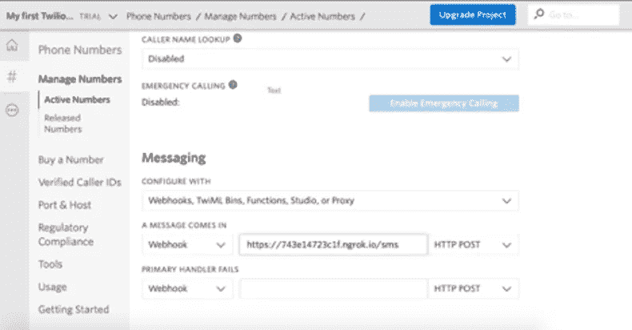

# 构建一个节点应用程序，使用 ngrok 接收文本消息并存储在 RDS 数据库中

> 原文：<https://levelup.gitconnected.com/a-node-app-to-receive-an-sms-with-twilio-and-send-the-message-content-to-an-rds-mysql-database-afd7c845eed3>


照片来自 [Unsplash](https://unsplash.com/photos/yg7WVUOf4N8)

本文将演示如何创建一个节点应用程序，该应用程序将使用 ngrok 和 Twilio 接收 SMS 消息，并将消息内容发送到 RDS MySQL 数据库。

# **第一步:设置一个 AWS 账户和一个 Twilio 账户，并设置您的环境和 RDS 数据库**

创建一个 AWS 账户和一个 Twilio 账户。

要设置您的环境，您需要 Node、Express 和 MySQL。如果你运行的是 Ubuntu 并且没有安装这些，使用下面的脚本。

```
#!/bin/bash
sudo apt-get update
sudo apt-get install node -y
sudo apt-get install npm -y
sudo npm install -g express-generator
sudo apt-get update
sudo apt-get install mysql-client-core-5.7 -y
sudo apt-get install unzip
```

要启动您的数据库，请转到 AWS RDS 选项卡，并创建一个免费层 MYSQL 数据库。

# **第二步:创建节点应用并安装依赖项**

当您等待 RDS 实例启动时，转到您的终端并导航到您的工作目录。使用以下命令初始化节点应用程序:

```
express myApp
```

导航到新创建的文件夹，并使用

```
npm install
```

要接收 SMS 消息，将 mysql、twilio 和 body-parser 添加到您的新应用程序中。为此，运行以下命令。

```
npm install mysql -- save
npm install twilio -- save
npm install body-parser -- save
```

测试方式:

```
npm start
```

然后，导航到您的 localhost:3000(或$YOUR_PUBLIC_IP:3000)。这将显示默认的快速页面。

# **步骤 3:配置您的 RDS 数据库**

导航到 AWS 控制台，确认 RDS 数据库已创建。单击数据库的名称，并记下端点。使用以下命令连接到您的数据库:

```
mysql -h $YOUR_ENDPOINT -P 3306 -u $USERNAME -p
```

输入您的密码并确认一切正常:

```
SHOW DATABASES;
```

这将显示默认数据库。用一些虚拟数据建立一个测试数据库(下面的 SQL 创建了一个名为 text_messages 的数据库和一个名为 data 的表，表中有一个假条目)。

```
CREATE DATABASE text_messages;
USE text_messages;
CREATE TABLE sms (number varchar(100), message varchar(100));
INSERT INTO sms (number, message) VALUES('1234121234', 'This is a test');
```

最后，确认该表已经填充了:

```
SELECT * FROM sms;
```

然后，用“退出”关闭连接。

# **步骤 4:将您的节点应用程序连接到您的 Twilio 帐户**

要接收消息，请转到您的应用程序的文件夹，创建一个名为 receive_sms.js 的文件，其中包含以下代码。它在/sms 接收 post 请求，将号码和消息插入数据库。

```
var mysql = require(‘mysql’);
var bodyParser = require(‘body-parser’);
const http = require(‘http’);
const express = require(‘express’);
const MessagingResponse = require(‘twilio’).twiml.MessagingResponse;
const app = express(); app.use(bodyParser.urlencoded({ extended: false }));
app.use(bodyParser.json());var my_database = mysql.createConnection({
     host: ‘$YOUR_RDS_ENDPOINT’,
     port : ‘3306’,
     user : ‘admin’,
     password: ‘$YOUR_RDS_PASSWORD’,
     database: ‘text_messages’});app.post(‘/sms’, (req, res) => {
     const twiml = new MessagingResponse();
     console.log(req.body); twiml.message(“DEFAULT RESPONSE”);
     res.writeHead(200, {‘Content-Type’: ‘text/xml’});
     res.end(twiml.toString()); var number = req.body.From.toString();
     var message = req.body.Body; var query = “INSERT INTO sms (number, message) VALUES (?, ?)”;
     var inserts = [req.body.From.toString(), req.body.Body];
     queryString = mysql.format(query, inserts); my_database.query(queryString, function(err, result, fields){
          if (err) throw err;
          console.log(“record inserted”);
     });
});http.createServer(app).listen(1336, () => {
     console.log(‘Port 4000’);
});
```

现在，用下面的代码在后台运行您的应用程序。

```
node receive_sms.js &
```

**步骤 5:使用 ngrok 将你的应用程序连接到 Twilio 并接收消息**

ngrok 是一个允许你的应用程序连接到 Twilio 的工具。有付费版和免费版。免费版本将允许您运行 ngrok 最多 8 小时。

要下载 ngrok，导航到[https://ngrok.com/download](https://ngrok.com/download)并复制 linux 下载 URL。然后，转到工作站的主目录，用 wget 下载 ngrok:

```
wget [https://bin.equinox.io/c/4VmDzA7iaHb/ngrok-stable-linux-amd64.zip](https://bin.equinox.io/c/4VmDzA7iaHb/ngrok-stable-linux-amd64.zip)
```

解压缩下载内容:

```
unzip ngrok-stable-linux-amd64.zip
```

然后，打开应用程序的端口(在上面的例子中是 3000):

```
./ngrok http 3000
```

这将显示一个包含各种信息的屏幕。保持 ngrok 运行，复制 https 转发链接。它应该看起来像这样:

```
[https://732e14237c1f.ngrok.io](https://743e14723c1f.ngrok.io)
```

Ngrok 每次运行时都会随机生成这些 URL，所以要让它一直运行下去。

打开浏览器，导航至 Twilio 控制台，然后转到电话号码屏幕。选择您的号码(如果您还没有号码，请购买一个)。单击电话号码并导航至页面底部的消息部分:



将 ngrok URL 粘贴到“消息到达”文本字段，并将“/sms”附加到该 URL 的末尾。检查是否选择了“Webhook”和“Post ”,然后单击“save ”(在屏幕的最底部)。

*注意:由于 ngrok 每次运行时都会生成一个随机的 URL，所以您每次运行 ngrok 时都需要粘贴一个新的 URL。ngrok 的试用版最多只能运行 8 个小时。*

# **第六步:测试**

若要测试你的应用，请向你的手机号码发送消息。ngrok 控制台日志应该显示请求正文以及确认 RDS 已更新的控制台日志。要确认，请使用登录您的 RDS

```
mysql -h $YOUR_ENDPOINT -P 3306 -u $USERNAME -p
```

而且，

```
USE text_messages;
SELECT * FROM sms;
```

它应该显示您的短信和相关号码。

# 结论

只要 ngrok 在运行，这个应用程序就会将所有收到的消息发送到您的 RDS 数据库。要构建一个生产就绪的应用程序，请使用 Twilio 和 ngrok 的付费版本，并考虑对应用程序进行 dockerizing 以增强安全性。