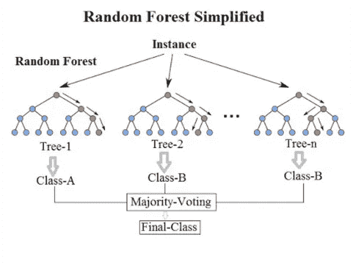
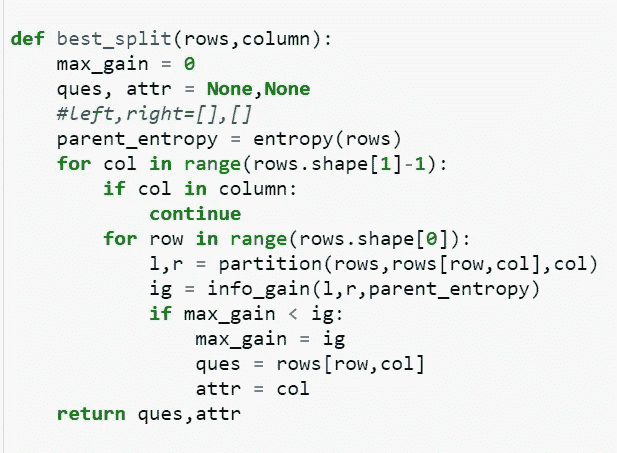

# 随机森林指南

> 原文：<https://levelup.gitconnected.com/a-noobs-guide-to-random-forest-d7398d56b01c>

作为一个新手，在了解随机森林的时候很容易迷路。但是不要害怕我的菜鸟朋友，因为这个博客会给你一个入门指南，让你在这个混乱的话题中生存下来。我们还将研究随机森林和决策树在数据集上的实现，这将有助于您进一步理解该算法。

来源:www.fromthegenesis.com

# 介绍

随机森林是一种 ***集成学习*** 方法，主要用于分类问题，但也可用于回归。它结合了多个决策树的决策，然后将所有决策树中的大多数响应作为最终的裁决/输出。

**集成**基本上是预测模型，它结合来自“弱学习者”的预测来创建一个“强预测者”。

为了理解和实现随机森林，你应该首先理解决策树的概念。如果你愿意，我已经在另一个博客中讨论了这个话题的理论，你可以在这里找到这个博客的链接。

# 工作

为了理解随机森林的工作原理，我们需要理解**“装袋”或“引导聚集”**的含义。

*套袋是一种技术，我们为每棵树选择一定数量的样品进行替换。 ***采样与替换*** 表明，当选择数据集行进行采样时，我们可以再次选择部分或全部那些行用于其他决策树。*

*在将样本分配给这些树之后，我们使用这些样本来训练这些树，然后继续使用所有这些样本来预测测试实例/行。*

*在我们从所有的树中得到结果后，我们在分类的情况下从结果池中找出所有结果的多数标签，并在回归的情况下对结果进行平均。*

*这整个过程可以用下图来描述:*

**

*资料来源:towardsdatascience.com*

*如果你仍然不明白这个过程，我们可以举一个装有樱桃、苹果和橘子的水果篮的例子。假设我们要在下图中找到某种水果的标签:*

**

*来源:pinterest.com*

*这种未知的水果具有以下特征:直径= 3，颜色为橙色，生长在夏季，形状为圆形。*

*现在我们将使用随机森林算法来找出它的归属。*

*   *首先，我们从数据集中看到，我们为三个决策树各取一个样本，并使用各自的样本对它们进行训练，如下图所示:*

**

*来源:pinterest.com*

*   *在对它们进行训练之后，我们将我们的测试实例“传递”到这些树中的每一棵树上，并在上面查看它们的预测。*
*   *拿第一棵树来说，我们看到它首先询问直径是否≥3？对于测试实例来说，这是真的，所以，它走上了正确的道路。然后树问颜色是否是橙色的。这也是真的，所以我们沿着正确的道路前进，最终预测是一个橙子。*
*   *类似地，对于树 2 和树 3，我们得到预测标签为“橙色”。*
*   *因此，在所有三个预测中出现次数最多的标签应该是“橙色”。*

*工作非常简单，有了决策树的知识和实现，随机森林变得相当容易。*

# *履行*

*我在乳腺癌数据集上实现了这个算法，你可以在这里找到。*

*   *导入 numpy 和 pandas 库。*
*   *pandas.read_csv()用于读取 csv 文件并将数据帧存储在变量数据集中。*
*   *我使用 numpy.isnull()检查空值。sum()。在这个数据集中，没有任何空值。*
*   *我将我的 dataframe 转换成一个 numpy 数组，因为我个人更容易使用它的切片操作*(我也可以使用 NP . random . shuffle(<array>)轻松地打乱行，并且我不必在每次想要访问列或行时都使用 dataframe.iloc)。**
*   *我按照 75:25 的比例将数据集划分为训练集和测试集。我首先在数据集的 3/4 处找到索引。因为我使用的是 Python 3.x，所以我必须使用整数除法，它使用“//”而不是“/”来进行普通除法。这个除法会给我一个整数值，而不是浮点数。*
*   *train = dataset[:idx，:]和 test = dataset[idx::]。请注意，我没有将列车分为 x 列车和 y 列车。测试集的类似情况。当我们浏览这些函数时，您将会看到原因。*

## *决策树函数*

***定义 count_label( <部分数据集> )** :它为我们的响应变量中不同类型的值创建一个字典。在我们的例子中,“诊断”中不同类型的值不是 0 就是 1。*

*在“cnt”字典中，对于每种类型，它存储它在响应列中出现的次数。*

**

***定义熵(数据集>的<部分)**:它在整个数据集中寻找熵或随机性(特别是响应变量，在我们的例子中是“诊断”)。*

*它首先获取响应变量列中每种类型值的出现次数，然后通过以下公式计算熵:*

***熵=**σ**(-n/总数)* log(n/总数)**其中，*

*   *total =该部分中的行数，*
*   *n =特定类型的出现次数。*

**

***定义 info_gain(left_split，right_split，parent_entropy):** 其中，left 和 right 是数据集划分后的左右部分。*

*它通过以下方式告诉我们拆分后获得了多少信息:*

*   *首先，求熵和它们的加权平均值的乘积之和。*
*   *然后，用母熵减去这些信息。*

**

***班级节点:***

*创建该类是为了便于存储最佳分割特征、节点的子节点(即左右分割)、给定特征的最佳问题和最终预测标注。*

*因此，对于所有不是叶节点的节点，我们将存储除预测标签之外的所有内容。*

*为了确定一个节点是否是叶子，我们使用方法 ***is_leaf()*** ，如果预测标签不是 none，则返回 true。*

**

***定义分区(<行的区段>，问题值，特征):***

*因此，问题值对应于我们进行拆分所基于的特性或列。它根据这个“阈值”或问题值创建左右分区。*

*如果该行的列值的值≥问题值，则将其追加到右分区。否则，它被附加到左分区。*

*它以 numpy 数组的形式返回分区。*

**

***定义 best_split(rows，column):***

*这里，行定义了要分割的数据集部分，列是在分割中已经用完的要素列表。*

*它返回最佳问题值和最佳属性或特征，基于这些，我们将获得最大的信息增益，并且得到的子代的熵将是最小的。*

*它首先检查该特征是否已经在早期迭代中用于分割。如果是，那么我们跳过这个特征，我们继续寻找这个特征的最佳可能问题值。*

*我们找到该特征中每个值的信息增益，并将最佳可能值存储在 ques 变量中，该变量给出信息增益的最大值。*

****如果没有信息增益为> 0 的拆分，则返回 ques 和 attr 变量 None。****

**

***定义 build_tree(rows，max_depth，column):***

*   *列是在分割中已经用完的特征的列表。*
*   *max_depth 给了我们允许树生长的极限。*
*   *rows 是数据集。*

***它执行的任务:***

*   *首先，它使用 best_split 函数找到最佳分割。*
*   *如果返回的属性值不是 None，那么它将继续查找我们的响应变量是否只包含一种类型的值。它还更新列列表。*
*   *如果 max_depth 为 0 或属性/特征为 None 或分割为纯分割(类型数= 1)，则返回叶节点。*
*   *否则，我们将行划分为左分区和右分区，并为这两个分区递归调用 build_tree，使 max_depth 递减 1，并更新列列表。*

**

***定义 find_common_label(column):** 对于给定的特性，它返回最常见类型的值。*

**

***define_root(rows，max_depth):** 调用 build_tree()函数，存储我们决策树的根。*

**

***define predict(test_set，root):** 它使用我们的训练数据建模决策树的根，并为测试集中的每个测试行给出预测。*

**

*define traverse_tree(test_row，node):它将测试行中的特征值与我们的决策树中存储的问题值进行比较。*

*   *如果该节点的特征值≥问题值，则遍历正确的路径*
*   *否则，遍历左侧路径。*

*如果它到达叶节点，那么它返回预测的标签。*

**

*决策树有很多功能。*

## *随机森林函数*

***定义 random_forest_classifier():** 它以树的数量、训练集、测试行(不包括响应列)、树的最大深度作为参数。*

*   *每棵树都分配有来自训练集的样本。*
*   *他们使用我们的决策树函数进行训练。*
*   *我们将每个树根附加到“树”列表，并将树预测附加到“每树预测”列表。*

**

***定义 get_samples(训练集):***

*我们使用 np.random.choice()选择随机行索引。我选择样本大小为训练集的三分之一。*

*然后将这些随机选择的行追加到样本列表中，然后返回。*

**

***定义 random _ forest _ predict(tree _ predictions，actual _ test _ response _ labels):**我们对每棵树的每一行的预测进行计数，并找到多数标签，然后将其作为最终输出返回。*

**

*我取树的数量= 5，最大深度= 100。这些值给了我 92.3%的准确率。*

******************************************************************

# *优势:*

*   *它对预测值之间的多重共线性是稳健的。*
*   *它可以有效地处理丢失的数据。*
*   *它减少了决策树的过拟合问题。*
*   *它对分类和回归问题都有用。*
*   *它不要求我们对数据集中的值进行规范化，因为它是基于规则的搜索。*

# ***缺点:***

*   *大量的树可能会降低算法的速度，从而限制其在实时应用中的使用。*
*   *这使得我们更难解释每一个决策，这在决策树的情况下是一个很大的优势。*
*   *它需要大量的时间来训练多棵树，并且需要更多的计算能力来建立它们。*

**************************************************************

*所以，博客到此结束。这篇博客的决策树部分可能看起来相当冗长。我完全同意。我花了很多时间去理解算法和实现。我希望这篇博客能帮助你(哪怕是一点点)理解决策树和随机森林背后的工作原理。*

*决不，我说这是一个完整的指南。我只能说我尽力了。*

*所以，感谢所有花时间阅读这篇博客的读者。祝你有美好的一天😄！！！*