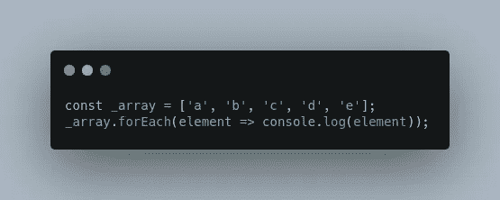
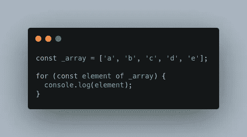

# 关于在 JavaScript 数组中进行循环的方法的说明

> 原文：<https://levelup.gitconnected.com/a-note-on-ways-to-do-looping-in-javascript-array-7aabf98fc236>

## Java Script 语言

## 这篇文章将记录我们可以用多少种方法在 JavaScript 中进行循环，利弊。

迈克·肯尼利在 [Unsplash](https://unsplash.com/s/photos/coffee?utm_source=unsplash&utm_medium=referral&utm_content=creditCopyText) 上拍摄的照片

在这个故事中，我想分享在 JavaScript 中进行循环的许多方法，以及每种方法的优缺点。

1.  顺序`for`循环
2.  Array.prototype.forEach
3.  ES6 `for-of`声明
4.  ES6 `for-in`声明
5.  奖励—组合迭代器和 For 循环

# 顺序 for 循环

循环提供了一种快速简单的方法来重复做某事。

使用顺序 for 循环的基本循环

这个循环标准将打印出字符串**向东走一步**五次。如果步长不大于四(4)，则每次循环执行时步长值都会递增。

## 优点和 CONS:

*   优点:
    -适用于所有浏览器。
    -我们可以使用`break`和`continue`流量控制语句。
*   缺点:
    ——太啰嗦。
    ——命令式。

# Array.prototype.forEach

`forEach()`方法为每个数组元素执行一次提供的函数。

在 JavaScript 中使用 forEach 方法

## 优点和 CONS:

*   优点:
    -适用于所有浏览器
    -声明性。
*   缺点:
    -我们不能使用`break`和`continue`流控制语句。

# ES6 for-of 语句

语句的[for…创建一个循环，对可迭代对象进行迭代，包括:内置字符串、数组、类数组对象、TypedArray、Map、Set、用户定义的可迭代对象。](https://developer.mozilla.org/en-US/docs/Web/JavaScript/Reference/Statements/for...of)

在 JavaScript 中使用 for … of 语句

## 优点和 CONS:

*   优点:
    -我们可以不用索引直接获取元素。
    -我们可以使用`break`和`continue`流控制语句。
*   缺点:
    -不支持网络浏览器。

# ES6 for-in 语句

语句中的[for…遍历一个对象的所有可枚举属性，包括继承的可枚举属性。](https://developer.mozilla.org/en-US/docs/Web/JavaScript/Reference/Statements/for...in)

在 javascript 中使用 for…in

你可以看到上面的`for...in`正在使用 with array。但是，这应该避免。我建议我们只对 object 使用这个，因为:

*   迭代的顺序没有保证；数组索引不能按数字顺序访问。
*   继承的属性也被枚举。

为..工作不正常

上面的代码还打印出一些不是来自`_array`变量的值。

我们只是用这个带对象和`hasOwnProperty()`的方法来限制风险，以获得实现问题。

在 JavaScript 对象中使用 for…时，不带 hasOwnProperty 和带 hasOwnProperty 是不同的

## 优点和 CONS:

*   优点:
    -支持所有浏览器
    -我们可以使用`break`和`continue`流量控制语句。
*   缺点:
    -我们需要使用`hasOwnProperty()`来避免意想不到的问题。

## 注意:中的 for…of 和 for…之间有所不同

*   for…in 语句以任意顺序迭代对象的可枚举属性。
*   for…of 语句迭代 iterable 对象定义要迭代的值。

# 奖励—组合迭代器和 For 循环

JavaScript 还为我们提供了一种叫做[迭代](https://developer.mozilla.org/en-US/docs/Web/JavaScript/Reference/Iteration_protocols)的遍历数据的方法，它有两个主要概念:

*   **迭代器**
    遍历元素的指针。
*   **iterable**
    一种数据结构，使其元素可供公众访问。

以下是创建应用迭代器的用户列表的示例。

用 JavaScript 中的迭代器创建用户列表

下面是如何在 for 循环中使用它。

在 JavaScript 中使用 for…of 循环遍历迭代器

注意:

在用 JavaScript 数组实现逻辑时，我们可以使用 JavaScript 中的一些方法，比如`[map()](https://developer.mozilla.org/en-US/docs/Web/JavaScript/Reference/Global_Objects/Array/map)`、`[filter()](https://developer.mozilla.org/en-US/docs/Web/JavaScript/Reference/Global_Objects/Array/filter)`、`[reduce()](https://developer.mozilla.org/en-US/docs/Web/JavaScript/Reference/Global_Objects/Array/Reduce)`、`[find()](https://developer.mozilla.org/en-US/docs/Web/JavaScript/Reference/Global_Objects/Array/find)`，还有更多，你可以在这里找到。

# 摘要

我希望这篇文章对你有用！可以跟着我上[中](https://medium.com/@transonhoang?source=post_page---------------------------)。我也在[推特](https://twitter.com/transonhoang)上。欢迎在下面的评论中留下任何问题。我很乐意帮忙！

# 参考

1.  Stackoverflow — [在 JavaScript](https://stackoverflow.com/questions/3010840/loop-through-an-array-in-javascript) 中循环遍历一个数组