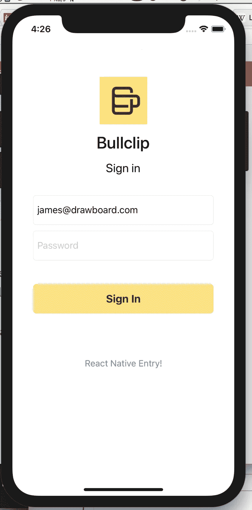
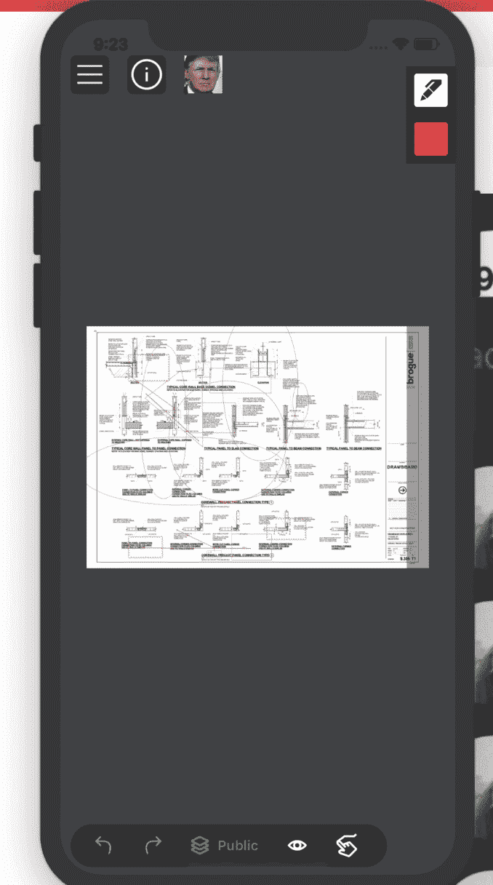

# 与 React Native 的一周对峙——或者说，我们会陷入多深？

> 原文：<https://levelup.gitconnected.com/a-one-week-stand-with-react-native-or-how-deep-do-we-plunge-cbb6ca44bb54>

## 我们团队在尝试 React Native 并将其集成到我们的工作流中的经验

我们的团队挤在一堵黑色的墙周围，墙上散落着神秘的彩色便利贴。它似乎有一些表格的性质，但它们是规定性的，而不是限制性的。一些笔记逃脱了遮蔽胶带栏的限制。人们没有实体的头的图片贴在各种各样的笔记上，表明他们对有组织的混乱的各个组成部分有某种占有。

现在，你可能已经猜到了。我们将要进行古老的仪式`stand-up`。百万(？)多年的进化让我们走到了这一步——手里拿着咖啡杯，这是不容错过的。

这是一天如何从画板开始的。几个“早上好”传来传去，我们为那天远程工作的人安排了一个住处——也许有人会把休伊举到镜头前。

休易。

我们正在建立[bull clip](https://www.drawboard.com/bullclip/)——一个设计和建筑行业的合作平台——部分技术挑战是跨多个平台开发。目前，我们在 UWP(通用视窗平台)、iOS 和网络上。当我们在不同平台上推进功能对等时，我们总是在寻找协作的方式，并帮助彼此将东西推出门外。

走路时反应自然。

在过去一年左右的时间里，我一直在偷懒地关注 RN 的进展，我唯一的真实经历是在我以前的雇主 iress 参加了半天的黑客马拉松。我们为移动设备构建了一个简单的金融市场数据应用程序，连接到 GraphQL 后端。我对我们如此迅速地启动并运行它印象深刻，但我没有进一步推动对 RN 的兴趣。

但是意识到我们有两个热情的 web 开发人员渴望开发一些很酷的东西(包括我自己)，以及一些被大量要求为 iOS 开发的功能——在纸面上，RN 看起来很诱人。

那天下午，我们走进一个房间，讨论了几个想法。20 分钟后，我有一些时间来探索 React Native 是否适合我们的目的。

剧透一下——我很兴奋。

第二个剧透警告——我没有编写原生移动代码的经验。 [Swift](https://en.wikipedia.org/wiki/Swift_(programming_language)) 的意思是快速，而 [Objective-C](https://en.wikipedia.org/wiki/Objective-C) 是公正的[大西洋](https://en.wikipedia.org/wiki/List_of_seas)——这两种编程语言我都不懂🤷。

但是如果有足够的咖啡因、网络连接和一段时间，我准备尝试一下。

我的第一个行动是在谷歌上输入:

> 将 react native 集成到现有的 iOS 应用程序中

提心吊胆地等待互联网长老理事会回应我的呼吁

我发现了这个。

我很兴奋。

由于不知道这是否可行——混淆了 RN 和本地代码——发现这是可能的是令人鼓舞的。

所以，我开始跟踪它。我到处碰壁*。*

*这该死的东西无法编译。我们有冲突的 Podfile 需求，XCode 对我大喊大叫，让我加快速度。当我试图将它导入 Swift 时，它找不到 React 它不知道我在说什么，并且拒绝花时间理解我的感受。Yaaaaarg！*

*半天的抨击浓缩成一句话:我必须使用最新版本之外的版本(`0.51.0`为我们工作)，我必须从我们不断增长的依赖列表中剔除多余的部分。*

*每当我不得不写一些本地代码时，这一点上的阻挡者就像是在黑暗中行走。幸运的是，我们的 iOS 工程师能够多次解锁我。我们设法在正确的位置添加了打开 React 本地视图的按钮。(我个人更喜欢进入一个神奇的 javascript 土地的门户，在那里詹姆斯感到舒适和安全，但无论如何。)*

*事情是这样开始的:*

**

*从指南中打开高分屏幕*

*是的，我写这篇文章的时候是凌晨 4:26。🦉*

*下一步是尝试在我们的 iOS 应用中开发一个我们已经想了一段时间的功能，但还没有能力进行优先排序。这是我们的时间线/评论源，用于与标记绘图的其他人交流。*

*如果我们要在没有疯狂难度的情况下建造它，就意味着要找到以下技术问题的解决方案:*

*   *无需调用本机代码即可处理经过身份验证的网络 IO*
*   *从我们现有的 web 应用程序的全部或部分代码重用。*
*   *本机组件和 react 视图的高性能集成*
*   *调试能力。(例如，有类似的网络开发经验)*
*   *能够在本地视图和反应视图之间轻松切换*

*剧透:目前为止，我已经确定 5 个中有 4 个是可能的。*

*一旦我进入 javascript 运行时，我的第一个目标就是看看从我们的后端获取数据并在屏幕上显示它是多么容易。*

*事实证明这非常简单！最大的问题是当我不得不编写一些 swift 代码来将无记名令牌放入 JS 运行时时，但是我们的 iOS 工程师再次介入来解除对我的封锁。*

*我们的 web 应用程序 99%是以函数式风格编写的，所以代码重用是 2%的复制粘贴，98%的 webpack/babel 配置魔术。(我想要[绝对进口](https://github.com/react-community/create-react-native-app/issues/171#issuecomment-316994039))。这个勾选了 2 号框。一个重要的警告是视图逻辑，因为我们到处都有`divs`和`spans`，在这一点上是不可共享的。目前这很好，但是如果我们超级热衷于整个“写一次”的想法，我们可能会有一些障碍要解决。想想 [react-native-web](https://github.com/necolas/react-native-web) 。*

*现在我们开始调试。是的，web 式热重装调试魔法是可行的！也是开箱即用！*

* [## jhen 0409/react-native-调试器

### react-native-debugger -基于 React Native 官方调试器的独立应用程序，包括 React Inspector /…

github.com](https://github.com/jhen0409/react-native-debugger) 

你只需轻触几个开关，就能进入游戏。太不可思议了。

灯亮着，但没人在家。让我们开始建造吧！* 

*检查完构建工具后，是时候写一个特性了。*

**

*当然，我必须确保用户知道功能是什么——所以他们当然会点击按钮。*

*找出奇怪的一个。点击它。*

*这是 react 本机视图的另一个“入口”。它打开了一个非常基本的、漏洞百出的时间线，但它是一个成功的概念证明，表明我们确实可以在 react native 中构建小功能。*

*这里最大的障碍是告诉本机运行时，我想从 javascript 中隐藏 react 本机视图。*

*我最初是使用 [NotificationCenter](https://developer.apple.com/documentation/foundation/notificationcenter) 实现的——因为没有任何干净的导航栈可供弹出和关闭。*

*但基本上，我通过以下方式向 javascript 公开了一个 swift 函数:*

* [## 本机模块反应本机

### 有时候一个 app 需要访问平台 API，React Native 还没有对应的模块。也许你想要…

facebook.github.io](https://facebook.github.io/react-native/docs/native-modules-ios.html#exporting-swift)* 

*我认为我们还没有准备好一头扎进深水区，进行一次彻底的重写。我也不认为这是明智之举。但是现在，在 react native 中构建小的、孤立的特性对我们来说非常有意义。网络平台比 iOS 或 Windows 走得更远，所以如果我们在网络前沿停下脚步，不存在落后的问题。*

*我需要解决的几件事包括:*

*   *屏幕尺寸不同。*
*   *部署*
*   *运行特性*

*但我没有预见到任何疯狂的路障。*

*如果我做了什么傻事，或者如果你对 react native 对我们有任何疑问，请在下面的评论中 HMU。*

*顺便说一句——我们在招人！来 Drawboard 和我一起工作吧！我们有饼干。*

*我们正在寻找一个 iOS 开发人员(或两个)。我们是远程友好的，我们有一大堆有趣的技术问题要解决。[https://stackoverflow.com/jobs/companies/drawboard](https://stackoverflow.com/jobs/companies/drawboard)*