# 一个无痛 Jupyter 笔记本代码审查和差异

> 原文：<https://levelup.gitconnected.com/a-painless-jupyter-notebook-code-review-and-diff-51d36d8cd20b>

## Jupyter 笔记本 Diff 入门


图片由[at ree23](https://pixabay.com/users/athree23-6195572/?utm_source=link-attribution&utm_medium=referral&utm_campaign=image&utm_content=4887880)来自 [Pixabay](https://pixabay.com/?utm_source=link-attribution&utm_medium=referral&utm_campaign=image&utm_content=4887880)

# 介绍

Jupyter Notebook 是一个很好的数据可视化工具。但它也有自己的缺陷。你以前尝试过用笔记本查找差异吗？这可能是[一场噩梦](https://towardsdatascience.com/version-control-with-jupyter-notebook-b9630bc5996e)。在网上显示我的文件是另一个问题。我对一个 [Jupyter 笔记本浏览器](https://nbviewer.jupyter.org/)和[活页夹](https://mybinder.org/)的速度感到沮丧。我也希望 GitHub 支持更多的可视化库。

在这篇文章中，你将发现如何通过使用 Jupyter 项目的 [ReviewNB](https://www.reviewnb.com/) 来解决所有这些问题。

```
**Table of Contents**
· [Introduction](#9d3b)
· [Getting started](#bb65)
· [Selecting a GitHub repo](#e459)
· [Pull Requests](#b943)
· [Adding a comment to a Jupyter Notebook cell](#393e)
· [Effortless Diffs](#6492)
· [Better workflow](#1210)
· [Fast](#ec5f)
· [Supporting libraries and widgets](#60f9)
· [Quick update](#75d9)
· [Supported Languages](#3861)
· [Security](#0a2e)
· [Conclusion](#4b9b)
· [References](#ea73)
```

# 入门指南

关于 ReviewNB 的一个伟大的事情是它对开源和教育是免费的。


免费注册。作者截图。

单击注册按钮并选择免费层。

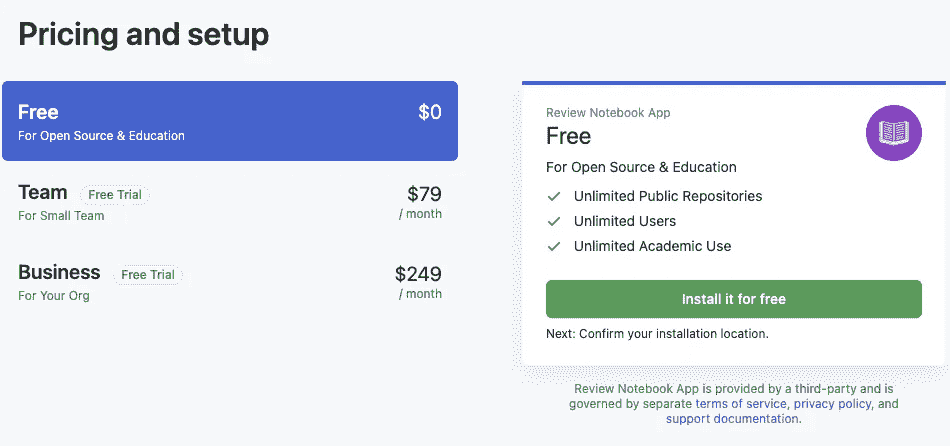

选择自由层。作者截图。

确认并单击完成订单开始安装。


GitHub 页面上的确认屏幕。作者截图。

选择“所有资料库”或“选定的资料库”,然后单击“安装”按钮。

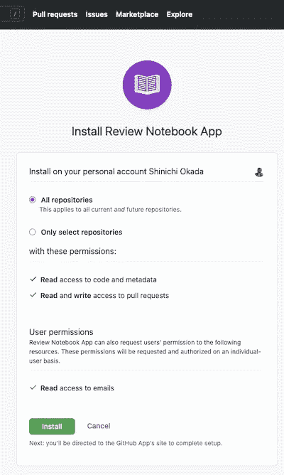

为 ReviewNB 应用程序选择所有存储库。作者截图。

目前只支持 GitHub。GitLab 和 BitBucket 支持正在路上。单击授权 ReviewNB 应用程序继续。

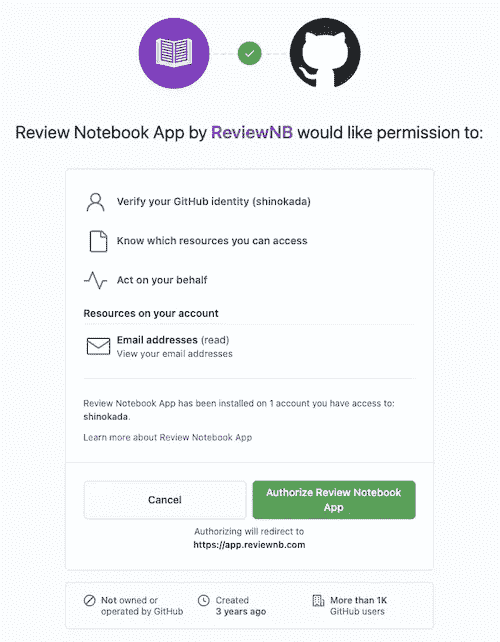

在 GitHub 上授权 ReviewNB 应用程序。作者截图。

# 选择 GitHub repo

您可以查看之前选择的存储库。如果您有许多存储库，请使用“选择存储库”字段来查找您的存储库。找到您的 Jupyter 笔记本存储库非常快。

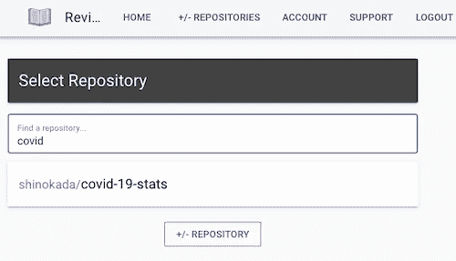

选择 Jupyter 笔记本回购。作者截图。

在这里，我选择我的新冠肺炎统计 Jupyter 笔记本存储库。

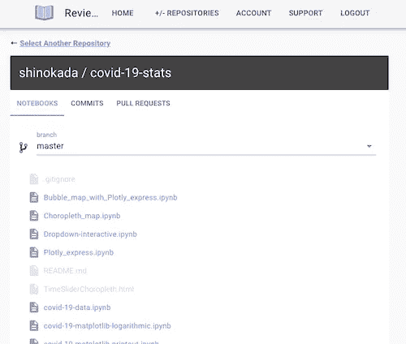

选择我的新冠肺炎统计 GitHub 回购。作者截图。

# 拉取请求

所有“拉”请求都在“拉”请求选项卡下。

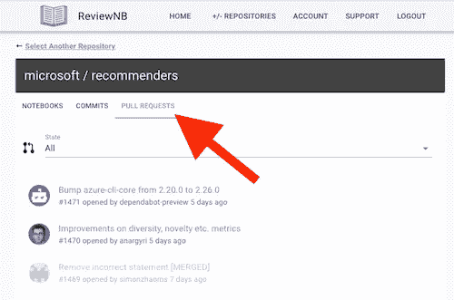

ReviewNB 在 GitHub for PRs 上发布了一个 bot 评论。这些评论使得从 GitHub PR 页面跳转到 ReviewNB PR 页面变得很容易。它会发布一条 bot 消息，GitHub 会生成一封电子邮件通知给任何在这个存储库上观看 PRs 的人。

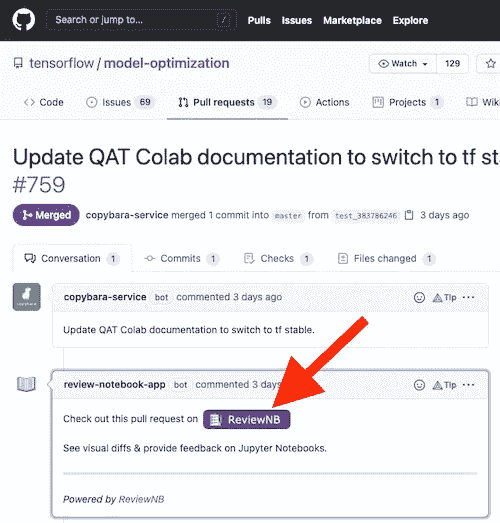

[GitHub 上一个 PR 的视图](https://github.com/tensorflow/model-optimization/pull/759#issuecomment-876957587)。作者截图。

ReviewNB 显示了拉请求的差异，如下图所示。

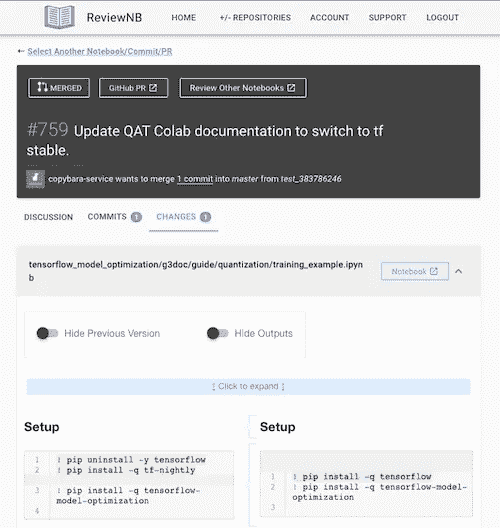

[review nb 上的公关观点。作者截图。](https://app.reviewnb.com/tensorflow/model-optimization/pull/759/)

# 向 Jupyter 笔记本单元格添加注释

单击其中一个 Jupyter 笔记本文件。它会打开所有的内容。每个单元格都可以点击添加评论。单击单元格左侧的加号，发表评论。

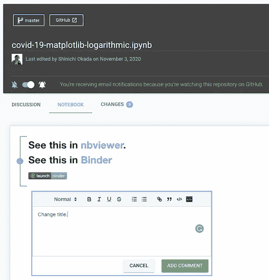

您可以给 Jupyter 笔记本单元格添加批注。作者截图。

ReviewNB 称之为 JDoc 评论。上面的评论反映在“讨论”选项卡中，您可以在其中回复或解决对话。JDoc 注释是对笔记本文件本身的注释，它们存储在 ReviewNB 数据库中。

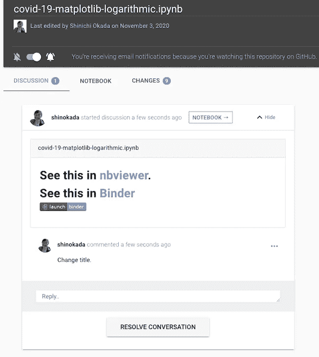

“讨论”选项卡显示您的所有评论。作者截图。

您在 pull request (PR)上写的注释存储在 GitHub 中。

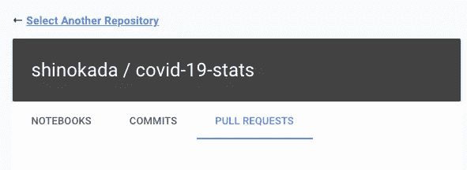

审核中的“拉动式请求”标签。作者截图。

# 轻松的差异

“更改”选项卡显示完整的提交历史记录。

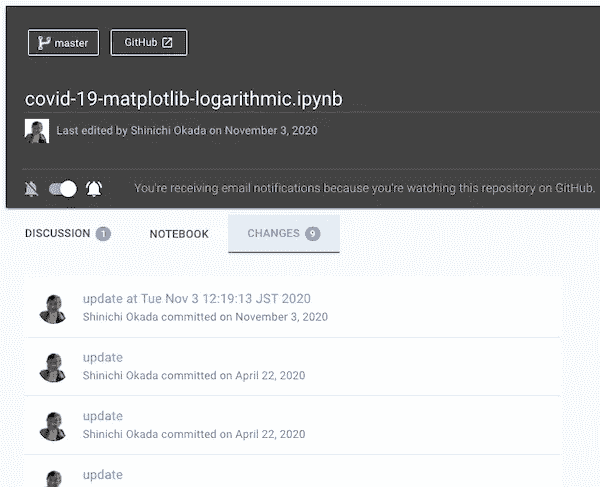

“更改”选项卡显示所有提交消息。作者截图。

当你点击其中一个提交时，它将打开**另一个**浏览器标签并显示提交细节。加载时间取决于特定提交中有多少文件。

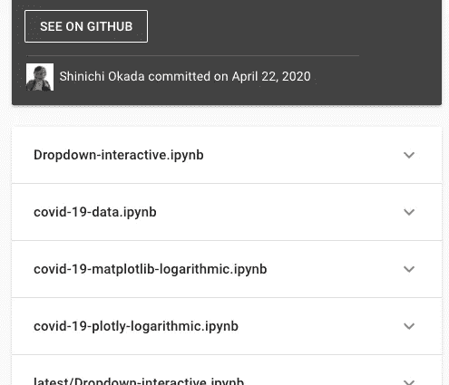

提交详细信息显示与特定提交相关的所有文件。作者截图。

当您单击其中一个箭头时，您将看到所有以前的版本和新版本。

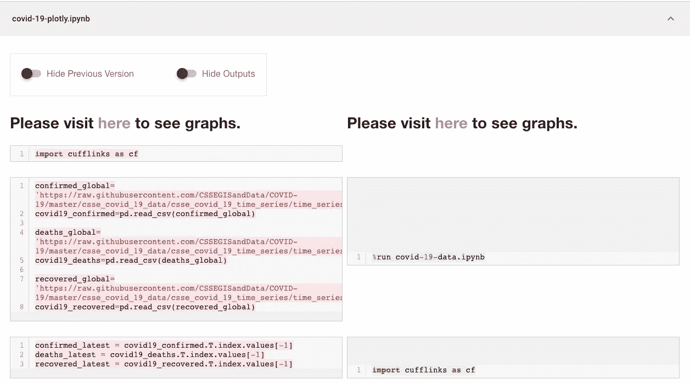

左边是以前的版本，右边是新版本。作者截图。

请注意，目前仅支持 Jupyter 笔记本差异。

# 更好的工作流程

从本地开发到 Jupyter 笔记本上的代码审查，工作流变得更加愉快和交流。PRs 在 ReviewNB 中更容易处理。

# 快的

你试过在[活页夹](https://mybinder.org/)上打开一个 ipynb 文件吗？这需要 60 多秒，因为它必须通过克隆收集 Git 内容，构建 Conda 环境，等等。

ReviewNB 以超快的速度显示您的 Jupyter 笔记本内容。分享和查看内容比任何其他平台都要容易得多。

# 支持库和小部件

截至撰写本文时，GitHub 还不支持 Plotly。

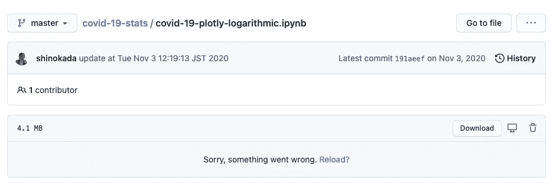

GitHub 不支持很多库。这里有一个关于 Plotly 的例子。图片由作者提供。

ReviewNB 支持所有主要的可视化库和交互式小部件。我还没见过其他支持这么多可视化库的免费在线服务。ReviewNB 使用与 Jupyter UI 相同的机制渲染笔记本。在 Jupyter 笔记本中渲染的所有库都在 ReviewNB 中工作。


# 快速更新

[nb viewer 不会更新您的更改](https://github.com/jupyter/nbviewer/issues/914)。创建提交时，ReviewNB 会立即更新存储库。您可以即时与合作者分享您的工作。

# 支持的语言

ReviewNB 支持 Jupyter 笔记本支持的所有语言，包括 Julia、Python 和 r。

# 安全性

当您登录和注销时，ReviewNB 会使用高级加密标准(AES)生成一个新的 GitHub 访问令牌，以获得额外的安全性。

根据他们的网站，[超过 100，000 台笔记本已经通过 ReviewNB 由包括谷歌、微软、亚马逊、TensorFlow 在内的 500 多家组织进行了审查](https://www.reviewnb.com/#repos)。GitHub 在 GitHub marketplace 上验证并批准了它。它不存储您的存储库内容。它使用 GitHub API 从存储库中获取数据。它仅存储单元格审阅注释。所以你的工作是安全和隐私的。

# 结论

跟踪 Jupyter 笔记本的变化可能是一件痛苦的事情，但是 [ReviewNB](https://www.reviewnb.com/) 解决了这个问题。在线评论界面是有用的和用户友好的。它也有助于代码审查。

ReviewNB 使导入 Jupyter 笔记本存储库变得容易，并使用笔记本评论创建对话主题。ReviewNB 的创建考虑到了灵活性、安全性和协作性。为您的下一个 Jupyter 笔记本项目尝试一下怎么样？

编码快乐！

**通过** [**成为**](https://blog.codewithshin.com/membership) **会员，获得媒体上所有故事的访问权限。**


[https://blog.codewithshin.com/subscribe](https://blog.codewithshin.com/subscribe)

# 参考

*   [https://www.reviewnb.com/](https://www.reviewnb.com/)
*   [https://docs.reviewnb.com/](https://docs.reviewnb.com/)