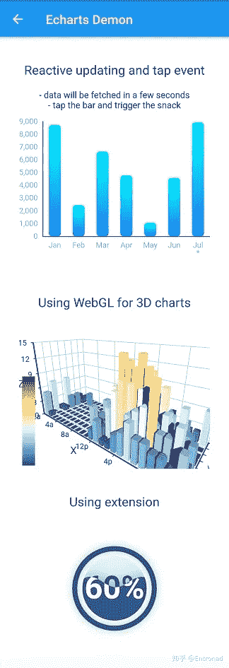
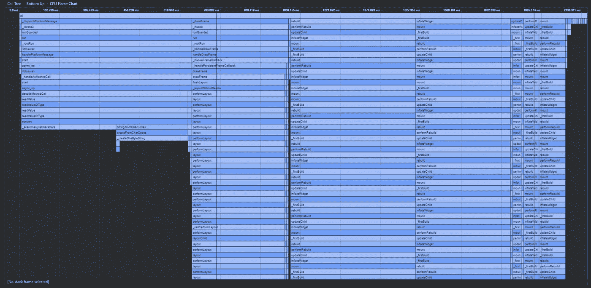
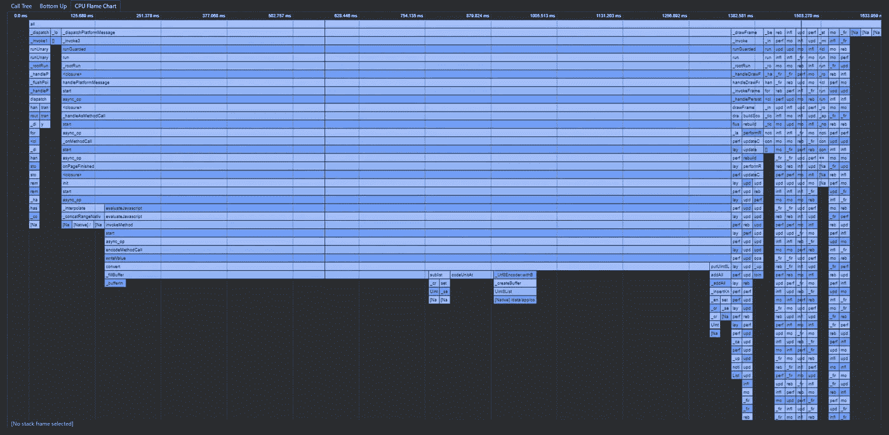
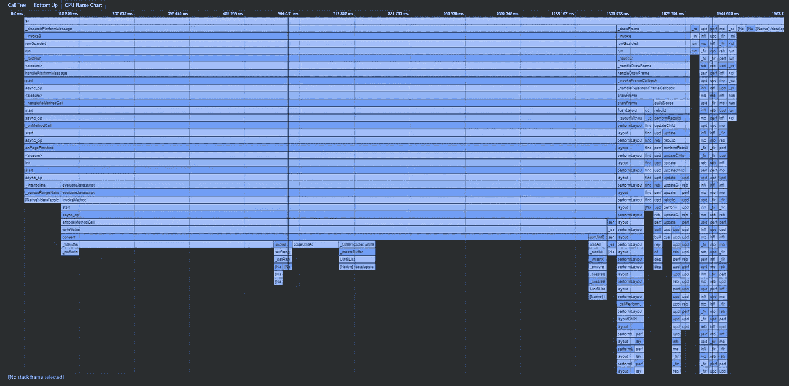
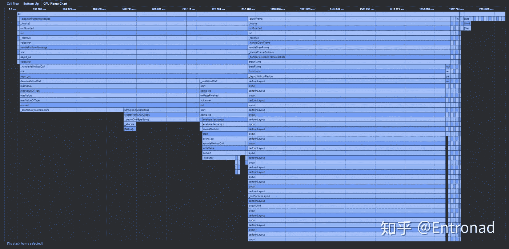

# 颤振 WebView 的性能优化

> 原文：<https://levelup.gitconnected.com/a-performance-optimization-of-flutter-webview-6afa1a5b4300>

## *本文记录了一个基于 WebView 的颤振数据可视化库的性能优化:*[*echarts _ Flutter*](https://github.com/entronad/flutter_echarts)*。*

对于任何使用 WebView 的小部件，页面加载总是性能的关键部分。 [echarts_flutter](https://github.com/entronad/flutter_echarts) ，其基础是用 WebView 渲染 [echarts](https://echarts.apache.org/en/index.html) 的本地页面，也不例外。

[echarts_flutter](https://github.com/entronad/flutter_echarts) 加载的内容可以分为以下几部分:

*   模板 HTML
*   电子艺术脚本
*   echarts 扩展脚本
*   图表的逻辑代码

模板 HTML 和图表的逻辑代码相当小，所以重点是加载 echarts 脚本和 echarts 扩展脚本。

echarts 最好的特性之一是它有许多令人敬畏的扩展，如 WebGL 3D 图表、GIS 地图等。随着数据可视化需求变得越来越复杂，这些扩展变得不亚于 echarts 本身。因此，必须允许用户方便地导入扩展。此外，为了避免麻烦的资产管理，我们希望将 HTML 和 JavaScript 都作为字符串处理，这样 WebView 将把所有资源作为 URI 加载。

会有一些问题:

*   脚本应该放在 HTML 内部还是之后注入？
*   URI 有一些字符限制，它需要一种安全的编码形式。

# 原始方法

一开始，我们认为最好把所有东西都放在 HTML 中，然后一起加载。考虑到 JavaScript 中存在大量非法的 URI 字符，我们应该在合成后将 HTML 转换为 Base64。我们不知道用户将导入什么扩展脚本，编码将由函数动态执行:

```
String _getHtml(
  String echartsScript,
  List<String> extensions,
  String extraScript,
) {
  ... // Compose and return all HTML and scripts
}
​
​
  @override
  void initState() {
    super.initState();
    // Convert to Base64 in init
    _htmlBase64 = 'data:text/html;base64,' + base64Encode(
      const Utf8Encoder().convert(_getHtml(
        echartsScript,
        widget.extensions ?? [],
        widget.extraScript ?? '',
      ))
    );
    _currentOption = widget.option;
  }
​
​
  @override
  Widget build(BuildContext context) {
    return WebView(
      // Load all of them
      initialUrl: _htmlBase64,
      ...
    );
  }
```

# 特性试验

让我们对羽毛分析进行一个简单的性能测试。测试用例有三个图表，包括一个 WebGL 3D 图表和一个液体动画图表:



使用 Flutter Dev 工具，我们可以得到 CPU 时间占用的火焰图:



# 最佳化

电子海图及其扩展图的容量很大。因此，在运行时编写和转换字符串将花费大量时间。然而，这些都是获得合法 URI 字符串的必要步骤，那么如何解决这个问题呢？

抛弃“什么都一起加载”的想法，通过`evaluateJavascript`注入动态部分，只把静态部分放在 HTML 里，怎么样？这可以节省一些转换工作。

为了确定可行性，我们先做一个实验:只把 HTML 中的所有脚本都移出来，注入`evaluateJavascript`，检查性能:

```
@override
  void initState() {
    super.initState();
    _htmlBase64 = 'data:text/html;base64,' + base64Encode(
      const Utf8Encoder().convert(_getHtml(
        // remove all scripts form the convert function
        // echartsScript,
        // widget.extensions ?? [],
        // widget.extraScript ?? '',
      ))
    );
    _currentOption = widget.option;
  }

  void init() async {
    final extensionsStr = this.widget.extensions.length > 0
    ? this.widget.extensions.reduce(
        (value, element) => (value ?? '') + '\n' + (element ?? '')
      )
    : '';
    await _controller?.evaluateJavascript('''
      // inject after the page is loaded
      $echartsScript
      $extensionsStr
      const chart = echarts.init(document.getElementById('chart'), null);
      ${this.widget.extraScript}
      chart.setOption($_currentOption, true);
    ''');
  }
```

结果是:



我们可以看到加载 HTML 的时间减少了，而包含脚本注入的`onPageFinished`的时间增加了。总时间减少了。

所以看起来转换大字符串是相当耗费成本的。用`evaluateJavascript`代替才是正道。

因此，我们然后删除所有的动态转换部分，并加载模板 HTML 作为一个常量字符串。由于 HTML 现在是静态的和简短的，我们可以手动转义非法字符并直接输入 UTF-8 字符串，这不需要 dart:convert 库，看起来更简单:

```
const htmlUtf8 = 'data:text/html;UTF-8,<!DOCTYPE html><html><head><meta charset="utf-8"><style type="text/css">body,html,%23chart{height: 100%;width: 100%;margin: 0px;}div {-webkit-tap-highlight-color:rgba(255,255,255,0);}</style></head><body><div id="chart" /></body></html>';
​
​
  @override
  void initState() {
    super.initState();
    _currentOption = widget.option;
  }

  @override
  Widget build(BuildContext context) {
    return WebView(
      initialUrl: htmlUtf8,
      ...
    );
  }
```

测试结果是:



我们可以看到时间进一步减少，尤其是在装载方面。

因此，与原始版本相比，性能提高了很多。

Echarts 脚本也是静态的，如果我们事先转换它并将其放入 HTML:

```
const echartsHtmlBase64 = '...';
​

  @override
  Widget build(BuildContext context) {
    return WebView(
      initialUrl: echartsHtmlBase64,
      ...
    );
  }
​
```

结果是:



反之，则需要更多的时间。

所以我们可以看到“把脚本放在 HTML 中”并不一定比“通过`evaluateJavascript`注入”更好，甚至因为一些编码原因会花费更多的时间。

# 结论

综上，最终的优化方案是:在 UTF-8 URI 字符串中加载模板 HTML，用`evaluateJavascript`注入所有脚本和逻辑代码。

*注意:webview_flutter 有一个问题* `*onPageFinished*` *在 IOS 中无法工作，所以上述优化暂时不适用于发布版本。你可以在* [*这个提交*](https://github.com/entronad/flutter_echarts/tree/db0a452b5f6652d2b9070aa0daeae995da13cb3e) *中看到它的源代码。*