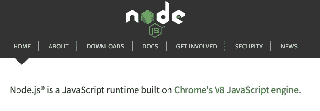
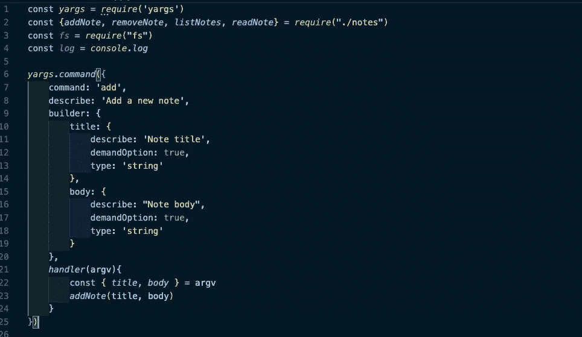

# 对节点、CLI 应用程序和 Yargs 的海盗式介绍！

> 原文：<https://levelup.gitconnected.com/a-pirate-y-intro-to-node-cli-apps-and-yargs-4af9410f034d>

## 真相会大白的！


这是一个海盗式的博客帖子，你们这些肮脏的渣滓。

有很多方法可以度过一场病毒灾难:冷静思考，自愿为邻居买杂货，[献血帮助爆发的病人](https://www.redcross.org/)，开发一个命令行 Node.js 应用程序…

等等，其中一个和其他的不一样。

但是没关系！

我最近开始学习 [Node.js](https://nodejs.org/en/) ，JavaScript 的后端语言。JavaScript 最初是作为一种与浏览器交互的方式开始的，用来操作“DOM”(用户在浏览器窗口中看到的所有东西)，而不必刷新和创建有趣的交互页面。它是“互联网三大语言”之一，其他两个是 HTML 和 CSS，JavaScript 可以与这两种语言进行交互。

问题是直到最近，JS 还做不了别的事情。这是一种半语言，在互联网上导致了很多仇恨，也许这是理所当然的([见上下文](https://www.destroyallsoftware.com/talks/wat))。

但是，我们一直在使用互联网，JavaScript 不仅允许我们创建动态网站，还允许我们以编程方式生成 HTML 元素，而不必重新键入大量代码，并支持与 Python、Ruby 和 Java 等其他后端编程语言进行通信。

这使得杰夫·阿特伍德，一个非常受欢迎的科技网站 Stack Overflow 的创始人之一，在 2007 年引用了一句话，后来被认为是阿特伍德定律。


事实上，早在几年前，OpenJS 基金会就已经给出了解决问题的答案，即通过编写他们自己的代码: [Node.js.](https://nodejs.org/en/)



谁颂

在某种程度上，这很有意义。由于 JavaScript 经常用于从“后端”或“服务器”获取数据，并且 JavaScript 和其他应用程序之间的通信经常使用 JSON 来完成，JSON 是“JavaScript Object Notation”的缩写，对于 JavaScript 来说，最简单、错误最少、最一致的后端-前端通信形式难道不是……更多的 JavaScript 吗？

但是 WHT，如果我告诉你这一切都是谎言。


看看那马力！

如果你看了上面 Node 的介绍图片，你会看到它实现了 [Google/Chrome 的 V8“引擎”](https://v8.dev/)。这实际上是使用任何 Chrome 或[Chrome 项目浏览器](https://www.chromium.org/)时使用的相同实现！所以当你打开 Chrome 时，Node 有点像交互式开发工具！在 WASM(WebAssembly)上还有一个非常酷的部分，非常令人兴奋，让我们可以更快地在网上进行“昂贵的计算”,我建议你去看看，但那是另一篇文章的内容了。

但是你看！是用 C++写的！

是的，这是真的，朋友们。Node.js 只是 JavaScript 告诉[老派编程语言 C++](http://cplusplus.com) ，通过编写的 JavaScript 和 V8 引擎，做一些计算，然后插值返回给我们。我们在作弊。一切都是谎言。没有圣诞老人。特朗普喷雾晒黑，严重。

也就是说，让我们使用它。


有一些要求。

这是我的 Node app 的顶部！类似于我们这些使用过 [React](https://reactjs.org/) 的人，我们导入他人有用代码的“模块”的方式是使用节点语法:

```
const someModule = require('someModule')
```

这与 React 语法非常相似:

```
import React from 'react'
```

事实上，两者都使用相同的语法将这些模块添加到他们的应用程序和“package.json”文件中，即:

```
npm install some-module
```

也就是“节点包管理器”或 NPM。

总之，这里我们正在安装[【yargs】](https://www.npmjs.com/package/yargs)，这是一个盗版的 NPM 包，允许 NodeJs 的命令行参数。

```
const *fs* = *require*("fs")const *chalk* = *require*('chalk')const{ *log* }= *console*const *addNote* =(*title*, *body*)=>{const *notes* = *loadNotes*()if(!*notes.find*(*note* => *note.title* ===title)){*notes.push*({title,body})*saveNotes*(notes)*console.log*(*chalk.green.inverse*("New Note "+title+" added."))}else{*console.log*(*chalk.red.inverse*(`*Sorry there is already a note called* ${title}*, please try a different title.*`))}}
```

这里我有一个看起来很普通的 JavaScript 函数，为带有一些节点功能的命令行“Notes App”创建一个“Notes”。FS 是一个节点模块，允许我与我的计算机的文件系统进行交互(这是 JS 在 Node 之前无法做到的！)而 Chalk 是一个很傻的模块，可以让你在控制台中给东西上色，这对错误消息和样式很有帮助。

我们有一些对其他函数的调用，我们不用担心，还有一些“console.log ”(这也是一个 C++函数！一切都是谎言！)但最大的问题是，我们将从哪里获得添加注释的参数？

在传统的 JS 中，这可能会连接到浏览器中的一个表单，但这是一个命令行应用程序，所以伙计们，我们将不得不擦洗甲板并获得一些 YARGS！



雅格，我的鹦鹉在哪里？

正如你从上图中看到的，我们导入了一个名为“Yargs”的模块，使用了我们见过的相同模式，我们甚至从我们自己编写的另一个文件中导入了使用[ES6 Object destructing](https://hacks.mozilla.org/2015/05/es6-in-depth-destructuring/)的函数！与 React 非常相似，Node 如此强大的一个原因是它允许我们编写自己的模块，这些模块可以与他人的代码配对，以获得最大的简洁性和可重用性。

我们也在使用一些东西。名为“command ”,它允许我们为名为“body”和“title”的变量描述一个 JavaScript 对象，然后由名为“handler”的“对象方法”执行，这就像 Ruby/Python 中的类方法——除此之外，对象方法是 JS 中的类方法，因为 JS 中的所有东西都是对象，所有这一切都利用了名为“原型”的东西，是“语法糖”,没有什么是真实的，政府给你的水添加了化学物质，好吧，回到它——

反正可以看到我们的标题和正文可能和前面看的函数一样有辨识度！

那么这在执行中看起来如何呢？


达特鲁夫

让我们来分解一下:

1.  我有“Node”命令，后跟允许我运行该文件的文件名，就像在他们的一个文件后面键入“python”或“ruby”。
2.  我有命令“添加”,它对应于前面图片中“Yargs.command”的“command”键。
3.  最后，我有两个参数，分别由“flags”或“—”语法、标题和正文表示，它们表示我希望将什么传递到我定义的 Yargs 命令的“handler”中。

我们看到消息是从我们的函数返回的！

```
*console.log*(*chalk.green.inverse*("New Note "+title+" added."))
```

我们可以看到，我们的标题参数已经通过我们的日志传递和保存。

我们心里清楚，C++为我们做了肮脏的工作…

无论如何，这是一篇关于 Node 的更深入的文章，但关于 Yargs 的深度比我想象的要低一些，但公平地说，Yargs 和 Node 本身是如此深入的主题，有很多值得探索的地方。

在这个充斥着错误信息和恐惧的时代，有许多真相有待发现，缺少了大卫·杜楚尼，我们就是我们自己 X 档案的代理人。

真相就在那里，真相就是德国牧羊犬斯特拉。


斯特拉。

她的耳朵和鼻子一样长，她的小粗腿是为跳跃和跳跃而生的，可以舔和拥抱人类的脸。

你在外面，斯特拉。

再见了，

网络信息中心(Network Information Center)ˌ网路界面卡(Network Interface Card)ˌ全国工业理事会(National Industrial Council)ˌ航行情报中心(Navigation Information Center)