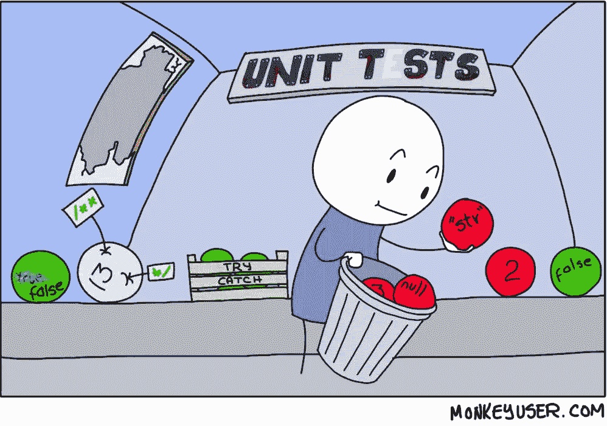

# Powershell 的穷人单元测试框架

> 原文：<https://levelup.gitconnected.com/a-poor-mans-unit-testing-framework-for-powershell-c14e146b7578>

我为一个政府机构工作，该机构不允许安装第三方软件，这意味着我不能使用 percept 进行单元测试。

我讨厌在无法快速知道代码是否还在工作的情况下修改代码，所以我制作了自己的 Powershell 单元测试框架。

单元测试框架做的最好的事情，是让你为你运行所有的单元测试，所以你不必手动运行每一个单元测试。

这正是我的框架所做的。你像平常一样写你的测试，按 F5，它们都会告诉你哪些测试失败了/通过了。

只会执行以`Test_`开头的函数名。

这允许您拥有可以在测试函数中重用的帮助函数。

你也可以从我的 [GitHub](https://github.com/DavidKlempfner/PoorMansUnitTestingFramework) 页面下载下面的代码。

# 该模块

这个模块需要被导入到您的每个测试文件中，并且将运行这个模块被导入到的文件中的每个函数:

# 示例:

下面是一个例子，说明如何使用它进行一些单元测试，用于[提取 netsh DHCP 选项 ID 值](https://github.com/backwardsDave1/ExtractOptionIdValuesFromNetsh/blob/master/ExtractOptionIdValuesFromNetsh.ps1):