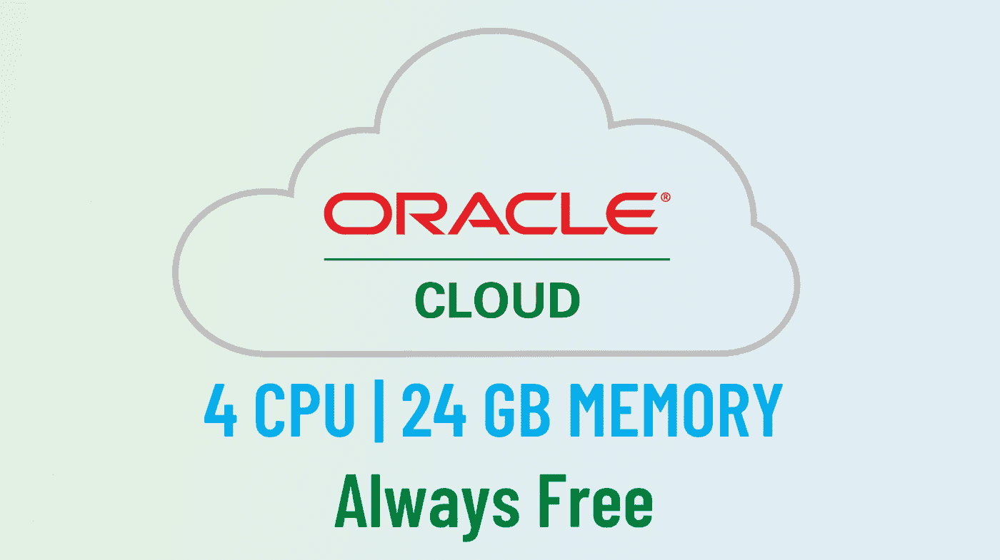
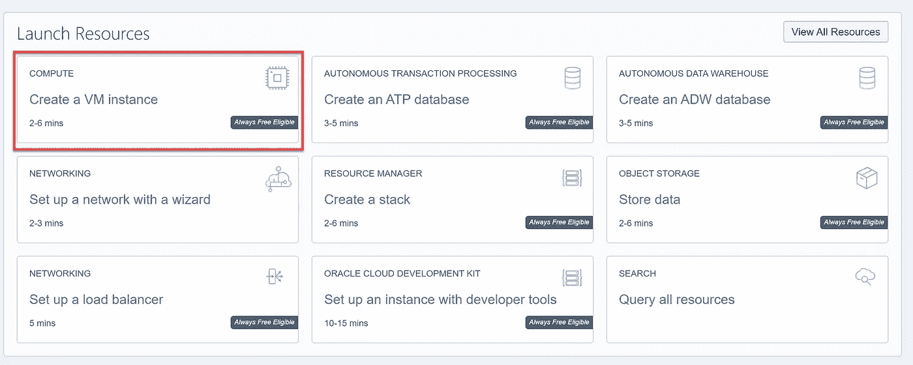
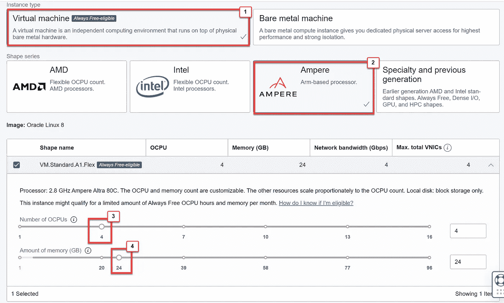
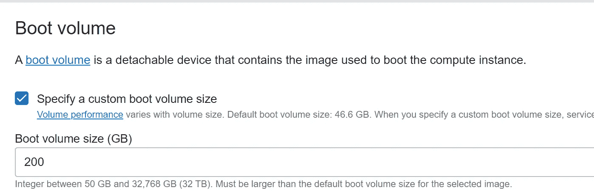
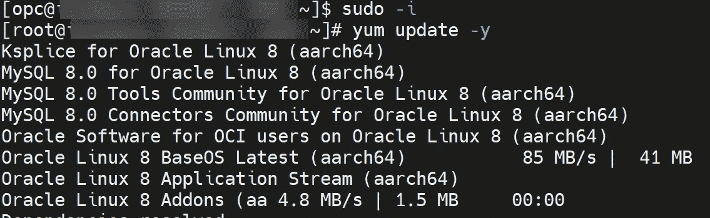

# 来自 Oracle Cloud 的强大服务器—永远免费

> 原文：<https://levelup.gitconnected.com/a-powerful-server-from-oracle-cloud-always-free-cbc73d9fbfee>

## 4 个 CPUs | 24 GB 内存🚀

来自 https://de.cleanpng.com/png-b9ab6d/的 img 由作者修改

如果您正在寻找一台非常强大的免费服务器，Oracle Cloud 将是您的正确选择！

在过去的几年里，我尝试了亚马逊 Web 服务、微软 Azure、谷歌云平台等几个云计算产品。尽管他们提供免费选项，但他们始终免费的服务也有一些限制:低规格虚拟机和更高层的单元只能在有限的时间内免费使用，或者直到您的信用用完。还有，后续成本高。

最近有机会试用甲骨文云，发现他们的“永远免费”VPS 非常强大，4 个 CPU，24 GB 内存。此外，它不会花费你任何东西！

## 你能用它做什么？

*   主机 WordPress 网站
*   NodeJS/ Express 应用
*   烧瓶应用
*   运行 Docker 应用程序
*   主持你自己的 Jupyter (24/7)
*   运行交易机器人，让它为你赚钱
*   还有更多…

# 设置 Oracle 云服务器

## 第一步:创建账户

只需前往 https://signup.cloud.oracle.com/[完成注册手续。虽然你需要输入你的信用卡，但这只是为了验证，使用免费服务时你不需要支付任何费用。](https://signup.cloud.oracle.com/)

## 步骤 2:创建虚拟机

**图一。在 Oracle 云上创建一个虚拟机实例**

登录你的账户后，点击“创建一个虚拟机实例”,如图 1 所示。根据 Oracle [1]的说法，对于使用虚拟机的虚拟机实例，所有租赁每月免费获得前 3，000 OCPU 小时和 18，000 GB 小时。标准. A1.Flex [外形](https://docs.oracle.com/en-us/iaas/Content/Compute/References/computeshapes.htm#Compute_Shapes)，其中有一个 [Arm 处理器](https://docs.oracle.com/en-us/iaas/Content/Compute/References/arm.htm#arm)。对于始终免费的租约，这相当于 **4 个 OCPUs 和 24 GB** 内存。因此，要获得大多数“永远免费”的服务，您可以遵循以下形状设置:

**图二。在 Oracle 云上创建一个虚拟机实例**

对于 SSH 选项，您可以使用 PuTTy 自己创建或者使用 Oracle 自动生成的选项，不要忘记保存 SSH 密钥，因为您需要它来远程访问您的服务器。

对于启动卷，您可以输入 200 GB，因为这是您可以用作始终可用层的最大值:

**图 3。在 Oracle 云上创建一个虚拟机实例(指定启动卷大小)**

## 步骤 3:连接到虚拟机

您可以通过 SSH 连接到您的虚拟机，使用您在上一步中使用用户“opc”生成的私钥。您可以在 Windows 中使用 PuTTy/ MobaXTerm/ OpenSSH，或者在 Mac/Linux 中使用终端通过 SSH 连接到服务器。进入后，您可以尝试`sudo -i; yum update -y;`来更新您机器上的所有软件。

## 就是这样！现在，服务器是你的了！

## 参考:

[1]甲骨文云基础设施文档([https://docs . Oracle . com/en-us/iaas/Content/FreeTier/FreeTier _ topic-Always _ Free _ resources . htm](https://docs.oracle.com/en-us/iaas/Content/FreeTier/freetier_topic-Always_Free_Resources.htm))

我希望你喜欢它，并发现它对你的日常工作或项目有用。如果你有任何问题，请随时联系我。

关于我&查看我所有的博客内容:[链接](https://joets.medium.com/about-me-table-of-content-bc775e4f9dde)

**平安健康！**
**感谢阅读。👋😄**