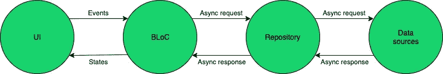

# 一种在 Flutter 中使用 Hive 缓存远程数据的实用方法

> 原文：<https://levelup.gitconnected.com/a-practical-approach-to-caching-remote-data-using-hive-in-flutter-b2bcff5bfdef>

在开发应用程序时，与远程数据源进行通信是很常见的。然而，为了能够显示内容而依赖于用户不断地具有网络连接有时会产生糟糕的用户体验。因此，将应用程序存储数据放在本地通常是可取的，这样它就可以保持响应，最重要的是…让用户满意！

[https://images.app.goo.gl/14gqK5Y3J5BjYRdWA](https://images.app.goo.gl/14gqK5Y3J5BjYRdWA)

为了应对这一挑战，我们将使用存储库模式，这意味着我们的 Flutter 应用程序的结构如下:

https://www.netguru.com/codestories/flutter-bloc

用于 Flutter 的 [BLoC](https://pub.dev/packages/bloc) 包将是我们的状态管理方法，并将负责包含我们的业务逻辑(我在这里写了另一篇文章，在这里我将更详细地研究 BLoC 模式)，我们将使用 [Hive](https://pub.dev/packages/hive) 作为我们的本地数据持久化方法。值得注意的是，对于需要更复杂关系表示的数据，探索基于 SQLite 的方法是值得的。

当创建干净的、可测试的和可维护的应用程序时，分离我们的关注点是很重要的。

因此，BLoC 将能够使用 BLoC 包中提供的 *RepositoryProvider* 方法，通过依赖注入(DI)与存储库进行通信。

我们在这里的目标是创建一个存储库，它将负责与*用户*对象进行交互，这些对象将公开添加和检索*用户*的功能。我们将要使用的*用户*模型非常基本，因为它将只包含一个 id 和一个名称，并且将被适当地标记，以便能够使用 Hive 进行存储。

我们将通过创建一个通用的存储库接口来开始这个解决方案，该接口定义了我们的存储库将拥有的核心功能，并且可以由任何类型为 *T 的对象来实现。*将它定义为一个接口允许它在测试应用程序时很容易被模仿。

为了简化未来对象的本地数据缓存的创建，我们还将创建一个存储库接口的 Hive 实现来处理这些核心操作。

这通过与蜂箱*箱*相互作用来工作，并且每次都有一个适当的检查来确保在试图执行任何操作之前*箱*是打开的。因此，在构建 *HiveRepository* 时，我们为其提供一个类型为 *T* 的打开的*盒子*是很重要的，因为这将用于数据交互。

我们现在将构建一个用于与远程数据源交互的实现。这只是一个模拟 API 响应的模拟实现，将通过在执行操作之前添加人工延迟来表示网络延迟。

最后，所有这些都将通过创建一个协调本地和远程存储库的存储库来整合在一起，这样它就只暴露了一个单一的实现供 BLoC 使用。这种方法受到了[资源库](https://pub.dev/packages/repository)包的启发。

我们的存储库将通过接受多个 *IRepository <用户>* 的实例来工作，每个实例对应一个远程和本地实现。与此同时，我们将构建一个有用的 *hasConnection* 函数，该函数将在存储库构建时定义。这个函数的目的是让它返回一个布尔值，该值将使用某种连接服务来解析。这将允许存储库能够轻松地检查它是否应该尝试向远程数据源发出请求。

对于用户请求的每个操作，它将决定如何处理请求并相应地采取行动。例如，当请求一个本地不可用的用户并且有一个 internet 连接时，将从远程源获取该用户，然后在本地存储，最后从存储库返回。这意味着任何未来的请求都可以使用本地存储的值来解决！然而，需要注意的是，在某些用例中，我们可能希望用远程数据更新本地值，这意味着需要一些额外的逻辑来处理这个问题。

错误处理是这里要考虑的另一个重要因素，尤其是在与远程数据源交互时。在这些情况下，最好抛出带有可选有效负载的自定义异常，以便块相应地处理它。

我们将通过创建一个 *NoConnectionException* 来实现这样一个例子，如果用户没有网络连接，这个异常将被抛出。例如，如果一个*用户*被请求，而该用户没有本地存储，那么这个异常将被抛出。

如前所述，我们将创建一个应用范围的 *RepositoryProvider* ，它将包含我们的可注入存储库，并通过一个接口将它们暴露给业务逻辑。

这里我们将遵循与前面相似的模式，将我们的*用户存储库*注册为【T43 存储库<用户> ，因为这种方法允许在测试业务逻辑时用模拟实现简单地替换它。

然后将使用远程和本地存储库的实现来构造*用户存储库*，确保我们在将它传递给本地存储库实现之前打开并初始化我们的 Hive *Box* 。

然后对于 *hasConnection* 函数，我们将使用一个可模仿的*NetworkConnectivityService*，它将能够确定用户是否连接到网络。目前，这将始终返回 True。

现在是时候让我们的业务逻辑能够与我们的新存储库一起工作了！

该块将产生的状态将包含从存储库中检索的*用户*，一个通知 UI 操作正在进行的*正在提取的*布尔值，以及最后一个 *hasNetworkError* 布尔值，该布尔值将在上述 *NoConnectionException* 的情况下使用。

我们的块将由一个*I repository<User>*的实现来构造，它将与该实现进行任何数据操作的交互。它将被设置为响应一个*fetch textuser*事件，该事件将触发对存储库的请求，然后返回它已经检索到的所有*用户*。

当处理这个请求时，它将首先设置 *isFetching* 标志，这样 UI 可以显示某种加载状态。然后，它将尝试从存储库中检索下一个*用户*，但将在 *try…catch* 内执行此操作，如果捕获到网络异常，将设置 *hasNetworkError* 标志。然而，如果已经成功地从存储库中检索到了*用户*，那么它将被添加到状态中。

最后，我们将构建一个用户界面(UI)来与这个模块进行交互。这个 UI 将是一个单一的屏幕，其中包含一个按钮，用于通过 BLoC 从存储库中一次一个地获取*用户*。然后，在检索到新的*用户*后，按钮下方的列表将填充每个用户的姓名。

UI 将负责使用 *RepositoryProvider* 请求实现*I repository<User>，并在构造时将其传递给 BLoC。然后它将有一个 *BLoCBuilder* ，它将响应 BLoC 发出的状态，处理获取、错误、空和填充状态！(可以在[这里](https://medium.com/swlh/reducing-boilerplate-in-flutter-uis-89e52838ba04)找到简化 ui 创建的方法)*

正如预期的那样，在应用程序的第一次运行时，我们发出的每个请求都需要调用网络，每次都会有短暂的延迟。我们将首先从存储库中加载 3 个*用户*，并在屏幕上显示他们来演示这一点。

然而，如果我们在加载了最初的 3 个*用户*之后重新加载应用程序，我们获取*用户*的前 3 个请求将会返回得更快！

这是因为*用户存储库*现在改为从本地存储库读取，根本不需要进行网络调用！

…就是这样！我们现在有了一个存储库实现，它可以在多个数据源之间进行协调，并将远程数据缓存在本地！

感谢阅读这篇文章。

包含这个例子的库可以在:[https://github.com/luketg8/Repository_Example](https://github.com/luketg8/Repository_Example)找到

[https://www.linkedin.com/in/luketg8/](https://www.linkedin.com/in/luketg8/)