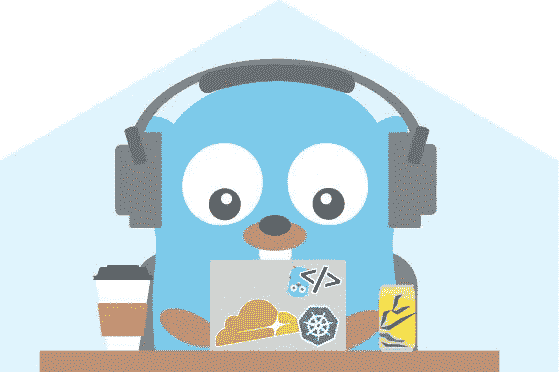
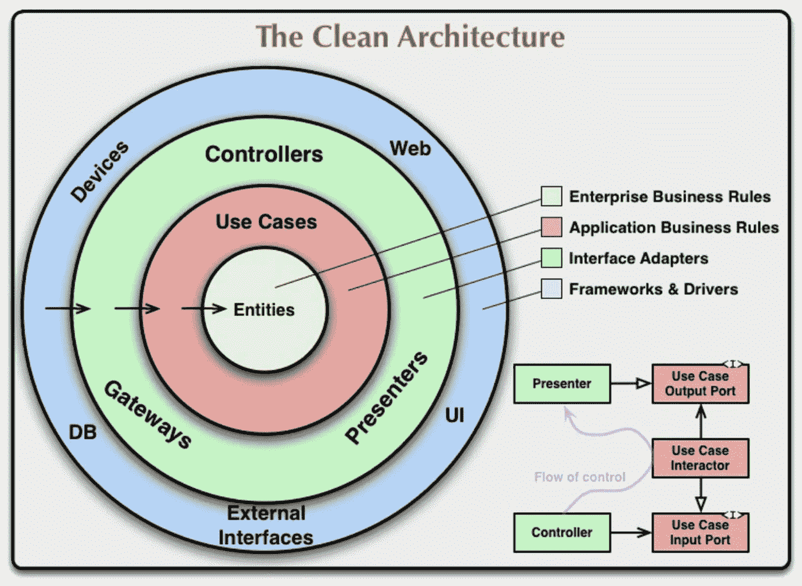

# 一种简单实用的构造 Golang 应用程序的方法

> 原文：<https://levelup.gitconnected.com/a-practical-approach-to-structuring-go-applications-7f77d7f9c189>



2022 更新。在写这篇更新的时候，距离我发表这篇文章已经一年多了。在这篇文章的最后，我保证第二部分，我必须承认，可能永远不会来了，原因有几个。我不再使用这种结构(我仍然认为这篇文章给了人们一些帮助，但希望在某一点上更新它。我建议你去看看这个[回购](https://github.com/bnkamalesh/goapp)。其次，关于集成测试，我刚刚发布了一篇关于它的长篇文章，你可以在这里找到。

*这个帖子也可以在我自己的网站* [*这里*](https://mortenvistisen.com/posts/practical-approach-to-structuring-go-apps) *。*

围棋是一门神奇的语言。它很简单，容易推理，并且为您提供了许多现成的工具。然而，当我开始使用 Go 时，我努力想出如何以一种不使用“企业化”方法的方式来构建我的应用程序。这是我对构建 Golang 应用程序的看法，这些应用程序开始时很简单，但具有增长的灵活性，这也是我在开始使用 Go 时想要的。

## 放弃

本文基于以下人物(链接到他们的推特):[马特·瑞尔、](https://twitter.com/matryer) [凯特·齐恩](https://twitter.com/kasiazien)、[乔恩·卡尔霍恩](https://twitter.com/joncalhoun)和[罗伯特·马丁](https://twitter.com/unclebobmartin)。

上面提到的所有人都有自己令人惊叹的文章和教程，你绝对应该去看看。

如果您只想查看本文项目的代码，请查看 [Github 库](https://github.com/MBvisti/weight-tracker-article)。

# 项目和工具

学习一门新语言总是令人沮丧，而且不得不一遍又一遍地创建相同的待办事项应用程序。因此，我们将制作一个应用程序，允许人们创建一个帐户，在那里他们可以跟踪他们的体重并计算他们的营养需求(受锁定期间体重增加的启发)。您可以随意添加您认为合适的功能到这个应用程序中。

现在，我假设您对 Golang 和编程有一定的了解，因为这是一个如何构建 Go 应用程序的实际例子。我们将使用以下内容:

*   Gin Web 框架
*   Go 版本 1.15 以上
*   一种数据库系统
*   golang-迁移
*   你最喜欢的 IDE(可能是 Goland 或者 VS code——我强烈推荐 Goland，它太棒了)

# 健壮且可扩展的结构的元素

花一些时间在软件开发上，你会很快了解到程序有时是脆弱的，有时是僵化的。因此，我在我的应用程序结构中寻找这三样东西:

*   易测性
*   可读性
*   适应性

以一种使编写测试变得容易的方式编写程序会极大地影响开发人员的生产力。除了可读性，它不仅使您更容易维护和改进旧代码。您还可以让新人更容易地添加到项目中，因为他们在更改或添加代码时会感到有些安全，因为您已经有了测试。最后，具有适应性意味着您的项目可以适应不断变化的需求和复杂性。

尽可能简单地开始，这样做的好处是你可以快速地重复新的想法，从一开始就解决实际的问题。大多数开发人员在开始新项目时不需要考虑领域驱动的开发，在大多数情况下这可能是浪费时间(当然，除非你在大公司工作，但是你为什么要阅读一篇面向初级 Go 开发人员的文章)。

本教程分为三个部分:

*   应用程序结构
*   用户服务实现
*   重量服务的 TDD 实现

这应该有望给你一个总体结构的概述，一个如何添加服务的逐步指南，以及最后用 TDD 编写测试和开发是多么容易。

# 应用程序结构

好了，说够了，我们走吧。在您想要存储项目的地方创建一个名为`weight-tracker`的新文件夹，并在文件夹中运行以下命令:

```
go mod init weight-tracker
```

该应用程序将遵循如下所示的结构:

```
weight-tracker
- cmd
  - server
    main.go
- pkg
  - api
    user.go
    weight.go
  - app
    server.go
    handlers.go
    routes.go
  - repository
    storage.go
```

继续在您指定的文件夹中创建上面的结构。

大多数 go 项目似乎都遵循一个惯例，即拥有一个`cmd`和一个`pkg`目录。`cmd`将是程序的入口点，让你可以灵活地以多种方式与程序互动。`pkg`目录将包含所有其他内容:路线、数据库交互、服务等。

我们将使用四个包:

*   主要的
*   美国石油学会(American Petroleum Institute)
*   应用
*   仓库

如果你以前做过 golang 编程，那么这个包应该是不言自明的。我们所有的服务，即`user`和`weight`服务，都将和一个`definitions`文件一起放入`api`包中，该文件将包含我们所有的结构(我们将在后面创建)。在`app`包中，我们将拥有`server`、`handlers`和`routes.`最后，我们拥有`repository`，它将包含我们所有与数据库操作相关的代码。

打开`main.go`并添加以下内容:

你现在应该有很多错误显示在你的 IDE 中，我们马上会修复这些错误。但首先，让我解释一下这里发生了什么。在我们的`func main()`中，我们调用一个名为`run`的方法，该方法返回一个错误(如果没有错误，则返回零)。如果`run`返回一个错误，我们的程序退出并给出一个错误信息。以这种方式设置我们的`main`函数允许我们测试它，从而遵循健壮的服务结构的元素，可测试性。这种设置主函数的方式来自 Mat Ryer，他在他的[博客文章](https://pace.dev/blog/2020/02/12/why-you-shouldnt-use-func-main-in-golang-by-mat-ryer.html)中谈到了更多。

接下来我们需要讨论的两个主题是**清洁架构**和**依赖注入**。你可能听说过清洁建筑的另一个名字，因为大约在同一时间有一些人写了它。我的大部分灵感来自于[罗伯特·c·马丁](https://blog.cleancoder.com/uncle-bob/2012/08/13/the-clean-architecture.html)，所以这就是我要提到的人。

我们不会严格遵循干净的架构，而是主要采用依赖规则的思想。看看下面的图片:



来源:罗伯特·c·马丁的博客——Clean Coder 博客

罗伯特·马丁文章中的一段引文有助于定义这一规则:

> *这个规则说源代码依赖只能向内指向。内圈的任何东西都不可能了解外圈的任何东西。*

粗略地说，内层不应该知道外层。这允许我们实际上改变我们使用的数据库。假设我们正在从 PostgreSQL 转换到 MySQL，或者通过 gRPC 而不是 HTTP 来公开我们的 API。您很可能永远不会这样做，但这确实说明了这个概念的适应性。

为了实现这一点，我们将使用依赖注入(简称 DI)。基本上，DI 是服务应该在创建时接收它们的依赖关系的想法。它允许我们将服务依赖项的创建与服务本身的创建分离开来。这将有助于我们测试代码。如果你想了解更多关于 DI 的内容，我推荐这篇[文章](https://blog.drewolson.org/dependency-injection-in-go)。

我通过查看实际代码学习得最好，所以让我们从添加一些缺失的代码开始，这将使`main.go`中的代码更有意义。打开`storage.go`并添加以下内容:

这允许我们随时随地创建一个新的存储组件，只要它接收到一个有效的`*sql.DB`类型的 db 参数。

您可能已经注意到，我们有一个小写和大写版本的`storage`，一个是结构，一个是接口。我们将在小写版本的存储上定义任何方法(如 CRUD 操作),并在大写版本中定义方法。通过这样做，我们现在可以轻松地模仿`storage`进行单元测试。此外，当我们在没有实现方法的情况下向存储接口添加方法时，我们现在可以从 IDE 获得一些好的建议。

现在，让我们建立一个服务的基础结构，`user.go`。这应该让您对 API 包将如何构造服务有一个感觉。对于`weight.go`服务，您也必须重复这个步骤。只需复制粘贴`user.go`的内容，更改命名即可。打开`user.go`并添加以下内容:

请注意，我们的用户服务具有存储库依赖性。稍后我们将在这里定义存储库方法(即数据库操作)，但重要的是我们只定义我们需要的方法。因为我们对这些方法的实现不感兴趣，只对行为感兴趣，所以我们可以编写适合给定测试用例的模拟函数。

这可能现在看起来有点模糊，但是现在请容忍我，以后会有意义的。让我们得到一个运行的应用程序，我们可以将实际的逻辑添加到服务中。

打开`server.go`并添加以下内容:

接下来，打开`routes.go`并添加以下内容:

我们将利用 gin 的组功能，这样我们就可以根据端点打算服务的资源轻松地对端点进行分组。接下来，让我们添加一个处理程序，这样我们就可以实际调用状态端点并验证我们的应用程序正在运行。打开`handlers.go`:

此时，我们只需要同步几个依赖项:Gin Web Framework 和 PostgreSQL 的驱动程序。继续在您的终端中键入以下内容:`go get github.com/gin-contrib/cors` 、`go get github.com/gin-gonic/gin`和`go get github.com/lib/pg`。

现在一切都应该准备好了，所以进入你的终端，写下:`go run cmd/server/main.go`，访问`http://localhost:8080/v1/api/status`，你应该会收到一条消息，大意如下:

如果你没有得到上面的消息，请回到前面的步骤，看看你是否遗漏了什么，或者检查一下附带的 [GitHub 库](https://github.com/MBvisti/weight-tracker-article)。

# 用户服务实现

至此，我们已经准备好开始构建应用程序的主体了。为此，我们可能需要建立一个包含表和关系的数据库。为此，我们将使用库`[golang-migrate](https://github.com/golang-migrate/migrate/)`。我个人喜欢这个库，因为它有一个 CLI 工具来添加迁移，这使我能够做一些事情，如添加 Makefile 命令来创建迁移。我鼓励你看一下这个库的文档，这是一个了不起的项目。

由于文章太长，我不会介绍如何设置它。现在，进入您的终端，确保您在`repository`文件夹中并运行:

```
git clone [https://gist.github.com/ed090d782dc6ebb35e344ff82aafdddf.git](https://gist.github.com/ed090d782dc6ebb35e344ff82aafdddf.git)
```

这克隆了项目所需的迁移。您现在应该也有了一个名为`ed090d782dc6ebb35e344ff82aafdddf`、的文件夹，让我们通过运行以下命令将其更改为迁移:

```
mv ed090d782dc6ebb35e344ff82aafdddf migrations
```

我们现在需要做的最后一件事是将`RunMigrations`方法添加到`storage.go`中:

要运行迁移，打开`main.go`并添加以下内容:

现在数据库中应该有两个表:user 和 weight。让我们开始编写一些实际的业务逻辑。

我们想让人们通过我们的 API 创建一个帐户。让我们从定义用户请求开始，在 API 文件夹`definitions.go`下创建一个名为的文件，并添加以下内容:

我们正在定义一个新的用户请求应该是什么样子。请注意，这可能与用户结构看起来不同，我们将结构定义为只包含我们需要的数据。接下来，打开`user.go`及以下的`UserService`和`UserRepository`:

这里我们在我们的`UserService`上定义了一个名为`New`的方法，在用户存储库上定义了一个名为`CreateUser`的方法。还记得我们之前讨论过的依赖规则吗？这就是`UserRepository`上的`CreateUser`方法所发生的事情，我们的服务不知道该方法的实际实现，它是什么类型的数据库等等。只是有一个叫做`CreateUser`的方法接受一个`NewUserRequest`并返回一个错误。这样做的好处是双重的:我们从我们的 IDE 得到一些指示，一个方法丢失了(打开`main.go`并检查`api.NewUserService`)以及它需要什么，并且它允许我们容易地编写单元测试。您还应该在`user.go`中看到一个来自`NewUserService`的错误，告诉我们缺少一个方法。让我们解决这个问题，添加以下内容:

我们做了一些基本的验证和标准化，但这种方法肯定可以改进。我们仍然需要添加`CreateUser`方法，因此打开`storage.go`并将下面的`CreateUser`方法添加到`Storage`接口:

注意，这使得`main.go`中的错误消失，但是导致了`NewStorage`函数中的新错误。我们需要实现这个方法，就像我们对`UserService`所做的那样。在`RunMigrations`下面加上这个:

同样，这段代码可能需要一些改进，但我会尽量简短。

现在，剩下要做的就是通过 HTTP 公开它，这样人们就可以开始使用我们的 API 并创建他们的帐户。打开 handlers.go 并添加以下内容:

我们将接受一个带有 JSON 有效负载的请求，并使用 gin 的 ShouldBindJSON 方法提取数据。去试试吧！

这花了一些时间，所以让我给你看一个我一直在说的好处:**可测试性**。

在 API 文件夹下创建一个名为`user_test.go`的文件，并添加以下内容:

这里发生了很多事情，所以让我们一步一步来看。

我们首先创建一个名为`mockUserRepo`的结构。我们的`UserService`知道它需要一个`UserRepository`，方法如下:`CreateUser`。然而，它确实关心所述方法的实际实现，这允许我们以任何我们想要的方式模仿行为。在这种情况下，我们说当请求的名称等于“已经创建的测试用户”(我知道这是一个不好的名称，但希望您明白这一点)时，返回一个错误，如果不是，就返回 nil。这允许我们模拟数据库的行为，使其适合不同的情况，并测试我们的逻辑是否以我们期望的方式处理它。

接下来，我们创建一个名为`mockUserRepo`类型的`mockRepo`的新变量，然后创建一个`mockUserService`并将`mockRepo`传递给它，我们就可以开始了！实际的测试是所谓的表驱动测试。我不会详细讨论它，因为这超出了本文的范围，但是如果你想知道更多，可以看看戴夫·邱晨关于 it 的文章。

现在，每当我们向`UserRepository`添加一个方法时，我们也必须将它添加到这里，在我们的`mockUserRepo`中。我们当然也想进行一些集成测试，但是我真正想通过这篇文章展示的是如何进行单元测试，因为这些测试既便宜又容易编写。

从根目录运行`go test ./...`，所有测试都应该通过。

# 重量服务的 TDD 实现

我们的申请现在没什么价值。我们只能创建一个用户，但不能跟踪我们的体重或计算我们需要的热量。让我们改变这一切！

我们的申请现在没什么价值。我们只能创建一个用户，但不能跟踪我们的体重或计算我们需要的卡路里数。让我们改变这一切！
我是测试驱动开发(TDD)的忠实粉丝，这个应用程序的构造方式让它非常容易使用。我们的权重服务需要三个方法:New、`CalculateBMR`和`DailyIntake`，我们的存储库中需要两个方法:`CreateWeightEntry`和 GetUser。打开`weight.go`并将以下内容添加到`WeightService`和`WeightRepository`:

接下来，我们需要向定义文件中添加三个结构:`´NewWeightRequest`、`Weight`和`User`。打开`weight.go`并添加以下内容:

现在，您将在`NewWeightService`上看到一个关于缺少方法的错误。我们还不想写实际的实现，因为我们正在做 TDD，所以现在，只需在下面添加这个`NewWeightService`:

打开`main.go`，你会看到我们也有一些被传递给`api.NewWeightService`的存储方法。打开`storage.go`并添加这些:

现在让我们添加我们将需要的测试，在 API 文件夹中创建一个名为`weight_test.go`的文件，并添加以下内容:

测试的实际内容并不重要，重要的是我们可以快速编写测试并模仿外部依赖，比如与数据库交互的方法。

从根目录运行`go test ./...`，您应该会收到很多失败的测试。我们将通过实现这些方法的逻辑来解决这个问题，从我们的`WeightService`中的三个开始。将此添加到`NewWeightService`下方:

有了这些方法，所有的测试都应该通过了。

我们需要做的最后一件事是添加与数据库交互所需的方法。打开`storage.go`并添加以下内容:

我们没有以真正的 TDD 风格来做这件事，但是，它应该再次描绘出我们如何使用 TDD 来构建 Go 应用程序并开发它们的画面。请随意重新实现这一部分，并按照真正的 TDD 风格来做:创建一个测试，让它通过，创建下一个，等等。

我们现在需要的几乎都有了。我们需要做的最后一件事是添加 routes 和一个处理器来为给定的用户创建一个权重条目。我将把这留给读者去实现，因为构建模块应该已经就位。如果你觉得懒，你可以查看一下附带的 Github 库。

# 结束了

希望本教程能让您对如何构建 Golang 应用程序有所了解。我知道这很长，但希望你没有浪费时间。在第二部分中，我将展示如何添加 Makefile 命令、集成测试和轻松部署应用程序。如果您有任何问题或批评，请随时联系我们。

我的[网站](https://mortenvistisen.com)、 [twitter](https://twitter.com/mbvisti) 和 [github](https://github.com/mbvisti) 。

# 资源

[项目 GitHub](https://github.com/MBvisti/weight-tracker-article)
[清洁架构](https://blog.cleancoder.com/uncle-bob/2012/08/13/the-clean-architecture.html)
[Golang-migrate](https://github.com/golang-migrate/migrate/)
[表驱动测试](https://dave.cheney.net/2013/06/09/writing-table-driven-tests-in-go)