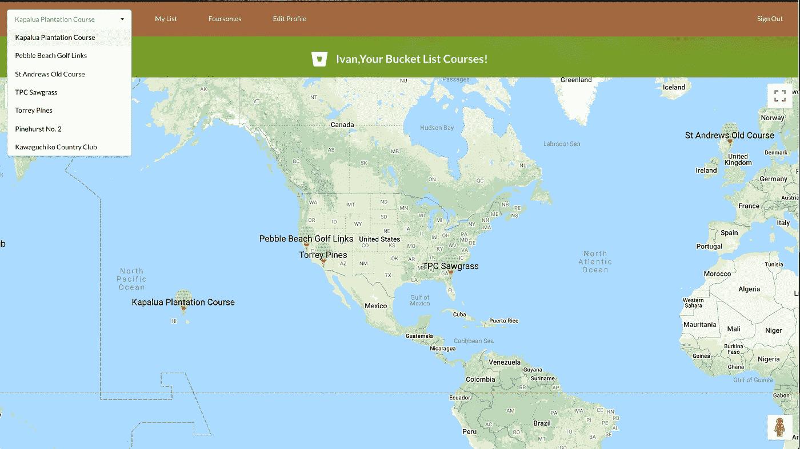
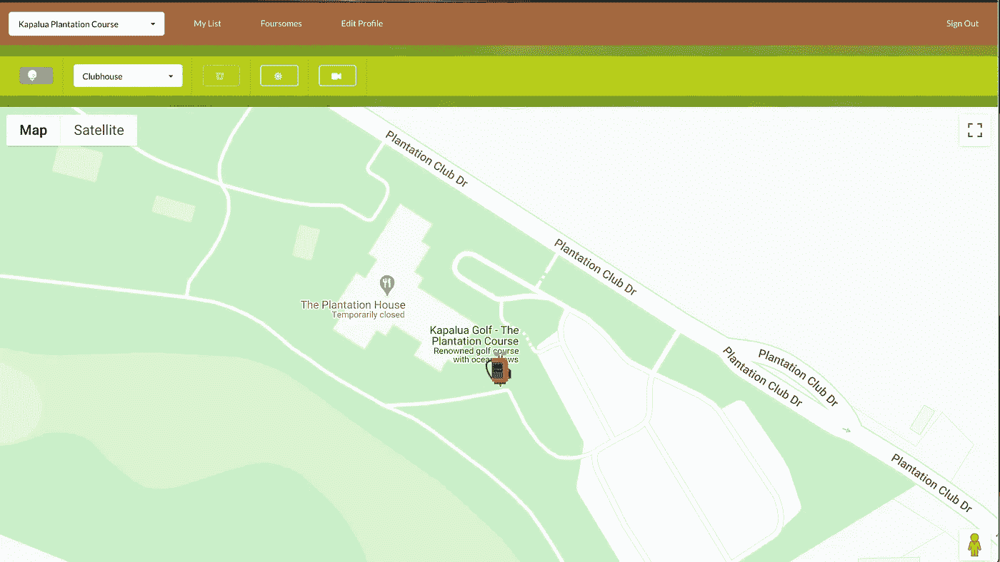
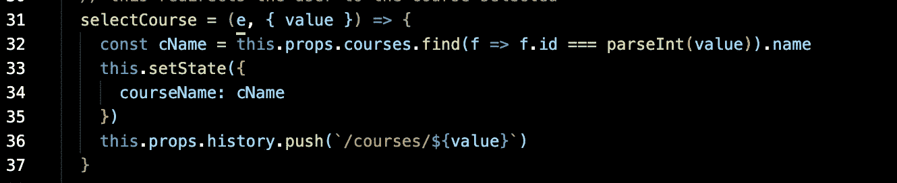
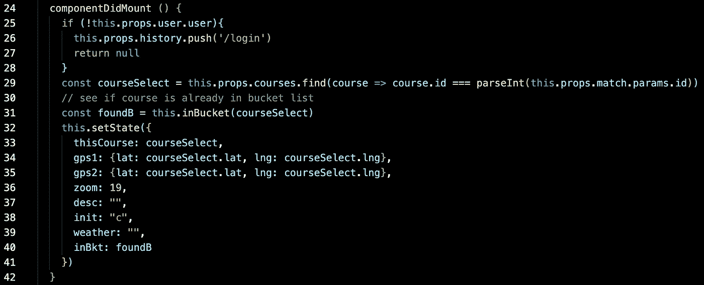
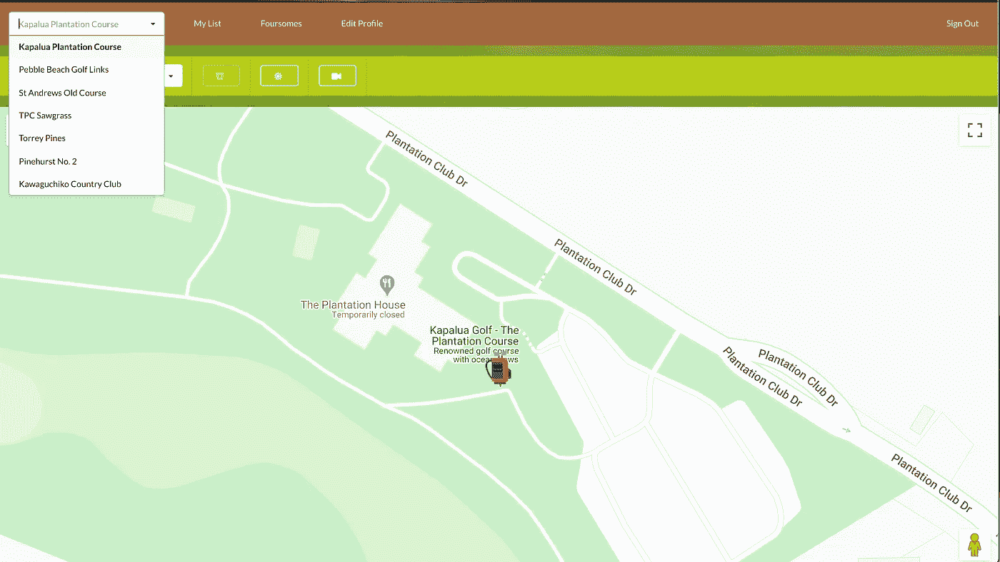
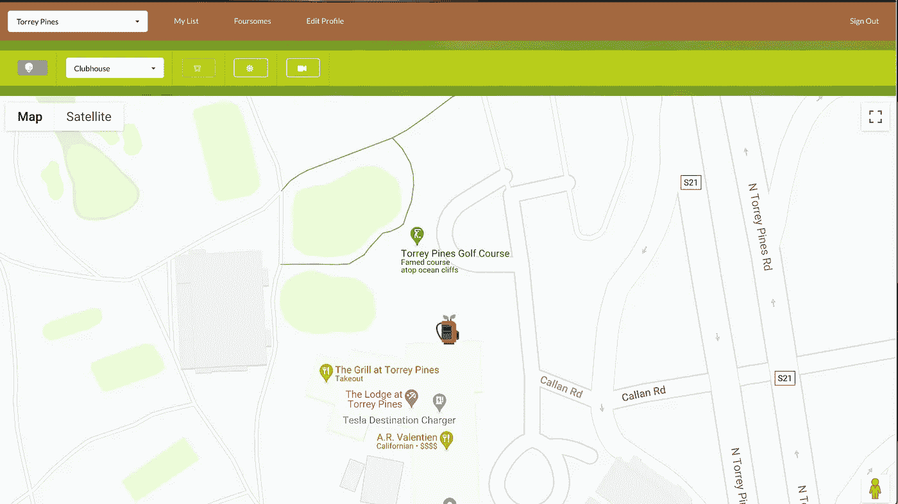
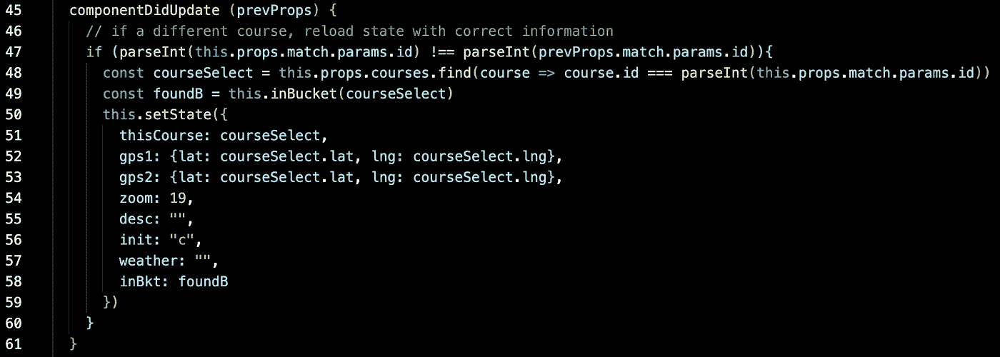

# 反应生命周期事件实际例子

> 原文：<https://levelup.gitconnected.com/a-practical-example-of-react-lifecycle-events-d73bc263df07>

我想我们都熟悉 React 生命周期事件组件 DidMount。我总是认为它是在组件初始加载时用它需要的状态值初始化组件。除此之外，其他生命周期事件对于初学者来说可能有点陌生。这是我用来展示这些其他事件可以派上用场的另一个事件，取决于你的需要。这是设置。

我的应用程序有一个下拉菜单，允许用户选择要查看的课程。

初始选择后，所选球场的地图会显示出来，地图上带有俱乐部会所标记。

通过导航到 BrowserRouter 中设置的/courses/:id 路径来触发该组件。

导航栏中的操作触发了下面的代码。

函数参数中的值是相关课程的 id。history.push 方法会将其“重定向”到路径/courses/${value}，这又会触发 ShowCourse 组件。

一旦触发，我们现在可以检查熟悉的 componentDidMount 生命周期事件。

在这里，我使用 Redux props 中的 match.params.id 来定位所选课程的 id，因为我知道这个组件是由一个路径触发的，该路径包含课程 id。然后可以用它在 Redux 存储中查找课程(通过一个 find 方法)，然后用页面运行所需的所有信息设置本地状态。

现在，如果用户仍然在 ShowCourse 组件上，从下拉菜单中选择不同的课程。

我们期待一个不同的过程立即显示出来。

这就是另一个生命周期事件 componentDidUpdate 发挥作用的地方。

由于 componentDidMount 只在组件最初被触发时执行一次，所以当选择发生变化时，我们不能使用它来将本地状态更改为不同的过程。原因是该组件已经安装，因此我们在正常操作期间无法再次触发此事件。

我们需要 componentDidUpdate 来允许我们捕获变化的事件并执行代码来刷新内容。在这种情况下，将本地状态设置为新的路线。这个函数中的关键字是 Redux 在 props 和 prevProps 中存储的 match.params.id。prevProps 包含我们之前所在球场的 id，而 Props 包含用户选择新球场时在路径中设置的当前球场的 id。

如果我们检测到两个 id 不同，我们就知道需要改变航线显示。然后，我们可以像在 componentDidMount 中一样执行路线查找和本地状态设置。一旦状态被设置为新的球场，组件将使用新的地图和标记位置重新呈现。当然，如果用户从下拉列表中选择相同的课程，id 检查将失败，因为 props 和 prevProps 包含相同的值，因此不会发生重新呈现。