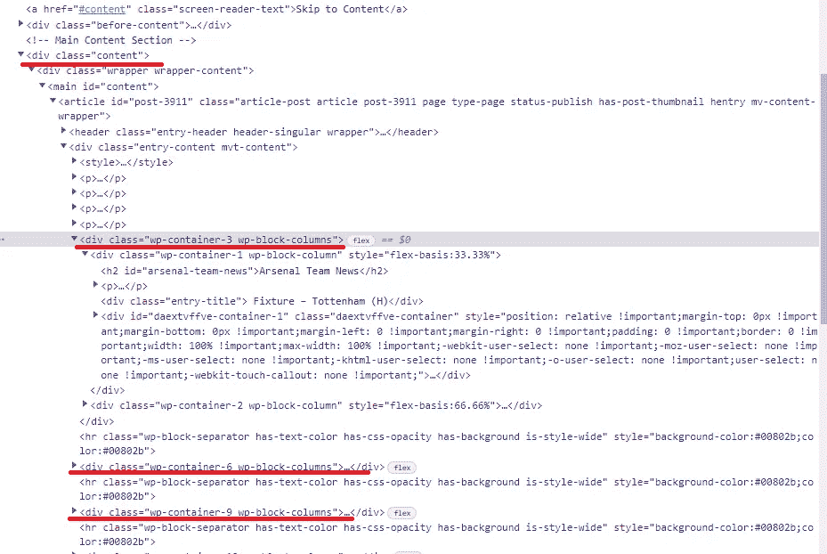
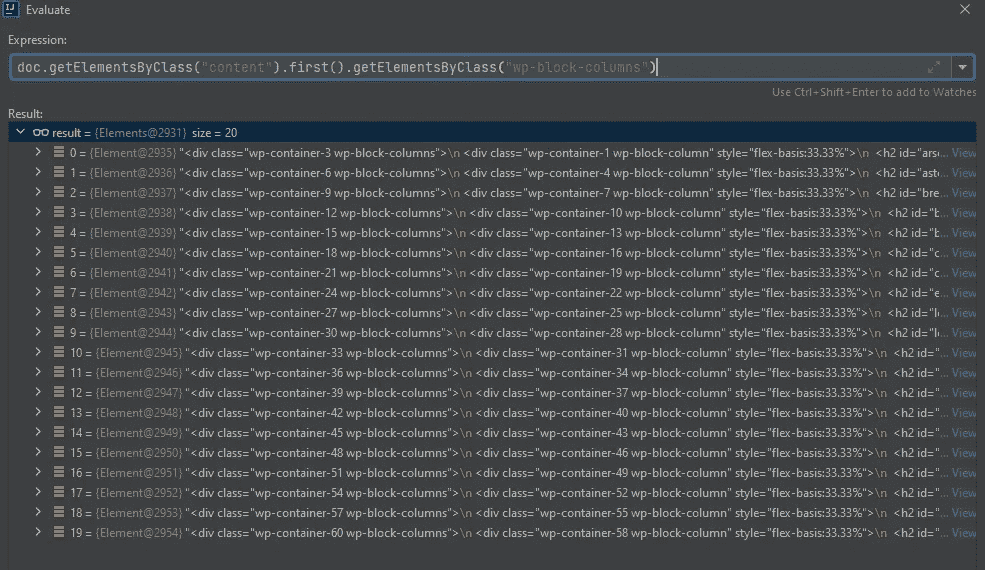
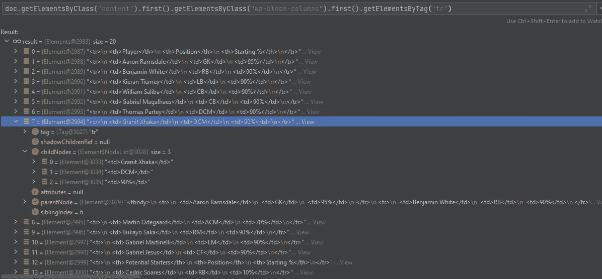

# 用 jsoup 和 java 解析网站的实用指南。

> 原文：<https://levelup.gitconnected.com/a-practical-guide-for-parsing-websites-with-jsoup-and-java-9b688e127f6>


潘卡杰·帕特尔在 [Unsplash](https://unsplash.com/s/photos/html-code?utm_source=unsplash&utm_medium=referral&utm_content=creditCopyText) 上的照片

当一个人把你经常做的事情自动化时，总会有一种快乐。它不仅给你带来空闲时间，而且感觉正确，减少不必要的例行公事。在本指南中，我将针对一个简单的问题，尝试从零开始描述整个过程。

**声明**

我喜欢足球。而作为一个看英超的人，我玩的是梦幻足球。这是一个可以和朋友吹嘘的有趣游戏，但是要花很多时间去网站查看预测的阵容等等。因为有几个，他们列出了所有我目前可能不感兴趣的球队和球员。因此，让我们编写一个简单的电报机器人，它将解析其中一个网站([https://www . fantasyfootbalbundit . com/fantasy-premier-league-team-news/](https://www.fantasyfootballpundit.com/fantasy-premier-league-team-news/))，并根据它给出聊天者预测的开始时间。在这一部分，我将描述如何解决这些问题的思考过程。

**寻找共同模式。**

现代网站的一切都使用 CSS，这使得解析器的工作变得更加容易，因为在大多数情况下，人们可以根据 CSS 类和结构轻松区分搜索到的信息。

为了我们的目标，我们需要找到一个显示团队和玩家的通用模式。我们可以检查页面，注意到所有对我们有用的信息都在 *div class="content"* 中，如果我们更仔细地观察团队，我们可以注意到模式(*div class = " WP-block-columns "*)。所以你总是可以看着页面去做，但是有一个更简单的方法——写一个测试。



**使用简单测试**

我们可以下载页面并编写一个简单的测试来解析它，借助现代开发工具(在本例中是 intellij)的强大功能，我们可以通过计算一个表达式来找到我们需要的 20 支球队和球员。

这个测试没什么特别的，但是它允许我们进入调试模式并动态评估文档页面。下面的截图可以像例子一样得到球队和球员。



**编写代码并把它们放在一起**

让我们把它们放在一起。我们将有一个服务来解析网页，并返回一个球员的球队地图。

根据之前的截图，我们知道该团队的位置:

```
getElementsByClass("content").first().getElementsByClass("wp-block-coumns")
```

而对于相应球队的球员来说:

```
getElementsByClass("content").first().getElementsByClass("wp-block-coumns").first().getElementsbyTag("tr")
```

基本上就是这样，这个服务还从响应中删除不需要的数据。

在服务被调用后，它只是从输入的键(team)返回值。

**调度程序和缓存**

虽然一切正常，并给出了我们想要的响应，但它几乎不可用，因为请求下载整个页面并解析它以获得输出需要时间。考虑到我们预先知道页面，并且知道它不会定期更新，我们可以简单地编写一个调度程序并缓存这些值。

我们不会使用任何花哨的缓存，只是一个简单的静态地图就足够了。下一次我们想要获得关于某个团队的信息时，我们不必连接到网站并等待，而只需从预加载的地图中获取值。

连接器只是以 jsoup 文档的形式获取网页。

我希望这些简单的步骤能让更多的人自动完成他们日常的网络任务，否则这些任务会变得很无聊。

**继续编码，拥有一个。**

— — — — — — — — — — — — — — — — — — — — — — — — — — — -

【https://github.com/Mumuksia/telegram_fpl】的 [*可以找到*的代码**](https://github.com/Mumuksia/telegram_fpl)

*电报可以通过*[*http://t.me/*](http://t.me/UkrGreetingBot)[@ FPLTeamBot](http://twitter.com/FPLTeamBot)访问

*文章* [如何设置电报机器人 https://medium . com/@ mumuk sia/telegram-bot-with-Java-and-docker-636 c 4136 fe7b](https://medium.com/@Mumuksia/telegram-bot-with-java-and-docker-636c4136fe7b)