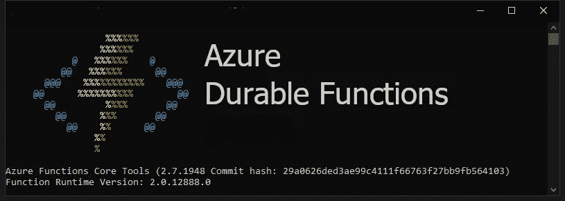
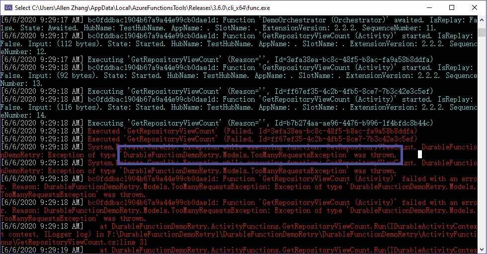
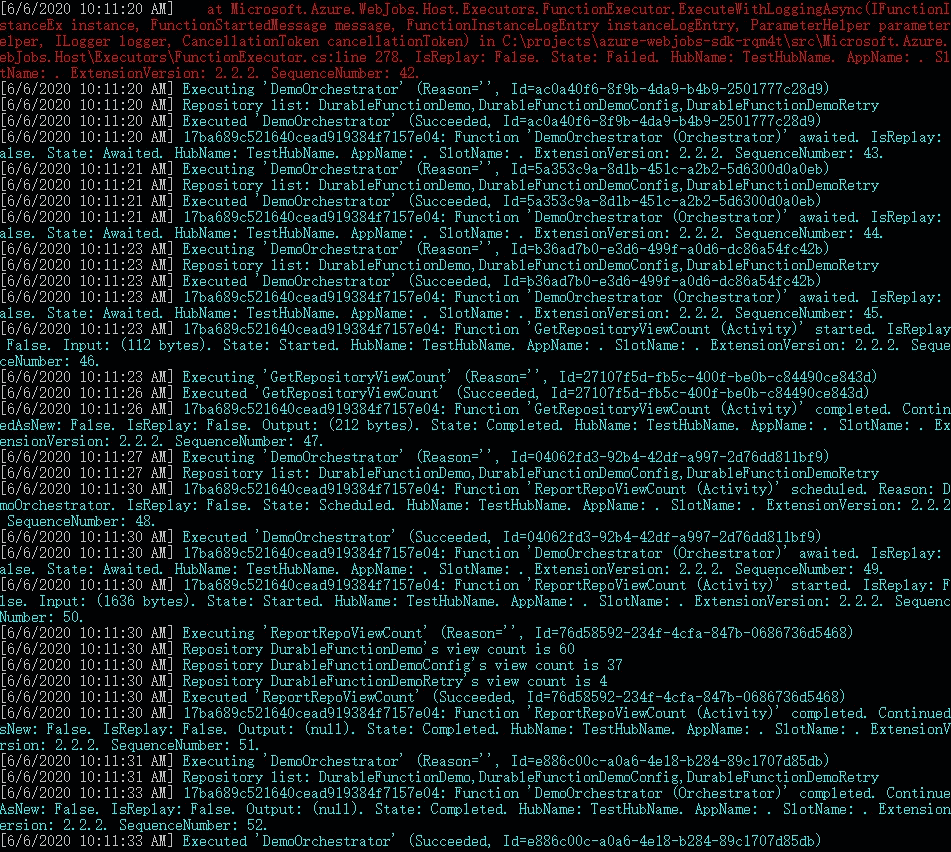
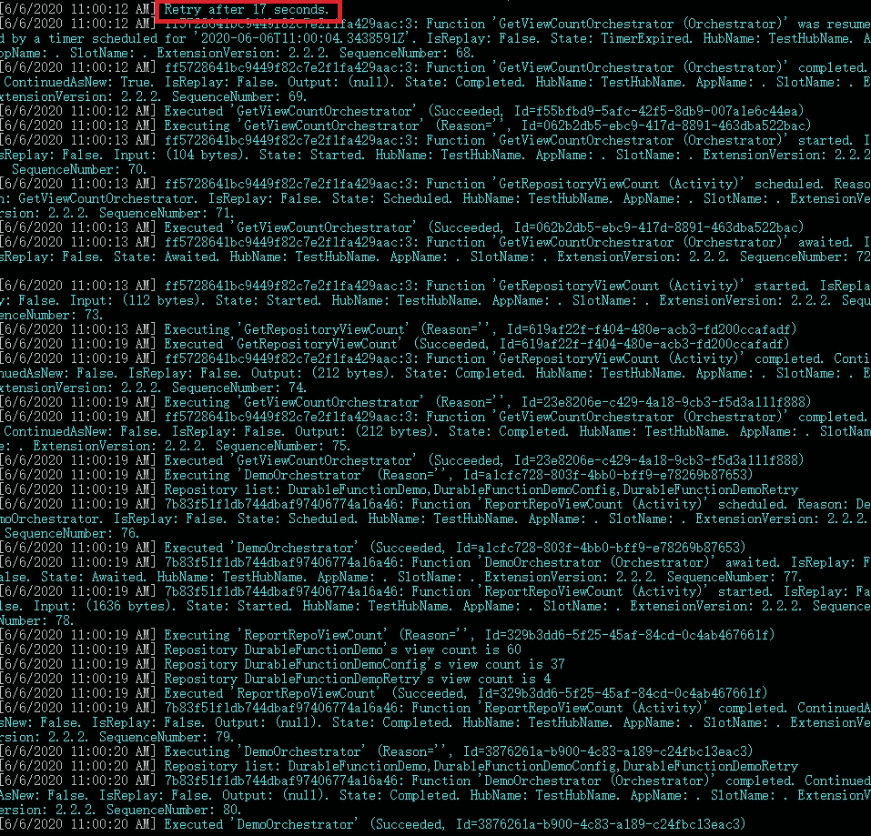

# Azure 持久功能实用指南—第 4 部分:重试

> 原文：<https://levelup.gitconnected.com/a-practical-guide-to-azure-durable-functions-part-4-retry-3b60c46067fa>



## 通过 Azure Durable Functions 创建生产就绪功能应用程序所需的一切。

本系列的第 4 部分是关于 Azure 持久功能的重试机制。这个故事中的示例代码采用了一种非常简单的方法来设置配置。如果您对更复杂的配置设置感兴趣，您可能想看看前面的故事。

[](https://medium.com/@allen.zhang1983713/a-practical-guide-to-azure-durable-functions-part-3-configurations-6baa1b49f532) [## Azure 持久功能实用指南——第 3 部分:配置

### 通过 Azure Durable Functions 创建生产就绪功能应用程序所需的一切。

medium.com](https://medium.com/@allen.zhang1983713/a-practical-guide-to-azure-durable-functions-part-3-configurations-6baa1b49f532) 

主要有 3 种重试机制可用于持久功能。

*   通过服务总线重试。
*   带有重试功能的内置活动/子流程调用。
*   内置子编排器重试。

我们之前在系列中根本没讲过副指挥。这是耐用功能的一个非常强大的功能。我们会找到的，请耐心听我说。

我们的演示应用程序仍然是旧的 GitHub 视图计数器。在实际应用程序中，您可能希望重试任何 web API 调用，因为:

*   API 可能是速率受限的，以保护自己免受 DDOS 攻击。
*   网络有时可能不稳定。

为了模拟速率受限的 API 端点，我让 **GetRepositoryViewCount** 活动函数随机抛出一个自定义异常。

如果我们用这个代码变化在本地运行它，它有时会失败。



那很好。现在我们需要重试 API 调用。

# 服务总线重试

严格来说，这与 Azure 持久功能无关。重试发生在 Azure 服务总线上。

实现它的代码是三个中最简单的:什么都不做。但是简单的方法总是好的方法吗？

通过消息队列的重试机制已经存在很多年了，并且被证明是可靠的。然而，我不建议使用服务总线触发器来增加 Azure 持久功能应用的弹性。

请记住，服务总线触发器只是 Azure 函数触发器的一种。如果您的应用程序的弹性仅仅依赖于它，其他触发器必须将它们的请求转发给服务总线。orchestrator 实际上只接受来自服务总线触发器的真实请求。

对于一个简单的 Azure Function 应用程序来说，这可能是唯一的选择，也确实是一个限制。但是我们当然不必依赖服务总线来获得具有持久功能的弹性。有更好的内置重试机制。

# 带 RetryOptions 的函数调用

到目前为止，在本系列的示例代码中，我们一直使用 **CallActivityAsync** 来调用活动函数。当活动函数抛出异常时，编排失败并存在。

但是在**IDurableOrchestrationContext**接口上还有另外两个方法可用于 **RetryOptions** :

我们稍后会讲到副指挥。让我们通过用**callactivitywithreyasync**调用替换 **CallActivityAsync** 调用来改进我们现有的代码。

在这个简单的演示应用程序中，我们可以定义一个单独的 **RetryOptions** ，并让所有活动函数共享它。

这意味着第一次重试应该发生在异常后 2 秒，最大重试次数应该是 5 次，我们只想重试 **TooManyRequestsException** 异常类型。

我们现在可以在 orchestrator 中用重试版本替换活动函数调用。

如果我们现在运行应用程序，并且如果我们不是非常不走运(经过这么多次重试，随机数总是大于或等于 7 的可能性很小)，异常仍然会发生，但是 orchestrator 应该会成功完成重试。



依我看，这比服务总线重试要好。它不需要另一个 Azure 资源(Azure 服务总线),并且可以按照你想要的方式进行配置。

带有重试功能的子流程调用的工作方式与活动调用非常相似。

但是，如果您需要实现更复杂的逻辑，还有另一个使用子编排器的重试选项。

# 副指挥重试

此选项仅通过子协调器提供。那么什么是副指挥呢？

你可能已经从名字猜到了。当一个指挥 A 可以调用另一个指挥 B **，**时，我们开始称 B 为副指挥。

从编码的角度来看，orchestrator B 没有什么特别的，它只是一个普通的 orchestrator 函数。它只有在从。

现在有趣的事情发生了，当你像这样链接管弦乐队时:

```
A => B => C => A
```

是的，持久函数可以递归！现在，使用持久函数处理树数据结构应该没有问题了。当然，当你设计这样的东西时要小心，就像设计任何其他递归方法一样。

子编排器不仅使持久函数变得非常强大和灵活，而且还提供了另一种重试机制，可以更好地控制代码。

首先，演示应用程序中的主编排器不应该再直接调用活动。它会调用一个子指挥器。

注意，我们不使用 **WithRetry** 方法调用子流程。重试发生在子协调器内部。

新创建的子编排器将调用活动函数。

最重要的一行是**上下文。ContinueAsNew(updatedRepoName)；**

**ContinueAsNew** 让 orchestrator 重置当前状态(持久函数是有状态的，记得吗？)并用给定的输入参数重新启动。

在上面的代码中，在重试之前添加了 10 到 30 秒之间的随机延迟。调用一个更新输入参数的方法来演示您可以在重试之前更新输入。

将此选项与前一个选项进行比较，我们可以看到这允许实现更复杂的重试逻辑。并且**不**需要**最大尝试次数。你可以永远重试。**

为了验证它的工作，我们在本地运行更新的应用程序。



# 摘要

这个故事展示了 Azur 持久函数的三个重试选项。以及为什么您可能不应该依赖服务总线来获得弹性。请不要急于得出 Azure 服务总线无用的结论。与系统的其他部分集成仍然是一个不错的选择。

当您的需求相对简单时，使用重试方法调用函数。设置简单，阅读清晰。

但是，如果您的场景需要通过重试来实现复杂的逻辑，那么子编排器方法可能更合适。

# 系列摘要

这个系列是否兑现了字幕上的承诺？

> 通过 Azure Durable Functions 创建生产就绪功能应用程序所需的一切。

差不多了。本系列为开发人员或软件工程师创建满足业务需求的复杂无服务器软件奠定了基础。

在真正投入生产之前，留给读者探索的唯一内容是 devops 方面。系列有点触及但没深入。在这里覆盖一个完整的 Azure Devops 管道感觉不太对。值得拥有自己的系列。读者可能有其他更喜欢的 devops 工具。所以我会让你自己去想应该怎么做。

这是 Azure 耐久功能系列的最后一个故事。以后大概还会再写 Azure Function。关注我的新故事。