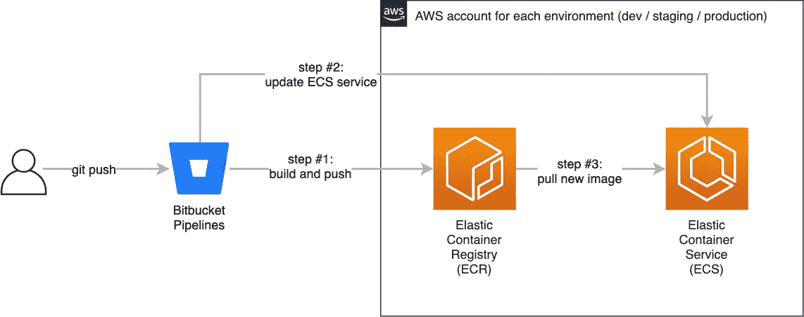

# 在 AWS 上部署微服务的实用指南

> 原文：<https://levelup.gitconnected.com/a-practical-guide-to-deploying-microservices-on-aws-6a8ddd298f7e>

## 通过 Docker、CloudFormation 和 Bitbucket 管道在 ECS Fargate 平台上持续部署生产就绪型微服务

这份介绍性指南介绍了在 AWS 中自动提供 API 服务基础设施的过程。主要关注点是创建可复制的基础设施和构建管道，而不是服务实现本身。该指南附带了两个代码库，帮助您开始使用[基础设施](https://bitbucket.org/idanlupinsky/ecs-fargate-service-infra/)和[服务](https://bitbucket.org/idanlupinsky/ecs-fargate-service-api/)实现。建议读者具备 AWS 概念的基础知识。

# 背景

我们的一个客户是房地产行业的初创企业。这家初创公司的数据团队开发了一个机器学习模型，用于根据房产位置和大小等特定特征对房地产进行估值。像许多其他团队一样，他们面临着将模型引入生产环境的挑战。他们要求我们将这个*价格评估模型*公开为他们的后端服务可以使用的内部 API。此外，他们希望有一个通用的启动项目，可以进行调整，以便在本地测试新模型，并快速轻松地在生产中推出变更。

由于我们的客户在 AWS 上运行其工作负载，并为其应用程序使用 Docker，我们决定在[弹性容器服务](https://aws.amazon.com/ecs/) (ECS)平台上运行资产评估 API。在 AWS 中，选择 ECS 似乎是理所当然的，因为它已经在亚马逊和其他公司中经受了考验，但它也提供了与 AWS 生态系统中许多服务的无缝集成。除此之外，我们选择将 ECS 与 [Fargate](https://aws.amazon.com/fargate/) 计算引擎配合使用，因为它允许我们委派调配和扩展底层集群容量的责任。这意味着我们只需指定所需的计算资源以及服务本身应如何扩展，而无需调配和维护底层计算群集。

最后，我们的客户使用[位桶](https://bitbucket.org/)作为它的版本控制库。尽管市场上有很多优秀的 CI/CD 产品，但是使用 Bitbucket 作为源存储库使得 [Bitbucket Pipelines](https://bitbucket.org/product/features/pipelines) 成为我们这个项目的首选 CI/CD 解决方案，特别是考虑到它与 AWS 的直接集成。

# 最小的 API 服务

鉴于我们在本指南中的目标是关注服务的基础设施和技术需求，而不是其功能，我们已经尽可能保持[服务实现](https://bitbucket.org/idanlupinsky/ecs-fargate-service-api/)简单。

我们的示例服务是用 [FastAPI](https://fastapi.tiangolo.com/) 实现的，这是一个用于在 Python 3.6 和更新版本中构建 API 的现代 web 框架。该框架的一个吸引人的特性是基于 OpenAPI 规范的交互式文档的内置生成，以 [SwaggerUI](https://github.com/swagger-api/swagger-ui) 和 [Redoc](https://github.com/Redocly/redoc) 的形式。

准系统实现由一个在`/health-check`暴露的端点组成，该端点返回一个以`{"status": "healthy"}`作为消息体的`HTTP 200 OK`响应。应用程序负载平衡器将使用此端点来监视服务。第二个端点是一个伪`/valuation`端点，它在其消息体中返回一个简单的硬编码值。代码如下所示:

最小 API 实现

让我们创建一个 [Docker 映像](https://docs.docker.com/engine/reference/builder/)，它将包含我们的 API 代码、它的依赖项以及将请求转发给我们的服务的[uvicon](http://www.uvicorn.org/)HTTP 服务器:

服务 API Dockerfile 文件

最后，让我们编写一个 [Docker Compose](https://docs.docker.com/compose/) 文件来轻松地支持我们的 API 堆栈，即使它在这一点上只包含一个容器:

服务 API Docker 编写文件

为了在本地运行我们的 API 栈，我们发出一个`docker-compose up`命令。Swagger UI 应该在`[http://localhost:8000/docs](http://localhost/docs)`可用，我们可以通过浏览器轻松测试两个 API 端点。

现在我们有了一个工作的——尽管是最小的——API 服务容器，让我们看看它如何适合 ECS 和 Fargate 的上下文。

# ECS 基础知识

ECS 中最基本的构件是*任务*。每个任务运行一个或多个相关的 Docker 容器。一个[任务定义](https://docs.aws.amazon.com/AmazonECS/latest/developerguide/task_definitions.html)通过描述哪些容器在任务中运行、对任务施加的 CPU 和内存限制、日志配置和几个其他属性，作为实例化任务的模板。类似于 EC2 实例，任务可以被分配一个 IAM 角色，这大大简化了凭证管理。

虽然可以手动运行任务，但是我们将使用*服务*抽象来运行任务的一个或多个实例。与手动运行任务相比， [ECS 服务](https://docs.aws.amazon.com/AmazonECS/latest/developerguide/ecs_services.html)调度程序提供了几个好处。首先，它允许我们定义应该并发运行的任务的期望数量。在一个任务失败的情况下，服务调度程序会自动启动一个新的任务并将其投入使用。另一个好处是能够将负载平衡器与服务关联起来。只要任务被认为是健康的，它们就是负载平衡器目标组的一部分。也可以将服务配置为自动扩展。稍后，我们将通过提供负载平衡器来利用其中的一些功能。我们将在后续文章中解决自动伸缩问题。

为了运行任务或服务，我们需要提供一个*集群*。一个 [ECS 集群](https://docs.aws.amazon.com/AmazonECS/latest/developerguide/clusters.html)只是服务和任务的逻辑分组。在我们的设置中，我们将调配一个 ECS 集群来容纳我们的服务，但是当然也可以将跨 VPC 的多个服务分组到一个集群中。

# 基础设施

让我们深入了解并详细回顾一下服务基础架构:

API 服务架构

上面的图表是一个相当标准的设置，但仍然有很多事情要做。我们来分解一下。

虚拟私有云(VPC)为我们的服务提供网络隔离。我们的 VPC 包括两个私有子网和两个公共子网，分布在两个可用性区域(az)中。在单个 AZ 失败的情况下，该服务仍然可用，尽管它暂时限于在单个 AZ 上运行的任务。AWS 区域通常有两个以上的 az，因此我们可以选择扩展我们的架构，以包含一个或多个附加的 az。这是一种权衡，因为额外的 az 可能会带来额外的成本。

假设服务是作为内部 API 使用的，我们实例化一个应用负载平衡器(ALB)并将其与私有子网关联。为了方便起见，我们还使用 Route 53 DNS 服务为我们的负载平衡器端点提供一个友好的 DNS 名称。如前所述，负载平衡器与 ECS 服务相关联，这意味着 ECS 调度程序将自动在负载平衡器目标组中注册新的 ECS 任务。

公共子网有双重用途:它们有助于建立堡垒主机，如果需要的话，我们可以从这些主机连接到私有子网。更重要的是，我们创建了 NAT 网关，允许私有子网中的 ECS 容器从互联网上获取 Docker 映像。如图所示，创建 NAT 网关是可选的，通常取决于是否需要从 Docker Hub 等来源获取图像，或者是否需要将指标发送给 DataDog 等第三方服务提供商。

最后，在我们的 VPC 中，我们希望使用某些服务，如 S3、CloudWatch 日志和弹性容器注册(ECR)。要做到这一点，同时确保流量保持在亚马逊网络内，需要设置图顶部所示的 VPC 端点。

# 云的形成

我们希望将上述设计整理成文，以便我们能够安全地复制和更新环境。很重要的一点是，变更要易于审查和审计，就像常规的代码审查一样。该守则还将作为最新的文件。为了实现基础设施，我们使用 AWS 的本机和声明式基础设施代码解决方案 CloudFormation。我们服务的基础设施代码可在[这里](https://bitbucket.org/idanlupinsky/ecs-fargate-service-infra)获得。

在 CloudFormation 模板中，堆栈被定义为相关资源的集合。对于我们的服务，我们定义了一个主堆栈，通过它我们能够复制整个服务基础设施。这对于确保生产环境和非生产环境之间的平等特别有用。也就是说，开发环境中通常不需要生产中调配的计算资源级别。为此，CloudFormation 允许我们添加可选参数，以更好地控制堆栈资源的供应方式。

让我们来看一个非常简单的 CloudFormation 模板:

云形成 ECR 示例

上面的示例创建了一个 ECR 存储库，并使用`Prefix`参数作为所选存储库名称的一部分。

随着堆栈大小的增长，将它分成更小的堆栈是有意义的。这提高了特定部署的可读性，并有助于跨项目重用堆栈。实现堆栈重用的方法之一是定义嵌套堆栈。嵌套堆栈就是定义为另一个堆栈中的资源的堆栈。

下面的摘录来自我们的顶级堆栈。在本例中，我们看到两个嵌套的堆栈:一个 VPC 堆栈和一个 VPC 端点堆栈。例如，如果另一个项目只需要 VPC 堆栈，但不需要配置 VPC 端点，那么将这两者分开是很有用的:

CloudFormation 嵌套堆栈示例

关于上面的例子，需要注意的一点是兄弟栈之间的依赖关系。例如，VPC 端点堆栈需要知道在哪个 VPC 创建端点。根堆栈引用 VPC 堆栈提供的输出，并将它们作为参数传递给 VPC 端点堆栈。在实例化堆栈之前，CloudFormation 会执行代码验证，以报告语法错误和循环依赖等问题。

我们最终定义了一个根栈，并把下面的嵌套栈作为资源:

*   **VPC** —提供一个 VPC，包括私有和公共子网、NAT 网关和一个互联网网关。
*   **VPC 端点** —提供服务端点，以确保在 VPC 使用这些服务时，数据仍保留在亚马逊网络中。VPC 端点是为以下 AWS 服务定义的:S3、云观察日志和 ECR。
*   **ECR** —为我们部署的 docker 映像提供一个容器注册表。
*   **负载平衡器** —提供一个与 ECS 服务相关联的内部应用程序负载平衡器。
*   **ECS** —调配 ECS 集群和支持 IAM 任务角色以及部署用户。请注意，服务和任务定义资源是在单独的 API 堆栈中定义的，因为它们经常更新。
*   **仪表板** —提供 CloudWatch 指标仪表板。
*   **主题** —提供主题，如同级堆栈使用的报警主题。
*   **安全组** —提供所需的安全组，这些安全组通常相互依赖来定义进入规则。然后，安全组作为参数传递给适当的嵌套堆栈。

# 部署流程

既然我们已经讨论了 API 实现和底层基础设施，那么让我们在较高层次上回顾一下部署流程:

部署流程:位桶管道、ECR 和 ECS

上图中最重要的一个方面是为每个 AWS 环境使用单独的帐户，同时共享相同的位存储库和管道。如图右侧所示，每个 AWS 帐户都包含自己的容器注册中心和 ECS 基础设施。这有助于在非生产环境中进行实验，而不必担心干扰正在运行的生产设置。考虑到环境资源固有地与特定帐户相关联，使用单独的帐户也使得环境标记有些多余。

部署流由 Bitbucket git 存储库的推送触发。正如我们将在后面看到的，每个分支或标记可以与位桶管道配置中的一组单独的步骤相关联，在特定的环境中处理部署。

随着管道的启动，第一步是构建我们的 API 容器，并将 docker 映像推送到相关帐户内的弹性容器注册中心(ECR)。接下来是对 ECS 服务和任务定义的更新，它从 ECR 中提取相应的映像，并对服务执行滚动更新。

# 比特桶管道

我们的实现使用位桶管道来实现上面的部署流程。官方的[入门](https://confluence.atlassian.com/bitbucket/get-started-with-bitbucket-pipelines-792298921.html)页面是一个很好的介绍，但是简而言之，`bitbucket-pipelines.yml`文件是为特定的存储库定义构建管道的地方。

在我们的设置中，[基础设施](https://bitbucket.org/idanlupinsky/ecs-fargate-service-infra/)和[服务](https://bitbucket.org/idanlupinsky/ecs-fargate-service-api/)存储库都包含一个与单独的 CloudFormation 堆栈相关联的`bitbucket-pipelines.yml`文件。

创建两个库和栈的动机是将相当静态的基础设施栈与更加动态的 API 栈分开，因为后者会随着每个 API 构建而更新。这种分离也便于操作和开发团队分别管理两个存储库。

让我们检查一个简化的部署管道，它在一个*开发*环境中提供基础设施堆栈:

位桶管道—部署到开发环境

`image`行指出哪个 Docker 映像用于构建环境。`pipelines-awscli`映像预装了 AWS CLI 工具，我们使用该工具在文件的`script`部分发出`aws cloudformation`命令。凭据被分配了使用位存储库设置页面配置的安全存储库变量。

为了供应堆栈，我们需要发出`package`命令来准备嵌套的堆栈工件并将其上传到 S3 桶，然后在准备好的根 CloudFormation 堆栈上发出`deploy`命令来创建新的堆栈或更新现有的堆栈。这个配置通过在*开发*分支上定义一个触发器来利用分支工作流。两个存储库中的默认配置还在主分支*上定义了一个管道，以部署到生产中。*

服务存储库定义了单独的位桶管道，该管道在更新 ECS 服务以触发对新版本的滚动更新之前，构建更新的 API docker 映像并将其推送到 ECR。一个名为`BITBUCKET_COMMIT`的预定义位桶变量用于标记我们的 API 映像的最新版本。

由于选择分离基础架构和服务堆栈，我们需要一种方法来引用或构建基础架构堆栈。为了交叉引用资源，例如 VPC 子网，我们使用了 CloudFormation 的一个特性，它允许从一个堆栈导出资源，并通过其他堆栈导入这些资源。查看更多关于交叉引用堆栈资源的[这里](https://aws.amazon.com/premiumsupport/knowledge-center/cloudformation-reference-resource/)。

# 监控和云监控

服务可观察性可以在基础设施和应用程序级别提供有价值的洞察力。为了使服务能够投入生产，需要对其进行适当的监控。

我们的设置整合了 CloudWatch 套件的几个组件，以提高可观察性并获得可操作的洞察力。从 [CloudWatch 日志](https://docs.aws.amazon.com/AmazonCloudWatch/latest/logs/WhatIsCloudWatchLogs.html)开始，ECS 任务将它们的容器日志发送到一个[日志组](https://docs.aws.amazon.com/AmazonCloudWatch/latest/logs/Working-with-log-groups-and-streams.html)来聚合它们。通过为任务定义中的每个容器指定`awslogs`日志驱动程序，任务被配置为发送日志。这促进了集中日志记录的最佳实践，因为日志不再存储在本地容器中，也不再被本地容器访问。使用指定的 VPC 端点，在服务 VPC 和 CloudWatch Logs 服务之间建立私有连接。

我们的设置还使用 [CloudWatch Metrics](https://docs.aws.amazon.com/AmazonCloudWatch/latest/monitoring/working_with_metrics.html) 从 AWS 资源和我们自己的服务中收集指标数据。AWS 资源自动向 CloudWatch 发送指标，以帮助监控它们的运行状况和性能。AWS 资源指标的一个例子是应用负载平衡器[HTTPCode _ Target _ 5XX _ Count](https://docs.aws.amazon.com/elasticloadbalancing/latest/application/load-balancer-cloudwatch-metrics.html)指标。此指标可用于帮助识别服务器后端问题。然而，收集我们自己的服务发送的定制指标也很重要。为此，我们的任务设置运行一个 [CloudWatch 代理](https://hub.docker.com/r/amazon/cloudwatch-agent)作为一个 [sidecar](https://docs.microsoft.com/en-us/azure/architecture/patterns/sidecar) 容器。自定义指标从我们的服务发送到代理容器，代理容器聚合指标数据，并将其进一步发送到 CloudWatch 服务。

CloudWatch 代理支持的指标收集协议之一是 [statsd](https://github.com/statsd/statsd) 。使用这样一个流行的协议有助于发送定制指标的过程。有相当多的 statsd 开源客户端可供选择。我们的服务实现使用了一个 [Python statsd 客户端](https://github.com/jsocol/pystatsd)，它允许修饰方法以声明的方式轻松地添加指标。以下示例演示了如何发送计时器度量，该度量跟踪评估方法运行所需的时间:

Statsd 定时器度量示例

为了分组和隔离指标，CloudWatch 提供了[名称空间](https://docs.aws.amazon.com/AmazonCloudWatch/latest/monitoring/cloudwatch_concepts.html)的概念。例如，应用程序负载平衡器服务将其指标分组到`AWS/ApplicationELB`名称空间中。我们通过将代理定义为 its 容器配置的一部分来配置代理使用特定的名称空间。以下代码片段摘自服务 API CloudFormation 堆栈的任务定义:

CloudWatch 代理容器定义

## 仪表板和警报

收集日志和指标是最基本的，但是仅仅收集日志和指标是不够的。为了能够可视化收集的数据，我们使用了 [CloudWatch 仪表盘](https://docs.aws.amazon.com/AmazonCloudWatch/latest/monitoring/CloudWatch_Dashboards.html)。仪表板是数据分析的重要工具，可以面向不同的受众。开发人员可以使用仪表板来促进性能改进，服务可靠性工程师(sre)可以参考仪表板来帮助分类生产问题，经理可以审查更高级别的业务指标。对于我们的服务，我们提供了一个简单的仪表板，主要面向开发人员和 sre。该控制面板聚合了有关我们的 ECS 集群、服务 ALB 以及估价方法计时器指标的指标数据。仪表板对于审查我们服务的整体运行状况和性能非常有用。

仪表板需要目标受众的主动监控和互动。为了自动化监控过程， [CloudWatch Alarms](https://docs.aws.amazon.com/AmazonCloudWatch/latest/monitoring/AlarmThatSendsEmail.html) 被提供来监控指标，并在警报阈值被突破时调用操作。一个[通知主题](https://docs.aws.amazon.com/sns/latest/dg/welcome.html)可以被指定为一个警报动作——每当警报产生时，该主题的订阅者都会收到一个通知。在我们的设置中，我们为 SNS 主题提供了一个电子邮件订阅者，并将所有警报与该主题相关联。以下代码片段演示了如何提供 CloudWatch 警报来监控上述[HTTPCode _ Target _ 5XX _ Count](https://docs.aws.amazon.com/elasticloadbalancing/latest/application/load-balancer-cloudwatch-metrics.html)负载平衡器指标:

CloudWatch 警报示例

如果我们在 1 分钟内从后端返回至少一个 5XX HTTP 错误，就会触发上述警报。这种警报是基础设施级监控的一个例子，但是我们也可以提供监控应用级指标的警报，比如评估方法运行时。

# 摘要

在本指南中，我们介绍了使用 ECS 和 Fargate 在 AWS 上构建和部署简单服务的过程。本指南旨在总结我们在部署自己的服务时学到的知识。服务架构部分基于 AWS 编写的[参考](https://github.com/awslabs/ecs-refarch-continuous-deployment) [架构](https://github.com/aws-samples/ecs-refarch-cloudformation)。希望本指南能够帮助您的团队开始在 AWS 上部署他们自己的服务。如果您有任何问题或改进建议，请联系我们。