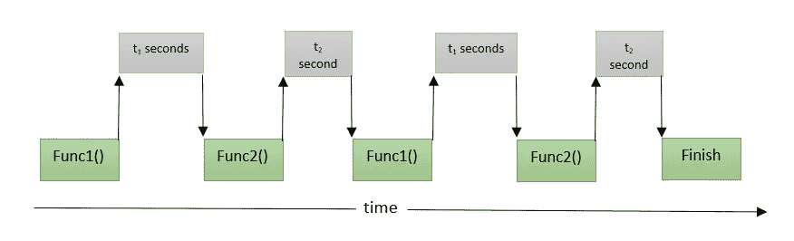
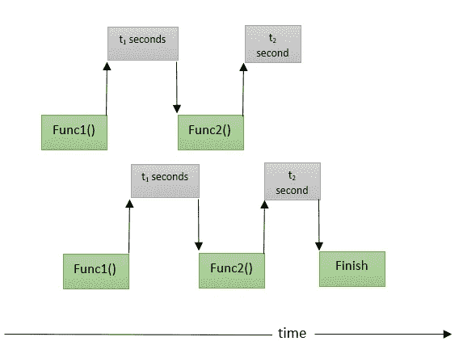

# Python 多线程实用指南

> 原文：<https://levelup.gitconnected.com/a-practical-guide-to-multithreading-in-python-adae78df1fac>

## 了解如何使用 Python 中的线程池来加速您的程序。


照片由[克里斯蒂安·休姆](https://unsplash.com/@christinhumephoto?utm_source=medium&utm_medium=referral)在 [Unsplash](https://unsplash.com?utm_source=medium&utm_medium=referral) 上拍摄

## 介绍

在本文中，您将学习如何通过使用 Python 中的`threading`模块和`concurrent.futures`模块并发运行 IO 扩展任务来加速您的程序。

**目录**

1.  [执行的正常流程](#24f4)
2.  [什么是线程？](#b93e)
3.  [线程和多重处理的区别](#b3df)
4.  [如何向目标函数传递参数？](#ec27)
5.  [线程池执行器](#1fe2)

## 1.正常的执行流程

当你运行一个程序时，每条指令都要等待前一条指令完成，然后才会被执行。这被称为同步执行。

为了更好地理解这个想法，让我们假设你有两个函数。第一个从硬盘`Func1()`中读取一个文件，第二个处理这个文件中的可用数据`Func2()`。另外，假设您想要调用这些函数来处理两个不同的文件。由于同步执行，这两个文件不能并发处理。

这不是最佳选择，会浪费 CPU 时间，因为从硬盘读取文件时 CPU 会处于空闲状态。参见图 1。



图 1:正常的执行流程(图片由作者提供)

现在，让我们看一个代码示例。我们将通过`time.sleep()`函数模拟长时间运行。

```
def Func1():
    # Read
    time.sleep(1)

def Func2():
    # Process    
    time.sleep(1)
```

```
def IO_extensive():
    """
    Reading and processing a large file
    """
    Func1()
    Func2()
    print('Done')
```

现在，假设您想要多次运行`IO_extensive`函数，并测量这个程序需要的时间。要测量你的程序需要多少秒才能完成，你可以使用如下的`time.perf_counter()`函数。

输出:

```
Done
Done 
Done 
Done 
Done 
the execution  finished in 10.065937800000029 seconds
```

它花了 10 秒，因为每次迭代花了 2 秒。

现在，让我们来理解什么是线程，以及它们如何加快处理时间。

## 2.什么是线程？

您可以将线程理解为在同一进程中一起运行的多个任务。更清楚地说，他们看起来是在一起跑，但实际上不是。参考图 2，它显示了前面的例子，但是使用了线程。



图 2:使用线程的流执行(图片由作者提供)

从这个图可以理解，当一个函数(`Func1`的第一次调用)等待从硬盘中读取文件时。第二个函数(`Func1`的第二次调用)将在这段空闲时间内开始使用 CPU，这反过来提高了 CPU 的利用率

> **注意**:有时你不会从使用线程中获得太多好处，而且程序可能会因为使用线程而运行缓慢，特别是当任务是 CPU 密集型任务时。这是因为线程在创建和销毁时需要时间。

由此我们可以理解，对于让 CPU 空闲一段时间的 I/O 大量任务(比如读取一个大文件、从互联网上下载图像等等)，线程会更高效。

为了在 Python 中使用线程，你可以使用内置的`threading`模块。要创建一个线程，你必须从`threading.Thread()`类创建一个对象，并确定你想使用这个线程执行哪个函数。

因此，让我们在测量执行时间的同时重复前面的例子。

**注意** : `thread.join()`用于让主程序等待线程完成执行。

输出:

```
Done Reading 
Done Reading 
Done Reading 
Done Reading 
Done Reading the execution has finished in 2.049022499999978 seconds
```

只花了 2 秒钟，因为现在所有的功能已经执行，没有等待对方。

在前面的例子中，我们使用了一个没有参数的函数。现在的问题是，如果函数有参数，如何传递函数参数？

## 4.如何向目标函数传递一个参数？

假设函数`IO_extensive`有一个参数，指定将要读取和处理的文件的名称。您可以使用`args`参数在`threading.Thread()`对象中传递这个参数。

```
def IO_extensive(name):
    """
    Reading a large file
    """
    Func1()
    Func2()
    print(f'Done Reading {name}\n')
```

然后，您可以像下面这样传递文件名:

输出:

```
Done Reading file4
Done Reading file1
Done Reading file3
Done Reading file2
Done Reading file0

the execution has finished in 2.032882799999925 seconds
```

现在，让我们继续，看看在 Python 中使用线程的更优雅的方式。

## **5。线程池执行器**

这是一种更容易和更有效的方式来运行线程。Python3.2 及以上版本支持。为了使用它，我们需要`concurrent.futures`模块。

为了理解如何使用这个池，让我们先看下一个代码示例，然后理解发生了什么。

输出:

```
Done Reading file0
Done Reading file1
Done Reading file4
Done Reading file3
Done Reading file2

the execution has finished in 2.0315140999998675 seconds
```

首先，您可以看到类`ThreadPoolExecuter`已经被导入并用于定义一个对象，该对象可以用作带有`with`语句的上下文管理器。

接下来我们来说说`submit()`法。这个方法简单地调度一个要执行的函数，并返回一个代表函数执行状态的`Future`对象。这个方法**并没有按照函数执行的顺序**返回结果。

最后，要获得函数返回的值，您可以使用`as_completed()`函数，它给出了一个迭代器，您可以循环遍历该迭代器以得到完整函数的结果。请注意，名称是按**而不是**排序的。

在线程中调用函数的另一种方法是使用`map()`方法。这个方法可以替代`for-loop`执行多线程。该方法按照函数的执行顺序返回结果。

现在让我们看看用`map()`方法的例子。

输出:

```
Done Reading file1
Done Reading file2
Done Reading file3
Done Reading file4
Done Reading file5

the execution has finished in 2.0273125999999593 seconds
```

请注意，名称是有序的。

**注意**:当您从创建一个对象时，您可以通过将所需的数量传递给`[ThreadPoolExecuter](https://docs.python.org/3/library/concurrent.futures.html)`类来控制创建的线程数量。默认情况下，这个数字等于机器上的核心数乘以 5。

**就是这样！！现在让我们继续讨论文章摘要。**


照片由[安 H](https://www.pexels.com/@ann-h-45017/) 在[像素](https://www.pexels.com/)上拍摄

在本文中，您已经了解到:

*   程序执行的正常流程是连续的。
*   您可以通过并行运行 IO 扩展任务来使用线程加速您的程序。
*   您可以使用`threading`模块创建和管理线程。
*   您可以使用`concurrent.futures`模块以更优雅的方式创建和管理线程。

要理解多线程和多重处理的区别，请参考这个。

[](/a-practical-guide-to-multiprocessing-in-python-3e10195eec23) [## Python 中多重处理的实用指南

### 了解如何使用 Python 中的进程池来加速您的程序

levelup.gitconnected.com](/a-practical-guide-to-multiprocessing-in-python-3e10195eec23) 

***附言*** *:非常感谢您花时间阅读我的故事。在你离开之前，让我快速地提两点*

*   *首先，要直接在您的收件箱中获得我的帖子，请在这里订阅*[](https://medium.com/@samersallam92/subscribe)**，您可以在这里关注我*[](https://medium.com/@samersallam92)**。***
*   ***第二，作家成千上万的****$*****上媒。为了无限制地访问媒体故事并开始赚钱，* [***现在就注册成为媒体会员***](https://medium.com/@samersallam92/membership)**，其中* *每月只需花费 5 美元。通过此链接* *报名* [***，可以直接支持我，不需要你额外付费。***](https://medium.com/@samersallam92/membership)****

**

萨梅尔·萨拉姆** 

## **Python 初学者到专家的完整课程**

**[View list](https://medium.com/@samersallam92/list/python-complete-beginner-to-expert-course-32d3a941c05e?source=post_page-----adae78df1fac--------------------------------)****21 stories****************

萨梅尔·萨拉姆** 

## **Python 面向对象编程的完整教程**

**[View list](https://medium.com/@samersallam92/list/the-complete-course-in-objectoriented-programming-in-python-7b54126a7f4e?source=post_page-----adae78df1fac--------------------------------)****24 stories**************