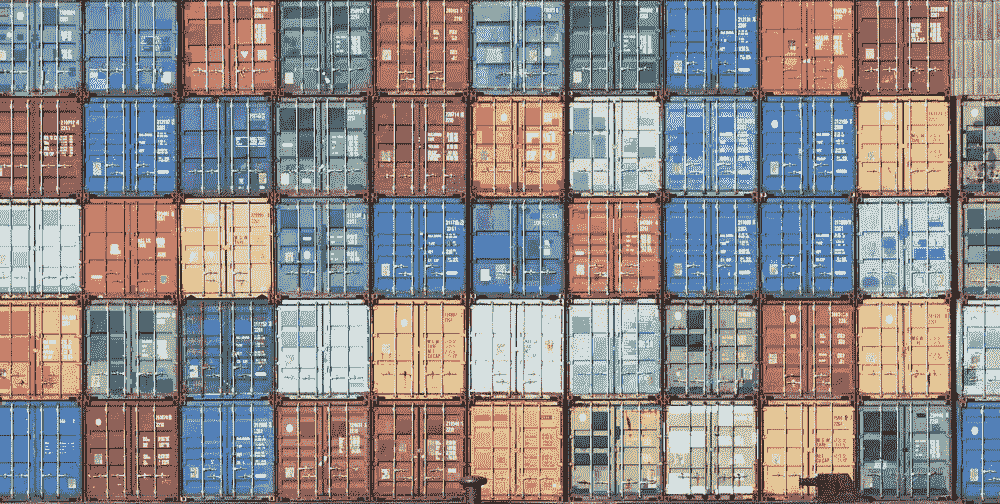
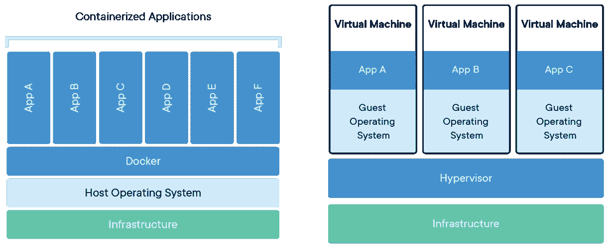

# node . js Docker 实用介绍

> 原文：<https://levelup.gitconnected.com/a-practical-introduction-to-docker-with-node-js-9c6fb7673e1f>

我们将通过 Node.js 中的一个例子来了解 Docker 的基础知识，从而理解它的好处。您可以从本文[这里](https://github.com/dustytrinkets/docker-node-example)下载工作代码示例。



当我们谈论软件时，它包括一整套组件，包括前端和后端组件、数据库、库等。

在我们软件的部署过程中，我们必须确保所有这些组件都能在我们的应用程序可能运行的各种平台上工作。

# docker 是做什么用的？


我猜您已经面临过这样的情况:您在本地测试您的应用程序，当部署它时，有些东西不能像预期的那样工作。

Docker 通过简化部署应用程序的过程来解决这个问题，它通过**打包应用程序及其所有依赖项，并在一个隔离的环境中运行它**，使这个过程变得非常简单和高效。

虽然 Docker 可以出现在软件开发的整个工作流程中，但它的主要用途是在部署期间。

这样，Docker 将你的应用程序分离到一个标准化的单元中，我们称之为容器。

# 什么是容器？

记得我们说过 docker **在一个隔离的环境**中打包并运行你的应用。这就是我们所说的容器。

容器提供了一种打包机制，在这种机制中，应用程序可以从它们实际运行的环境中抽象出来，这为开发人员提供了创建可预测环境的可能性。容器成为测试应用程序的单元。

# 为什么选择 docker？

## Docker 与虚拟机

***虚拟机***(VM)是将一台服务器变成多台服务器的物理硬件的抽象。虚拟机管理程序是创建和运行虚拟机的计算机软件、固件或硬件，允许多个虚拟机在一台机器上运行。每个虚拟机都包含操作系统内核、应用程序和必要库的完整副本。虚拟机启动也可能很慢。

> **内核**是操作系统的一部分，处理内存管理、资源分配和其他对系统至关重要的底层服务。



容器和虚拟机具有相似的资源隔离和分配优势，但是**功能不同，因为容器虚拟化的是操作系统而不是硬件。**

**容器**是应用程序层的抽象，将代码和依赖项打包在一起。多个容器可以在同一台机器上运行，并与其他容器共享操作系统内核，每个容器在用户空间中作为独立的进程运行。

## 码头工人的好处

从运营的角度来看，它可以提高基础设施的效率，从而更好地利用计算资源。这允许我们在给定的硬件组合上运行比使用虚拟机更多的容器。

回到容器，容器是 docker 映像的一个**运行时实例。**所以基本上，docker 容器由 docker 映像、执行环境和一组标准指令组成。但是，什么是形象呢？

# 什么是图像？

正如我们所见，容器是图像的可运行实例。因此，与容器不同，图像**没有状态**，并且从不改变。图像是一个**模板，带有创建 docker 容器**的指令。

从这里开始，我们将遵循来自[库](https://github.com/dustytrinkets/docker-node-example)的示例来构建我们的节点应用程序并将其归档。

首先，我们有一个 index.js 文件，它公开了一个 get 并返回运行应用程序的端口。对于这个例子，我们需要安装 express 和 dotenv 作为依赖项。

索引. js

如果我们运行应用程序并浏览 [http://localhost:3000](http://localhost:3000) 服务器将返回

```
Your application is running on port 3000
```

那么接下来的问题是，我们如何建立一个 docker 形象？

# Dockerfile 是干什么用的？

对于构建图像，我们使用 Dockerfile。这是一个带有简单语法的文件，用于定义创建和运行我们的图像所需的步骤。

通常，它是一个基于另一个图像的图像**，带有一些额外的定制。这是 Dockerfile 文件包含的内容。因此，为了组装我们的图像，我们将创建一个文档，其中包含构建我们自己的应用程序的图像所需的所有命令。**

我们可以创建自己的图像，或者使用他人创建并在注册表中发布的图像。例如，我们可以使用在 **Docker Hub 上发布的任何图像。**

我们将构建节点应用程序的映像。为此，我们可以从 Ubuntu 映像的开始**，在它上面安装 Node，然后安装我们的应用程序，或者直接从节点映像开始。**

来自 ubuntu 映像的 Dockerfile

**docker 文件中的每个指令在图像中创建一个层**，当您更改 docker 文件并重建图像时，**只有那些已更改的层才会被重建**。这就是为什么图像如此轻便、小巧和快速。

我们将从节点映像启动**，并从那里安装和运行我们的应用程序，如下所示:**

来自节点映像的 Dockerfile

在这之后，我们有**运行**一对命令。第一个将 Python 作为构建依赖项安装。对于这个项目所具有的依赖项来说，这是不必要的，但是这是一个很好的例子来看看如何插入构建依赖项，也就是说，我们需要构建我们的应用程序，但是一旦程序被编译，我们就不再需要它了。第二个安装项目的依赖项。

在这些例子中，我们**在源代码**拷贝之前**拷贝 **package.json** 。。**)。这是因为 Docker 映像是由**层**组成的，并且由于文件 **package.json** 不像我们的源代码那样经常改变，所以我们不想在每次运行`docker build`时都要重新构建我们的 **node_modules** 。

我们将把 **ENV** 变量端口和类型设置为 3000，这样我们就可以在运行 dockerised 应用程序时看到不同之处。

之后， **EXPOSE** 告诉 Docker 容器在运行时监听哪个端口，在本例中我们是公开端口 3000。

最后， **CMD** 命令告诉 Docker 如何运行我们打包在映像中的应用程序。CMD 遵循格式 *CMD [“命令”、“参数”]* 。

如果我们现在运行命令`docker build .`,我们将构建刚刚创建的映像。如果我们想标记刚刚创建的图像，我们也可以运行`docker build --tag myapp .`。

我们现在可以看到我们刚刚用命令`docker images`构建的图像。

为了提高构建的性能，我们应该通过向目录添加一个`.dockerignore`文件来避免文件和目录包含在映像中。在我们的例子中，我们忽略了所有不需要的文件。

我们现在可以运行`docker run -p 3001:3000 myapp`。这样，我们将主机端口 3001 映射到容器端口 3000。图案是`HOST:CONTAINER`。

现在，当我们访问 http://localhost:3001 时，服务器将返回:

```
Your built with Dockerfile application is running on port 3000
```

# docker-compose 是干什么用的？

假设我们想要运行两个容器，一个用于节点应用程序，另一个用于存储一些信息的数据库，例如 MongoDB。这就是 docker-compose 变得有用的时候。

docker-compose 定义了一个 docker 运行命令。这是创建和运行我们的容器的一组步骤。我们在一个文件中定义一个多容器应用程序，然后用一个命令启动我们的应用程序，这个命令完成了运行应用程序所需的一切。

首先，确保在您的机器上安装了 docker-compose，并添加这个 docker.compose.yml 文件:

docker-compose.yml

我们在这里给出构建两个图像的指令，一个用于 ***myapp*** 一个用于 ***mymongo*** 。

在服务 ***myapp*** 中，我们告诉 docker-compose 使用同一个目录中的 Dockerfile(即。从`build .`指示运行 build 命令，Dockerfile，就在当前工作目录下)。

我们还告诉 myapp `depends_on` mymongo，所以 *myapp* 不会运行，直到 *mymongo* 运行。

使用`ports`指令，我们再次映射暴露于 3001 的端口，就像我们之前手动使用`docker run`命令一样。

我们设置了 ***环境*** 变量**端口**和**类型**，这样当我们运行命令`docker-compose up`并检查 [http://localhost:3001](http://localhost:3001) 时，我们应该看到:

```
Your built and run with docker-compose application is running on port 3000
```

命令`docker-compose up`根据 docker-compose.yml 为 Docker 提供构建图像和运行容器的指令。

命令`docker-compose down`关闭了之前脚本运行的所有服务。

由于`docker ps`列出了 docker 引擎中所有正在运行的容器，`docker-compose ps`列出了与`docker-compose file`中声明的图像相关的容器，因此`docker-compose ps`的结果是`docker ps`结果的子集。

# Docker 命令行备忘单

以下是一些有用的 Docker 命令解释:

`docker build --tag ***tagname*** .` →从当前目录下的 Dockerfile 文件构建一个图像，并标记该图像。示例:`docker build --tag myapp .`

`docker run -d -p 80:80 ***tagname*** service nginx start` →例:`docker build --tag myapp .`

`docker ps` →检查运行中的容器。

`docker ps -a` →显示所有容器(默认显示正在运行的容器)。

从给定的 docker 容器进入控制台。

`docker images` →查看本地构建的图像

`docker images -a` →查看本地存储的所有图像，包括中间图像。请记住，每个 docker 映像都由层组成，这些层之间具有父子层次关系。Docker 称之为**中间图像。**

`docker image rm ***imagename***` →删除一幅图像。

`docker stop ***containername***` *→* 停止一个容器。

`docker rm ***containername***` →取出一个容器。

`docker-compose -f ***path/to/docker-compose.yml*** up` →创建并启动 docker 合成文件中指定的容器。示例:`docker-compose -f docker/docker-compose.yml up`

`docker-compose -f ***path/to/docker-compose.yml*** down` →停止并移除容器、网络、图像和卷。例子:`docker-compose -f docker/docker-compose.yml down`