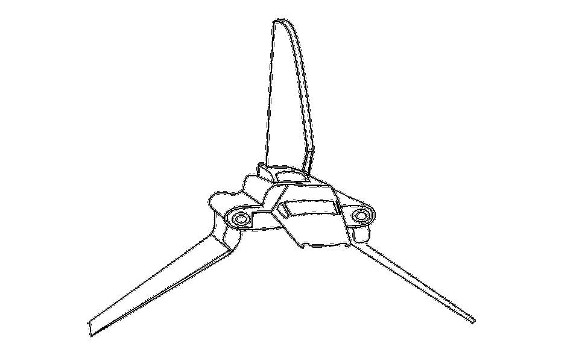

# Python Lambda 函数的实用介绍

> 原文：<https://levelup.gitconnected.com/a-practical-introduction-to-python-lambda-functions-3b4a0702b6a1>



看，一艘形似 Lambda 的星球大战飞船！

> 想获得灵感？快来加入我的 [**超级行情快讯**](https://www.superquotes.co/?utm_source=mediumtech&utm_medium=web&utm_campaign=sharing) 。😎

在 Python 中， *Lambda 函数*指的是一个小型的匿名函数。我们称这些函数为匿名函数，因为从技术上来说它没有名字——我们不用 Python 中常用的标准关键字`def`来定义它。相反，Lambda 函数被定义为执行单个表达式的一行程序。

尽管它们看起来不同，Lambda 函数的行为方式与使用`def`关键字声明的常规函数相同。它们的执行方式与常规 Python 函数类似，只是它们严格执行单个表达式。

Lambda 函数主要用于创建小型的一次性函数。你经常会看到它们代替了一个完全定义的函数，但是为了节省时间和空间，它们被写成了 Lambda。来自 [Python 设计和历史常见问题解答](https://docs.python.org/3/faq/design.html):

> 与其他语言中添加功能的 lambda 形式不同，如果你懒得定义函数，Python lambdas 只是一种速记符号。

具体描述，λ函数可以通过以下 3 点来理解:

*   Lambda 函数必须总是执行单个表达式
*   表达式是由 lambda 函数运行的 Python 代码，它可能会也可能不会返回任何值
*   lambda 函数可以接受任意数量的输入参数并返回任意数量的输出参数，只要该函数被维护为单个表达式

# Python 中的基本 Lambda 函数

所有 Python Lambda 函数遵循完全相同的语法:

```
lambda arguments: expression
```

例如，假设我们想要声明一个 Lambda 函数来计算除法运算的余数。当然，我们可以不用 Python 的`%`操作符来实现这个功能，但是在浏览代码时可读性不是很好。第一遍通读的时候很容易漏掉，也不直观抓。

然而，当我们使用 Lambda 函数时，我们能够进行清理，以获得更好的可读性和更干净的代码:

```
compute_remainder = lambda x, y: x % y
```

我们的 Lambda 函数接受两个参数，`x`和`y`，然后通过`x % y`使用 Python 的`%`操作符计算这两个参数的余数。要调用该函数，我们所要做的就是像应用任何其他常规 Python 函数一样，传递参数并将返回值保存在一个变量中。

```
### Prints out 1
r = compute_remainder(10, 3)
print(r)
```

我们使用 Lambda 函数的代码简单且包含。

# filter()函数

`filter()`函数用于从 Python 序列中选择特定的元素。Python 序列是一种可以保存多个元素的数据类型，例如列表、元组、集合或字符串。

过滤函数将两个项目作为输入，一个*对象*和一个*序列:*

```
filter(object, sequence)
```

对象将是我们的 Python Lambda 函数。因此，我们正在使用 Python Lambda 函数过滤*序列*。

由于我们传递的 Lambda 函数将执行过滤操作，我们将需要它严格返回一个布尔值— `True`保留一个元素，`False`将其过滤掉。然后，filter 函数将返回另一个序列，该序列仅包含 Lambda 评估为 True 的元素。

例如，假设我们有一个数字列表，我们想过滤掉所有小于 50 的数字。我们可以通过列表理解来做到这一点:

```
### Prints out [66, 91, 98, 80, 99]data = [66, 15, 91, 30, 35, 38, 43, 20, 38, 28, 98, 50, 7, 80, 99]
filtered = [d for d in data if d > 50]
print(filtered)
```

虽然列表理解绝对是 Pythonic 式的，但对读者来说不是很友好。相反，带有 Lambda 的过滤函数看起来要干净得多。

```
### Prints out [66, 91, 98, 80, 99]data = [66, 15, 91, 30, 35, 38, 43, 20, 38, 28, 98, 50, 7, 80, 99]
filtered = list(filter(lambda x: (x > 50), data))
print(filtered)
```

我们的过滤器非常适合一行程序，同时比列表理解更具可读性，并能完成相同的任务。

# map()函数

`map()`函数用于将操作符或表达式应用于序列中的每个元素。例如，如果您的序列是一个数字列表，您可能希望将每个数字除以 2，这是使用`map()`函数的最佳情况。

map 函数将两个项目作为输入，一个*对象*和一个*序列:*

```
map(object, sequence)
```

就像之前一样，对象将是我们的 Python Lambda 函数。因此，我们对*序列*中的每个元素执行 Lambda 中的表达式。

因为我们传递的 Lambda 函数将在每个列表元素上执行一个表达式，所以我们的 Lambda 可以返回任何类型的值。唯一需要注意的是你的列表中没有任何元素会给你的 Lambda 函数带来错误。例如，您可能有一个既包含整数又包含字符串的列表，所以试图将每个元素除以 2 是行不通的。

让我们用一个和`filter()`相似的例子，我们有一个数字列表。在这种情况下，我们将编写代码来计算列表中每个元素的平方。同样，我们总是可以通过列表理解来做到这一点:

```
### Prints out [33.0, 7.5, 45.5, 15.0, 17.5, 19.0, 21.5, 10.0, 19.0, ### 14.0, 49.0, 25.0, 3.5, 40.0, 49.5]data = [66, 15, 91, 30, 35, 38, 43, 20, 38, 28, 98, 50, 7, 80, 99]
mapped = [(x / 2) for x in data]
print(mapped)
```

虽然列表理解肯定是*python 式的*，但它对读者来说不是很友好。相反，带有 Lambda 的 map 函数看起来要干净得多。

```
### Prints out [33.0, 7.5, 45.5, 15.0, 17.5, 19.0, 21.5, 10.0, 19.0, ### 14.0, 49.0, 25.0, 3.5, 40.0, 49.5]data = [66, 15, 91, 30, 35, 38, 43, 20, 38, 28, 98, 50, 7, 80, 99]
mapped = list(map(lambda x: (x / 2), data))
print(mapped)
```

我们的映射非常适合一行程序，同时比列表理解更具可读性，并完成相同的任务。

# 喜欢学习？

在 Twitter 上关注我，我会在这里发布所有最新最棒的人工智能、技术和科学！也在 [LinkedIn](https://www.linkedin.com/in/georgeseif/) 上和我联系吧！