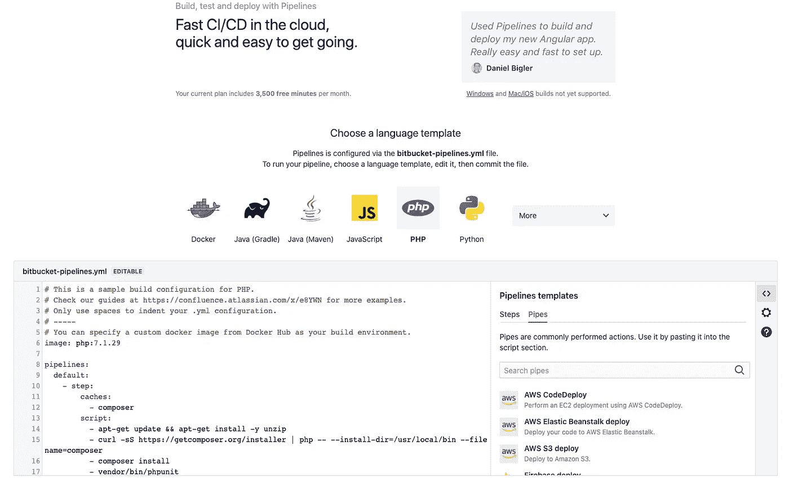

# 使用位桶管道的实用方法

> 原文：<https://levelup.gitconnected.com/a-practical-way-to-use-bitbucket-pipelines-72c9f515df34>


在 [Unsplash](https://unsplash.com?utm_source=medium&utm_medium=referral) 上由 [Erlend Ekseth](https://unsplash.com/@er1end?utm_source=medium&utm_medium=referral) 拍摄的照片

## 以及如何快速入门

这是给那些想知道如何在他们的项目中使用 Bitbucket 管道的人的指南。本文提供了一个逐步演练，引导您完成整个过程。

# 入门指南

为了开始，我们需要创建一个名为*的文件。这个文件保存了我们的库的构建配置，它是以 [YAML](https://yaml.org) 格式定义的，并定义了您的管道应该如何运行。*

因为 *bitbucket-pipelines.yml* 包含在您的存储库中，所以它包含在 GIT 中，它也被版本化，这意味着它与您的代码同步。

要查看官方入门指南，请访问[官方融合文档](https://confluence.atlassian.com/bitbucket/get-started-with-bitbucket-pipelines-792298921.html)。

## 语言模板

您可以选择各种不同语言的模板来开始使用。
或者您可以创建完全符合您需求的定制管道。



在本指南中，我将重点介绍 [PHP](https://php.net) 模板和包含 [Laravel⁴](https://laravel.com) 框架的资源库。

在示例中，您将看到我们正在运行 [apt⁵](https://itsfoss.com/apt-command-guide/#:~:text=What is apt?) 命令，这些命令让您可以与 Linux 的打包系统进行交互，而您通常希望将这个打包系统保持在最低限度。这增加了不理想的构建时间。

你可以寻找一张 Docker⁶的图片，里面有你需要的一切，或者你也可以创造自己的图片。

# 变得实际

看看下面的要点。这是我们的*bit bucket-pipelines . yml*，它完全可以做以下事情:

*   安装环境
*   安装项目
*   运行代码嗅探器
*   运行测试

这个例子不仅仅是基本的，而且是我们想要达到的最好的。我们将浏览文件，看看代码，看看它做了什么。

# 说明

我将尽我所能解释我们的 bitbucket-pipelines.yml 中的大部分部件是做什么的，并确保共享来自 Atlassian 的源代码。

## 图像

这可能是我们文件中描述的最简单的事情，但仍然值得一提。我认为这很重要的原因是，该图像不仅允许默认的 docker 图像，还允许托管在 [Docker hub⁷](https://hub.docker.com) 之外的图像。

请访问“[使用 Docker 图片作为构建 environments⁸](https://confluence.atlassian.com/bitbucket/use-docker-images-as-build-environments-in-bitbucket-pipelines-792298897.html) ”指南。

## 选择

我们使用`*最大时间*'选项来确保构建永远不会超过给定的时间。我们这样做的原因是，我们不希望管道无限期地运行，浪费我们的构建时间。

当中的命令递归调用自身并且不抛出错误时，可能会发生这种情况。所以这是一种确保我们不浪费钱的保险措施。

当您的存储库增长时，几乎可以肯定它会比我们给它的给定时间更长。当这种情况发生时，是时候调整时间做一些更明智的事情了。

## 管道

这将保存我们所有的管道定义。例如，您可以使用`*默认的*'定义。
您将在此定义中添加的步骤将在每次推送时运行。

所以在我们的例子中，这是非常多余的，所以我们使用`*拉请求*'的定义。这允许我们定位我们将添加步骤的分支。

## ‘**’

这是一个分支定义，属于“*拉取请求*”定义。我们将添加一些步骤，这样构建将会经历这些步骤，并执行我们想要执行的任务。

## 服务

在`*定义*定义下，我们添加我们的`*服务*定义，我们的应用程序将在我们的构建中使用这些定义。

在我们的例子中，它只存在于一个服务定义中。

```
definitions:
  services:
    mariadb:
      image: mariadb:10.3
      environment:
        MYSQL_DATABASE: 'laravel'
        MYSQL_ROOT_PASSWORD: 'root'
        MYSQL_USER: 'laravel'
        MYSQL_PASSWORD: 'root'
```

因此，因为我们在我们的服务器上运行 [MariaDB⁹](https://mariadb.com) ，所以将它添加到我们的管道中是明智的。

为此，您可以在您的服务定义下添加一个新的定义，并使用您想要添加的服务的名称作为这个定义的键。

第二，您将需要添加您想要使其可访问的服务的映像，在我们的例子中，这是` *mariadb:10.3* `。

根据您添加的图像，您可能需要添加环境变量。

# 步伐

至于步骤，它们本身应该有一个章节，这样更容易理解我们正在使用什么选项以及我们为什么这样做。

我还会添加一些额外的东西，你可以使用，这是 YAML 语法，但使管道工作比我认为值得一提的好得多。

## 步骤

首先，我们从一个普通的步骤开始构建。让我们在下面仔细看看它，并浏览一下我们的步骤定义。

```
- step:
    name: Node Build
    image: node:lts
    caches:
      - node
    script:
      - npm install
      - npm run dev
    artifacts:
      - public/css/**
      - public/fonts/**
      - public/img/**
      - public/js/**
```

首先，我们从步骤的名称开始。我喜欢给它一个描述性的名字，这样当你浏览文件时，你就知道这个步骤应该做什么。

其次，我们正在分配一个新的图像。这感觉好一点，因为我们知道有一个节点 docker 图像。它还允许我们仅在分配了正确映像的情况下运行特定任务。

在第三步中，我们分配应该使用的缓存。在我们的例子中，我们希望缓存节点。我们这样做是为了加快构建速度，这样我们就不会一遍又一遍地下载所有的东西。

然后我们添加我们的脚本。在这种情况下，它应该做什么就很简单了。
首先，我们希望运行` *npm install* `以便安装所有节点模块。
我们想运行` *npm run dev* `这样我们的资产将为开发服务器编译。

最后，我们正在分配我们的工件。这些是我们希望在下面的步骤中重用的路径。这使得例如在稍后阶段运行端到端测试成为可能。

## 安装步骤

在我们的应用构建步骤中，你会看到我们正在为[作曲家⁰](https://getcomposer.org) 分配一个新的缓存。

在这一点上，我们的剧本是最重要的。你会看到一些你可能还没见过的东西，但是很酷。

那么什么是`*-*`符呢？嗯，叫做[块标量](https://yaml-multiline.info)。
这允许我们使用多行，因此一切都更具可读性，但它被解释为单行。

因此，我们正在为 Linux 安装以下库:

*   饭桶
*   卷曲
*   libmcrypt-dev
*   Maria db-客户端
*   Ghostscript
*   ssh rsync
*   zlib1g-dev libzip-dev unzip

如你所见，我正试图捆绑属于彼此的库，以便于理解。

启用一些 docker 扩展后，我们正在下载 Composer 并运行我们的项目安装脚本。

```
composer install &&
php artisan clear-compiled &&
php artisan config:clear &&
php artisan route:clear &&
php artisan migrate:fresh &&
php artisan db:seed --class=PermissionSeeder &&
php artisan optimize:clear
```

## 平行的

在并行部分，我们最多可以添加十个彼此异步运行的步骤。这意味着在运行我们的测试套件时，我们可以从更少的总构建时间中获益。

因此，我们将同时运行 time，而不是一个接一个地运行我们的代码嗅探器、 [PHPUnit](https://phpunit.de) 单元测试和 PHPUnit 特性测试。

这将允许我们减少时间，同时更有效率。

# 资源

1.  [YAML: YAML 不是标记语言](https://yaml.org)
2.  [比特桶管道入门— Atlassian 文档](https://confluence.atlassian.com/bitbucket/get-started-with-bitbucket-pipelines-792298921.html)
3.  [PHP:超文本预处理器](https://www.php.net)
4.  [Laravel——面向 Web 工匠的 PHP 框架](https://laravel.com)
5.  [Apt 命令指南](https://itsfoss.com/apt-command-guide/#:~:text=What is apt?)
6.  [为开发者赋能应用开发| Docker](https://docker.com)
7.  [Docker Hub](https://hub.docker.com)
8.  [使用 Docker 映像作为构建环境](https://confluence.atlassian.com/bitbucket/use-docker-images-as-build-environments-in-bitbucket-pipelines-792298897.html)
9.  [马里亚布](https://mariadb.com)
10.  [作曲家](https://getcomposer.org)
11.  [YAML 多线琴弦](https://yaml-multiline.info)
12.  [PHPUnit—PHP 测试框架](https://phpunit.de)

# 感谢阅读

我希望这篇文章对了解如何实际使用 Bitbucket 管道有所帮助。

在不久的将来，我计划发表一篇文章，介绍我们如何利用多种环境的环境变量进入位桶管道，以及我们如何实际部署我们的应用程序。