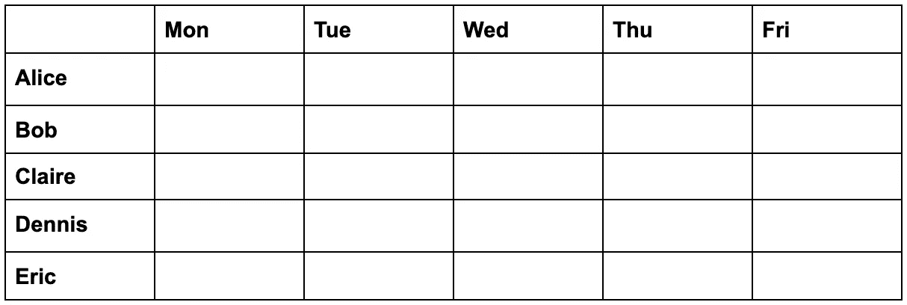
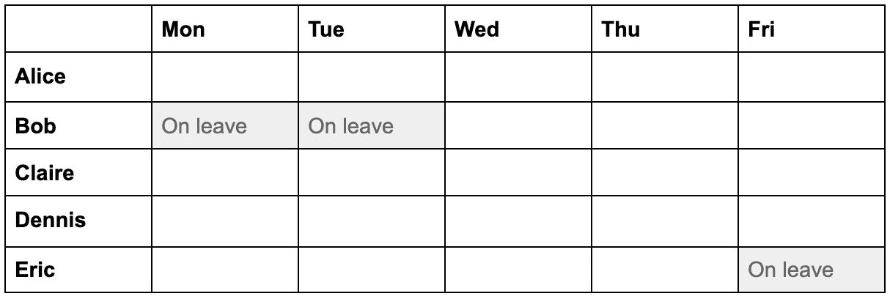
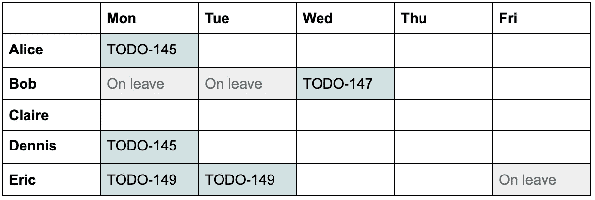
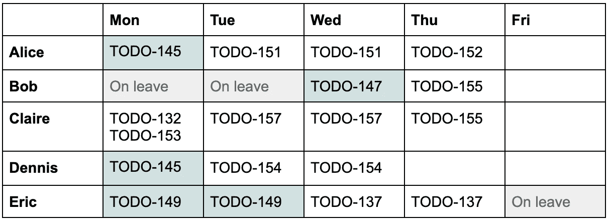

# 规划短跑的实用指南，帮助你赢得马拉松

> 原文：<https://levelup.gitconnected.com/a-pragmatic-approach-to-sprint-planning-2ce632cc1c36>

## 工程管理

## 如何为软件工程团队创建切实可行的冲刺计划，发挥他们的优势并专注于他们的目标。

在 [Unsplash](https://unsplash.com?utm_source=medium&utm_medium=referral) 上[空中聚焦](https://unsplash.com/@airfocus?utm_source=medium&utm_medium=referral)拍摄的照片

这篇文章是关于我最喜欢的一个小型软件开发团队的 sprint 计划方法。它简单、快捷、实用。我已经看到它在几个团队中成功地工作。

使用这种方法，10 个人的团队通常只需要不到一个小时的时间来规划两周的冲刺。新团队成员在第一次 sprint 规划会议上很容易理解这种方法。对于刚刚开始从事 sprints 工作的团队来说，这也很容易掌握。

在本文中，我将以一个小型软件开发团队为例，用一周的 sprint 演示这种方法。然而，这种方法同样适用于更广泛的产品开发团队，包括设计师、产品经理、分析师、测试人员、支持人员等。

# 冲刺规划输入

这种方法的输入是:

*   **团队当前优先事项列表** —阐明整个团队应该努力的方向。可能包括产品和纯技术目标。通常建议整个团队有一个单一的冲刺目标。然而在实践中，这是很少可能的——不同的团队成员通常同时致力于几个目标。一个 6-7 名开发人员的团队可能很容易就有 2-3 个 sprint 目标。因此，这是一份简短的优先事项清单，而不是一个单一的目标。
*   每个团队成员在 sprint 期间的工作天数——这将决定 sprint 的最大团队能力。换句话说，有多少时间可以花在工作上。
*   **当前 sprint 中未完成任务的优先顺序和估计列表** —显示下一个 sprint 的哪一部分用于完成当前 sprint 计划中的未完成工作。
*   **估计任务的优先积压** —阐明团队在接下来的几个冲刺阶段需要做什么工作。理想情况下，应该在 sprint 规划前一两天的单独会议上对待办事项进行优先排序和评估。这加快了规划的速度，并使其更有针对性。以我的经验，用故事点估算任务最简单，一点相当于一天左右:0.5，1，2，3，5。估计值为 5 或更多通常意味着任务应该进一步分解。根据我的经验，人们发现故事点的估算比 t 恤尺寸的估算更容易推理。

# 冲刺规划输出

这种方法的结果是:

*   冲刺计划(Sprint plan)—团队承诺在冲刺结束时交付的优先任务列表
*   **冲刺目标** —团队努力实现的目标的简短列表。

任务列表将帮助团队决定首先要做什么，以及在冲刺阶段可以做什么，甚至放弃什么。sprint 目标将指导团队决定在 sprint 期间将哪些任务添加到 sprint 计划中，以及将哪些任务添加到 backlog 中。

# 冲刺计划会议

让我们来看一个由五名开发人员组成的团队的 sprint 规划会议:Alice、Bob、Claire、Dennis 和 Eric 正在开发一个移动待办事项列表应用程序。Alice 和 Bob 是移动应用程序开发人员，具有一些后端开发经验，Claire 是全栈移动开发人员。Dennis 是一名后端开发人员，在 web 前端和 react native 和 CI 方面有一些经验。Eric 是后端和运营工程师。

在 sprint planning 会议上，团队收集我们刚刚讨论过的信息，并开始准备 sprint 计划。假设当前团队的优先事项是:

1.  为客户添加更多功能
2.  为客户保留现有功能，在没有已知错误的情况下工作
3.  持续收集关于客户如何使用该应用的见解
4.  保持 CI 的健康运行，以平稳地运行构建并及时交付代码

在这个例子中，我们假设团队的冲刺持续一周，从周一开始，到周五结束。团队用故事点来估计他们的任务，一个故事点相当于一个工作日。这意味着 sprint 的最大团队容量是 25 个故事点。

让我们制作一个表格，以团队成员的名字为行，以工作日为列。我们将使用这个表，根据任务优先级和可用的开发人员技能，计划每个团队成员将在这个 sprint 中承担哪些任务。

为了这次冲刺，Eric 在周五休假，Bob 在周一和周二休假。这将最大团队能力减少到 22 天。

作为下一步，团队转移到当前冲刺计划中未完成的任务:

*   **TODO-145** 允许顾客在应用程序中互相分享他们的待办事项列表(爱丽丝和丹尼斯)——还剩 2 分
*   **TODO-147** 允许客户通过电子邮件/短信发送他们的待办事项列表(Bob)——还剩 1 分
*   **TODO-149** CI 性能和可靠性改进(Eric) —还剩 2 分
*   **TODO-112** 调查迁移到不同日志收集服务(Dennis)的情况— 1 分

团队决定在下一个 sprint 期间继续处理前三个任务，并将 TODO-112 移回 Backlog，因为它不再符合团队的优先级。这将减少剩余团队能力 5 点(2 + 1 + 2)到 17 点。

优先待办事项的顶部包含以下任务:

*   **TODO-132** 修复注册时罕见的应用程序错误— 0.5 分
*   **TODO-153** 修复显示很长待办事项列表的缺陷——0.5 分
*   **TODO-151** 允许客户邀请朋友使用待办事宜应用——2 分
*   **TODO-152** 允许客户通过邀请注册— 1 分
*   **TODO-155** 允许顾客标记待办事项——3 分
*   **TODO-133** 更新应用程序中的配色方案和图标——2 分
*   **TODO-157** 允许客户软删除待办事项— 2 分
*   **TODO-137** 修复 CI 中的片状测试— 2 分
*   **TODO-154** 允许客户将照片附加到待办事项中— 2 分
*   **TODO-156** 允许客户在待办事项列表中搜索——4 分
*   **TODO-139** 调查并解决应用分析问题— 1 分

在团队开始将任务纳入 sprint 计划之前，他们需要决定应该将多少剩余能力用于计划的工作，将多少剩余能力用于计划外的工作。

在冲刺阶段，团队可能不得不做一些计划外的事情。例如，客户可能会报告一个必须立即修复的重大错误。CI 或基础设施的技术问题可能会影响团队的表现，并在几天内分散工程师对 sprint 计划的注意力。团队成员可能会生病。有些任务可能比原计划花费更多(或更少)的时间。全局中断可能会导致后端基础架构停止运行。总而言之，任何事情都有可能发生，如果期望在冲刺阶段只处理计划好的任务，那就太乐观了。

我知道两种方法来决定在冲刺阶段计划多少故事点:

*   计划在最近的冲刺阶段交付的故事点的平均数量，
*   计划最大团队能力的百分比。

我还是不确定哪个更好。

第一种在实践中并不总是可靠的。在不同任务、工作日数、人数和干扰的几次冲刺中交付的故事点的平均数量，感觉上并不是一个团队在下一次冲刺中能做多少工作的好估计。有几次，我看到一个团队在做一些事情，比如计算每个开发人员每天交付的平均故事数，然后用这个数乘以 sprint 中的工作日数来得到这个数字。

第二种方法更简单。根据经验法则，一个团队应该根据在冲刺阶段预期的惊喜数量，计划其最大能力的 60-75%。70–75%适用于 1 周短跑，60–65%适用于 2 周短跑。对于更简单的项目，该百分比会更高。对于复杂的问题—更低。

顺便提一句，我应该提到，计划超过 80%能力的团队正在为失败做准备。

让我们回到我们的例子。在这种情况下，对于 1 周的冲刺，我会使用第二种方法，计划达到 75%。最大容量为 22 点，即 16.5 点，可以四舍五入到 17 点。

由于已经为当前 sprint 中未完成的工作分配了 5 个点，团队可以获得 12 个故事点。

*   **TODO-132** 修复注册时罕见的应用程序错误— 0.5 分
*   **TODO-153** 修复了显示很长待办事项列表的缺陷——0.5 分
*   **TODO-151** 允许客户邀请朋友使用待办事宜应用——2 分
*   **TODO-152** 允许客户通过邀请注册— 1 分
*   **TODO-155** 允许顾客标记待办事项——3 分
*   **TODO-157** 允许客户软删除待办事项— 2 分
*   **TODO-137** 修复 CI 中的片状测试— 2 分
*   **TODO-154** 允许客户将照片附加到待办事项中— 2 分

即使拉入的卡的估计值之和实际上是 13。团队没有承诺完成 TODO-155。它只是计划为那张卡做 2 个故事点的工作。

如果团队喜欢在 sprint 开始时将任务分配给特定的开发人员，那么这个计划可以是这样的:

以下是一些需要注意的事项。

*   团队优先修复现有功能中的缺陷，而不是添加新功能，这是一个很好的实践。
*   团队将 TODO-133 留在待办事项中，以便更好地利用 Eric 的技能，而不是修复剩余的 CI 问题。在理想的团队中，任何开发人员都应该能够处理待办事项中的任何任务。然而，实际上，开发人员通常只能处理产品的某个部分。因此，团队必须根据特定开发人员的可用性，稍微打乱优先级顺序，将任务加入到 sprint 中。
*   任务不必分配给特定的团队成员。尽管每个开发人员最好从 sprint 计划的顶部选择下一个任务。这样，每个开发人员最终都可以熟悉整个代码库，并自信地处理产品的任何部分。这将使团队达到我上面提到的“理想”状态。

以下任务仍未完成:

*   **TODO-133** 更新应用程序中的配色方案和图标——2 分
*   **TODO-156** 允许客户在待办事项列表中搜索——4 分
*   **TODO-139** 调查并解决应用分析的问题— 1 分
*   **TODO-112** 调查迁移到不同日志收集服务的情况— 1 分

如果团队提前完成了 sprint 计划——他们应该能够从待办事项列表的顶部引入更多的任务，或者进行一些重构。

冲刺阶段的团队目标可以是:

1.  确保应用程序没有已知的面向客户的错误
2.  提供支持客户协作的功能
3.  不到 5%的 CI 构建会因为不可靠的测试而失败

有了这些冲刺目标，团队将能够决定如何处理计划外的工作。

例如，如果他们得到一个 bug 报告，他们很可能会优先考虑它而不是特性工作，因为它与第一个目标一致。

然而，如果他们得到一个与第二个目标不一致的快速特性请求，他们很可能会将它放在 backlog 中，以便以后进行评估和优先排序。

# 外卖食品

我们看了一个软件工程团队的冲刺计划会议的例子。

团队通过计算即将到来的 sprint 的最大容量开始了会议。然后，他们从当前的 sprint 中拉出未完成的工作，这些工作仍然与他们的优先级保持一致。在那之后，团队计算出他们还能承担多少工作，并从待办事项列表的顶部拉出足够多的任务。然后，团队就他们应该努力实现的几个冲刺目标达成一致。

团队准备的冲刺计划是*现实的*,因为它允许有足够的时间来处理合理数量的计划外和意外的工作，并且*务实的*,因为它专注于与团队目标一致的最优先任务，并且考虑了冲刺期间可用的工程师的技能。

我希望你会发现这种 sprint 计划的方法很有用，并且能够在你的团队中应用它或者借用一些想法。