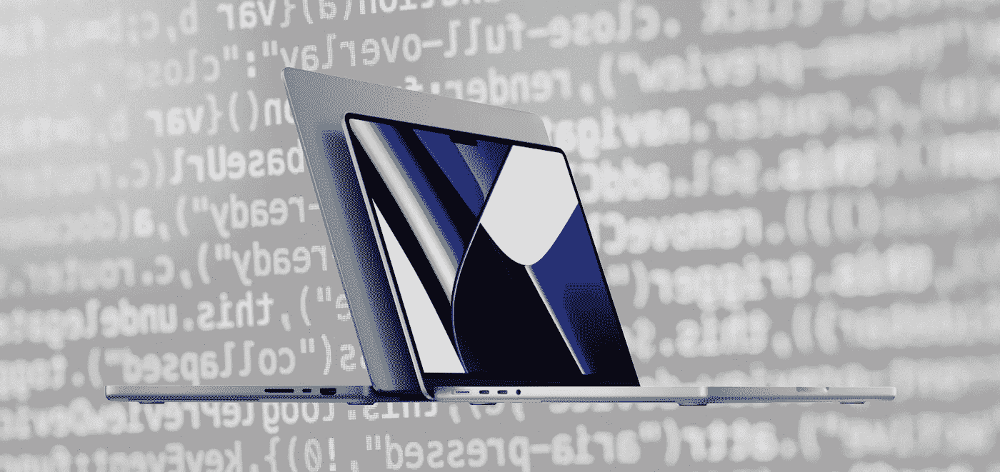

# 一个务实的开发者对苹果 2021 MacBook Pro 的想法

> 原文：<https://levelup.gitconnected.com/a-pragmatic-developers-thoughts-on-apple-s-2021-macbook-pro-189d41cb8ed8>

让我们现在就把事情解决掉。我喜欢苹果产品，而且在很大程度上，我喜欢苹果的总体愿景，多年来一直如此。但我也从成为自己最严厉的魔鬼代言人中获得了巨大的快乐。如果杰夫·敦哈姆与自己的争论可以转化为我对苹果新 MacBook Pros 的看法，那就是它了，除了可能不那么有趣。我永远也体会不到木偶大师的幽默。

今年 10 月的活动是迄今为止我最期待的一次。忘记我的生日，黑色星期五，圣诞节，忘记一切。仅次于疫情的终点，这是我自 2020 年 11 月以来等待的时刻。在[体验了一年的苹果 M1 13 英寸专业套装](/twelve-months-into-using-apples-m1-chip-and-my-opinions-have-changed-1831e77d657e)后，我的兴奋和好奇程度达到了顶点，比我高三级，非常高。我给自己倒了一品脱不含酒精的吉尼斯黑啤酒，在将近一个小时的时间里，我一边品尝着天鹅绒般柔滑的黑咕隆咚，一边品味着苹果公司在这场几乎令人惊讶的短暂活动中设法塞进去的所有技术、营销和其他东西。最后，我只剩下一个空的品脱玻璃杯，老实说……在一个介于困惑、兴奋和一丝失望之间的陌生世界里。

# 好的…

在某些方面，今年 10 月的活动类似于奥普拉的*“你得到一辆车”*时刻。我认为虚拟观众中很少有人觉得他们没有得到什么。当然，与奥普拉的情况不同，这需要相当大的成本，但如果我们与过去四年左右的事件进行比较，苹果似乎处于*“我们删除了这个，这个也是，哦，还有一点，我们也删除了这个”* roll，2021 年客观上是每个人都有所回报的一年，除非你希望再有一个英特尔 CPU。不会再回来了，这可能是件好事。时间(和我在某个时候)会告诉我们…

## 我们有港口。

我们实际上收回了自 2012 年以来被拿走的每个端口，除了以太网端口，但是，嘿，我认为我们都可以接受这一点——如果你问我，我认为它可能已经进入充电砖了。然而，一个 USB-C 转以太网转换器不会冒犯极简主义之神，这一点我可以向你保证。**三个高速 USB-C 端口、一个 HDMI 端口、SD 卡插槽、高阻抗音频端口，甚至还有一个 Magsafe 连接器！**

但是…作为一个软件工程师，你会从这些中受益匪浅吗？咩。作为一名 JavaScript 和 Flutter 开发人员，我不得不说，不尽然。我仍然不得不依靠我的 USB-C 到 USB-A 加密狗在旧手机上进行测试，我的 USB-C 到以太网加密狗不会受到随机 WiFi 频道变化的干扰，我从来没有发现 SD 卡是我软件开发工作流程的一部分。不过，我最欣赏的是 HDMI 和 Magsafe 端口。前者将消除使用加密狗连接到我的旧外部显示器的需要，后者是非常好的，为我节省了一个 USB-C 端口。

如果我戴上内容创建者的帽子，更多的这些端口就有意义了。我终于可以让我的 SD 卡加密狗退役了，我将有不是一个，不是两个，而是三个端口来将我的外部驱动器本机连接到机器，同时仍然对它充电。现在，那…那太棒了！

## 我们有键盘。

我必须承认，我不太明白黑色键盘井周围的边界湿兴奋。也许我比大多数人更喜欢对比，但对我来说灰色比黑色更有意义。毫无疑问，如果在 iFixit 拆除后，键盘更容易更换，我会更欣赏 black well，因此使机器更符合我大部分订阅的修复视力的权利。

我们也有全尺寸的功能键，但就我个人而言，我有点困惑，为什么这对许多人来说如此重要。肌肉记忆是非常迷人的，无论大小，你的手指都会记得按钮在哪里。

我必须说，作为一名软件工程师，我没有发现苹果推出的键盘变化有任何实实在在的好处。也许从可访问性的角度来看，较大的功能键可能更容易够到，然而，苹果机器已经被认为是满足小功能键可访问性需求的顶级产品，嘿，甚至还有 touch-bar。这个新键盘不会让我写代码的效率有丝毫提高，但是欢迎你在评论中提出不同意见。

## 我们有更好的屏幕。

最后，对于任何一个程序员来说，这都是一个客观的进步。更多的屏幕空间意味着在同一个屏幕上为代码、终端、开发工具、仿真器等提供更多的空间，这在 **14 英寸机型上尤其受欢迎，我认为这对许多开发人员来说是一个越来越有吸引力的选择，因为它将更小的外形与强大的马力**结合在一起。我在 13 英寸的机器上做了相当多的开发工作，但它们自己还勉强过得去。这额外的一英寸，即使有缺口，也会产生明显的不同。

更高刷新率、更高像素密度和更高尼特的 pro-motion 屏幕——就像更亮的屏幕一样——我不太确定。从 Retina 开始，苹果屏幕就不错了。自从我的 11 英寸 Air 以来，我还没有见过像素，即使这样也不像当时的竞争屏幕那样可怕。当然，更高的分辨率确实意味着一个人可以在同一时间将更多的应用程序放入同一视图中，但老实说，**每天长时间以超高分辨率编码，不是我推荐的事情**。这些纸面上的改进听起来很棒，但是从软件开发的角度来看，并没有那么有用，尤其是考虑到仿真器是可以扩展的。

## 我们有更好的声音。

因此，您可以在 AppleTV+上以杜比全景声观看最新的 007 电影，几乎让您大吃一惊。或者不…因为让我们现实一点。苹果的声音来自这些笔记本电脑，虽然毫无疑问是顶级的，但它与 3000 美元的无线 Atmos 音频系统或影院体验相去甚远。另外，虽然我没有数据来支持我的理论，**我怀疑没有多少人会欣然接受用笔记本电脑看电影的机会。**我不认为它是多媒体消费的首选设备。平板、手机、电视？是的。笔记本电脑？没那么严重。

更好的声音可能更有意义的地方是在多媒体创作中，尽管我怀疑 may 会指着他们的耳机说我是 eejit，我完全不会被冒犯。更高阻抗的音频端口，嗯，这可能会有所帮助，但再次强调，不是软件工程师，事实上，**对于我们这些以写代码为生的人来说，音频方面的改进可能都没有多大意义**，对吗？

## 我们有疯狂快速的 SOC。

是的，我们有。今年的野兽被释放了。正如苹果不负责任地说的那样。当然，只能被明年的野兽取代。至此，MacBooks 的未来已经明朗。就像 iPhone、iPad 和苹果制造的所有东西一样，每年都会有更新、更好、更大的 SOC。不知何故，它几乎消除了对未来 5-10 年机器的好奇预期的一些魔力。将会是 M2、M3、M4…等等，总是比去年的型号更快、更节能。至少对于 iPhones 来说，总有一些很酷的新相机技术和一些花哨的传感器可以测量岩石的周长，这是你在使用激光雷达之前从未感觉到的。但是从整体来看，这些增加的东西确实吸引了我。M2，M3…说真的，除非你在做一些真正高端的人工智能，否则编译他们的代码需要多快？

新 SOC 的速度本身并没有给大多数软件工程师带来多少实际好处。然而，它所带来的功能——嗯，一个真正重要的功能——更多的 RAM，高达 64GB，尽管有一个缺点。有了英特尔的机器，内存分配就非常清楚了。从 M1 开始，就没这么多了。M1 Pro 和 M1 Max 也不例外。你拥有的任何 RAM 都是共享的，这对软件开发人员来说是一个更困难的决定。你习惯的 16GB 不再是 16GB 了，困难的是，我不知道它实际上是多少，因为它完全取决于你在开发时使用的其他东西，其中有多少会被苹果添加的令人印象深刻的 GPU 使用。

> **我想说 16GB 的型号对于软件开发来说很好，但是——有史以来第一次——凭良心说，我不能这么做。**

见鬼，即使是我为自己准备的假设配置也有 32GB 的内存，因为在我的英特尔机器上，我有 16GB 的 RAM 和 4GB 的 GPU 专用 RAM。总共是 20GB。我的数学很糟糕，但 20 感觉比 16 大得多，在小范围内，我在 8GB 13 英寸的 MacBook Pro M1 上证明了这种恐惧。对于软件工程师来说，所有这些基本上都将入门级的 M1 Pro(14 英寸或 16 英寸)置于一个有问题且不太受欢迎的位置，因此可能会推高价格。也许真实世界的测试会证明我的担心是错误的，但我几乎可以肯定，入门级的 M1 专业人士已经不太适合软件开发人员了。

## 我们有更长的电池寿命。

是的，我们有。虽然具体有多少，还不完全清楚。好的，根据苹果公司的说法，你可以在电池上编译比以前多 4 倍的代码。**对我来说，这听起来像是一个非常怪异且可能规避的指标。**我一生中从未见过或听过工程师通过编译代码来计算电池寿命，以下是我对此的看法。

由于耗电更少的 SOC 和更少的风扇旋转需求，电池在客观上比以前的型号更持久。这一切都很好，**所以我预计我在电池上 4-5 小时的编码时间将增加到 7-8 小时**。那很好。这基本上是一个工作日。它不能保证全天的电池续航时间，但与今天相比，它确实使基于电池的开发工作流程更安全(r)——客观上是不可能的。

# 不好的…

因为不管我有多喜欢苹果，事实上没有一件事不会让我生气。太阳底下真的没有完美的东西了吗？啊！

## 不再有触摸条。

“你有一辆车，你有一辆车，每个人都有一辆车，但我要把剧透拿走！”— 这就是移除 touch-bar 的感觉。听着，我明白。苹果大张旗鼓地推出了 touch-bar 作为下一个大事件。许多人不同意。许多人嘲笑苹果，发誓他们永远不会碰 MacBook Pro，直到*“那个……东西消失”*，所以苹果让它消失，但与所有冒犯骨髓粉丝的刻薄不同，我实际上喜欢那个……东西。我用了很多吗？不，但是它在添加表情符号和控制声音和亮度方面非常棒。CMD+F5 启动 VoiceOver 有点费劲，但我只是用了鼠标。

作为一个普通用户和软件开发者，我从来没有觉得它碍事。我**觉得去掉触控条，给我们更大的功能键并不划算。**touch-bar 的功能多得令人难以置信，而那些功能键恰恰相反。这 100%感觉像是一种倒退。

## 价格更高。

就其本身而言，理论上新款 MacBook Pros 并没有更贵。它们其实比我的 2018 款 15 寸 MacBook Pro 还便宜。**基本款 16 英寸 M1 Pro 比我购买英特尔 i7 的价格便宜大约 250 欧元**，我知道 10 和 16 核 SOC 在 CPU 和 GPU 方面将在各方面胜过我的 i7。而且我连通货膨胀都没算！**然而，回到我之前关于共享内存的观点，选择 32GB 内存来弥补 4GB GPU 内存的损失，使这台机器更加昂贵，价格为 209 欧元。那是一大笔额外的现金吗？有人可能会说不是，但也有人会说有其他更好的方法可以花掉这额外的 200 美元。**

## 基本规格附带一个条件。

因为基本模型总是带有一些荒谬和不合理的缺陷。在这种情况下，14 英寸的型号每年都会患苹果病。**苹果今年大张旗鼓地推出了快速充电。除了它忘记提到的是，8 核 14 英寸型号的充电器将无法提供这一点。至少可以说，你必须为这种令人愤怒的事情付出更多的现金。我不想给苹果出主意，但如何不像这样削弱入门级规格的设备，或者惩罚低预算客户不合理的较差体验，同时几乎迫使他们拥有两个充电器(除非作为定制规格的机器购买)，只是因为他们不需要，不想或负担得起更高规格的版本。我已经多次声明我爱苹果，但是贪婪变得不道德，虐待狂和近乎不人道，这就是那个点。**

# 而真正丑陋的…

今年活动的另一个标题或许应该是… *当复古不再流行时，我们还是会尝试。*

所以，Jony Ive 离开了苹果。伊夫的核心灵感来自迪特·拉姆斯——一个我真正尊敬的人，他引入了 UX 的功能设计，让物理设备变得有意义，同时保留了美感和简洁。今年的 MacBook Pro 感觉就像蒂姆·库克(Tim Cook)在 Ive 的旧桌子里翻找旧的废弃草图，这些草图从未被制作出来，因为它们从未完全符合迪特标准。就是感觉复古又与众不同，没有必要。当然，增加厚度对于额外的硬件和更好的热外壳是必要的，但我觉得设计变化应该停止在那里。

**怪异的 4 条腿曲底设计让人感觉毫无必要的 2009。如果飞人裤再次流行，我会说，好吧，让我们随波逐流吧，这又是一个属于世界的时代了。但事实并非如此。客观上不是。虽然我知道有些人喜欢这个设计，但我也知道有很多人绝对讨厌它。当我在某个时候购买这种新机器的版本时，我几乎感到尴尬，因为我的室友和近 20 年的老朋友对伟大的设计有着出色的眼光，当她看到它时，她会像*“你花了 3000 美元买了这个？！?"我将不得不像*那样“不要只看外表！”。****

# 我要带着这个去哪里？

可能不是去商店买的。在写这篇文章的时候，我实际上说服自己不要买今年的模特。虽然不管出于什么原因，我都有可能被说服去买一个，但我觉得我没有足够好的理由去买。我目前的日常司机——2018 版 i7，15 英寸专业版，似乎做了我需要的一切，虽然我和在苹果活动期间一样好奇体验新机器，但我真的不能证明现在的举动是正确的。当然不是作为一个软件开发人员。以旧换新当然是一个选择，但我也不太相信我可以完全抛弃我的英特尔驱动的 Mac，所以我完全打算保留它，如果没有其他原因，只是为了子孙后代的缘故。

## 你应该买新的 MacBook Pros 吗？

如果你是一名软件开发人员，而你现有的机器能做你需要的一切，我的直觉告诉我，不，不要。对于网络开发，Android，Flutter，Swift 等等，如果你没有被你当前的设置所阻碍，你很有可能在下一年过得很好。然而，在一些情况下，这些新机器可能正是你所需要的。

鉴于疫情已经大大改变了职业规范，你可能会发现自己更多地远程工作，这也可能意味着脱离电网。在这种情况下，一台电池续航时间长得多但马力足以满足您所有需求的机器将会是一个救命恩人，并且一点额外的电力可以帮助您通过 git 合并冲突和单元测试将会大有帮助。

如果这是你的第一台机器，我也会选择它，不管你从事什么职业。如果你是一名软件开发人员，你知道你将拥有目前最好的 Mac，这将是一项伟大的长期投资，并将真正使你的生活更轻松。

最后，如果你是一名软件开发人员，想冒险进入人工智能、游戏或应用程序开发工作流，这些工作流绝对会受益于额外的 CPU 和 GPU 能力，那么这台机器对你来说再次是，尽管请记住，获得足够的 RAM 是充分利用任何 M1 机器的关键，无论是普通的 Pro 还是 Max。

> 让我这么说吧——新款 MacBook Pros 是很棒的机器，但对大多数软件工程师来说可能是不必要的升级。

阿提拉·瓦戈——*高级软件工程师打造令人惊叹的 ed-tech 软件。永远的酷呆子，代码和博客的作者。网络无障碍倡导者，乐高迷，黑胶唱片收藏家。喜欢精酿啤酒！*