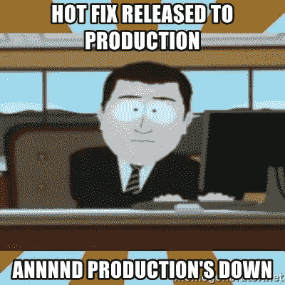

# 一项无人谈论的产品工程技能

> 原文：<https://levelup.gitconnected.com/a-product-engineering-skill-that-no-one-talks-about-6a96bd063361>

## 成为更好的软件产品工程师指南

詹·西奥多在 [Unsplash](https://unsplash.com?utm_source=medium&utm_medium=referral) 上的照片

任何人都可以制造一个产品，但是制造和维护一个在市场上进步的产品需要很多努力。软件工程师喜欢解决问题，修复 bug 是他们在整个编码过程中面临的问题。错误修复是有趣的游戏，直到它发生在生产环境中，客户受到实时影响。

> **事件管理**是每个软件产品工程师都必须具备的一项冷门软技能

# 个案研究

玛丽在一家在线销售鞋子的电子商务公司工作。组织中的应用程序是作为微服务构建的，他们有 10 多个服务，每个服务有 5 名以上的工程师。Mary 是一名高级工程师，她的团队中有 3 名初级工程师和 1 名实习生。Mary 向负责管理其他一些微服务的技术主管汇报。

在一次例行的每周发布中，Mary 团队中的某人将一个代码推向生产，该代码允许客户编辑鞋子的价格，并以编辑后的价格完成购买。一个星期五的下午 6 点，Mary 的经理打电话给她，告诉她生产环境出了问题。

玛丽如何解决这个问题？

## 如何提高您的事件管理技能？

这个问题没有明确的答案，因为它会因行业而异。根据我的个人经验，我总结了软件产品工程师在事故中可以遵循的 10 个要点。

1.  首先也是最重要的一点，Mary 应该花一些时间去了解到底是什么问题。在玛丽完全理解这个问题之前，在这里花一些时间是可以的。总比花时间，解决错误的问题要好。
2.  保持冷静。放轻松，花点时间处理这个问题玛丽正准备开始她的周末，这个电话可能会让她非常沮丧。你永远不知道事故什么时候会发生。重要的是，带着一个新鲜的头脑进入事件作战室。玛丽决定冷静下来，补充水分，然后进入作战室。
3.  你可能是个万事通，但还是要趁早接触合适的人
    玛丽的整个职业生涯都是一名工程师，她也是组织中表现最好的人之一。这并不意味着她应该自己调试一切。她发现了可能造成影响的提交，并请求初级开发人员加入呼叫。
    她还让她的经理和技术主管了解问题的状态、下一步措施以及修复的预计时间。
4.  **清楚地沟通，有同理心** 玛丽平静地向她的同事解释问题，并提出解决方案
5.  遵循不责备的文化虽然玛丽个人对这件事不高兴，但她没有向她的同龄人发泄。她认为这是工作的一部分，可能会出错。
6.  **分析影响

    她将这些客户的详细信息传递给运营团队，以检查这些订单是否可以并行纠正。**
7.  **找到如何立即阻止影响恶化的方法**
    Mary 想出了一个计划，暂时阻止平台接受更多订单。她通知前端工程师展示维护横幅。
8.  **找到补丁，彻底测试，应用补丁** 一旦初级开发人员编写了补丁，Mary 会亲自彻底检查代码，并要求在 QA 环境中测试。一旦所有的测试检查都通过了，她请求部署并拉下维护横幅。
9.  **观察和监控** 一旦部署了补丁，Mary 就要求进行生产测试，并亲自监控此后下的一些订单。在确认一切正常后，她将监控责任移交给一名支持工程师并签字确认。
10.  找到 RCA，并取得尸体的所有权。看看你将来如何避免此类事件
    接下来的一周，她与她的同事重新分组，以确定这个边缘案例是如何被遗漏的，以及将来如何避免这种情况。她建议在价格差异的情况下发出警报，如果值被篡改就抛出错误，并编写更多的单元测试来测试所有场景。

[https://memegenerator.net](https://memegenerator.net/img/instances/57807095/hot-fix-released-to-production-annnnd-productions-down.jpg)

# 结论

事件管理在软件工程社区中没有被广泛使用，我相信这是一种软技能，只有通过面对许多事件才能得到发展。在某些组织中，技术主管完全负责事件管理。如果你是一名软件产品工程师，渴望成为一名技术领导者，你可以通过跟随你的资深同事来开始提高你的事故管理技能。

[https://media.makeameme.org/](https://media.makeameme.org/created/so-youre-telling-400b135511.jpg)

不管有没有最好的工程师和使用最好的工具，你仍然可能面临事故。利用每一个机会，从中学习，让自己变得更好。