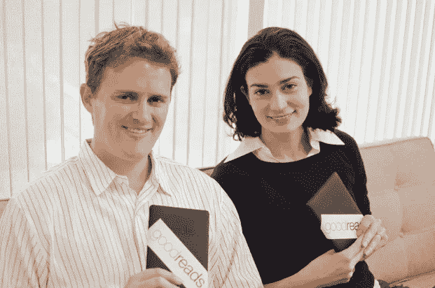

# 一个程序员和他的女朋友一起开发了一个价值 150，000，000 美元的产品，却没有商业模式

> 原文：<https://levelup.gitconnected.com/a-programmer-builds-a-150-000-000-product-with-his-girlfriend-and-no-business-model-a4ab7c8eb1c8>

## 在没有任何员工的情况下工作了几年

来自 goodreads.com 的奥蒂斯和伊莉莎白·钱德勒的照片

奥蒂斯和伊丽莎白的钱德勒从小就爱看书。

但问题是，没有多少已经读过一本书的人会在网上分享他们的评论。没有人们可以写书评的高质量网站。

在这个世界上，任何人都很难决定是否要读一本没有质量评价的书。

如果一个已经读过这本书的人分享他们对这本书的真实看法。这些观点很有价值。

如果所有的观点和评论都集中在一个地方，这对几代人来说都是有价值的。

这就是奥蒂斯和伊丽莎白·钱德勒创造 goodreads.com 的原因。

# 伊丽莎白对高等教育不感兴趣

伊丽莎白没有上大学的打算，她想成为一名肚皮舞者。

她的父母坚持认为她需要上大学。最初，她打算上一年大学，然后离开。

她一直是个好学生，这就是她被斯坦福大学录取的原因。

在斯坦福大学读完第一年后，她去了波士顿的腹部学校。

在波士顿的腹部学校，她是最好的艺术家之一。她计划进行不同的试镜。

但由于大量练习，她严重伤害了其中一个髋关节窝，然后回到了大学。

大学一毕业，她就在自己的房子里找到了一份在《帕洛阿尔托周刊》的实习工作。她喜欢在《帕洛阿尔托周刊》工作。

正是因为这份工作，她开始喜欢上了新闻工作。

# 奥蒂斯的童年是什么样的？

奥蒂斯属于洛杉矶的一个名门望族。

奥蒂斯的家人经营洛杉矶时报。他的祖父是出版商。

奥蒂斯有一个可爱而美好的童年。

## 孩提时代，奥蒂斯的生活在得知父亲患有癌症后发生了改变

当他 10 岁的时候，他发现他的父亲患了癌症。

医生告诉他的父亲，他只能再活两年。

但是他的父亲因为治疗而活了 15 年。

奥蒂斯父亲的癌症让他成长得快了一点。他对当时生活中发生的不同事情承担了更多的责任。

他的母亲有三个弟弟妹妹，她必须独自抚养。

奥蒂斯是学校里最聪明的学生之一。

> “我是一个出类拔萃的孩子，但我没有新闻基因。我从我的另一个祖父那里获得了工程基因，他是一名土木工程师。”

奥蒂斯在斯坦福大学主修机械工程，因为他喜欢建造新的东西。

## 奥蒂斯作为软件开发人员的第一份工作

尽管他已经学了两门软件工程的课程，他还是设法找到了一份软件工程师的工作。他得到的工作是在一家拥有大约 20 名员工的初创公司。

他加入时，公司名为 emode.com，后来更名为 tickle.com。

该公司曾经设计和进行性格测试。

奥的斯过去在公司设计这些个性测试时接受有趣的工程挑战。

# 这两个人是怎么认识的？

这两个人，奥蒂斯和伊丽莎白，从大学就不认识。

他们从斯坦福毕业后，在帕洛阿尔托的一个聚会上相遇。

伊丽莎白辍学将近两年，奥蒂斯辍学六个月。

伊丽莎白在奥蒂斯的一个朋友的家庭聚会上遇见了奥蒂斯。在他们第一次见面时，伊丽莎白告诉奥蒂斯她的职业以及她是如何学习物理的。

后来，奥蒂斯告诉他的朋友，他遇到了一个了不起的女孩，觉得她就是那个人。

后来这两个人开始交往。

## 异地恋四年后的分离

伊丽莎白搬出了城镇去学习新闻。

他们的关系变成了异地恋。

经过四年的异地恋，2005 年伊丽莎白决定分手，因为他们的关系没有任何进展。

奥蒂斯对分手并不开心。

他开车去洛杉矶见伊丽莎白，并最终决定搬到洛杉矶。他开始住在伊丽莎白住的地方附近。

他继续在洛杉矶为他的公司工作，工资更低，工作时间更短。

同时，伊丽莎白在洛杉矶的《洛杉矶时报》找到了一份工作。

2005 年，当伊丽莎白在《洛杉矶时报》找到一份工作时，奥蒂斯的家人不再与《洛杉矶时报》有任何瓜葛。

奥蒂斯的家人把《洛杉矶时报》卖给了一家公司。伊丽莎白被《洛杉矶时报》聘为助理编辑。

## 奥的斯公司被收购

奥蒂斯住在洛杉矶时为 tickle.com 做兼职。

tickle.com 后来被 monstor.com 以大约 1 亿美元的价格收购。

由于奥蒂斯不是公司的创始人，他从中赚了一些钱。税后金额约为 8 万美元。

那时，奥蒂斯意识到你必须成为一个创始人才能赚到改变生活的钱，

# 奥蒂斯是如何想到创办 Goodreads 的

奥蒂斯在旧金山一个朋友的公寓里。他在他的起居室里看见了书架。

他直接被吸引到书架前，向他的朋友询问书架上的每本书。

奥蒂斯问了这样的问题:

> “你喜欢这个吗？”
> 
> “那一个呢？”

奥蒂斯带着五六本书离开了公寓。他读那些书很兴奋。

对奥蒂斯来说，这是鼓舞人心的时刻之一。

## 这个想法突然出现了

因为在他的日常工作中，奥蒂斯正在建立一种有个人资料页面的社交网络。

他认为如果他能做一些东西，让人们可以分享他们对读过的书的看法，那将会很棒。

这样，每个人都会有比他们能读到的更多的书籍推荐。

他的想法是建立一个网站，其中的个人资料页面将是一个书架，类似于人们家中的书架。如果一切执行正确，将会有成千上万的书籍推荐。

# 为图书爱好者推出一个网站。

2006 年，奥蒂斯·钱德勒决定拿出自己的一些积蓄，为像他一样的书迷们建立了一个网站。

他直接从编码开始，因为他知道如何建立一个社交网络。在 2006 年的大部分时间里，奥蒂斯·钱德勒只专注于网站的编码和建设。

最初，奥蒂斯和伊丽莎白都想把网站命名为 goodread.com，而不是 goodreads.com。

goodread.com 网站花费了大约 5 万美元。那时候对奥的斯来说很贵。

奥蒂斯随后以 5000 美元的价格买下了域名 goodreads.com。

## Goodreads 的测试版

Goodreads 本应是一个社交网站，人们可以在这里搜索世界上任何一本书。任何人都可以在他们的个人资料中添加书籍，给它们评分，如果他们愿意，还可以写一篇评论。

这样，任何人都可以拥有自己的藏书，如果他们愿意，他们也可以探索他人的藏书。

奥的斯没有商业模式。他只知道如果他想的话，他可以在网站上做广告。

2006 年 12 月，奥的斯推出了该网站的测试版。

> “嗯，这是你见过的最丑陋的网站之一，但它很有效……我记得去找我的一个设计师朋友，说，你认为你可以做一个附带项目，设计我做的这个东西吗？他说当然……我们迭代了一下……一周后，它从我见过的最丑的东西变成了看起来相当不错的东西。”

## 在发布前发现竞争对手

就在发布之前，奥的斯发现了 Goodreads 的一个竞争对手。

他们有两位联合创始人，三名员工，以及来自 Amazon.com 的 100 万美元种子基金。

奥蒂斯以为一切都结束了。他认为亚马逊会促进公司发展，帮助他们赢得这场战斗。

但是当奥蒂斯深入研究他们的产品时，他意识到公司的做法不对。他只是勇往直前，试图解决他想要处理和解决的问题。

对奥蒂斯和伊丽莎白来说，这是一个可怕的时刻。

# 获取用户的战斗

当奥蒂斯在伊丽莎白的帮助下推出 Goodreads 时，他们给所有认识的人发电子邮件，并能找到他们的电子邮件地址。

> “我想人们开始注册，我坐在那里看日志…哦，有人在网站上…这样就有 800 人了。”

2007 年 1 月，奥蒂斯问伊丽莎白，“你认为我们能得到一些媒体吗？”

伊丽莎白写了一份新闻稿，分发给几个地方。

Mashable 发表了一篇提到 Goodreads 的报道，并告诉读者 Goodreads 是如何达到每天 10 到 100 个用户的。

## 第一波增长

新闻稿未能吸引大量用户。

第一波增长来自 2007 年左右存在于另一个博客平台上的大型书评人社区。

> “他们试图做的只是与和他们阅读相同内容的其他人联系起来……当他们发现 Goodreads 时，他们开始采纳我们并选择我们，因为我们比博客平台更好。”

书评人可以很容易地访问他们正在阅读的书的页面，然后他们可以找到所有读过这本书的人。

所有这些人都开始喜欢好阅读。

## 最初几天的收入

在成长阶段之前，Goodreads 每天大约有 100 人访问。

当时，服务器成本还不算太高，但为了解决这个问题，奥的斯投放了基于文本的谷歌广告。

最初几年，广告能够支付服务器的成本。

此外，他们有附属链接购买书籍，但很快伊丽莎白和奥蒂斯意识到，这将永远不会是一个重大的数额。

## 前 100，000 名用户

到 2007 年底，Goodreads 的注册用户增加到了 10 万人。

当时他们没有其他员工或任何其他帮助。只有两个人不停地工作导致了这种增长。

伊丽莎白全职在《洛杉矶时报》工作。她还计划为他们俩举办一场婚礼。对伊丽莎白和奥蒂斯来说，这是一段艰难的时期。

伊丽莎白不得不在全职工作之余挤出时间在 Goodreads 工作。奥的斯完全致力于这个项目；从早到晚，他只是在编码。

他喜欢在 Goodreads 工作，做客户服务。

> “当你做客户服务时，你会学到很多关于什么对你的产品有用，什么没用的东西。”

# 雇佣了他们的第一个员工

Goodreads 受到了人们的广泛关注。该网站的用户已经达到近 50 万。

奥的斯能够从投资者那里筹集资金，是因为该网站的规模如此之大。

Goodreads 在天使轮中筹集了大约 30 万美元。

天使轮之后，奥蒂斯雇佣了 Goodreads 的第一名员工。

最初，Goodreads 的每个人都习惯在家工作，使用 Skype 和 IRC 聊天工具工作。

他们后来在已婚夫妇 Otis 和 Elizabeth 曾经居住的地方附近有了他们自己负担得起的办公室。

## 它终于可以赚些钱了

2008 年，奥蒂斯遇到了现在著名的数字营销者尼尔·帕特尔，尼尔是当时顶尖的搜索引擎优化增长黑客之一。

奥蒂斯告诉他关于他的网站 Goodreads 的成长。尼尔告诉奥蒂斯关于搜索引擎优化，谷歌的算法，以及谷歌的算法是如何有利于他的网站，因为高浏览量。

在 2008 年左右，Goodreads 能够为每一本书的书名进行很好的排名。Goodreads 网站的广告收入持续增长，奥的斯继续为他的团队增加开发人员。

在运营网站至少两到三年并从广告中赚钱之后。后来奥蒂斯意识到 Goodreads 将会成为一件大事。

Goodreads 让广告客户可以选择向他们的目标受众投放广告。对科幻感兴趣的人可以看到与科学相关的广告。

广告商知道观众受过高等教育，所以他们能够从这个角度制作广告。对于广告商和用户来说，这是一个双赢的局面。

奥蒂斯没有筹集到多少资金来经营公司。他总共筹集了大约 300 万美元来经营这家公司。

该公司在运营三到四年后实现了盈利。

# 2000 万次网络访问

2012 年，Goodreads 获得了大约 2000 万次网络访问。

当时，该公司总部位于旧金山，大约有 35 名员工。

Goodreads 拥有大约 1000 万注册用户。

年收入不到 1000 万美元。所有这些钱都来自广告和附属机构。

在 Goodreads 的第一年，奥蒂斯的工资为零。

在接下来的几年里，他的薪水增加了很多，但并不比其他高级员工多。

## 考虑在 2013 年筹集更多资金

运营公司六年后，Goodreads 列出了大约 1 亿本图书。

每个月都有数百万人访问这个网站。但 Goodreads 的银行账户里没有多少钱来支持团队计划的营销活动。

他们需要巨额投资来支持他们的整个营销活动和他们计划开发的高级功能。

他们希望筹集大约 1000 万到 1500 万美元的投资。

当时，Amazon.com 在为新书做广告时受到 Goodreads 的激烈竞争。Goodreads 的网站每月有 3000 万到 4000 万活跃用户。

## 被亚马逊收购

当 Kindle 在 2007 年推出时，它彻底改变了图书行业。

每本书的发现都搬到了网上。

对于 Goodreads 来说，这是一个激动人心的时刻。

在过去的四五年里，亚马逊团队每年都与 Goodreads 团队进行一次对话。每次他们谈到可能的收购时，亚马逊的报价对奥的斯来说都不是很好。

但是这一次奥蒂斯不得不筹集大约 1500 万美元。

奥的斯会见 Kindle 领导团队。他们正试图一起草拟一些想法。

与此同时，亚马逊这次准备好了不同的数字。

亚马逊开出了奥蒂斯无法抗拒的价格。

最终，亚马逊在 2013 年 3 月以 1.5 亿美元收购了 Goodreads。奥蒂斯和伊丽莎白·钱德勒作为公司员工在亚马逊工作了六年。

# 帮我写这篇文章的采访

我是如何和盖伊·拉兹一起建造的。

你可以在苹果播客上听。

# 你想加速你的程序员生涯吗

加入一群热爱编程和技术的人。

[你可以在这里加入。](https://codertoentrepreneurs.substack.com/)

在我们社区的帮助下，我们将解决程序员生活中的主要问题，并讨论前端和后端工程。

我们将帮助你重新规划你对科技中各种事物的理解。