# 一个 Python 库，使预测时间序列变得简单

> 原文：<https://levelup.gitconnected.com/a-python-library-that-makes-it-simple-to-forecast-time-series-6a403da71542>


本博客重点介绍 Darts，这是目前专门为预测和操作时间序列数据而创建的最好和最简单的库之一，您可能使用过 scikit-learn 等其他库，但它的应用范围更广，您必须使用 sklearn 执行手动步骤来预测/预测任何时间序列数据。

**飞镖库 GitHub 链接:**[](https://github.com/unit8co/darts)

****文档链接:**[**https://unit8co . github . io/darts/quick start/00-quick start . html # Training-forecasting-models-and-making-predictions**](https://unit8co.github.io/darts/quickstart/00-quickstart.html#Training-forecasting-models-and-making-predictions)**

****下面显示的所有代码均来自其官方文档页面。****

**我们开始吧！**

## **导入 darts 库**

**使用安装 darts 库**

```
pip install darts
```

**像 scikit-learn 一样，darts 也有一些标准数据集，不需要从一些外部网站下载任何文件。**

## **导入库和数据集**

**安装完库后，我们将从 darts.dataset 导入 darts 以及 Air passengers 时间序列数据集**

**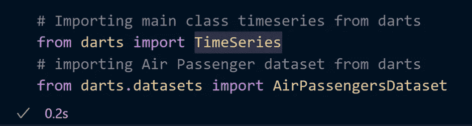**

**TimeSeries 是 Darts 中的主要数据类。时间序列代表一个单变量或多变量时间序列，具有适当的时间索引。**

## **绘制数据集**

**让我们加载我们的时间序列数据集并绘制它**

**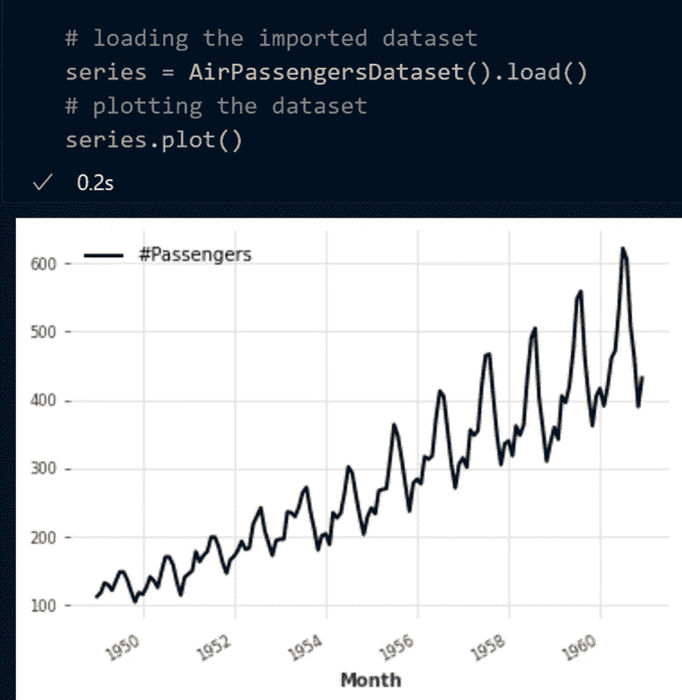**

**x 轴代表年份，y 轴代表乘客数量。**

**TimeSeries 类包含不同种类的操作，让我们看看其中的一些。**

## **剧烈的**

**您可以使用这两个命令中的任何一个来分割数据集**

```
**split_after(split_point)**
which Splits the series in two, after a provided split_point.**split_before(split_point)** 
that Splits the series in two, before a provided split_point.
```

**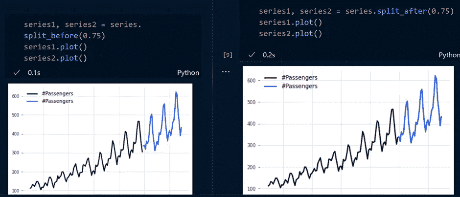**

**使用上述两种不同的方法将系列分为两部分，即 **75%和**25%。**

## **限幅**

**您可以使用索引方法对时间序列数据进行切片。**

**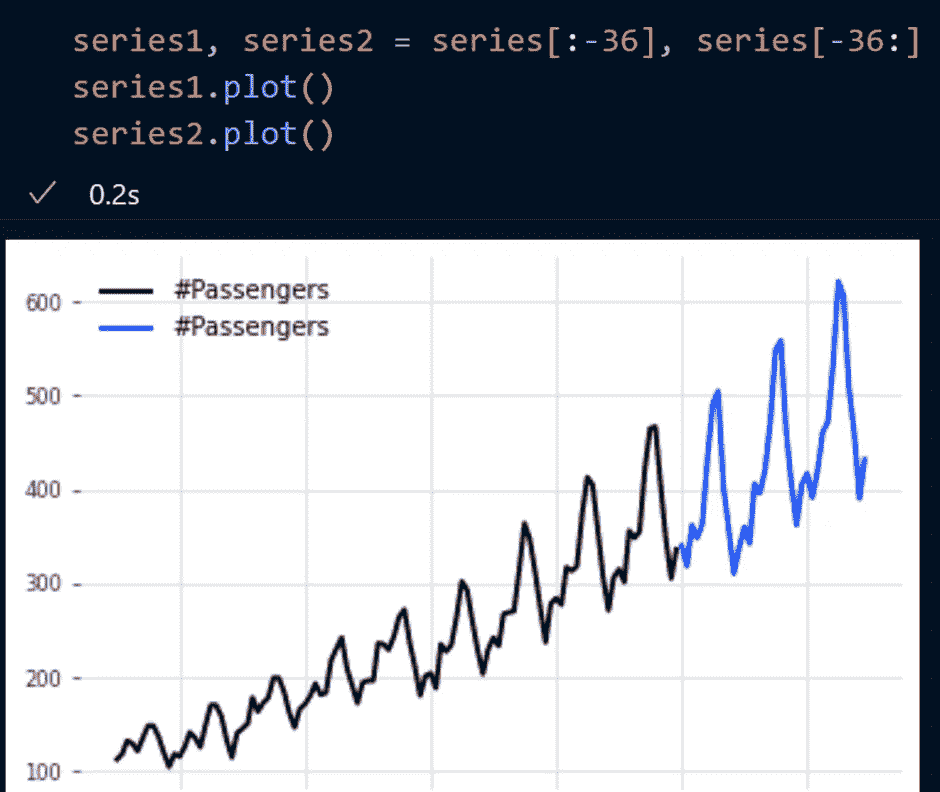**

## ****算术运算****

**对我们的系列数据集执行算术运算**

**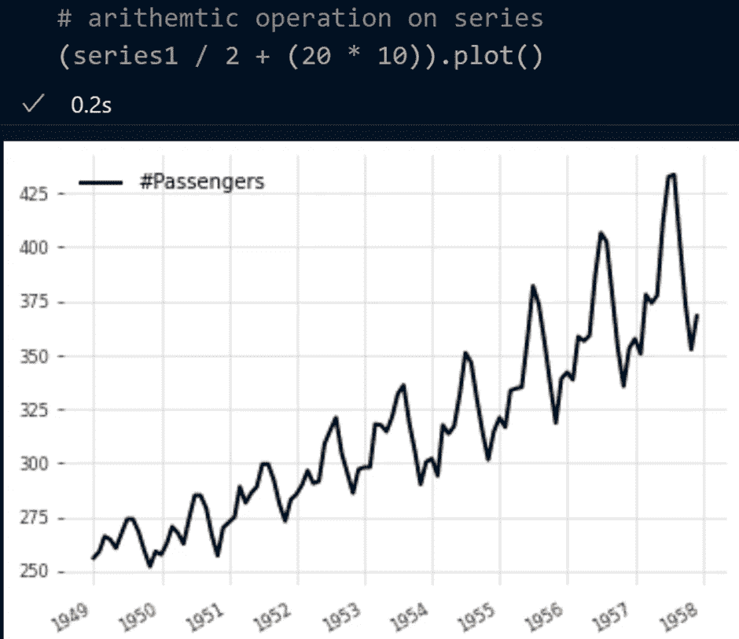**

## **映射操作**

**使用 NumPy 库映射值**

**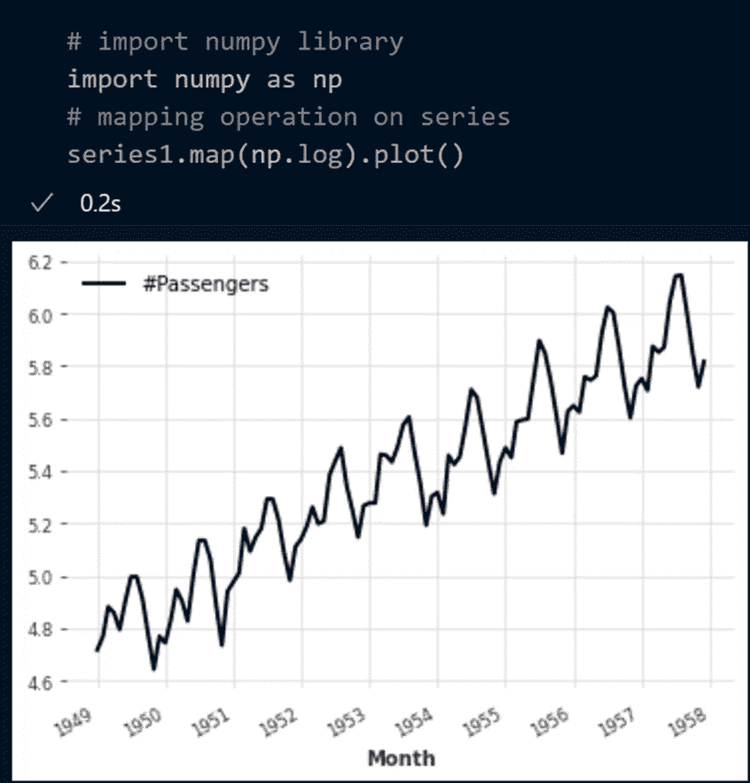**

## **添加一些二进制假日组件**

**这就是事情变得有趣的地方！**

**正如他们的官方文档所述， **add_holidays** 方法将一个二元单变量组件添加到当前序列中，该组件在与所选国家/地区的假期相对应的每个指数处等于 1，否则等于 0。**

**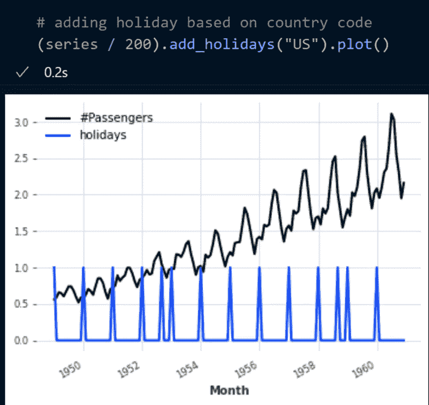**

## **填充缺失值**

**Darts 包含一个 filling_missing_values 函数，使您能够填充时间序列数据中的缺失值**

**下面是演示此功能的代码:**

**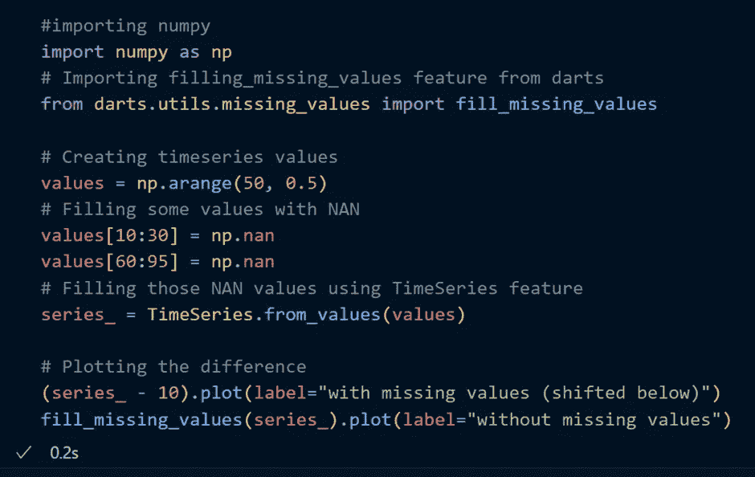**

**这是输出**

**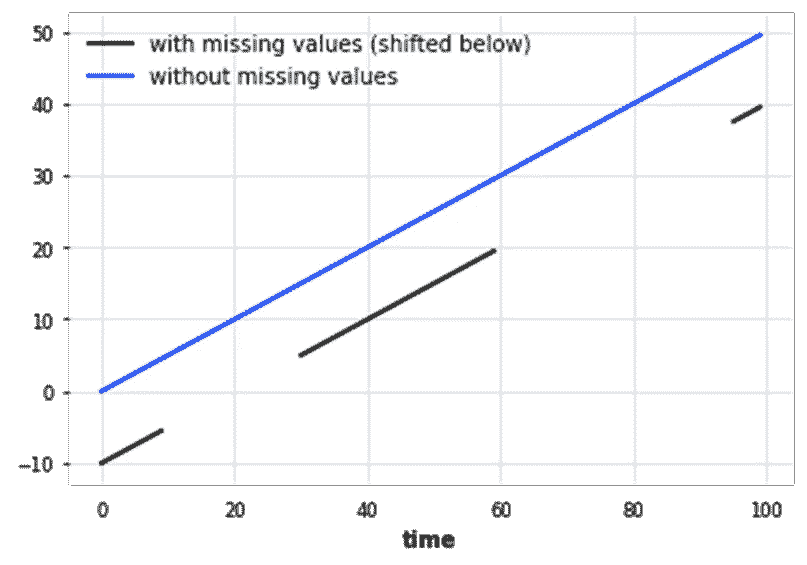**

**你可以看到它完美地预测了时间序列数据的 NAN 值。**

## **创建用于预测的训练和测试数据**

**我们正在使用我们的航空乘客数据集，并将其分为训练和测试数据**

**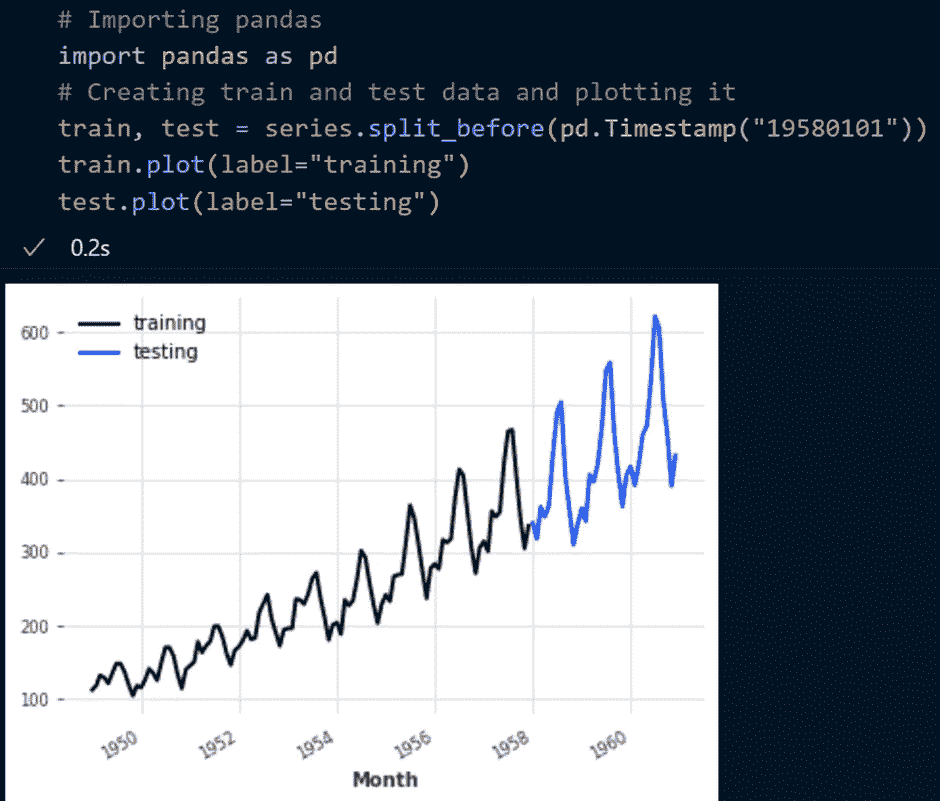**

**训练序列将是包含直到 1958 年 1 月(不包括)的值的时间序列，而测试序列是包含其余部分的时间序列。**

## **使用 NaiveSeasonal 预测**

**分割数据集后，我们将使用 darts 库提供的第一个预测模型。**

**正如他们的文档中所述，Darts 中存在一组“幼稚的”基线模型，这对于了解人们所能期望的最低精确度非常有用。例如，NaiveSeasonal(K)模型总是“重复”K 个时间步之前发生的值。**

**在其最简单的形式中，当 K=1 时，该模型简单地总是重复训练序列的最后一个值:**

**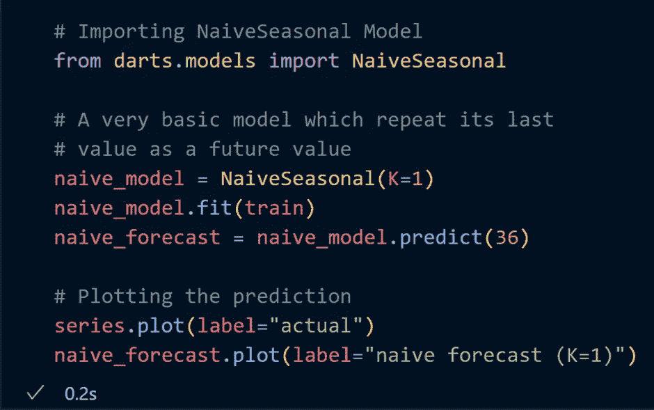**

**这是输出:**

**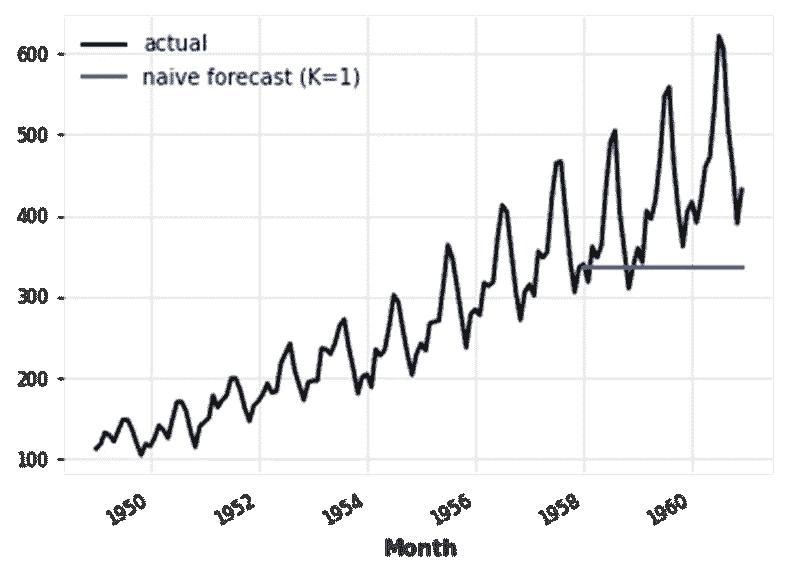**

**使用 darts 库拟合和预测时间序列数据非常容易，fit()用于训练数据集，而 predict()用于预测数据。**

## **检查季节性**

**正如你所看到的，我们的模型太天真(缺乏预测)，我们已经看到我们的数据显示每年的季节性行为，我们可以通过使用 darts.utils.statistics 中的 check _ seasonality 来确认这一点。**

**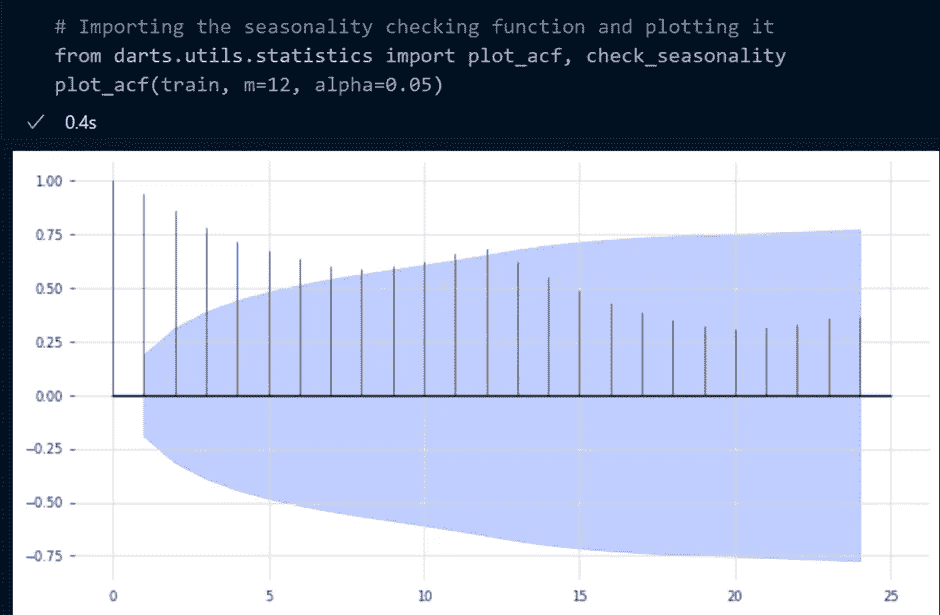**

**你可以在 **x = 12** 处看到一个峰值，代表年度季节性趋势(红线)。**

**现在，我们将重新运行我们简单的季节性模型，但是 k = 12(我们之前已经确定的值)**

**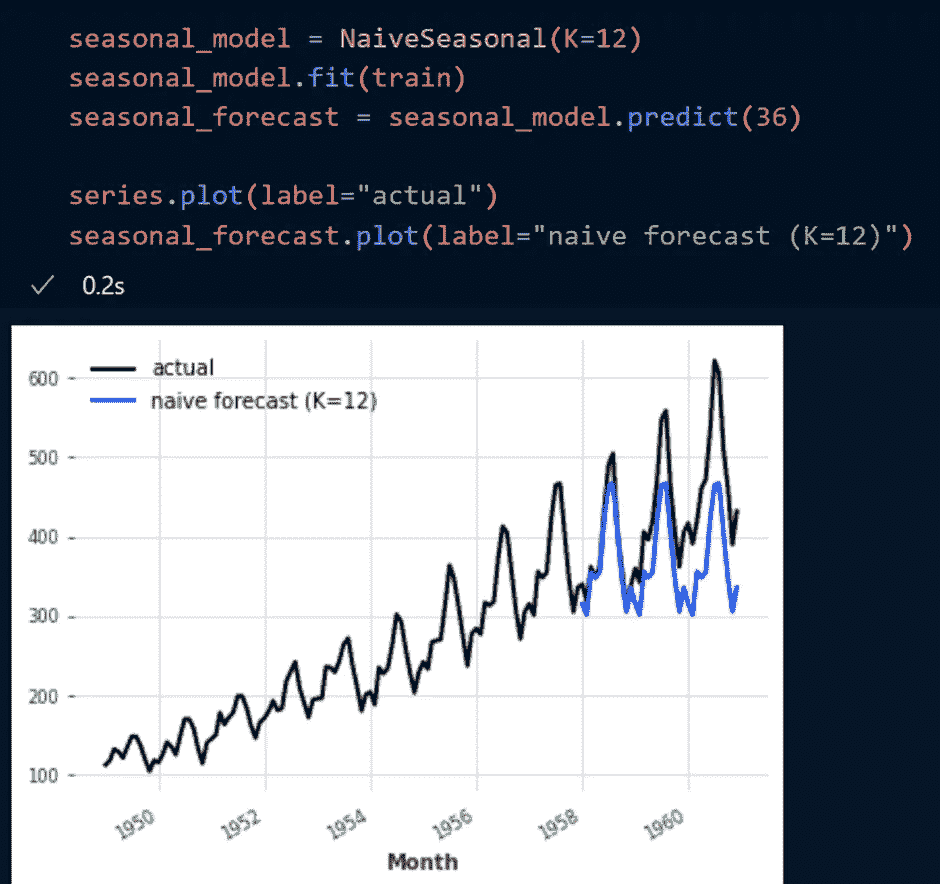**

**正如你所看到的，在我们的模型中实现季节变化值后，它显示了更好的预测，但仍然不准确。**

**正如他们的官方文档中所述，还有另一个捕捉趋势的幼稚基线模型，称为 NaiveDrift。此模型生成线性预测，其斜率由定型集的第一个和最后一个值决定。**

## **计算误差度量**

**让我们来看看我们必须最小化的误差值。我们可以使用 darts.metrics 中的 map 函数来实现**

**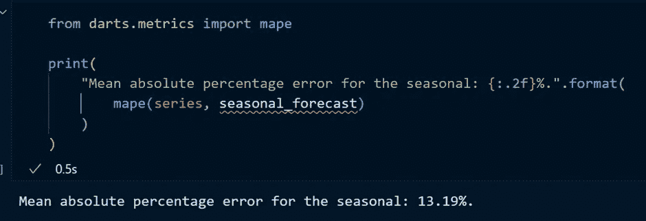**

**如你所见，在 k = 12 的情况下，我们的天真模型的误差约为 13%。对该数据执行 NaiveDrift 以检查它是否减少了任何误差。**

****这是一个非常简短的 darts 库指南，你可以从他们的文档页面中找到很多。****

## **如果您有任何疑问，请随时问我！**