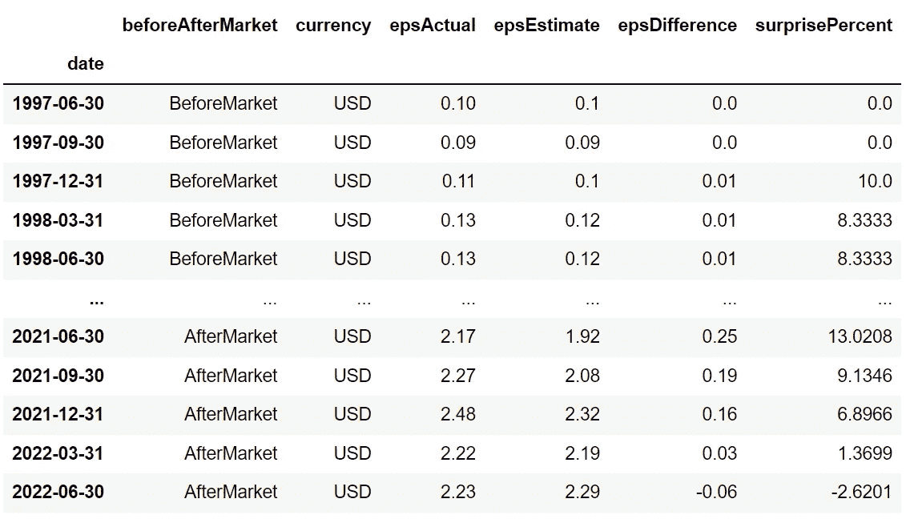
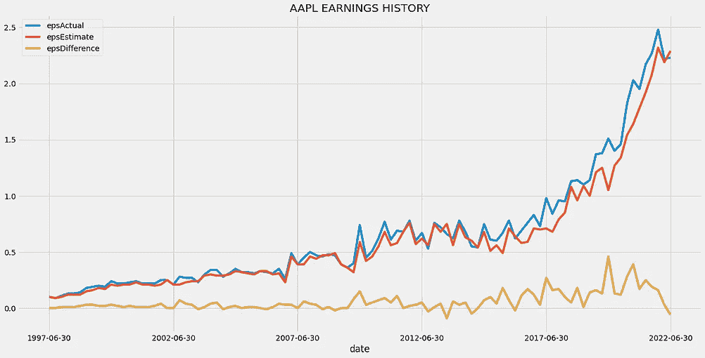
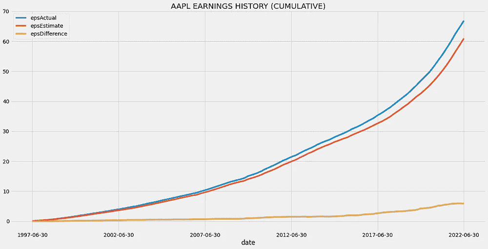

# 轻松检索金融数据的 Python 包:第 1 部分

> 原文：<https://levelup.gitconnected.com/a-python-package-to-easily-retrieve-financial-data-part-1-99e9bc8f26ec>

## 用较少的代码访问基础数据的简单解决方案


布莱克·康纳利在 [Unsplash](https://unsplash.com?utm_source=medium&utm_medium=referral) 上的照片

# 介绍

充足可靠的财务数据对交易者来说非常重要，因为它在很大程度上影响着他们的投资决策。因此，交易者认真考虑并执行数据收集过程，以最大化他们在市场上的优势。

现在，可以使用 python 以两种不同的方式提取金融数据。第一种方法是利用各种提供者提供的财务 API，并进行 API 调用来获取所需的数据。第二种方法是利用开源 python 包/库来检索数据。

大多数人更喜欢第二种提取数据的方式，即通过开源 python 包。这主要是因为使用财务 API 获取数据比使用开源包需要更多的努力，这对初学者来说是一个障碍。

在本文中，我们将关注一个名为`eod`的 python 包，它通过提供可靠的不同类型的金融数据来帮助数据收集过程。事不宜迟，让我们进入文章吧！

# 到职日期(Date of Entering Office)

在进入编程部分之前，有必要了解一下我们将在本文中使用的包。`eod`是一个开源的 python 库，支持大量的市场数据，每个交易者都可以访问。这个包是由 EOD 历史数据 API([EODHD API](https://eodhistoricaldata.com/?utm_source=medium&utm_medium=post&utm_campaign=a_python_package_to_retrieve_financial_data_part1))开发的，它是金融 API 提供者领域的主要参与者。他们创建了这个开源项目，目的是让初学者能够以一种更简单的方式与他们的 API 进行交互。

使用`eod`包有两个主要优点。首先，可以以非常直接的方式提取数据，并且需要非常少的编码来完成任务。其次，由于该软件包由 EODHD 的金融应用编程接口支持，用户可以访问从基本到独特和关键信息的大量市场数据。

# Python 实现

在本节中，我们将使用 python 编写一些代码来提取各种市场数据，即基本面数据、历史或当日价格数据、当天数据和实时数据。以下是这一部分的基本概要，以便于后续跟进:

```
**1\.** [**Importing Packages**](#34ac) **2\.** [**API Key Activation**](#c19b) **3\.** [**Fundamental Data**](#0c3a) **4\. Historical Data
5\. Intraday Data
6\. Real-time Data**
```

前两个主题主要与设置 python 编程环境有关，其余主题与数据提取过程有关。

从第三个主题开始，对提取的数据进行额外的处理，例如数据分析，以提供获得的数据的实际使用的要点。不一定要跟上额外的步骤，但强烈建议这样做。

由于每个主题都包含深入的解释和大量的编码过程，因此本文分为不同的部分。这篇文章显然是这个系列的第一部分，我们将只关注基本数据的提取，其余的主题将在接下来的部分中讨论。话虽如此，我们还是做点编码吧！

## 导入包

设置编码环境的第一步也是最重要的一步是导入所需的包。在本文中，我们将使用七个不同的包，分别是用于金融数据提取的`eod`、用于数据操作的`pandas`、用于数据可视化的`matplotlib`、用于处理日期和时间的`datetime`、用于特定时间相关功能的`time`、用于定制打印输出的`termcolor`，以及用于金融可视化的`mplfinance`。以下代码将把所有提到的包导入到我们的 python 环境中:

```
from eod import EodHistoricalData
import pandas as pd
import matplotlib.pyplot as plt
import datetime as dt
import time
from termcolor import colored as cl 
import mplfinance as mf
plt.style.use('fivethirtyeight')
plt.rcParams['figure.figsize'] = [20, 10]
```

从上面的代码中，值得注意的是，除了导入基本的包之外，我们还对默认的`matplotlib`包设置进行了一些修改，以定制可视化的主题和大小。这是一个可选步骤，用于美化本文后面要生成的地块。

此外，如果您还没有安装任何导入的软件包，请确保在您的终端中使用`pip`命令进行安装。

## API 键激活

为了使用它的功能，必须在包中注册 EODHD API 密钥。如果您没有 EODHD API 密钥，首先，前往他们的[网站](https://eodhistoricaldata.com/?utm_source=medium&utm_medium=post&utm_campaign=a_python_package_to_retrieve_financial_data_part1)，然后，完成[注册](https://eodhistoricaldata.com/register?utm_source=medium&utm_medium=post&utm_campaign=a_python_package_to_retrieve_financial_data_part1)过程以创建 EODHD 帐户，最后，导航到“[设置](https://eodhistoricaldata.com/cp/settings?utm_source=medium&utm_medium=post&utm_campaign=a_python_package_to_retrieve_financial_data_part1)”页面，在那里您可以找到您的秘密 EODHD API 密钥。确保这个秘密的 API 密钥不会泄露给任何人是很重要的。您可以通过以下代码激活 API 密钥:

```
api_key = '<YOUR API KEY>'
client = EodHistoricalData(api_key)
```

代码非常简单。在第一行中，我们将秘密的 EODHD API 密钥存储在`api_key`中，然后在第二行中，我们使用由`eod`包提供的`EodHistoricalData`类来激活 API 密钥，并将响应存储在`client`变量中。

注意，您需要用您的秘密 EODHD API 密钥替换`<YOUR API KEY>`。除了用文本直接存储 API 密钥之外，还有其他方法可以提高安全性，比如利用环境变量等等。

## 提取基础数据

基本面数据包括股票财务状况和头寸的一般信息。这种类型的数据在分析过程中起着至关重要的作用，有助于确定交易者的投资决策。使用以下代码可以轻松提取任何给定股票的基本数据:

```
ticker = 'AAPL.US'
aapl_f_info = client.get_fundamental_equity(ticker)
aapl_f_info_keys = list(aapl_f_info.keys())
for i in range(len(aapl_f_info_keys)):
    print(cl(f'{i+1}. {aapl_f_info_keys[i]}', attrs = ['bold']))
```

在代码的第一行，我们创建了一个变量来存储我们想要提取的股权的符号，在我们的例子中是 Apple。然后，使用`eod`包提供的`get_fundamental_equity`函数，我们正在提取苹果的基本面数据。

该功能由两个参数组成:`ticker`和`filter_`。在上面的代码中，只使用了`ticker`字段，它将股票的符号作为输入，在我们的例子中是苹果(AAPL)。美国)。`filter_`字段将在本文的这一部分稍后用到。

最后，我们将响应存储在`aapl_f_info`变量中。除了这两行代码之外，其余的都是可选的，编写后会产生以下输出:

```
1\. General
2\. Highlights
3\. Valuation
4\. SharesStats
5\. Technicals
6\. SplitsDividends
7\. AnalystRatings
8\. Holders
9\. InsiderTransactions
10\. ESGScores
11\. outstandingShares
12\. Earnings
13\. Financials
```

上面生成的输出是包含在提取的苹果基本数据中的所有细节的列表。很明显，基本面数据为其用户提供了足够多的信息，从一般细节到公司的财务状况，甚至内幕交易。

但有些人可能会对庞大的数据感到有点不知所措，因为他们只会寻找公司的特定细节。这就是我们之前讨论的`filter_`参数发挥作用的地方。

顾名思义，`filter_`参数可以用来过滤基础数据，只提取用户需要的细节。例如，如果一个人只对基本面数据的收益部分感兴趣，可以通过以下代码轻松提取:

```
earnings = client.get_fundamental_equity(ticker, filter_ = 'Earnings::History')
earnings_dates = list(earnings.keys())
cols = list(earnings[earnings_dates[0]].keys())
earnings_df = pd.DataFrame(columns = cols)
for i in range(len(earnings_dates)):
    data = earnings[earnings_dates[i]]
    earnings_df.loc[i] = data
earnings_df = earnings_df.drop('reportDate', axis = 1).set_index('date').dropna()
earnings_df = earnings_df.iloc[::-1]
```

最需要注意的一行是第一行。这与我们之前所做的非常相似，但唯一的变化是在`get_fundamental_equity`函数中增加了`filter_`参数。`filter_`参数需要以下格式:

```
<MainCategory>::<SubCategory 1>::<SubCategory 2>....
```

这里，`<MainCategory>`指的是先前在输出中表示的十三个类别中的任何一个，而`<SubCategory>`指的是每个主要类别中存在的子类别。在上面的代码中，我们指定了最多`<SubCategory 1>`，但是可以根据剩余的子部分进一步缩小范围。

剩下的代码行主要关注于处理提取的数据，包括数据清理、数据格式化和数据操作的不同过程。最终输出是一个熊猫数据帧，如下所示:



作者图片

## 数据分析

现在我们有了格式良好的数据，让我们做一些数据分析。在进入数据分析过程之前，我们有必要弄清楚数据框架中包含的术语。

首先，EPS 是指每股收益。顾名思义，它揭示了一个公司从一股中赚了多少钱。在数据框中，我们有三个与每股收益相关的列，分别是:`epsActual`、`epsEstimate`、`epsDifference`。列的名称是不言自明的。其次，

惊喜百分比(`surprisePercent`)指的是在特定季度中超出分析师实际估计的收入。例如，在第三行中，我们可以看到`surprisePercent`是 10，这意味着苹果在该季度的收益比分析师的估计高出 10%。

我们在分析过程中主要关注的列是与每股收益相关的列。现在，我们不打算进行广泛的数据分析，而只是浏览一下数据，最好的方法是进行趋势分析。分析数据趋势的最佳方式是通过数据可视化。以下代码将生成两个不同的图，以便更好地理解数据:

```
earnings_df[['epsActual', 'epsEstimate', 'epsDifference']].plot()
plt.title('AAPL EARNINGS HISTORY')
earnings_df[['epsActual', 'epsEstimate', 'epsDifference']].cumsum().plot()
plt.title('AAPL EARNINGS HISTORY (CUMULATIVE)')
```

代码非常简单，不需要深入解释。在这里，`Pandas`和`matplotlib`包都在可视化过程中使用，尽管许多人更喜欢单独使用`matplotlib`。代码生成如下所示的两个折线图:



作者提供的图片

左侧的图像是一个折线图，显示了三个不同的 EPS 相关数据多年来的趋势，右侧的图像代表了苹果的累积收益数字。通过观察这两张图表，很明显苹果的收益正朝着积极的方向发展，而且这种趋势似乎还会继续。

但是需要认真考虑的一件事是`epsDifference`的缓慢下降，它显示了实际获得的收益与分析师估计的收益之间的差异。因此，当`epsDifference`达到负数时，这意味着苹果的实际收益没有跟上其预期值。这可能不是一个大问题，但仍然可以肯定地说，这是值得考虑的。

# 结束语

在这篇文章中，我们了解了一个名为`eod`的新软件包，以及如何用它来提取股票的基本面数据。为了更进一步，我们对提取的数据进行了一些基本的数据分析，并得出了一些关于股票收益趋势的见解。

本文将在下一部分继续讨论`eod`包的各种功能，下一篇文章将围绕使用这个包提取资产的历史数据。所以请注意下一部分。话虽如此，你已经到了文章的结尾。希望你今天学到了新东西。编码快乐！