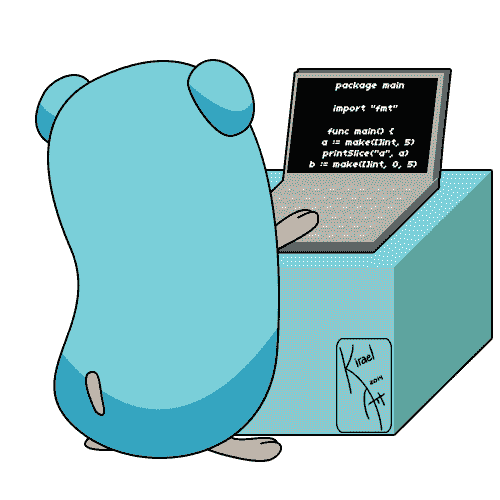

# 使用干净架构方法的架构设计简介

> 原文：<https://levelup.gitconnected.com/a-quick-architecture-and-components-design-2baf0216021f>

## [去宁静的](/go-restful-series-a7addbfef5b1)——# 9

## 走向 RESTful 系列—迭代#1

在这个架构中，我们将涵盖“干净的架构”方法的核心原则，以及如何将它们应用到一个真实的项目中。

[在我的上一篇文章](/gorestful-1st-iteration-requirements-and-api-specification-f2b5e40e9571)中，我完成了迭代的需求和规范。为了向前推进，让我们在开始实现之前做一个快速的架构设计。

# 干净的建筑

每个软件工程师大概都听说过。自从罗伯特·马丁(又名鲍勃叔叔)出版了他的同名书籍以来，“干净的架构”已经在软件开发中广泛应用了几十年。

*   *实体*封装了*企业范围的*业务规则，企业中的不同应用程序可以使用这些规则。为此，*实体*通常是围绕其属性的模型和约束。
*   *用例*定义*特定于应用的*业务规则，通常是在*实体*之上采取的一组用例或动作。
*   *接口适配器(控制器、网关、呈现器)*是一组适配器，用于将数据从最适合用例及实体的格式转换为最适合数据库或网络等外部机构的格式。例如， *REST 控制器*将 HTTP 请求的查询参数和主体转换成*用例*参数或*存储库*来读取数据库并将结果转换成*实体*。
*   *框架和驱动*是*接口适配器*连接的实际外部服务/组件。

## 依赖性规则

同心圆代表软件的不同领域。一般来说，你越深入，软件的水平就越高。内部组件是在外部组件存在之前定义的。因此，外部组件的变化不应影响内部组件。

# 我们干净的建筑

遵循*干净的架构*，我可以把事情分解并简化一点。

*   *实体*描述它们周围的模型和业务规则。例如带有验证方法的`User`模型。
*   *用例*定义与应用特性相对应的功能，如创建用户、更新用户、删除用户等。
*   访问*数据库*和其他*外部服务*被抽象在*接口适配器*之后。
*   REST API 由 API 视图或控制器组成，它们将 API 调用路由并转换成对*用例*或*实体*的调用。
*   *配置*将一切连接在一起。

就是这样。下一篇文章再见！